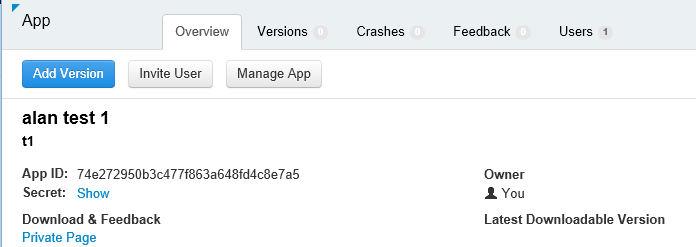
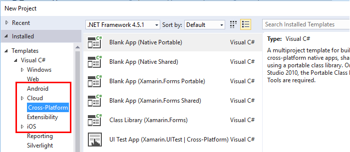
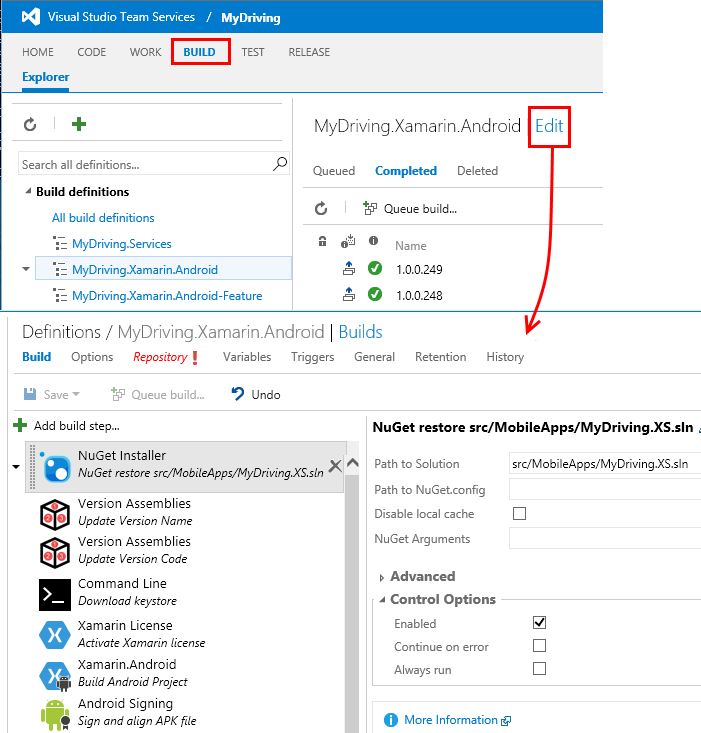
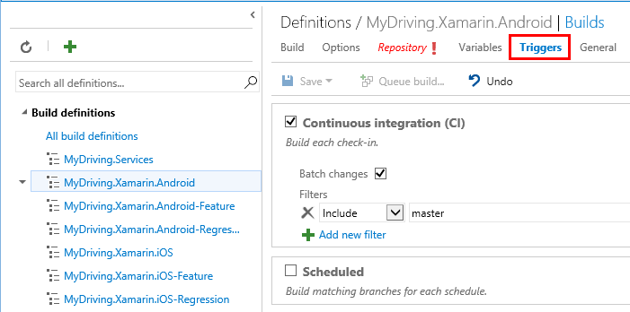
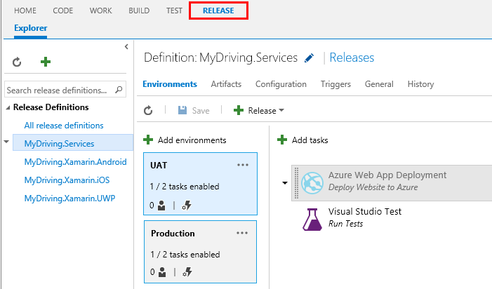
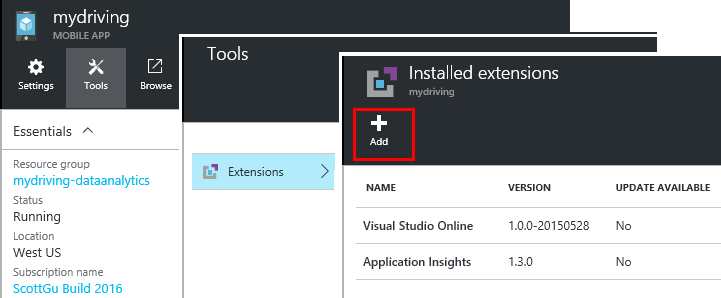

<properties
    pageTitle="Exemple de MyDriving Azure IoT : générer | Microsoft Azure"
    description="Créer une application qui est une démonstration complète comment concevoir un système IoT à l’aide de Microsoft Azure, notamment les flux Analytique, apprentissage automatique et Hubs événement."
    services=""
    documentationCenter=".net"
    suite=""
    authors="harikmenon"
    manager="douge"/>

<tags
    ms.service="multiple"
    ms.workload="tbd"
    ms.tgt_pltfrm="ibiza"
    ms.devlang="dotnet"
    ms.topic="article"
    ms.date="03/25/2016"
    ms.author="harikm"/>


# <a name="build-and-deploy-the-mydriving-solution-to-your-environment"></a>Créer et déployer la solution MyDriving dans votre environnement

MyDriving est une solution Internet des objets (IoT) qui regroupe les données provenant de votre voiture, il traite à l’aide d’apprentissage automatique et présente sur votre téléphone mobile. Le serveur principal est composée d’une variété de services fournis par Microsoft Azure. Les clients peuvent être téléphones Windows 10, iOS ou Android.

Nous avons créé la solution MyDriving pour vous fournir une jumpstart lors de la création de votre propre système IoT. À partir du [référentiel de MyDriving GitHub](https://github.com/Azure-Samples/MyDriving), vous pouvez obtenir des scripts du Gestionnaire de ressources Azure pour déployer l’architecture principale dans votre propre compte Azure. À partir de là, vous pouvez reconfigurer les différents services, modifiez les requêtes en fonction de vos propres données et ainsi de suite. Vous trouverez ces scripts--ainsi que de code pour l’application mobile, le projet API de Service d’application Azure et autres éléments--dans le référentiel MyDriving.

Si vous n’avez pas encore essayé l’application, consultez le [guide de mise en route Get](iot-solution-get-started.md).

Il existe un compte détaillé de l’architecture dans le [Guide de référence MyDriving](http://aka.ms/mydrivingdocs). En résumé, il existe plusieurs morceaux que nous configurés et que vous le feriez configuré pour créer un projet similaire :

* Une **application client** s’exécute sur les téléphones Android, iOS et Windows 10. Nous utilisons la plateforme Xamarin pour partager une grande partie du code, qui est stocké sur GitHub sous `src/MobileApp`. L’application effectue deux fonctions distinctes :
 * Il relais de télémétrie à partir de l’appareil intégrée diagnostics (OBD) et de sa propre service emplacement principal de cloud du système.
 * Il est une interface utilisateur dans lequel les utilisateurs peuvent interroger sur leurs voyages route enregistrées.
* Un **service cloud** ingests les données de voyage en temps réel et la traite. Le travail principal de la création de ce service consiste à choisir, paramétrer et associer une variété de services Azure. Certaines pièces requièrent des scripts pour filtrer et traiter les données entrantes. Nous utilisez un modèle Azure le Gestionnaire de ressources pour configurer toutes les parties.
* Une **application de service mobile** est le service web derrière la partie interface utilisateur de l’application d’appareil. Son travail principale consiste à la base de données des données stockées, transformées. Son code se trouve sur GitHub sous `src/MobileAppService`.
* **Visual Studio avec Xamarin** est notre environnement de développement. Xamarin, qui se trouve à la fois en tant que composant de Visual Studio et un environnement de développement autonome (IDE), est utilisé pour générer le code de l’appareil de disponibilité sur plusieurs plateformes. Pour générer le code iOS, il est nécessaire d’avoir une instance de Xamarin s’exécutant sur un ordinateur OS X. Si nécessaire, il peut être exécuté en tant qu’agent, géré par Visual Studio.
* **Tests d’unités** des applications appareil est effectué dans Xamarin Test Cloud.
* **GitHub** est le référentiel dans lequel nous stocker code, des scripts et des modèles.
* **Visual Studio Team Services** est un service cloud qui est utilisé pour gérer les build en continu et test des applications de service et le périphérique web.
* **HockeyApp** permet de distribuer des versions du code appareil. Il collecte également des rapports de blocage et l’utilisation et les commentaires des utilisateurs.
* **Visual Studio Application Insights** surveille le service web mobile.

Voyons donc comment nous configurer tout cela. Notez que la plupart des étapes sont facultatives.

## <a name="sign-up-for-accounts"></a>S’inscrire pour les comptes

-   [Visual Studio développement Essentials](https://www.visualstudio.com/products/visual-studio-dev-essentials-vs.aspx). Ce programme gratuit permet d’accéder facilement à de nombreux outils de développement et services, y compris Visual Studio, Visual Studio Team Services et Azure. Il vous donne un crédit $25/ mois sur Azure de 12 mois. Il inclut également des abonnements à la formation Pluralsight et Université Xamarin. Vous pouvez également vous inscrire séparément de niveaux gratuit de [Azure](https://azure.com) et [Visual Studio Team Services](https://www.visualstudio.com/products/visual-studio-team-services-vs.aspx), mais ils ne fournissent pas crédits Azure.

-   [HockeyApp](https://rink.hockeyapp.net/) (facultatif) pour la gestion de distribution de test des applications mobiles et à la collecte de télémétrie.

-   [Xamarin](https://xamarin.com/) (obligatoire), pour créer l’application mobile et exécutant déboguer s’exécute et tests sur [Xamarin Test Cloud](https://xamarin.com/test-cloud).

-   [GitHub](https://github.com/Azure-Samples/MyDriving/) (facultatif), pour créer des référentiels publics gratuits pour votre propre code (référentiels privés sont payées). Vous pouvez également utiliser le plan de base dans Visual Studio Team Services pour les référentiels privés.

-   [Power BI](https://powerbi.microsoft.com/) (facultatif), pour créer des visualisations enrichies de données dans l’ensemble du système.

> [AZURE.NOTE] Vous n’avez pas besoin un compte GitHub pour accéder au code MyDriving dans [le référentiel GitHub MyDriving](https://github.com/Azure-Samples/MyDriving).

## <a name="install-development-tools"></a>Installer les outils de développement

La configuration suivante concerne de développement de la solution complète : une iOS, Android et Windows 10 Mobile application disponibilité sur plusieurs plateformes, avec un Azure back-end.

Comme alternative, vous pouvez utiliser Xamarin Studio sur Mac ou Windows pour développer les applications mobiles si vous n’utilisez pas sur la Azure back-end.

Il existe une [description plus détaillée de ce programme d’installation](https://msdn.microsoft.com/library/mt613162.aspx).

### <a name="windows-development-machine"></a>Machine de développement Windows

L’outil central de Windows est Visual Studio, pour l’utilisation de l’application MyDriving pour Android et Windows, le projet API de Service d’application et extensions microservice.

Xamarin, Git, émulateurs et autres composants utiles sont tous intégrés avec Visual Studio.

Installer :

-   [Visual Studio 2015 avec Xamarin](https://www.visualstudio.com/products/visual-studio-community-vs) (n’importe quelle édition--Communauté est gratuite).

-   [SQLite de plateforme Windows universel](https://visualstudiogallery.msdn.microsoft.com/4913e7d5-96c9-4dde-a1a1-69820d615936). Requis pour générer le code Windows 10 Mobile.

-   [Azure SDK pour Visual Studio 2015](https://go.microsoft.com/fwlink/?linkid=518003&clcid=0x409). Vous donne le Kit de développement pour l’exécution d’applications dans Azure, ainsi que des outils de ligne de commande de gestion des Azure.

-   [Service azure TISSU SDK](http://www.microsoft.com/web/handlers/webpi.ashx?command=getinstallerredirect&appid=MicrosoftAzure-ServiceFabric). Requis pour générer l’extension [microservice](../service-fabric/service-fabric-get-started.md) .

Assurez-vous également que vous avez les extensions de Visual Studio droite. Vérifiez que sous **Outils**, vous voyez **Android, iOS, Xamarin...**. Dans le cas contraire, ouvrez le panneau de configuration et sélectionnez **programmes et fonctionnalités** > **Microsoft** > **Visual Studio 2015** > **Modifier**. Sous **développement sur plusieurs plates-formes**, sélectionnez **C\#/.Net (Xamarin)**. Vous avez, vérifiez que **Git pour Windows** est installé.

### <a name="mac-development-machine"></a>Machine de développement Mac

Mac (Yosemite ou version ultérieure) est nécessaire si vous souhaitez développer pour iOS. Bien que nous utilisons Visual Studio avec Xamarin sur Windows pour développer et gérer tout le code, Xamarin utilise un agent est installé sur un Mac afin de créer et signer le code iOS.


(Comme alternative, vous pouvez utiliser Xamarin Studio directement sur le Mac pour développer des applications de disponibilité sur plusieurs plateformes.)

Vous n’avez pas besoin Mac si vous ne voulez pas inclure iOS comme plate-forme cible.

Installer :

-   [Xamarin Studio pour iOS](https://developer.xamarin.com/guides/ios/getting_started/installation/mac/). Vous pouvez également configurer Visual Studio et Xamarin sur un Mac exécutant une machine virtuelle Windows. Consultez [le programme d’installation, installer et vérifications pour les utilisateurs de Mac](https://msdn.microsoft.com/library/mt488770.aspx) sur MSDN.

-   [Outils de développement Azure](https://azure.microsoft.com/downloads/) (facultatif).

Activer la connexion à distance sur le Mac. Accédez à **Préférences système** > **partage**et puis sélectionnez **Connexion distante**.

Lorsque vous ouvrez un projet iOS dans Visual Studio sous Windows, le plug-in Xamarin vous invite à entrer l’ID de Mac.

## <a name="fetch-the-github-repository"></a>Extraire le référentiel GitHub

Récupérer une copie locale du [référentiel GitHub MyDriving](https://github.com/Azure-Samples/MyDriving) en utilisant le bouton **Télécharger le code postal** dans GitHub, Visual Studio ou un autre client Git.

Décompressez le fichier dans un dossier avec un nom de chemin d’accès court, tel que c :\\code.

Par ailleurs, si vous voulez tenir à jour avec ou contribuer à notre code, cloner le référentiel comme suit :

**GIT cloner https://github.com/Azure-Samples/MyDriving.git**

## <a name="get-a-bing-maps-api-key"></a>Obtenir un Bing maps API clé

[Inscrivez-vous à une clé d’API Bing Maps](https://msdn.microsoft.com/library/ff428642.aspx).

Vous devrez le remplacer dans ligne 22 `src/MobileApps/MyDriving/MyDriving.Utils/Logger.cs`.


## <a name="build-the-demo-app"></a>Créer l’application démo

Ouvrir ces solutions dans Visual Studio :

-   src\MobileApps\MyDriving.sln

-   src\MobileAppService\MyDrivingService.sln

-   src\Extensions\ServiceFabric\VINLookUpApplication\VINLookUpApplication.sln

Vous obtiendrez des invites pour :

-   Faire confiance à certains projets potentiellement non fiables. Choisir d’ouvrir les si vous voulez continuer.

-   Définir le mode développeur si vous travaillez sur un ordinateur Windows 10 novateur.

-   Fournir vos informations d’identification Xamarin.

-   Se connecter à Xamarin Mac. Si vous n’avez un Mac, cliquez sur le projet iOS dans Visual Studio et sélectionnez **Décharger le projet**.

Reconstruire la solution.

Si vous avez des difficultés à créer, essayez les solutions à faiblesses nous avons rencontré :

-   *Projet VINLookupApplication ne se charge pas*: Assurez-vous que vous avez installé le [Kit de développement Azure pour Visual Studio 2015](https://go.microsoft.com/fwlink/?linkid=518003&clcid=0x409).

-   *Service TISSU project ne créer*: générer les projets interface tout d’abord et vérifiez que vous avez installé le Kit de développement de tissu de Service.

-   *Application android ne créer*:

    -   Ouvrir les **Outils de** > **Android** > **Android SDK Manager**et vérifiez que 6 Android (API 23) / plateforme SDK est installé.

    -   Supprimer ce répertoire et puis reconstruire :<br/>
        `%LocalAppData%\Xamarin\zips`

## <a name="get-to-know-the-code"></a>Se familiariser avec le code

Dans la solution, vous trouverez :

-   Extensions Azure : tissu de Service.

-   Azure HDInsight : Scripts pour le traitement des données de voyage dans Azure.

-   Applications mobiles : Les applications de périphérique.

-   MobileAppsService/MyDrivingService : Mettre fin à nouveau le web.

-   Power BI : La définition de rapport.

-   Scripts :

    -   Le Gestionnaire de ressources : modèles pour générer les ressources Azure.

    -   PowerShell : Exécuter les modèles de gestionnaire de ressources des Scripts.

    -   Base de données SQL Azure : Débogage des bases de données.

-   Base de données SQL : CreateTables a : les définitions de schéma.

-   Azure flux Analytique : Les requêtes transforment le flux de données entrant.

## <a name="run-the-apps-in-development-mode"></a>Exécuter les applications en mode de développement

Prendre des mesures pour exécuter les applications, basées sur le périphérique que vous utilisez :

-  Partie principale : MyDrivingService définir en tant que le projet de démarrage et appuyez sur F5 pour exécuter le service web principale. Un affichage de navigateur de la liste des API s’ouvre.

-  Les clients mobiles : les [applications mobiles sont développées dans Xamarin](https://developer.xamarin.com/guides/cross-platform/deployment,_testing,_and_metrics/debugging_with_xamarin/).
 -  Android : Pour plus d’informations, voir [Débogage Android dans Xamarin](http://developer.xamarin.com/guides/android/deployment,_testing,_and_metrics/debugging_with_xamarin_android/).

 -  iOS : pour plus d’informations, consultez [débogage dans iOS](http://developer.xamarin.com/guides/ios/deployment,_testing,_and_metrics/debugging_in_xamarin_ios/).

 -  Windows Phone : Pour plus d’informations, voir [Xamarin + Windows Phone](https://developer.xamarin.com/guides/cross-platform/windows/phone/).

## <a name="upload-the-mobile-app-to-hockeyapp"></a>Télécharger l’application mobile sur HockeyApp

HockeyApp gère la distribution de votre application Windows, iOS ou Android pour tester les utilisateurs, avertissant les utilisateurs de nouvelles versions. Il collecte également des rapports sur les incidents utiles, commentaires des utilisateurs avec captures d’écran et les mesures d’utilisation.

[Commencez par téléchargement de](http://support.hockeyapp.net/kb/app-management-2/how-to-create-a-new-app) votre application de génération. Puis se connecter à [HockeyApp](https://rink.hockeyapp.net) à partir de votre ordinateur de développement. Dans le tableau de bord du développeur, cliquez sur **Nouvelle application**et puis faites glisser les fichiers par défaut sur la fenêtre. (Une version ultérieure, vous pouvez automatiser votre service de build pour effectuer cette opération.)

Vous êtes maintenant dans votre tableau de bord d’application.



Répétez le processus pour chaque plate-forme votre application s’exécute sur. Vous pouvez procéder comme suit :

-  Utiliser l' [ID de l’application](http://support.hockeyapp.net/kb/app-management-2/how-to-find-the-app-id) du tableau de bord d’envoyer des données de blocage et les commentaires à partir de votre application. MyDriving, mettre à jour les numéros de src/MobileApps/MyDriving/MyDriving.Utils/Logger.cs.

-  [Invitez des utilisateurs de test](http://support.hockeyapp.net/kb/app-management-2/how-to-invite-beta-testers). Vous obtenez une URL de recrutement utilisateurs testeurs. Elle pourra s’inscrire à votre équipe, téléchargez l’application et vous envoyer des commentaires.

-  Si vous préférez une version bêta plus ouverte, définissez la distribution au public. Cliquez sur **Gérer les application** > **Distribution** > **Télécharger = Public**. Maintenant tout le monde peut télécharger votre application et vous envoyer des commentaires, et ils verront une notification lorsque vous publiez une nouvelle version. Vous pouvez obtenir trop certains rapports blocage d’eux.

    

-  [Rapports de blocage de lien pour Visual Studio Team Services](http://support.hockeyapp.net/kb/third-party-bug-trackers-services-and-webhooks/how-to-use-hockeyapp-with-visual-studio-team-services-vsts-or-team-foundation-server-tfs). Cliquez sur **Gérer les application** > **Visual Studio Team Services**. HockeyApp pouvez créer automatiquement les éléments de travail Team Services lorsqu’il y a des rapports de blocage ou lors de la réception d’évaluation.

En savoir plus sur le [site HockeyApp](https://hockeyapp.net).

## <a name="test-the-mobile-app-on-xamarin-test-cloud"></a>Tester l’application mobile sur Xamarin Test Cloud

[Nuage de Test Xamarin](https://developer.xamarin.com/guides/testcloud/introduction-to-test-cloud/) permet d’automatiser l’interface utilisateur test sur les appareils réels dans le cloud. À l’aide de l’infrastructure NUnit, vous écrivez des tests qui s’exécutent votre application via l’interface utilisateur.

Pour utiliser Xamarin, pour intégrer le Kit de développement logiciel [Xamarin.UITests](https://developer.xamarin.com/guides/testcloud/uitest/intro-to-uitest/) dans votre application, qui est fourni sous forme de package NuGet. Vous la trouverez dans l’application de démonstration, et il a inclus lorsque vous créez de nouveaux projets de test avec les modèles de Xamarin.



Un exemple de projet de test est inclus avec l’application dans le référentiel. Dans [MyDriving](https://github.com/Azure-Samples/MyDriving/tree/master/src/MobileAppService), regardez sous [src](https://github.com/Azure-Samples/MyDriving/tree/master/src)/MobileApps/[MyDriving](https://github.com/Azure-Samples/MyDriving/tree/master/src/MobileApps/MyDriving)/MyDriving.UITests/.

Si vous utilisez une version de Visual Studio Team Services, il est facile d’écrire Xamarin UI tests unitaires et les exécuter dans le cadre de votre génération.

## <a name="deploy-azure-services"></a>Déployer les services d’Azure

Pour effectuer un déploiement automatique des services Azure et services de build Team Services, consultez les instructions détaillées de **scripts/README.md**.

Microsoft Azure propose un large éventail de différents services que vous pouvez utiliser pour créer des applications cloud. Bien que la plupart peuvent être utilisées individuellement (tels que les applications de Service/Web App), elles sont au mieux lorsqu’ils sont interconnectés à un système intégré comme que nous utilisons dans MyDriving de formulaire.

Il est possible de créer et interconnexion services Azure manuellement, mais il est beaucoup plus rapides et plus fiables d’utiliser le Gestionnaire de ressources Azure modèles. [Gestionnaire de ressources](../azure-resource-manager/resource-group-overview.md) permet d’automatiser le déploiement d’une solution ressources et des interconnexions entre elles.

Vous trouverez le modèle pour le système MyDriving dans le référentiel GitHub sous [Scripts/processeur](https://github.com/Azure-Samples/MyDriving/tree/master/scripts/ARM). Il fournit une vue complète et concise de la manière dont les différents services dans notre architecture sont reliés. Nous vous expliquerons tous ces en détail dans le [Guide de référence MyDriving](http://aka.ms/mydrivingdocs), mais vous pouvez en savoir un grand nombre simplement en lisant l’article au moyen du modèle lui-même.

> [AZURE.NOTE] Les services plus Azure ont un coût associé, selon le niveau de tarification. Si vous débutez avec Azure, vous pouvez [essayer gratuitement](https://azure.microsoft.com/free/). Toutefois, si vous ne prévoyez d’utiliser certains composants dans le système MyDriving, veillez à supprimer les pour Évitez les coûts liés. La section « Estimer les coûts d’exploitation » plus loin dans cet article fournit un résumé des frais de service classique.

### <a name="edit-the-template"></a>Modifier le modèle

Pour personnaliser votre déploiement, par exemple, pour supprimer les composants inutiles ou pour ajouter d’autres personnes, d’abord faire une copie de scénario\_complete.params.json et scénario\_complete.json dans lesquelles vous pouvez apporter des modifications.

Vous pouvez utiliser le scénario\_fichier complete.params.json pour remplacer les valeurs par défaut différents, tels que le service de référence (SKU) ou le type de réplication de stockage, comme décrit dans le tableau suivant. Les valeurs par défaut Sélectionnez les options les plus faibles coût.

| **Paramètre**         | **Description**                | **Valeur par défaut** |
|--------|---------|-------|
| Concentrateur IoT référence (SKU)           | Niveau de service Azure IoT concentrateur | F1                |
| Type de compte de stockage  | Type de stockage de réplication       | LRS standard      |
| Objectif de Service SQL | Consommation de connecteur concurrence   | DW100             |
| Plan d’hébergement de référence (SKU)      | Plan de services pour le Service d’application   | F1                |

Dans le scénario\_complete.json :

-   Recherchez « nom » de base et le remplacer par un nom que vous préférez.

-   Recherchez « Créer ». Chacune de ces sections crée une ressource.

-   Définissez sqlServerAdminLogin et sqlServerAdminPassword sur les valeurs appropriées.

-   Avant de supprimer une section qui crée une ressource, déterminez si elle est dépendants en recherchant son nom ailleurs dans le fichier. Notez que chaque section qui crée un service comprend une section *dependsOn* qui répertorie ses dépendances.

Voici ce que configure le modèle. Détails figurent dans le [Guide de référence](http://aka.ms/mydrivingdocs).

| **Service**                 | **Description et les détails**  
|---|----
| Comptes de stockage            | Le modèle crée trois comptes :                                                                                                                                                                       
|| -Une base de données SQL qui reçoit télémétrie agrégé des flux Analytique et sert de magasin de stockage pour les tables de Service d’application Azure qui exposent ces données via les points de terminaison API.                      
|| -Stockage d’objets blob qui sont additionnés les données historiques à partir d’une autre tâche de flux de données Analytique, soient traités par HDInsight.                                                                                         
|| -Une base de données SQL qui reçoit les résultats traités par HDInsight pour une utilisation avec Power BI.                                                                                                                 
| Concentrateur IoT Azure                     | Établit une connexion bidirectionnelle sur chaque appareil connecté. Dans la solution MyDriving, l’application mobile sert de passerelle de champ pour envoyer des données à Azure IoT concentrateur. Concentrateur IoT Azure sert alors une entrée aux flux Analytique. |
| Événement Azure Hubs                   | Une copie d’une tâche de flux de données Analytique la sortie aux extensions créés avec Azure Service tissu en file d’attente.                                                                                               
| Data Warehouse SQL Azure          |                                                                                                                                                                                                            
| Flux de travaux Analytique | Connecter les entrées et les sorties avec une requête, qui est utilisée pour agréger les données historiques et en temps réel pour l’application API de Service, apprentissage automatique Azure, extensions et Power BI.                               
| Espace de travail formation machine  | Inclut expériences, code R et API.                                                                                                                                                              
| Données Azure usine                | Reconversion apprentissage automatique planifiée.                                                                                                                                                                     
| Plan d’hébergement tissu de service | Pour les extensions.                                                                                                                                                                                            
| Application Service (« application Mobile »)  | Héberge le projet Mobile applications API qui fournit les points de terminaison pour l’application mobile. Le code de l’API doit être déployé sur Service d’application à partir de Visual Studio.                                                         
| Règles d’alerte                 | Envoie que vous envoyer par courrier électronique si les réponses d’application indiquent des défaillances.                                                                                                                                            
| Analyse de l’application        | Pour analyser les performances de l’API dans le Service d’application. Vous devez configurer la connexion dans Visual Studio.                                                                                          
| Archivage sécurisé clé Azure                   | Pour enregistrer le certificat cluster du service web.                                                                                                                                                                

### <a name="run-the-template"></a>Exécuter le modèle

Dans **scripts/README.md**, il existe des instructions détaillées sur le modèle en cours d’exécution.

Pour configurer tous ces services dans votre propre compte Azure en utilisant le script, effectuez l’une des opérations suivantes :

-   Utiliser PowerShell :

    ```

    cd scripts/PowerShell;
    deploy.ps1 *location* *resourceGroupName*
    ```

 -   *emplacement* est l' [emplacement Azure](https://azure.microsoft.com/regions/), tel que `North Europe` ou `West US`. Utiliser `Get-AzureLocation` pour obtenir une liste des emplacements disponibles.

 -   *resourceGroupName* est le nom que vous souhaitez donner au groupe auquel appartient toutes les ressources. Lorsque vous avez terminé avec les ressources, vous pouvez les supprimer tous les éléments en supprimant ce groupe.

-   Exécuter DeploymentScripts/Bash/deploy.sh avec Bash.

-   Ouvrir et générer la solution Visual Studio DeploymentScripts/VS/DeployARM.sln.

Notez que chaque fois que le modèle est exécuté, il crée un nouvel ensemble de ressources avec les nouveaux noms. Pour supprimer les ressources, accédez au portail et supprimer le groupe de ressources.

Si le script échoue pour une raison quelconque, vous pouvez le réexécuter en toute sécurité.

Le script vous donne la possibilité de configurer l’intégration continue dans Visual Studio Team Services. Si vous avez configuré un projet Team Services, vous devez une URL : https://yourAccountName.visualstudio.com. Entrez l’URL complète lorsque vous êtes invité. Vous pouvez lui donner un nom de nouveau ou existant pour un projet Team Services.

## <a name="set-up-build-and-test-definitions-in-visual-studio-team-services"></a>Configurer la créer et tester les définitions dans Visual Studio Team Services

Nous utiliser Team Services sur ce projet principalement pour sa génération et tester les fonctionnalités. Mais il fournit également prise en charge de collaboration excellente, telles que la gestion des tâches avec des tableaux Kanban, révision du code intégré aux tâches et contrôle de code source et contrôlé crée. Il s’intègre également avec d’autres outils tels que GitHub, Xamarin, HockeyApp et bien entendu, Visual Studio. Vous pouvez y accéder via l’interface web ou Visual Studio, selon ce qui est plus pratique à tout moment.

Les étapes décrites dans les définitions de build et version utilisent une variété de plug-in services qui sont disponibles dans les Services d’équipe [Marketplace](https://marketplace.visualstudio.com/VSTS). Outre les utilitaires de base pour lancer des lignes de commande ou copier des fichiers, il existe services qui appeler générations en Xamarin, Android et d’autres fournisseurs, et qui se connectent à HockeyApp.



### <a name="build-definitions"></a>Définitions de build

Nous avons des définitions de build pour chacune des cibles principales. Nous avons également variations de fonctionnalité et test de régression. Qui permet de :

-   MyDriving.Services (l’application web principale pour l’application mobile)

-   MyDriving.Xamarin.Android

    -   Fonctionnalité de MyDriving.Xamarin.Android

    -   MyDriving.Xamarin.Android régression

-   MyDriving.Xamarin.iOS

    -   Fonctionnalité de MyDriving.Xamarin.iOS

    -   MyDriving.Xamarin.iOS régression

-   MyDriving.Xamarin.UWP

    -   Fonctionnalité de MyDriving.Xamarin.UWP

    -   MyDriving.Xamarin.UWP régression

Si vous souhaitez afficher les détails complets de notre configuration, voir la section 4.7 du [Guide de référence MyDriving](http://aka.ms/mydrivingdocs), « Génération et Configuration Release ». Ils suivent le même modèle général. Le script :

1.  Restaure le package NuGet. Nous ne garder code compilé dans le référentiel, afin de pouvoir les premières étapes de chaque génération sont restaurer les packages NuGet requis.

2.  Active la licence. La génération est effectuée dans le cloud, l’emplacement dans lequel nous avons besoin d’une licence, en particulier, pour que le service de build Xamarin--nous doivent activer notre licence sur l’ordinateur de build en cours. Puis nous désactiver immédiatement après, pour l’autoriser à utiliser sur un autre ordinateur.

3.  Génère en utilisant le service approprié. Nous utilisons Xamarin générations pour les applications mobiles, et Visual Studio génère pour le service web principale.

4.  Crée des tests.

5.  Exécute des tests. Nous exécuter les tests de l’application mobile dans Xamarin Test Cloud.

6.  Publie le résultat de build vers l’emplacement cible.

Le déclencheur pour les versions principales est défini pour l’intégration continue. En d’autres termes, la génération est exécutée chaque fois code a été extrait la branche maître.



### <a name="release-definitions"></a>Définitions des versions

Définitions des versions sont configurées pratiquement la même manière.

Pour le service web, nous configurer déploiement comme une application web Azure :



Et nous le déclencheur release au déploiement continue. Autrement dit, chaque archiver suivi d’une génération réussie des résultats dans une mise à jour à l’application web.


Pour les applications mobiles, nous déployer sur HockeyApp :


## <a name="explore-telemetry-by-using-application-insights"></a>Explorer télémétrie à l’aide de perspectives d’Application

[Application Insights](../application-insights/app-insights-overview.md) collecte télémétrie sur les performances et l’utilisation de vos services web. Le Kit de développement de perspectives Application envoie télémétrie à partir du service à la ressource Application Insights dans Azure.

Accédez à la ressource Application perspectives que le modèle est configuré. Là, vous pouvez Explorer graphiques des performances de votre [projet de Service d’application Mobile](https://github.com/Azure-Samples/MyDriving/tree/master/src/MobileAppService). Ils affichent des demandes de serveur et les heures de réponse, échecs, et exception compte. Il existe également des graphiques de dépendance réactivité--autrement dit, les appels à la base de données et aux API REST comme apprentissage automatique. S’il existe des problèmes de performances, vous pourrez voir quelle partie de votre système à l’origine de leur.


Si vous avez un service web que vous avez configuré manuellement, il est facile d’obtenir les mêmes graphiques. Dans la carte de service web, cliquez sur **Outils** > **Extensions** > **Ajouter**. Sélectionnez **Application perspectives**.



La fonctionnalité est disponible par l’instrumentation de votre application avec le Kit de développement de perspectives Application.

Vous pouvez ajouter télémétrie personnalisé (ou une application qui s’exécute n’importe où en dehors d’Azure instrument) en [ajoutant le Kit de développement de perspectives Application](../application-insights/app-insights-asp-net.md) au moment du développement. Il est utile de mesures journal dépendant de l’application, telles que la longueur de voyage moyenne utilisateurs ou kilométrage total. Dans Visual Studio, droit sur le projet, puis sélectionnez **Ajouter Application perspectives**.


Analyse de l’application vous envoie des alertes électroniques s’il voit inhabituels numéros des réponses échec. Vous pouvez également configurer vos propres alertes sur les différentes mesures, telles que des temps de réponse.

Juste pour vous assurer que votre service web est toujours haut et en cours d’exécution, vous pouvez configurer [les tests de disponibilité](../application-insights/app-insights-monitor-web-app-availability.md). Ces tests ping sur votre site à partir de divers emplacements dans le monde toutes les 15 minutes. Là encore, vous recevrez un message électronique si il semble un problème.

## <a name="estimate-operational-costs"></a>Estimation des coûts d’exploitation

Il est extrêmement élevé exécuter une application comme celui-ci à l’échelle petite. La plupart des services ont des niveaux d’entrée de gamme gratuits, pour que développement et le fonctionnement de petite taille de coût très peu. Et bien entendu, vos propres applications n’ont pas d’utiliser toutes les fonctionnalités décrites dans MyDriving.

Voici une estimation approximative de nos coûts de configuration de la configuration de développement pour MyDriving. Nous Notez également des alternatives qui nous l’avons fait n’utilise *pas* . Ces informations peuvent être utiles lorsque vous estimez vos propres coûts.

Nous part du principe :

-   Une équipe de pas plus de cinq (plus observer les parties prenantes).

-   En cours d’un mois.

-   100 d’utilisateurs avec quatre voyages par jour.

>[AZURE.NOTE] Si vous débutez avec Azure, il est un [compte gratuit](https://azure.microsoft.com/free/).

| **Service/composant**  | **Notes** | **Coût par mois** |
|--------|--------|----------------|
| [Visual Studio 2015 Communauté](https://www.visualstudio.com/products/visual-studio-community-vs) avec [Xamarin](https://visualstudiogallery.msdn.microsoft.com/dcd5b7bd-48f0-4245-80b6-002d22ea6eee) <br/>Environnement de développement de disponibilité sur plusieurs plateformes| Communauté Visual Studio. (Vous avez besoin de [Visual Studio Professional](https://www.visualstudio.com/vs-2015-product-editions) pour [Xamarin.Forms](https://xamarin.com/forms), conception disponibilité sur plusieurs plateformes à partir d’une base de code unique.)  | 0 $   |
| [Concentrateur IoT Azure](https://azure.microsoft.com/pricing/details/iot-hub/) <br/>Connexion de données à double sens aux périphériques | 8 000 messages + 0,5 Ko/message gratuit. | 0 $             |
| [Flux Analytique](https://azure.microsoft.com/pricing/details/stream-analytics/)  <br/>   Traitement des données de flux de données volumineux                                                                                                                                                              | Frais de $0.031 par unité par heure, la diffusion tant qu’activé. Vous choisissez le nombre d’unités de diffusion en continu que vous le souhaitez. en plus d’évoluer. | $23            |
| [Apprentissage automatique](https://azure.microsoft.com/documentation/services/machine-learning/)<br/> Réponses Adaptive                                                                                                                                                                              |  $10/siège/mois. <br/>                                                                                                                                                                                 + 3 heures expérience \* $1 / tester heure. <br/>                                                                                                                                                           + 3.5 heures API processeur \* $2 / heure processeur de production. <br/>                                                                                                                                                          Temps processeur API suppose min 5/jour reconversion, bien que ce serait augmentent avec des données plus d’entrée.                   <br/>                                                                                                                                                                     + 2 min jour score pour traiter les déplacements/jour 400.  | 20            |
| [Service d’application](https://azure.microsoft.com/pricing/details/app-service/)  <br/> Hôte pour mobile principal                                                                                                                                                                              | Niveau B1--applications web de production. | $56            |
| [Visual Studio Team Services](https://azure.microsoft.com/pricing/details/visual-studio-team-services/)  <br/> Créer, test unitaire et gestion des versions ; gestion des tâches | Agents privés, cinq utilisateurs.| 0 $             |
| [Analyse de l’application](https://azure.microsoft.com/pricing/details/application-insights/) <br/>Analyse des performances et l’utilisation de sites et services web| Niveau gratuit.  | 0 $             |
| [HockeyApp](http://hockeyapp.net/pricing/) <br/> Distribution des applications bêta, ainsi que la collection de commentaires et l’utilisation des données de blocage                                                                                                                                      | Deux applications gratuites pour les nouveaux utilisateurs.<br/> $30/ mois suivant.  | 0 $    |
| [Xamarin](https://store.xamarin.com/)<br/> Code sur une plateforme uniforme pour plusieurs appareils | Version d’évaluation gratuite. <br/>25 $/ mois suivant.| 0 $    |
| [Base de données SQL](https://azure.microsoft.com/pricing/details/sql-database/) Azure Application Service| Niveau de base ; modèle de base de données unique. | 5 $             |
| [Tissu de service](https://azure.microsoft.com/pricing/details/service-fabric/) (facultatif)  | Exécuter un cluster local. | 0 $             |
| [Power BI](https://powerbi.microsoft.com/pricing/)<br/> Affiche polyvalents et enquête de données en continu et statiques| Niveau gratuit : 1 Go, 10 000 lignes/heure, actualisation quotidienne. <br/> utilisateur/10/mois pour les [limites supérieures](https://powerbi.microsoft.com/documentation/powerbi-power-bi-pro-content-what-is-it/), plusieurs options de connexion, collaboration.    | 0 $             |
| [Espace de stockage](https://azure.microsoft.com/pricing/details/storage/)   | L (localement redondant) &lt; 100 G $0.024/go.  | $3             |
| [Données par défaut](https://azure.microsoft.com/pricing/details/data-factory/)                                                                                                                       | 0,60 dollar par activité \* (produits gratuits 8-5).| $2             |
| [HDInsight](https://azure.microsoft.com/pricing/details/hdinsight/) <br/>  Cluster à la demande pour former quotidien   | Trois nœuds A3 à 0,32 $/ h pour une heure quotidiennement * 31 derniers jours. | $30            |
| [Événement Hubs](https://azure.microsoft.com/pricing/details/event-hubs/)  | Base avec unité de débit $11/ mois + pénétration $0.028. | $11            |
| OBD clé.  || $12            |
| **Total**|    | **157 $**       |

Pour plus d’informations, voir :

-   Résumé des [limites et les quotas de service Azure](../azure-subscription-service-limits.md#iot-hub-limits)

-   Azure [calculateur de prix](https://azure.microsoft.com/pricing/calculator/)

## <a name="send-us-your-feedback"></a>Envoyez-nous vos commentaires

Étant donné que nous avons créé MyDriving pour vous aider à démarrer votre propre systèmes IoT, nous voulons certainement Découvrez le bon fonctionnement de votre part. Dites-nous si :

-  Vous rencontrez des difficultés ou défis.

-  Il existe un point d’extension qui serait plus adapté à votre scénario.

-  Vous recherchez un moyen plus efficace pour accomplir certaines besoins.

-  Vous avez des autres suggestions d’amélioration de MyDriving ou la documentation.

Pour envoyer des commentaires, classer [problème sur GitHub] ou laisser un commentaire ci-dessous (en-us edition).

Nous espérons Audition de votre part !

## <a name="next-steps"></a>Étapes suivantes

Nous vous recommandons le [Guide de référence MyDriving](http://aka.ms/mydrivingdocs), qui est une description détaillée de la conception du système et ses composants.
