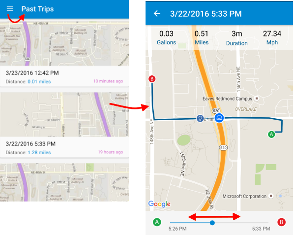

<properties
    pageTitle="Exemple de MyDriving Azure IoT : prise en main | Microsoft Azure"
    description="Commencer avec une application qui est une démonstration complète comment concevoir un système IoT à l’aide de Microsoft Azure, notamment les flux Analytique, apprentissage automatique et Hubs événement."
    services=""
    documentationCenter=".net"
    suite=""
    authors="harikmenon"
    manager="douge"/>

<tags
    ms.service="multiple"
    ms.workload="tbd"
    ms.tgt_pltfrm="ibiza"
    ms.devlang="dotnet"
    ms.topic="article"
    ms.date="03/25/2016"
    ms.author="harikm"/>

# Système MyDriving IoT : prise en main

MyDriving est un système qui montre la conception et implémentation d’une solution [Internet des objets](iot-suite-overview.md) (IoT) par défaut qui regroupe télémétrie à partir d’appareils, traite ces données dans le cloud et applique d’apprentissage fournir une réponse adaptive automatique. La démonstration enregistre les données relatives à vos trajets en voiture, en utilisant des données à partir de votre téléphone mobile et un adaptateur qui collecte des informations de système de contrôle de votre voiture. Il utilise ces données pour fournir des commentaires sur votre style de conduite par rapport aux autres utilisateurs.

L’objectif réel de MyDriving consiste à vous aider à créer votre propre solution IoT. Mais avant cela, nous allons vous familiarisez-vous avec l’application MyDriving--en tant que membre de notre équipe utilisateur test. Cela vous donne une expérience de l’application et le système derrière en tant que consommateur, avant d’approfondir l’architecture. Il vous présente également HockeyApp, un bon moyen les répartitions alpha et bêta de vos applications de gestion des utilisateurs de test.

## Utiliser l’expérience mobile

Vous pouvez utiliser l’application MyDriving si vous avez un appareil Windows 10, iOS ou Android.

### Installation de Windows 10 Mobile et Android

Sur votre appareil :

1.  Autoriser les applications de développement :

    -   Android : Dans **les paramètres** > **sécurité**, autoriser les applications d’origine **inconnue**.

    -   Windows 10 : Dans **les paramètres** > **mises à jour** > **Pour les développeurs**, définir le **mode développeur**.

2.  Participer à notre équipe de test bêta par inscription avec ou se connecter à [HockeyApp](https://rink.hockeyapp.net). HockeyApp facilite la distribution premières versions de votre application pour tester les utilisateurs.

    Si vous utilisez Windows 10, utilisez le navigateur de bord.

    Si vous êtes un participant à la version 2016, connectez-vous à l’aide de la même Microsoft adresse de messagerie que vous avez enregistré pour la conférence, en utilisant l’un des boutons situés à Microsoft. Vous êtes déjà inscrit avec HockeyApp.

    

3.  Téléchargez et installez l’application à partir d’ici :

    -   [Android](http://rink.io/spMyDrivingAndroid)

    -   [Windows 10](http://rink.io/spMyDrivingUWP)

    Il existe deux éléments. Installer le certificat dans le **Dossier contacts approuvés**. Ensuite, installez l’application.

*Les problèmes de démarrage de l’application sur Windows 10 Mobile ?* Votre téléphone peut être une mise à jour ou deux derrière. Vérifiez que vous avez les dernières mises à jour ou d’installer :

 - [Microsoft.NET.Native.Framework.1.2.appx](https://download.hockeyapp.net/packages/win10/Microsoft.NET.Native.Framework.1.2.appx) 

 - [Microsoft.NET.Native.Runtime.1.1.appx](https://download.hockeyapp.net/packages/win10/Microsoft.NET.Native.Runtime.1.1.appx) 

 - [Microsoft.VCLibs.ARM.14.00.appx](https://download.hockeyapp.net/packages/win10/Microsoft.VCLibs.ARM.14.00.appx)

### installation iOS

Si vous avez assisté Build 2016, téléchargez l’application en tant que membre de notre équipe de test sur HockeyApp :

1.  Sur votre appareil iOS, connectez-vous à [HockeyApp](https://rink.hockeyapp.net).
    Utiliser un des boutons de connexion à Microsoft et connectez-vous à l’aide de la même Microsoft adresse de messagerie que vous avez enregistré avec la conférence. (N’utilisez pas les champs de messagerie et mot de passe).

    

2.  Dans le tableau de bord HockeyApp, sélectionnez MyDriving et téléchargez-le.

3.  Autoriser la version bêta de HockeyApp :

    un. Accédez à **paramètres** > **Général** > **profils et gestion des périphériques.**

    b. Approuver le certificat **Bit stade GmbH** .

Si vous n’avez pas Assistez Build 2016, vous pouvez créer et déployer l’application vous-même :

1.   Télécharger le code [de GitHub].

2.   Créez et déployez à [l’aide de Xamarin].

Vous trouverez plus d’informations dans le [Guide de référence MyDriving](http://aka.ms/mydrivingdocs).

## Obtenir une carte OBD (facultatif)

Il s’agit de la partie qui en fait un système Internet des objets réel ! Vous pouvez utiliser l’application sans une, mais il est plus amusant avec la réalité et ne sont pas coûteux.

Diagnostics intégrés (OBD) est la fonctionnalité d’une voiture qui utilise le garage régler votre voiture et diagnostiquer les bruits impairs et feux avertissement. À moins que votre voiture est de rédaction antiquité, vous trouverez un socket quelque part dans main, généralement derrière un volet sous le tableau de bord. Avec le lien droit, vous pouvez obtenir des indicateurs de performance du moteur et apporter certaines modifications. Un connecteur OBD peut être acheté économique à partir des emplacements habituelles. Il se connecte à l’aide de Bluetooth ou Wi-Fi pour une application sur votre téléphone.

Dans ce cas, nous allons vous connecter votre voiture dans le cloud. La connexion directe entre les diagnostics intégrés consiste à votre téléphone, mais notre application fonctionne comme un relais. Télémétrie de votre voiture est envoyé directement dans le hub MyDriving IoT, où il est traité pour connecter vos voyages de route et évaluer votre style de conduite.

Pour connecter un périphérique OBD :

1.  Vérifiez que votre voiture possède un socket OBD.

2.  Obtenir une carte OBD :

    -   Si vous utilisez un téléphone Android ou Windows, vous avez besoin d’une carte compatible Bluetooth OBD II. Nous avons utilisé [Outil d’analyse des produits BAFX 34t5 Bluetooth OBDII].

    -   Si vous utilisez un téléphone iOS, vous avez besoin d’une carte OBD activé Wi-Fi. Nous avons utilisé [ScanTool OBDLink MX Wi-Fi : OBD carte/Diagnostics scanneur].

3.  Suivez les instructions fournies avec votre carte OBD pour vous connecter à votre téléphone. Gardez les éléments suivants à l’esprit :

    -   Un adaptateur Bluetooth doit être associé à la communication téléphonique, dans la page **paramètres** .

    -   Une carte Wi-Fi doit avoir une adresse dans la plage 192.168.xxx.xxx.

4.  Si vous avez plusieurs voitures, vous pouvez obtenir une carte distincte pour chaque (maximum de trois).

Si vous n’avez pas une carte OBD, l’application vous envoie toujours un emplacement et la vitesse des données à partir de récepteur GPS de téléphone au serveur principal et vous demande si vous souhaitez simuler un OBD.

Vous pouvez en savoir plus sur la façon dont l’application utilise des données à partir de la carte OBD et à propos des options permettant de créer votre propre dispositif OBD à la section 2.1, « Périphériques IoT » dans le [Guide de référence MyDriving](http://aka.ms/mydrivingdocs).

## Utiliser l’application

Démarrez l’application. Il existe un initial démarrage rapide pour vous expliquant en détail comment cela fonctionne.

### Effectuer le suivi de vos déplacements

Appuyez sur le bouton enregistrement (grand cercle rouge dans la partie inférieure de l’écran) pour commencer un voyage, puis appuyez de nouveau sur pour mettre fin.

Chaque fois que vous démarrez un voyage, s’il n’existe aucun dispositif OBD, vous êtes invité si vous souhaitez utiliser le simulator.

À la fin d’un voyage, appuyez sur le bouton Arrêter, et vous obtenez un résumé.

### Passez en revue vos voyages

### Passez en revue votre profil

## Envoyez-nous vos commentaires de test

Étant donné que nous avons créé MyDriving pour vous aider à démarrer votre propre systèmes IoT, nous voulons certainement Découvrez le bon fonctionnement de votre part. Dites-nous si :

- Vous rencontrez des difficultés ou défis.

- Il existe un point d’extension qui serait plus adapté à votre scénario.

- Vous recherchez un moyen plus efficace pour accomplir certaines besoins.

- Vous avez des autres suggestions d’amélioration de MyDriving ou la documentation.

Dans l’application MyDriving lui-même, vous pouvez utiliser le mécanisme de commentaires HockeyApp intégré : iOS et Android, simplement donner une agiter à votre téléphone, ou utilisez la commande de menu **commentaires** . Capture d’écran, est automatiquement joint afin que nous en savoir plus sur ce que vous parlez. Et si sont les incidents Malheureusement, HockeyApp collecte les journaux de blocage pour informer les. Vous pouvez également envoyer des commentaires à partir du [portail de HockeyApp].

Vous pouvez également classer un [problème sur GitHub], ou laisser un commentaire ci-dessous (en-us edition).

Nous espérons Audition de votre part !

## Étapes suivantes

-   Découvrez le [Guide de référence MyDriving](http://aka.ms/mydrivingdocs) pour mieux comprendre comment nous avons conçu et généré l’ensemble du système MyDriving.

-   [Créer et déployer un système de votre propre](iot-solution-build-system.md) à l’aide de nos scripts Azure le Gestionnaire de ressources. Le [Guide de référence MyDriving](http://aka.ms/mydrivingdocs) vous guide également où vous allez apporter les personnalisations de la plupart des zones.

  [à partir de GitHub]: https://github.com/Azure-Samples/MyDriving
  [à l’aide de Xamarin]: https://developer.xamarin.com/guides/ios/getting_started/installation/
  [Outil d’analyse BAFX produits 34t5 Bluetooth OBDII]: http://www.amazon.com/gp/product/B005NLQAHS
  [Analyseur de carte/Diagnostics OBD ScanTool OBDLink MX Wi-Fi :]: http://www.amazon.com/gp/product/B00OCYXTYY/ref=s9_simh_gw_g263_i1_r?pf_rd_m=ATVPDKIKX0DER&pf_rd_s=desktop-2&pf_rd_r=1MWRMKXK4KK9VYMJ44MP
  [Portail HockeyApp]: https://rink.hockeyapp.org
  [émettre sur GitHub]: https://github.com/Azure-Samples/MyDriving/issues
