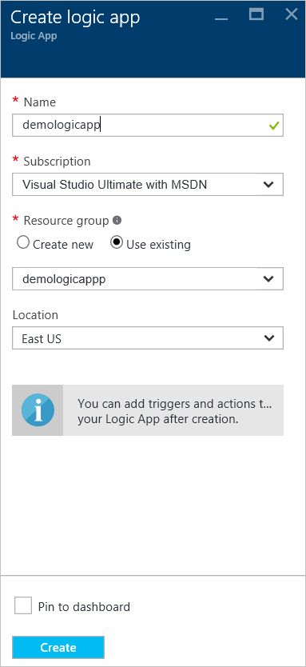

<properties
  pageTitle="Azure IoT Suite et applications logique | Microsoft Azure"
  description="Didacticiel sur la façon de sociaux logique d’applications dans la Suite de IoT Azure pour le processus d’entreprise."
  services=""
  suite="iot-suite"
  documentationCenter=""
  authors="aguilaaj"
  manager="timlt"
  editor=""/>

<tags
  ms.service="iot-suite"
  ms.devlang="na"
  ms.topic="article"
  ms.tgt_pltfrm="na"
  ms.workload="na"
  ms.date="08/16/2016"
  ms.author="araguila"/>
  
# <a name="tutorial-connect-logic-app-to-your-azure-iot-suite-remote-monitoring-preconfigured-solution"></a>Didacticiel : Se connecter application logique à votre solution Azure IoT Suite surveillance préconfiguré

La [Suite de Microsoft Azure IoT] [ lnk-internetofthings] surveillance solution préconfigurée à distance est un excellent moyen pour commencer rapidement avec un ensemble de fonctionnalités de bout en bout qui illustre une solution IoT. Ce didacticiel vous explique comment ajouter une logique de l’application à votre solution préconfigurée de surveillance à distance Microsoft Azure IoT Suite. Ces étapes décrivent comment vous pouvez prendre votre solution IoT encore plus loin en vous connectant à un processus métier.

_Si vous recherchez une procédure pas à pas sur la mise en service un contrôle à distance solution préconfigurée, voir [didacticiel : prise en main les solutions IoT préconfiguré][lnk-getstarted]._

Avant de commencer ce didacticiel, vous devez :

- Mise en service de la solution préconfigurée contrôle à distance dans votre abonnement Azure.

- Créer un compte SendGrid pour vous permettent d’envoyer un message électronique qui se déclenche votre processus d’entreprise. Vous pouvez vous inscrire pour un compte d’évaluation gratuit sur [SendGrid](https://sendgrid.com/) en cliquant sur **un essai gratuit**. Une fois que vous avez enregistré pour votre compte d’évaluation gratuit, vous devez créer une [clé de l’API](https://sendgrid.com/docs/User_Guide/Settings/api_keys.html) dans SendGrid qui accorde des autorisations d’envoyer des messages. Vous devez cette clé API plus loin dans le didacticiel.

En supposant que vous avez déjà configuré votre contrôle à distance solution préconfigurée, naviguez jusqu’au groupe de ressources pour cette solution dans le [portail Azure][lnk-azureportal]. Le groupe de ressources a le même nom que le nom de la solution choisie lorsque vous sa mise en service votre solution d’analyse à distance. Dans le groupe de ressources, vous pouvez voir toutes les ressources Azure générés pour votre solution à l’exception de l’application Azure Active Directory que vous pouvez trouver dans le portail classique Azure. La capture d’écran suivante montre une carte de **groupe de ressources** d’exemple pour une solution préconfigurée surveillance à distance :


Pour commencer, configurez l’application logique à utiliser avec la solution préconfigurée.

## <a name="set-up-the-logic-app"></a>Configurer l’application logique

1. Cliquez sur __Ajouter__ dans la partie supérieure de votre carte de groupe de ressources dans le portail Azure.

2. Recherchez __L’application logique__, sélectionnez-le, puis sur **créer**.

3. Renseignez le __nom__ et utilisent le même **abonnement** et **groupe de ressources** que vous avez utilisé lorsque vous sa mise en service de votre solution d’analyse à distance. Cliquez sur __créer__.

    

4. Lorsque votre déploiement est terminé, vous pouvez voir que l’application logique est répertoriée en tant que ressource dans votre groupe de ressources.

5. Cliquez sur l’application logique pour accéder à la carte logique application, sélectionnez le modèle **d’Application logique vierge** pour ouvrir le **Concepteur d’applications logique**.

    

6. Sélectionnez __une demande__. Cette action indique qu’une demande HTTP entrante avec un JSON spécifique format charge utile agit comme un déclencheur.

7. Collez ce qui suit dans le schéma de JSON corps de requête :

    ```
    {
      "$schema": "http://json-schema.org/draft-04/schema#",
      "id": "/",
      "properties": {
        "DeviceId": {
          "id": "DeviceId",
          "type": "string"
        },
        "measuredValue": {
          "id": "measuredValue",
          "type": "integer"
        },
        "measurementName": {
          "id": "measurementName",
          "type": "string"
        }
      },
      "required": [
        "DeviceId",
        "measurementName",
        "measuredValue"
      ],
      "type": "object"
    }
    ```
    
    > [AZURE.NOTE] Vous pouvez copier l’URL pour le billet HTTP une fois que vous enregistrez l’application logique, mais vous devez d’abord ajouter une action.

8. Cliquez sur __+ nouvelle étape__ sous votre déclencheur manuel. Puis cliquez sur **Ajouter une action**.

    

9. Rechercher **SendGrid - envoyer des messages électroniques** et cliquez dessus.

    

10. Entrez un nom pour la connexion, telles que **SendGridConnection**, entrez la **Clé d’API SendGrid** que vous avez créé lorsque vous configurez un compte SendGrid, puis cliquez sur **créer**.

    

11. Ajouter des adresses de messagerie que vous êtes propriétaire pour à la fois les champs **** d’et **à** . Le champ **objet** , ajoutez **surveillance alerte [ID de périphérique] à distance** . Dans le champ **Corps du message électronique** , ajoutez **[ID de périphérique] a signalé [measurementName] avec la valeur [measuredValue].** Vous pouvez ajouter **[ID de périphérique]**, **[measurementName]**et **[measuredValue]** en cliquant sur dans la section **que vous pouvez insérer des données des étapes précédentes** .

    

12. Dans le menu du haut, cliquez sur __Enregistrer__ .

13. Cliquez sur le déclencheur **demander** et copiez la valeur __Http Post à cette URL__ . Vous devez cette URL plus loin dans ce didacticiel.

> [AZURE.NOTE] Activer la logique applications vous permet d’exécuter [toutes sortes d’action] [ lnk-logic-apps-actions] , y compris des actions dans Office 365. 

## <a name="set-up-the-eventprocessor-web-job"></a>Configurer la tâche Web EventProcessor

Dans cette section, vous connectez votre solution préconfigurée à l’application logique que vous avez créé. Pour effectuer cette tâche, vous ajoutez l’URL pour déclencher l’application logique à l’action qui se déclenche quand une valeur de capteur appareil dépasse un seuil.

1. Utilisez votre client git pour cloner la dernière version de la [azure-iot-de surveillance à distance référentiel github][lnk-rmgithub]. Par exemple :

    ```
    git clone https://github.com/Azure/azure-iot-remote-monitoring.git
    ```

2. Dans Visual Studio, ouvrez le __RemoteMonitoring.sln__ à partir de la copie locale du référentiel.

3. Ouvrez le fichier __ActionRepository.cs__ dans le **Infrastructure\\référentiel** dossier.

4. Mettre à jour le dictionnaire **actionIds** avec le __Http Post à cette URL__ que vous avez noté depuis votre application logique comme suit :

    ```
    private Dictionary<string,string> actionIds = new Dictionary<string, string>()
    {
        { "Send Message", "<Http Post to this UR>" },
        { "Raise Alarm", "<Http Post to this UR> }
    };
    ```

5. Enregistrer les modifications dans la solution et quitter Visual Studio.

## <a name="deploy-from-the-command-line"></a>Déployer à partir de la ligne de commande

Dans cette section, vous déployez votre version mise à jour de la solution d’analyse à distance pour remplacer la version en cours d’exécution dans Azure.

1. Après la [configuration correcte de développement] [ lnk-devsetup] instructions pour configurer votre environnement pour le déploiement.

2.  Pour déployer localement, suivez le [déploiement local] [ lnk-localdeploy] instructions.

3.  Pour déployer dans le cloud et mettre à jour votre déploiement de cloud existant, suivez le [déploiement de cloud] [ lnk-clouddeploy] instructions. Utilisez le nom de votre déploiement d’origine en tant que le nom du déploiement. Pour exemple, si le déploiement d’origine était appelé **demologicapp**, utilisez la commande suivante :

    ``
    build.cmd cloud release demologicapp
    ``
    
    Lorsque le script de compilation s’exécute, veillez à utiliser le même compte Azure, abonnement, région et instance Active Directory que vous avez utilisé lorsque vous la solution sa mise en service.

## <a name="see-your-logic-app-in-action"></a>Consultez votre application logique en action

La solution préconfigurée d’analyse à distance comporte deux règles définies par défaut lorsque vous configurez une solution. Les deux règles sont sur le périphérique **SampleDevice001** :

* Température > 38.00
* Humidité > 48,00

La règle température de déclencher le script **Alarme déclencher** et la règle humidité déclenche l’action **SendMessage** . En supposant que vous avez utilisé la même URL pour les actions de la classe **ActionRepository** , votre application logique déclenche pour une règle. Les deux règles utilisent SendGrid pour envoyer un message électronique à **l’adresse avec détails de l’alerte** .

> [AZURE.NOTE] L’application logique continue à déclencher chaque fois que le seuil est atteint. Pour éviter les e-mails inutiles, vous pouvez désactiver les règles dans votre portail solution ou désactiver l’application logique dans le [portail Azure][lnk-azureportal].

En plus de recevoir des messages électroniques, vous pouvez également consulter lors de l’exécution de l’application logique dans le portail :


## <a name="next-steps"></a>Étapes suivantes

À présent que vous avez utilisé une application logique pour connecter la solution préconfigurée à un processus métier, vous pouvez en savoir plus sur les options permettant de personnaliser les solutions préconfigurées :

- [Solution préconfigurée de télémétrie dynamique utiliser avec le contrôle à distance][lnk-dynamic]
- [Solution préconfigurée appareil informations métadonnées dans le contrôle à distance][lnk-devinfo]

[lnk-dynamic]: iot-suite-dynamic-telemetry.md
[lnk-devinfo]: iot-suite-remote-monitoring-device-info.md

[lnk-internetofthings]: https://azure.microsoft.com/documentation/suites/iot-suite/
[lnk-getstarted]: iot-suite-getstarted-preconfigured-solutions.md
[lnk-azureportal]: https://portal.azure.com
[lnk-logic-apps-actions]: ../connectors/apis-list.md
[lnk-rmgithub]: https://github.com/Azure/azure-iot-remote-monitoring
[lnk-devsetup]: https://github.com/Azure/azure-iot-remote-monitoring/blob/master/Docs/dev-setup.md
[lnk-localdeploy]: https://github.com/Azure/azure-iot-remote-monitoring/blob/master/Docs/local-deployment.md
[lnk-clouddeploy]: https://github.com/Azure/azure-iot-remote-monitoring/blob/master/Docs/cloud-deployment.md
