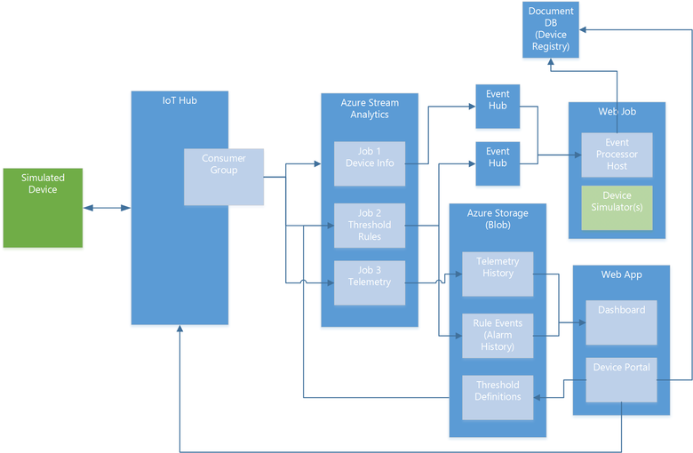

<properties
 pageTitle="Surveillance à distance préconfiguré procédure pas à pas de solution | Microsoft Azure"
 description="Une description de la IoT Azure préconfiguré contrôle à distance solution et son architecture."
 services=""
 suite="iot-suite"
 documentationCenter=""
 authors="dominicbetts"
 manager="timlt"
 editor=""/>

<tags
 ms.service="iot-suite"
 ms.devlang="na"
 ms.topic="get-started-article"
 ms.tgt_pltfrm="na"
 ms.workload="na"
 ms.date="08/17/2016"
 ms.author="dobett"/>

# <a name="remote-monitoring-preconfigured-solution-walkthrough"></a>Contrôle à distance préconfiguré solution procédure pas à pas

## <a name="introduction"></a>Introduction

La distance IoT Suite surveillance [solution préconfigurée] [ lnk-preconfigured-solutions] est une mise en œuvre d’un bout à surveillance solution pour plusieurs ordinateurs distants. La solution combine services Azure clés pour fournir une implémentation générique d’au scénario d’entreprise et vous pouvez l’utiliser comme point de départ pour votre propre implémentation. Vous pouvez [Personnaliser] [ lnk-customize] la solution pour répondre aux besoins de votre entreprise spécifique.

Cet article décrit quelques-unes des éléments clés de la solution d’analyse à distance à vous permettent de comprendre le fonctionnement. Ces connaissances vous aidera à :

- Résoudre les problèmes de la solution.
- Planifier la personnalisation de la solution pour répondre à vos besoins spécifiques. 
- Créer votre propre solution IoT qui utilise des services Azure.

## <a name="logical-architecture"></a>Architecture logique

Le diagramme suivant décrit les composants logiques de la solution préconfigurée :




## <a name="simulated-devices"></a>Appareils simulés

Dans la solution préconfigurée, périphérique simulé représente un périphérique refroidissement (par exemple, une construction air conditionne ou unité de gestion des installations air). Lorsque vous déployez la solution préconfigurée, vous devez configurer également automatiquement quatre périphériques simulés qui s’exécutent dans un [Azure WebJob][lnk-webjobs]. Les appareils simulés permettent d’Explorer le comportement de la solution sans avoir à déployer les périphériques physiques. Pour déployer un appareil physique réel, consultez la [solution préconfigurée de surveillance se connecter votre périphérique au serveur distant] [ lnk-connect-rm] didacticiel.

Chaque périphérique simulé peut envoyer des types de messages suivants à IoT concentrateur :

| Message  | Description |
|----------|-------------|
| Démarrage  | Lorsque l’appareil démarre, il envoie un message **d’informations du périphérique** contenant des informations sur lui-même au serveur principal. Ces données incluent l’id du périphérique, les métadonnées de périphérique, une liste des commandes le périphérique prend en charge et la configuration actuelle de l’appareil. |
| Présence | Un périphérique envoie régulièrement un message de **présence** pour signaler si l’appareil peut détecter la présence d’une cellule. |
| Télémétrie | Un périphérique envoie régulièrement un message de **télémétrie** qui fournit des valeurs simulés pour la température et l’humidité collectées à partir de capteurs simulé du périphérique. |


Les appareils simulés envoyer les propriétés du périphérique suivant dans un message **Infos sur l’appareil** :

| Propriété               |  Objectif |
|------------------------|--------- |
| ID de périphérique              | ID qui est fourni ou affecté lors de la création d’une unité dans la solution. |
| Fabricant           | Fabricant du périphérique |
| Numéro de modèle           | Numéro de modèle de l’appareil |
| Numéro de série          | Numéro de série de l’appareil |
| Microprogramme               | Version actuelle du microprogramme sur l’appareil |
| Plateforme               | Architecture de la plate-forme du périphérique |
| Processeur              | Processeur le périphérique en cours d’exécution |
| RAM installée          | Quantité de mémoire vive installée sur le périphérique |
| Concentrateur état activé      | Propriété état IoT concentrateur de l’appareil |
| Heure de création           | Heure de que création de l’appareil dans la solution |
| Heure mise à jour           | Heure de la dernière propriétés ont été mises à jour pour le périphérique |
| Latitude               | Emplacement Latitude du périphérique |
| Longitude              | Localisation longitude du périphérique |

Le simulator est basée sur ces propriétés dans simulé appareils avec des exemples de valeurs.  Chaque fois que le simulator Initialise un périphérique simulé, le périphérique publie les métadonnées prédéfinies à IoT concentrateur. Notez comment cela remplace les métadonnées mises à jour dans le portail d’appareil.


Les appareils simulés peuvent gérer les commandes suivantes envoyés à partir du tableau de bord solution via le concentrateur IoT :

| Commande                | Description                                         |
|------------------------|-----------------------------------------------------|
| PingDevice             | Envoie une _commande ping_ sur le périphérique pour vérifier qu’il est actif   |
| StartTelemetry         | Démarre le périphérique envoi de télémétrie                 |
| StopTelemetry          | Cesse de l’appareil à partir de l’envoi de télémétrie             |
| ChangeSetPointTemp     | Modifie la valeur de définir le point autour de laquelle les données aléatoires sont générées |
| DiagnosticTelemetry    | Déclenche le simulator appareil pour envoyer une valeur de télémétrie supplémentaires (externalTemp) |
| ChangeDeviceState      | Modifie une propriété état étendu pour l’appareil et envoie le message d’informations sur le périphérique de l’appareil |

L’accusé de réception de commande appareil au serveur principal solution est fourni par le biais du concentrateur IoT.

## <a name="iot-hub"></a>Concentrateur IoT

Le [hub IoT] [ lnk-iothub] ingests les données envoyées par les appareils dans le nuage et rend disponible pour les tâches de flux de Azure Analytique (ASA). Concentrateur IoT envoie également des commandes à vos périphériques au nom du portail de l’appareil. Chaque tâche ASA flux utilise un groupe de consommateur IoT concentrateur distinct pour lire le flux des messages à partir de vos appareils.

## <a name="azure-stream-analytics"></a>Flux de données Azure Analytique

Dans la solution d’analyse à distance, [Azure flux Analytique] [ lnk-asa] (ASA) distribue les messages appareil reçus par le hub IoT à d’autres composants principaux de traitement ou de stockage. Différentes tâches ASA exécutent des fonctions spécifiques en fonction du contenu des messages.

**Tâche 1 : Infos sur l’appareil** filtre les messages d’informations appareil à partir du flux de messages entrants et les envoie à un point de terminaison concentrateur de l’événement. Un périphérique envoie des messages d’informations de périphérique au démarrage et en réponse à une commande **SendDeviceInfo** . Cette tâche utilise la définition de la requête suivante pour identifier les messages **Infos sur l’appareil** :

```
SELECT * FROM DeviceDataStream Partition By PartitionId WHERE  ObjectType = 'DeviceInfo'
```

Cette tâche envoie sa sortie à un concentrateur événement pour un traitement approfondi.

**Travail 2 : règles** évalue les valeurs de télémétrie température et humidité entrantes par rapport aux seuils par périphérique. Les valeurs des seuils sont définis dans l’éditeur de règles disponible dans le tableau de bord solution. Chaque paire/valeur de l’appareil est stocké par horodatage dans un blob libellée dans Analytique de flux de données de **Référence**. La tâche compare une valeur non vide contre le seuil défini pour le périphérique. S’il dépasse la ' >' condition, la tâche génère un événement **d’alarme** qui indique que le seuil est dépassé et fournit l’appareil, valeur et des valeurs d’horodatage. Cette tâche utilise la définition de la requête suivante pour identifier les messages de télémétrie qui doivent déclencher une alarme :

```
WITH AlarmsData AS 
(
SELECT
     Stream.IoTHub.ConnectionDeviceId AS DeviceId,
     'Temperature' as ReadingType,
     Stream.Temperature as Reading,
     Ref.Temperature as Threshold,
     Ref.TemperatureRuleOutput as RuleOutput,
     Stream.EventEnqueuedUtcTime AS [Time]
FROM IoTTelemetryStream Stream
JOIN DeviceRulesBlob Ref ON Stream.IoTHub.ConnectionDeviceId = Ref.DeviceID
WHERE
     Ref.Temperature IS NOT null AND Stream.Temperature > Ref.Temperature

UNION ALL

SELECT
     Stream.IoTHub.ConnectionDeviceId AS DeviceId,
     'Humidity' as ReadingType,
     Stream.Humidity as Reading,
     Ref.Humidity as Threshold,
     Ref.HumidityRuleOutput as RuleOutput,
     Stream.EventEnqueuedUtcTime AS [Time]
FROM IoTTelemetryStream Stream
JOIN DeviceRulesBlob Ref ON Stream.IoTHub.ConnectionDeviceId = Ref.DeviceID
WHERE
     Ref.Humidity IS NOT null AND Stream.Humidity > Ref.Humidity
)

SELECT *
INTO DeviceRulesMonitoring
FROM AlarmsData

SELECT *
INTO DeviceRulesHub
FROM AlarmsData
```

La tâche envoie sa sortie à un concentrateur événement pour un traitement approfondi et d’enregistrer les détails de chaque alerte à blob storage à partir de l’endroit où le tableau de bord solution peut lire les informations d’alerte.

**Travail 3 : télémétrie** fonctionne sur le flux de télémétrie appareil entrant de deux façons. La première envoie tous les messages de télémétrie à partir des périphériques au stockage blob permanente pour le stockage à long terme. La deuxième calcule les valeurs humidité moyenne, minimale et maximale sur une fenêtre décalée de cinq minutes et envoie ces données au stockage d’objets blob. Le tableau de bord solution lit les données de télémétrie depuis le stockage blob pour remplir les graphiques. Cette tâche utilise la définition de la requête suivante :

```
WITH 
    [StreamData]
AS (
    SELECT
        *
    FROM [IoTHubStream]
    WHERE
        [ObjectType] IS NULL -- Filter out device info and command responses
) 

SELECT
    IoTHub.ConnectionDeviceId AS DeviceId,
    Temperature,
    Humidity,
    ExternalTemperature,
    EventProcessedUtcTime,
    PartitionId,
    EventEnqueuedUtcTime,
    * 
INTO
    [Telemetry]
FROM
    [StreamData]

SELECT
    IoTHub.ConnectionDeviceId AS DeviceId,
    AVG (Humidity) AS [AverageHumidity],
    MIN(Humidity) AS [MinimumHumidity],
    MAX(Humidity) AS [MaxHumidity],
    5.0 AS TimeframeMinutes 
INTO
    [TelemetrySummary]
FROM [StreamData]
WHERE
    [Humidity] IS NOT NULL
GROUP BY
    IoTHub.ConnectionDeviceId,
    SlidingWindow (mi, 5)
```

## <a name="event-hubs"></a>Événement Hubs

Les tâches ASA **Infos sur l’appareil** et les **règles** de sortie Hubs événement pour transférer fiable dois-je du **Processeur d’événements** dans le WebJob de leurs données.

## <a name="azure-storage"></a>Stockage Azure

La solution utilise le stockage blob Azure pour conserver toutes les données de télémétrie brute et résumées à partir des unités de la solution. Le tableau de bord lit les données de télémétrie depuis le stockage blob pour remplir les graphiques. Pour afficher les alertes, le tableau de bord lit les données depuis le stockage blob qui enregistre lorsque les valeurs de télémétrie dépassement les valeurs seuil configuré. La solution utilise également stockage d’objets blob pour enregistrer les valeurs de seuil que vous définissez dans le tableau de bord.

## <a name="webjobs"></a>WebJobs

Outre l’hébergement simulateurs d’appareil, les WebJobs dans la solution hébergent également du **Processeur d’événements** dans un WebJob Azure qui gère les messages informations appareil et les réponses aux commandes. Elle utilise :

- Messages d’information appareil pour mettre à jour le Registre de périphérique (stocké dans la base de données DocumentDB) avec les informations de périphérique en cours.
- Messages de réponse commande Mettre à jour l’historique des commandes de périphérique (stockée dans la base de données DocumentDB).

## <a name="documentdb"></a>DocumentDB

La solution utilise une base de données DocumentDB pour stocker des informations sur les appareils connectés à la solution. Ces informations comprennent l’historique des commandes envoyées aux périphériques du tableau de bord et les métadonnées de l’appareil.

## <a name="web-apps"></a>Applications Web

### <a name="remote-monitoring-dashboard"></a>Tableau de bord de surveillance à distance
Cette page dans l’application web utilise des contrôles javascript PowerBI (voir [mis en pension PowerBI visuels](https://www.github.com/Microsoft/PowerBI-visuals)) pour visualiser les données de télémétrie à partir des périphériques. La solution utilise le travail de télémétrie ASA pour écrire les données de télémétrie stockage BLOB.


### <a name="device-administration-portal"></a>Portail d’administration appareil

Cette application web vous permet de :

- Configurer un nouvel appareil. Cette action définit l’id d’appareil unique et génère la clé d’authentification. Il écrit d’informations sur le périphérique dans le Registre identité IoT concentrateur et la base de données DocumentDB solution spécifiques.
- Gérer les propriétés de l’appareil. Cette action inclut l’affichage des propriétés existantes et la mise à jour avec de nouvelles propriétés.
- Envoyer des commandes à un appareil.
- Afficher l’historique de commande pour un appareil.
- Activer et désactiver les appareils mobiles.

## <a name="next-steps"></a>Étapes suivantes

Les billets de blog TechNet suivants fournissent davantage de détails sur la solution préconfigurée surveillance à distance :

- [Contrôle à distance IoT Suite - les paramètres avancés :](http://social.technet.microsoft.com/wiki/contents/articles/32941.iot-suite-under-the-hood-remote-monitoring.aspx)
- [Suite IoT - contrôle à distance - Ajout d’un périphérique simulé et en temps réel](http://social.technet.microsoft.com/wiki/contents/articles/32975.iot-suite-remote-monitoring-adding-live-and-simulated-devices.aspx)

Vous pouvez continuer la prise en main IoT Suite, lisez les articles suivants :

- [Connectez votre appareil à la solution préconfigurée contrôle à distance][lnk-connect-rm]
- [Autorisations sur le site azureiotsuite.com][lnk-permissions]

[lnk-preconfigured-solutions]: iot-suite-what-are-preconfigured-solutions.md
[lnk-customize]: iot-suite-guidance-on-customizing-preconfigured-solutions.md
[lnk-iothub]: https://azure.microsoft.com/documentation/services/iot-hub/
[lnk-asa]: https://azure.microsoft.com/documentation/services/stream-analytics/
[lnk-webjobs]: https://azure.microsoft.com/documentation/articles/websites-webjobs-resources/
[lnk-connect-rm]: iot-suite-connecting-devices.md
[lnk-permissions]: iot-suite-permissions.md