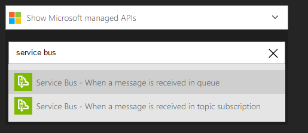

<properties
    pageTitle="Configuration de l’archivage sécurisé clé avec rotation des clés de bout en bout et d’audit | Microsoft Azure"
    description="Utilisez cette procédure pour vous aider à obtenir le programme d’installation avec rotation des clés et de contrôle des journaux des clés de l’archivage sécurisé"
    services="key-vault"
    documentationCenter=""
    authors="swgriffith"
    manager="mbaldwin"
    tags=""/>

<tags
    ms.service="key-vault"
    ms.workload="identity"
    ms.tgt_pltfrm="na"
    ms.devlang="na"
    ms.topic="article"
    ms.date="07/05/2016"
    ms.author="jodehavi;stgriffi"/>
#<a name="how-to-setup-key-vault-with-end-to-end-key-rotation-and-auditing"></a>Configuration de l’archivage sécurisé clé avec rotation des clés de bout en bout et d’audit

##<a name="introduction"></a>Introduction

Après avoir créé votre l’archivage sécurisé de clé Azure, vous pourrez à exploiter que l’archivage sécurisé pour stocker vos clés et Secrets. Vos applications n’avez plus besoin pour conserver vos clés ou secrets, mais plutôt demandera les de l’archivage sécurisé clé selon vos besoins. Cela vous permet de mettre à jour des clés et secrets sans ayant un impact sur le comportement de votre application qui ouvre un large éventail de possibilités autour de votre clé et le comportement de gestion des secrets.

Cet article décrit un exemple de l’utilisation de l’archivage sécurisé de clé Azure pour stocker un code secret, dans le cas présent une clé de compte de stockage Azure qui est consultée par une application. Il va également vous montrer l’implémentation d’une rotation planifiée de cette clé de compte de stockage. Enfin, il guidera une démonstration de surveiller les journaux d’audit de l’archivage sécurisé clés et émettre des alertes lorsque les requêtes inattendus sont effectuées.

> \[AZURE. Remarque\] ce didacticiel n’est pas destiné à expliquer en détail le jeu initial vers le haut de votre l’archivage sécurisé de clé Azure. Pour obtenir ces informations, voir [prise en main l’archivage sécurisé de clé Azure](key-vault-get-started.md). Ou, pour obtenir des instructions de l’Interface de ligne de commande de disponibilité sur plusieurs plateformes, consultez [ce didacticiel équivalent](key-vault-manage-with-cli.md).

##<a name="setting-up-keyvault"></a>La configuration KeyVault

Pour activer une application d’extraire un code secret de l’archivage sécurisé de clé Azure, vous devez tout d’abord créer le code secret et téléchargez-le sur votre l’archivage sécurisé. Pour ce faire facilement via PowerShell comme illustré ci-dessous.

Démarrer une session PowerShell Azure et se connecter à votre compte Azure avec la commande suivante :

```powershell
Login-AzureRmAccount
```

Dans la fenêtre du navigateur contextuel, entrez votre nom d’utilisateur compte Azure et le mot de passe. PowerShell Azure peuvent accéder à tous les abonnements qui sont associés à ce compte et par défaut, utilise la première.

Si vous avez plusieurs abonnements, vous devrez peut-être spécifier un spécifique ayant servi à créer votre l’archivage sécurisé de clé Azure. Tapez ce qui suit pour afficher les abonnements pour votre compte :

```powershell
Get-AzureRmSubscription
```

Ensuite, pour indiquer l’abonnement associée à votre l’archivage sécurisé clé que se connectent, tapez :

```powershell
Set-AzureRmContext -SubscriptionId <subscriptionID> 
```

Comme le montre cet article le stockage d’une clé de compte de stockage comme un code secret, vous devrez obtenir cette clé de compte de stockage.

```powershell
Get-AzureRmStorageAccountKey -ResourceGroupName <resourceGroupName> -Name <storageAccountName>
```

Après avoir récupéré votre code secret, dans ce cas votre clé de compte de stockage, vous devrez qui convertir une chaîne sécurisée, puis créez un code secret avec cette valeur dans votre l’archivage sécurisé clé.

```powershell
$secretvalue = ConvertTo-SecureString <storageAccountKey> -AsPlainText -Force

Set-AzureKeyVaultSecret -VaultName <vaultName> -Name <secretName> -SecretValue $secretvalue
```
Ensuite, vous devez obtenir l’URI pour le mot de passe que vous venez de créer. Cela sera utilisé dans une étape ultérieure lorsque vous appelez l’archivage sécurisé clé pour récupérer votre code secret. Exécutez la commande PowerShell suivante et prenez note de la valeur « Id », ce qui correspond à l’URI secrète.

```powershell
Get-AzureKeyVaultSecret –VaultName <vaultName>
```

##<a name="setting-up-application"></a>Configuration d’Application

Maintenant que vous avez un secret stocké vous souhaiterez récupérez ce secret et l’utiliser à partir de code. Il existe quelques étapes requises pour ce faire, la première et la plus importante de ce qui est enregistrement de votre application avec Azure Active Directory, puis de l’archivage sécurisé de clé Azure vos informations sur l’application afin qu’il peut autoriser les requêtes à partir de votre application.

> \[AZURE. Remarque\] votre application doit être créée sur le même client Azure Active Directory en tant que votre l’archivage sécurisé clé. 

Tout d’abord ouvrir l’onglet applications d’Azure Active Directory


Sélectionnez « Ajouter » pour ajouter une nouvelle application à votre annonce Azure


Laissez le type d’application en tant que « API WEB et/ou Web Application » et donnez un nom à votre application.


Donnez à votre application une URL « authentification » et un 'application ID URI'. Ces peuvent être tout ce que vous voulez pour cette démonstration et peuvent être modifiées ultérieurement si nécessaire.


Une fois que l’application est ajoutée à Azure Active Directory, vous seront mises en page de l’application. À partir de là cliquez sur l’onglet « Configuration » et puis recherchez et copiez la valeur « ID Client ». Prenez note de l’ID de client pour les étapes ultérieures.

Vous devez ensuite générer une clé pour votre application puissent interagir avec votre annonce Azure. Vous pouvez le créer sous la section « Touches » dans l’onglet « Configuration ». Notez la la clé nouvellement créée à partir de votre application Azure AD pour une utilisation dans une étape ultérieure.


Avant d’établir des appels provenant de votre application dans l’archivage sécurisé clé vous devrez indiquer l’archivage sécurisé clé relatives à votre application et son « autorisations. La commande suivante prend le nom de l’archivage sécurisé et l’ID de client à partir de votre application Azure AD et accorde l’accès 'Get' à votre l’archivage sécurisé clé pour l’application.

```powershell
Set-AzureRmKeyVaultAccessPolicy -VaultName <vaultName> -ServicePrincipalName <clientIDfromAzureAD> -PermissionsToSecrets Get
```

À ce stade, vous êtes prêt à commencer à créer votre application appelle. Vous devez installer les packages NuGet nécessaires pour interagir avec l’archivage sécurisé de clé Azure et Azure Active Directory dans votre application. À partir de la console du Gestionnaire de Package Visual Studio, entrez les commandes suivantes. Notez qu’à la rédaction de cet article la version actuelle du package Active Directory est 3.10.305231913, et vous préférerez peut-être confirmer la dernière version et mettre à jour en conséquence.

```powershell
Install-Package Microsoft.IdentityModel.Clients.ActiveDirectory -Version 3.10.305231913

Install-Package Microsoft.Azure.KeyVault
```

Code de l’application, créez une classe pour mettre en attente de la méthode d’authentification de votre Active Directory. Dans cet exemple de classe est appelée « Utilitaires ». Vous devrez ajouter la suivants à l’aide.

```csharp
using Microsoft.IdentityModel.Clients.ActiveDirectory;
```

Ensuite, ajoutez la méthode suivante pour récupérer le jeton JWT à partir d’Azure AD. Pour la maintenance que vous souhaiterez peut-être déplacer durs codée en valeurs de chaîne dans la configuration de votre application web ou.

```csharp
public async static Task<string> GetToken(string authority, string resource, string scope)
{
    var authContext = new AuthenticationContext(authority);

    ClientCredential clientCred = new ClientCredential("<AzureADApplicationClientID>","<AzureADApplicationClientKey>");

    AuthenticationResult result = await authContext.AcquireTokenAsync(resource, clientCred);

    if (result == null)

    throw new InvalidOperationException("Failed to obtain the JWT token");

    return result.AccessToken;
}
```

Enfin, vous pouvez ajouter le code requis pour l’archivage sécurisé clé d’appel et de récupérer votre valeur secrète. Vous devez d’abord ajouter les éléments suivants à l’aide de déclaration.

```csharp
using Microsoft.Azure.KeyVault;
```

Ensuite, vous allez ajouter les appels de méthode d’appeler l’archivage sécurisé clé et récupérer votre code secret. Dans cette méthode, vous devez fournir le code secret URI que vous avez enregistré dans une étape précédente. Notez l’utilisation de la méthode GetToken à partir de la classe utilitaires créée ci-dessus.
    
```csharp
var kv = new KeyVaultClient(new KeyVaultClient.AuthenticationCallback(Utils.GetToken));

var sec = kv.GetSecretAsync(<SecretID>).Result.Value;
```

Lorsque vous exécutez votre application, vous devez à présent le couple à Azure Active Directory et en récupérant ensuite votre valeur secrète de votre l’archivage sécurisé de clé Azure.

##<a name="key-rotation-using-azure-automation"></a>Rotation de clé à l’aide de Automation Azure

Il existe différentes options de mise en œuvre une stratégie de rotation pour les valeurs que vous entrerez en tant que secrets de l’archivage sécurisé de clé Azure. Secrets peuvent être pivotés dans le cadre d’un processus manuel, ils peuvent faire pivoter par programmation en tirant parti des appels d’API ou qu’ils peuvent faire pivoter au moyen d’un script d’automation. Dans le cadre de cet article nous va exploiter PowerShell Azure combiné avec Azure Automation pour modifier une touche d’accès de compte de stockage Azure et puis nous met à jour un code secret l’archivage sécurisé clés avec cette nouvelle clé. 

Afin de permettre l’automatisation Azure définir les valeurs secrètes dans votre l’archivage sécurisé clé, vous devrez obtenir l’ID client pour la connexion nommée « AzureRunAsConnection » a été créée lorsque vous avez établi votre instance d’Azure Automation. Vous pouvez accéder à cet identifiant en choisissant « Actifs » dans votre instance d’Azure Automation. À partir de là, vous choisissez « Connexions », puis sélectionnez le principe de service 'AzureRunAsConnection'. Vous souhaiterez prenez note de l’ID d’Application. 


Pendant que vous êtes toujours dans la fenêtre de biens, vous devez également choisir « Modules ». À partir de modules sélectionnez « Galerie » et recherchez et 'Import' mis à jour les versions de chacun des modules suivants.

    Azure
    Azure.Storage   
    AzureRM.Profile
    AzureRM.KeyVault
    AzureRM.Automation
    AzureRM.Storage
    
> \[AZURE. Remarque\] à la rédaction de cet article uniquement précédentes noter modules requis pour mettre à jour pour le script partagé en dessous. Si vous trouvez que votre travail automation échoue, vous devez vérifier que vous disposez de tous les modules nécessaires et leurs dépendances importés.

Une fois que vous avez extrait l’ID de l’application pour votre connexion Automation Azure, vous devrez indiquer votre l’archivage sécurisé de clé Azure que cette application a accès à mettre à jour les secrets dans votre l’archivage sécurisé. Pour ce faire avec la commande PowerShell suivante.

```powershell
Set-AzureRmKeyVaultAccessPolicy -VaultName <vaultName> -ServicePrincipalName <applicationIDfromAzureAutomation> -PermissionsToSecrets Set
```

Cliquez ensuite que vous allez sélectionner la ressource « Procédures opérationnelles » sous votre instance d’Azure Automation et sélectionnez « Ajouter un Runbook ». Sélectionnez Création rapide. Nommez votre runbook et sélectionnez « PowerShell » comme type de runbook. Vous pouvez également ajouter une description. Pour finir, cliquez sur « Create ».


Dans le volet de l’éditeur pour votre nouvelle runbook vous allez copier le script PowerShell suivant.

```powershell
$connectionName = "AzureRunAsConnection"
try
{
    # Get the connection "AzureRunAsConnection "
    $servicePrincipalConnection=Get-AutomationConnection -Name $connectionName         

    "Logging in to Azure..."
    Add-AzureRmAccount `
        -ServicePrincipal `
        -TenantId $servicePrincipalConnection.TenantId `
        -ApplicationId $servicePrincipalConnection.ApplicationId `
        -CertificateThumbprint $servicePrincipalConnection.CertificateThumbprint 
    "Login complete."
}
catch {
    if (!$servicePrincipalConnection)
    {
        $ErrorMessage = "Connection $connectionName not found."
        throw $ErrorMessage
    } else{
        Write-Error -Message $_.Exception
        throw $_.Exception
    }
}

#Optionally you may set the following as parameters
$StorageAccountName = <storageAccountName>
$RGName = <storageAccountResourceGroupName>
$VaultName = <keyVaultName>
$SecretName = <keyVaultSecretName>

#Key name. For example key1 or key2 for the storage account
New-AzureRmStorageAccountKey -ResourceGroupName $RGName -StorageAccountName $StorageAccountName -KeyName "key2" -Verbose
$SAKeys = Get-AzureRmStorageAccountKey -ResourceGroupName $RGName -Name $StorageAccountName

$secretvalue = ConvertTo-SecureString $SAKeys[1].Value -AsPlainText -Force

$secret = Set-AzureKeyVaultSecret -VaultName $VaultName -Name $SecretName -SecretValue $secretvalue
```

Dans le volet de l’éditeur, vous pouvez choisir 'Test volet' pour tester votre script. Une fois que le script s’exécute sans erreur, vous pouvez sélectionner l’option « Publier », et appliquez-lui une planification pour le runbook au volet de configuration runbook.

##<a name="key-vault-auditing-pipeline"></a>Pipeline audit-clé de l’archivage sécurisé

Lorsque vous installez une archivage sécurisé de clé Azure vous pouvez activer l’audit pour collecter des journaux sur des demandes d’accès apportées à l’archivage sécurisé clé. Ces fichiers journaux est stockées dans un compte de stockage Azure désigné et peut ensuite être extraites, surveiller et analyser. Sous parcours via un scénario qui utilise les fonctions Azure, Azure logique d’applications et l’archivage sécurisé clé des journaux d’audit pour créer une opportunité pour envoyer un message électronique lorsque secrets de l’archivage sécurisé sont renvoyées par une application qui ne correspondent pas à l’id de l’application de l’application web.

Tout d’abord, vous devez activer la journalisation sur votre l’archivage sécurisé clé. Pour ce faire via les commandes PowerShell suivantes (détails complets peuvent être vu [ici](key-vault-logging.md)) :

```powershell
$sa = New-AzureRmStorageAccount -ResourceGroupName <resourceGroupName> -Name <storageAccountName> -Type Standard\_LRS -Location 'East US'
$kv = Get-AzureRmKeyVault -VaultName '<vaultName>' 
Set-AzureRmDiagnosticSetting -ResourceId $kv.ResourceId -StorageAccountId $sa.Id -Enabled $true -Categories AuditEvent
```

Une fois que cette option est activée, les journaux d’audit démarre collecte dans le compte de stockage désigné. Ces fichiers journaux contiendra événements sur la façon d’et lorsque vous accédez à votre chambres fortes clé et par qui. 

> \[AZURE. Remarque\] vous pouvez accéder à vos informations de journalisation au maximum, 10 minutes après la clé vault opération. Dans la plupart des cas, il sera plus rapide que cela.

L’étape suivante consiste à [créer une file d’attente Bus des services Azure](../service-bus-messaging/service-bus-dotnet-get-started-with-queues.md). Il s’agit de l’endroit où les journaux d’audit de l’archivage sécurisé clés sont déplacées. Une fois dans la file d’attente, l’application logique sont les décrochez et agir sur les. Pour créer un Bus Service est relativement directe et Voici les étapes de haut niveau :

1. Créer un espace de noms Bus des services (si vous possédez déjà un que vous souhaitez utiliser pour cette puis passez à l’étape 2).
2. Recherchez le Bus de Service dans le portail et sélectionnez l’espace de noms que vous voulez créer la file d’attente.
3. Sélectionnez Nouveau et choisissez Service Bus -> file d’attente et entrez les informations requises.
4. Sélectionner les informations de connexion de Service Bus en choisissant l’espace de noms et en cliquant sur _Informations de connexion_. Vous avez besoin de ces informations pour le composant suivant.

Ensuite, vous allez [créer une fonction d’Azure](../azure-functions/functions-create-first-azure-function.md) pour interroger les journaux de l’archivage sécurisé clé au sein du compte de stockage et de décrocher de nouveaux événements. Il s’agit d’une fonction qui se déclenche sur un planning.

Créer une fonction d’Azure (cliquez sur Nouveau -> fonction application dans le portail). Lors de la création, vous pouvez utiliser un plan d’hébergement existant ou créez-en un. Vous pouvez également opter pour dynamique d’hébergement. Vous pouvez trouver plus d’informations sur la fonction options d’hébergement [ici](../azure-functions/functions-scale.md).

Lorsque la fonction Azure est créée, y accéder, puis sélectionnez un minuteur de la fonction et C\# puis cliquez sur **créer** à partir de l’écran d’accueil.


Dans l’onglet _développer_ , remplacez le code run.csx avec les éléments suivants :

```csharp
#r "Newtonsoft.Json"

using System;
using Microsoft.WindowsAzure.Storage;
using Microsoft.WindowsAzure.Storage.Auth;
using Microsoft.WindowsAzure.Storage.Blob;
using Microsoft.ServiceBus.Messaging; 
using System.Text;

public static void Run(TimerInfo myTimer, TextReader inputBlob, TextWriter outputBlob, TraceWriter log) 
{ 
    log.Info("Starting");

    CloudStorageAccount sourceStorageAccount = new CloudStorageAccount(new StorageCredentials("<STORAGE_ACCOUNT_NAME>", "<STORAGE_ACCOUNT_KEY>"), true);

    CloudBlobClient sourceCloudBlobClient = sourceStorageAccount.CreateCloudBlobClient();

    var connectionString = "<SERVICE_BUS_CONNECTION_STRING>";
    var queueName = "<SERVICE_BUS_QUEUE_NAME>";

    var sbClient = QueueClient.CreateFromConnectionString(connectionString, queueName);

    DateTime dtPrev = DateTime.UtcNow;
    if(inputBlob != null)
    {
        var txt = inputBlob.ReadToEnd();

        if(!string.IsNullOrEmpty(txt))
        {
            dtPrev = DateTime.Parse(txt);
            log.Verbose($"SyncPoint: {dtPrev.ToString("O")}");
        }
        else
        {
            dtPrev = DateTime.UtcNow;
            log.Verbose($"Sync point file didnt have a date. Setting to now.");
        }
    }

    var now = DateTime.UtcNow;

    string blobPrefix = "insights-logs-auditevent/resourceId=/SUBSCRIPTIONS/<SUBSCRIPTION_ID>/RESOURCEGROUPS/<RESOURCE_GROUP_NAME>/PROVIDERS/MICROSOFT.KEYVAULT/VAULTS/<KEY_VAULT_NAME>/y=" + now.Year +"/m="+now.Month.ToString("D2")+"/d="+ (now.Day).ToString("D2")+"/h="+(now.Hour).ToString("D2")+"/m=00/";

    log.Info($"Scanning:  {blobPrefix}");

    IEnumerable<IListBlobItem> blobs = sourceCloudBlobClient.ListBlobs(blobPrefix, true);

    log.Info($"found {blobs.Count()} blobs");

    foreach(var item in blobs)
    {
        if (item is CloudBlockBlob)
        {
            CloudBlockBlob blockBlob = (CloudBlockBlob)item;

            log.Info($"Syncing: {item.Uri}");

            string sharedAccessUri = GetContainerSasUri(blockBlob);

            CloudBlockBlob sourceBlob = new CloudBlockBlob(new Uri(sharedAccessUri));

            string text;
            using (var memoryStream = new MemoryStream())
            {
                sourceBlob.DownloadToStream(memoryStream);
                text = System.Text.Encoding.UTF8.GetString(memoryStream.ToArray());
            }

            dynamic dynJson = JsonConvert.DeserializeObject(text);

            //required to order by time as they may not be in the file
            var results = ((IEnumerable<dynamic>) dynJson.records).OrderBy(p => p.time);

            foreach (var jsonItem in results)
            {
                DateTime dt = Convert.ToDateTime(jsonItem.time);

                if(dt>dtPrev){
                    log.Info($"{jsonItem.ToString()}");

                    var payloadStream = new MemoryStream(Encoding.UTF8.GetBytes(jsonItem.ToString()));
                    //When sending to ServiceBus, use the payloadStream and set keeporiginal to true
                    var message = new BrokeredMessage(payloadStream, true);
                    sbClient.Send(message);
                    dtPrev = dt;
                }
            }
        }
    }
    outputBlob.Write(dtPrev.ToString("o"));
}

static string GetContainerSasUri(CloudBlockBlob blob) 
{
    SharedAccessBlobPolicy sasConstraints = new SharedAccessBlobPolicy();

    sasConstraints.SharedAccessStartTime = DateTime.UtcNow.AddMinutes(-5);
    sasConstraints.SharedAccessExpiryTime = DateTime.UtcNow.AddHours(24);
    sasConstraints.Permissions = SharedAccessBlobPermissions.Read;

    //Generate the shared access signature on the container, setting the constraints directly on the signature.
    string sasBlobToken = blob.GetSharedAccessSignature(sasConstraints);

    //Return the URI string for the container, including the SAS token.
    return blob.Uri + sasBlobToken;
}
```
> \[AZURE. Remarque\] veillez à remplacer les variables dans le code ci-dessus pour pointer vers votre compte de stockage dans lequel les journaux de l’archivage sécurisé clé sont écrits, au Bus Service que vous avez créée et le chemin d’accès spécifiques pour les journaux de stockage de clés de l’archivage sécurisé.

La fonction récupère le fichier journal plus récente à partir du compte de stockage dans lequel les journaux de l’archivage sécurisé clé sont écrits, extrait les derniers événements à partir de ce fichier et les pousse à une file d’attente Bus des services. Dans la mesure où un seul fichier peut avoir plusieurs événements, par exemple, plus d’une heure complète, puis nous créer un fichier de _sync.txt_ la fonction examine également pour déterminer l’horodatage du dernier événement qui a été sélectionné vers le haut. Cela garantit que nous ne transmission le même événement plusieurs fois. Ce fichier _sync.txt_ contient simplement un horodatage pour le dernier événement a été détecté. Les fichiers journaux lors du chargement, doivent être triées en fonction de l’horodatage pour vous assurer qu’ils sont classés correctement.

Pour cette fonction, nous faire référence à quelques autres bibliothèques qui ne sont pas disponibles prêts à l’emploi dans les fonctions Azure. Pour inclure ces, nous avons besoin de fonctions Azure dessus à l’aide de nuget. Choisissez l’option _Afficher les fichiers_ 


et ajouter un nouveau fichier nommé _project.json_ avec le contenu suivant :

```json
    {
      "frameworks": {
        "net46":{
          "dependencies": {
                "WindowsAzure.Storage": "7.0.0",
                "WindowsAzure.ServiceBus":"3.2.2"
          }
        }
       }
    }
```
Fonction _Enregistrer_ cela déclenche fonctions Azure pour télécharger les fichiers binaires requis. 

Basculez vers l’onglet **intégrer** et donner au paramètre timer un nom explicite pour utiliser au sein de la fonction. Dans le code ci-dessus, il attend le minuteur à appeler _myTimer_. Spécifier une [expression CRON](../app-service-web/web-sites-create-web-jobs.md#CreateScheduledCRON) comme suit : 0 \* \* \* \* \* pour le minuteur qui va entraîner la fonction à exécuter une fois par minute. 

Dans le même onglet **intégrer** , ajoutez une entrée qui sera du type de _Stockage d’objets Blob Azure_. Il pointe vers le fichier _sync.txt_ qui contient l’horodatage de l’événement dernière étudié par la fonction. Cela sera disponible au sein de la fonction par le nom du paramètre. Dans le code ci-dessus, l’entrée de stockage d’objets Blob Azure attend le nom du paramètre à être _inputBlob_. Sélectionnez le compte de stockage dans lequel se trouve le fichier _sync.txt_ (il peut être identique ou un compte de stockage différents) dans le champ chemin d’accès, indiquez le chemin d’accès où le fichier se trouve dans le format de {container-name}/path/to/sync.txt.

Ajouter un résultat qui sera de type sortie de _Stockage d’objets Blob Azure_ . Cela pointera également vers le fichier _sync.txt_ que vous venez de définir dans l’entrée. Cela servira par la fonction pour écrire l’horodatage du dernier événement examiné. Le code ci-dessus attend ce paramètre à appeler _outputBlob_.

À ce stade, la fonction est prête. Vérifiez que revenir à l’onglet de **développer** et _Enregistrer_ le code. Vérifiez la fenêtre de sortie pour les erreurs de compilation et corrigez ceux en conséquence. Si elle compile, le code doit maintenant être exécuté et toutes les minutes vérifie les journaux de l’archivage sécurisé clé et transmission de tous les nouveaux événements dans la file d’attente Service Bus défini. Vous devriez voir les informations de journalisation écrire dans la fenêtre journal automatiquement au que déclenche de la fonction.

###<a name="azure-logic-app"></a>Application logique Azure

Nous devez ensuite créer une application de logique Azure qui décrocher les événements que la fonction est reçue dans la file d’attente Bus des services, analyser le contenu et envoyer un message électronique basé sur une condition filtrée.

[Créer une application logique](../app-service-logic/app-service-logic-create-a-logic-app.md) en accédant à nouveau -> Application logique. 

Une fois l’application logique est créée, y accéder et choisissez _Modifier_. Dans l’éditeur de l’application logique, sélectionnez que la _File d’attente de Service Bus_ api managée et entrez vos informations d’identification de Bus des services pour vous connecter à la file d’attente.



Cliquez sur Suivant pour _Ajouter une condition_. Dans la condition, basculez vers l' _Éditeur avancé_ et entrez les informations suivantes, le remplacement du APP_ID avec la APP_ID réel de votre application web :

```
@equals('<APP_ID>', json(decodeBase64(triggerBody()['ContentData']))['identity']['claim']['appid'])
```

Cette expression essentiellement retourne la **valeur false** si la propriété **identificateur** de l’événement entrant (qui est le corps du message Bus des services) n’est pas l' **identificateur** de l’application. 

À présent, créez une action sous l’option _Si aucune, n’indiquez rien..._ .


Pour l’action, sélectionnez _Office 365 - envoyer un message électronique_. Renseignez les champs pour créer un message électronique à envoyer lorsque la condition définie retourne false. Si vous n’avez pas Office 365 vous pouvez ressembler à alternatives pour obtenir le même.

À ce stade, vous avez un pipeline de bout en bout qui, une fois par minute, recherche nouveaux journaux d’audit de l’archivage sécurisé clé. Les nouveaux journaux détectés, il sera les pousser à une file d’attente de Bus de Service. L’application logique sera déclenchée dès qu’un nouveau message arrive dans la file d’attente et si l’identificateur de l’événement ne pas correspond à l’id de l’application de l’application appelante puis envoyer un message électronique. 
