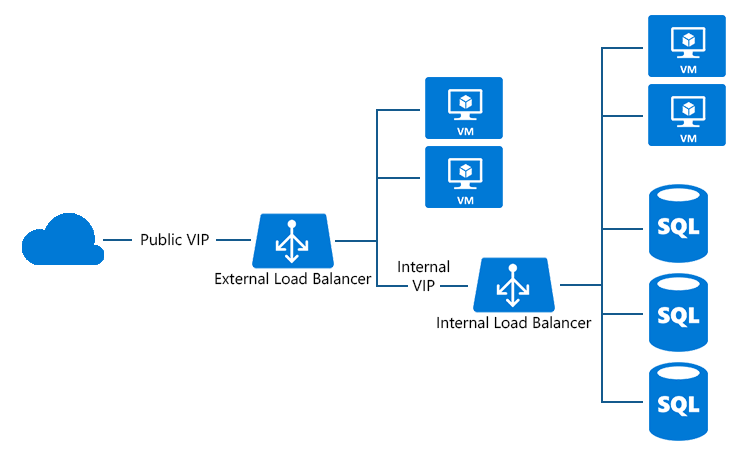

<properties
   pageTitle="Configurer l’équilibrage de charge pour SQL toujours sur | Microsoft Azure"
   description="Configurer équilibrage de charge pour l’utiliser avec SQL toujours sur et comment tirer parti de powershell pour créer l’équilibrage de charge pour l’implémentation SQL"
   services="load-balancer"
   documentationCenter="na"
   authors="sdwheeler"
   manager="carmonm"
   editor="tysonn" />
<tags
   ms.service="load-balancer"
   ms.devlang="na"
   ms.topic="article"
   ms.tgt_pltfrm="na"
   ms.workload="infrastructure-services"
   ms.date="10/24/2016"
   ms.author="sewhee" />

# Configurer l’équilibrage de charge pour SQL toujours sur

Groupes de disponibilité AlwaysOn de SQL Server peuvent désormais être exécutées avec ILB. Groupe de disponibilité est solution phare de SQL Server haute disponibilité et récupération d’urgence. Le récepteur de groupe disponibilité permet aux applications clientes en toute transparence se connecter à réplica principal, quel que soit le nombre réplica de la configuration.

Le nom du récepteur (DNS) est mappé à une adresse IP équilibrage de charge et équilibrage de charge de Azure achemine le trafic entrant pour seulement le serveur principal dans le jeu de réplica.

Vous pouvez utiliser la prise en charge ILB pour les points de terminaison de SQL Server AlwaysOn (récepteur). Vous pouvez contrôler l’accessibilité de que l’auditeur et pouvez choisir l’adresse IP équilibrage à partir d’un sous-réseau spécifique dans votre réseau virtuel (VNet).

À l’aide de ILB sur le récepteur, le point de terminaison SQL server (par exemple, Server = tcp:ListenerName, 1433 ; base de données = DatabaseName) est accessible uniquement par :

- Services et machines virtuelles dans le même réseau virtuelle
- Services et machines virtuelles à partir du réseau connecté en local
- Services et machines virtuelles à partir de VNets interconnecté

Figure 1 : AlwaysOn SQL configuré avec équilibrage de charge via Internet

## Ajout d’équilibrage de charge interne au service

1. Dans l’exemple suivant, nous allons configurer un réseau virtuel qui contient un sous réseau appelé « Sous-réseau-1 » :

        Add-AzureInternalLoadBalancer -InternalLoadBalancerName ILB_SQL_AO -SubnetName Subnet-1 -ServiceName SqlSvc

2. Ajouter des points de terminaison équilibrée de charge pour ILB sur chaque ordinateur virtuel

        Get-AzureVM -ServiceName SqlSvc -Name sqlsvc1 | Add-AzureEndpoint -Name "LisEUep" -LBSetName "ILBSet1" -Protocol tcp -LocalPort 1433 -PublicPort 1433 -ProbePort 59999 -ProbeProtocol tcp -ProbeIntervalInSeconds 10 –
        DirectServerReturn $true -InternalLoadBalancerName ILB_SQL_AO | Update-AzureVM

        Get-AzureVM -ServiceName SqlSvc -Name sqlsvc2 | Add-AzureEndpoint -Name "LisEUep" -LBSetName "ILBSet1" -Protocol tcp -LocalPort 1433 -PublicPort 1433 -ProbePort 59999 -ProbeProtocol tcp -ProbeIntervalInSeconds 10 –DirectServerReturn $true -InternalLoadBalancerName ILB_SQL_AO | Update-AzureVM

    Dans l’exemple ci-dessus, vous avez 2 machines virtuelles appelée « sqlsvc1 » et « sqlsvc2 » en cours d’exécution dans le cloud service « Sqlsvc ». Après avoir créé le ILB avec commutateur « DirectServerReturn », vous ajoutez des points de terminaison équilibrée de charge à la ILB pour permettre à SQL configurer l’écoute pour les groupes de disponibilité.

Pour plus d’informations sur AlwaysOn SQL, consultez [configurer un équilibrage de charge interne pour un groupe de disponibilité AlwaysOn dans Azure](../virtual-machines/virtual-machines-windows-portal-sql-alwayson-int-listener.md).

## Voir aussi

[Démarrer la configuration Internet facing équilibrage de charge](load-balancer-get-started-internet-arm-ps.md)

[Démarrer la configuration d’un programme d’équilibrage de charge interne](load-balancer-get-started-ilb-arm-ps.md)

[Configurer un mode de distribution d’équilibrage de charge](load-balancer-distribution-mode.md)

[Configurer les paramètres de délai d’expiration TCP inactives pour votre équilibrage de charge](load-balancer-tcp-idle-timeout.md)
