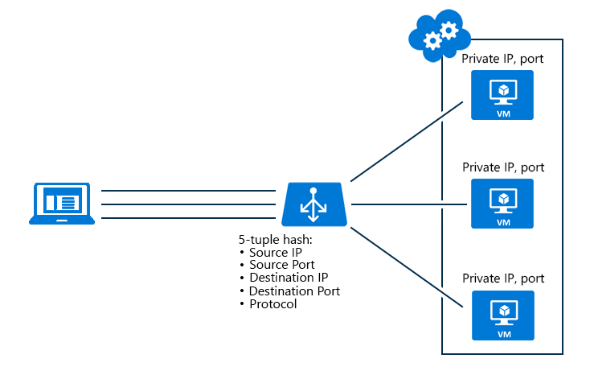

<properties
   pageTitle="Configurer le mode de distribution équilibrage de charge | Microsoft Azure"
   description="Comment faire pour configurer le mode de distribution équilibrage de charge Azure pour prendre en charge l’affinité IP source"
   services="load-balancer"
   documentationCenter="na"
   authors="sdwheeler"
   manager="carmonm"
   editor="tysonn" />
<tags
   ms.service="load-balancer"
   ms.devlang="na"
   ms.topic="article"
   ms.tgt_pltfrm="na"
   ms.workload="infrastructure-services"
   ms.date="10/24/2016"
   ms.author="sewhee" />

# Configurer le mode de distribution d’équilibrage de charge

## Mode de distribution basé sur hachage

L’algorithme de distribution par défaut est un 5-tuple (adresse IP, port source, source adresse IP de destination, port de destination, type de protocole) hachage pour mapper le trafic vers les serveurs disponibles. Il propose caractère collant uniquement au sein d’une session de transport. Paquets dans la même session seront dirigés vers la même instance de centre de données IP (fondu) derrière le point de terminaison équilibrée de charge. Lorsque le client démarre une nouvelle session à partir de la même adresse IP source, le port source change et provoque le trafic accéder à un point de terminaison fondu différent.

Figure 1-5-uplet distribution

## Mode d’affinité IP source

Nous avons un autre mode de distribution affinité Source IP (également appelé affinité session ou affinité du client IP). Équilibrage de charge Azure peut être configuré pour utiliser un 2-tuple (adresse IP Source, adresse IP de Destination) ou 3-uplet (adresse IP Source, adresse IP de Destination, Protocol) pour mapper le trafic vers les serveurs disponibles. À l’aide d’affinité adresse IP Source, connexions établies à partir de l’ordinateur client même accède au même point de terminaison fondu.

Le diagramme suivant illustre une configuration 2-tuple. Notez l’exécution de l’objet 2 tuples via l’équilibrage de charge à machine virtuelle 1 (VM1) qui est sauvegardé puis par ordinateur virtuel 2 et VM3.

Figure 2 : 2 tuples distribution

Affinité d’IP source résout une incompatibilité entre l’équilibrage de charge Azure et de la passerelle Bureau à distance (RD). Vous pouvez désormais créer une batterie de serveurs de passerelle Bureau à distance dans un service cloud unique.

Un autre scénario d’utilisation est téléchargement media où le transfert de données s’effectue par le biais UDP mais le plan de contrôle par le biais TCP :

- Un client débute une session TCP vers l’adresse équilibrage de charge tout d’abord, obtient dirigé vers un fondu spécifique, ce canal est laissé actif pour surveiller l’état de connexion
- Une nouvelle session UDP à partir du même ordinateur client commence sur le point de terminaison public équilibrage de charge même, l’attente ici est que cette connexion est également dirigée au même point de terminaison fondu comme la connexion TCP précédente afin que multimédias téléchargement pouvant être exécutée en haut débit tout en conservant un canal de contrôle via TCP.

>[AZURE.NOTE] Lorsqu’un jeu d’équilibrage de charge est modifié (supprimant ou ajoutant une machine virtuelle), la répartition des demandes des clients est recalculée. Vous ne peut pas dépendre nouvelles connexions à partir de clients existants se retrouver sur le serveur. En outre, à l’aide des adresse IP source mode de distribution affinité peut entraîner une répartition inégale du trafic. Les clients qui exécutent derrière les serveurs proxy peuvent être considérés comme une application cliente unique.

## Configuration des paramètres affinité adresse IP Source pour l’équilibrage de charge

Pour les machines virtuelles, vous pouvez utiliser PowerShell pour modifier les paramètres de délai d’expiration :

Ajouter un point de terminaison Azure à une Machine virtuelle et définir le mode de distribution équilibrage de charge

    Get-AzureVM -ServiceName mySvc -Name MyVM1 | Add-AzureEndpoint -Name HttpIn -Protocol TCP -PublicPort 80 -LocalPort 8080 –LoadBalancerDistribution sourceIP | Update-AzureVM

LoadBalancerDistribution peut être définie à sourceIP pour 2-uplet (adresse IP Source, adresse IP de Destination) d’équilibrage de charge, sourceIPProtocol pour l’équilibrage de charge 3-uplet (protocole IP Source, adresse IP de Destination,) ou aucun si vous souhaitez que le comportement par défaut d’équilibrage de charge 5-uplet.

Utilisez ce qui suit pour récupérer une configuration en mode point de terminaison charge équilibrage de la distribution :

    PS C:\> Get-AzureVM –ServiceName MyService –Name MyVM | Get-AzureEndpoint

    VERBOSE: 6:43:50 PM - Completed Operation: Get Deployment
    LBSetName : MyLoadBalancedSet
    LocalPort : 80
    Name : HTTP
    Port : 80
    Protocol : tcp
    Vip : 65.52.xxx.xxx
    ProbePath :
    ProbePort : 80
    ProbeProtocol : tcp
    ProbeIntervalInSeconds : 15
    ProbeTimeoutInSeconds : 31
    EnableDirectServerReturn : False
    Acl : {}
    InternalLoadBalancerName :
    IdleTimeoutInMinutes : 15
    LoadBalancerDistribution : sourceIP

Si l’élément LoadBalancerDistribution ne trouve pas l’équilibrage de charge Azure utilise l’algorithme de 5-uplet par défaut.

### Définir le mode de Distribution sur un ensemble de point de terminaison d’équilibrage de charge

Si les points de terminaison font partie d’un ensemble de point de terminaison d’équilibrage de charge, le mode de distribution doit être défini sur le jeu de point de terminaison d’équilibrage de charge :

    Set-AzureLoadBalancedEndpoint -ServiceName MyService -LBSetName LBSet1 -Protocol TCP -LocalPort 80 -ProbeProtocolTCP -ProbePort 8080 –LoadBalancerDistribution sourceIP

### Configuration du Service cloud pour modifier le mode de distribution

Vous pouvez utiliser le Kit de développement Azure pour .NET 2,5 (doit être publié en novembre) pour mettre à jour votre Service Cloud. Paramètres de point de terminaison pour les Services en nuage sont effectués dans la .csdef. Pour mettre à jour le mode de distribution équilibrage de la charge d’un déploiement de Services en nuage, une mise à niveau de déploiement est requis.
Voici un exemple de modifications .csdef pour les paramètres de point de terminaison :

    <WorkerRole name="worker-role-name" vmsize="worker-role-size" enableNativeCodeExecution="[true|false]">
      <Endpoints>
        <InputEndpoint name="input-endpoint-name" protocol="[http|https|tcp|udp]" localPort="local-port-number" port="port-number" certificate="certificate-name" loadBalancerProbe="load-balancer-probe-name" loadBalancerDistribution="sourceIP" />
      </Endpoints>
    </WorkerRole>
    <NetworkConfiguration>
      <VirtualNetworkSite name="VNet"/>
      <AddressAssignments>
    <InstanceAddress roleName="VMRolePersisted">
      <PublicIPs>
        <PublicIP name="public-ip-name" idleTimeoutInMinutes="timeout-in-minutes"/>
      </PublicIPs>
    </InstanceAddress>
      </AddressAssignments>
    </NetworkConfiguration>

## Exemple de l’API

Vous pouvez configurer la distribution d’équilibrage de charge à l’aide de l’API de gestion de service. Veillez à ajouter la `x-ms-version` en-tête est défini sur version `2014-09-01` ou une version ultérieure.

### Mettre à jour la configuration de l’ensemble d’équilibrage de charge spécifié dans un déploiement

#### Exemple de requête

    POST https://management.core.windows.net/<subscription-id>/services/hostedservices/<cloudservice-name>/deployments/<deployment-name>?comp=UpdateLbSet    x-ms-version: 2014-09-01
    Content-Type: application/xml

    <LoadBalancedEndpointList xmlns="http://schemas.microsoft.com/windowsazure" xmlns:i="http://www.w3.org/2001/XMLSchema-instance">
      <InputEndpoint>
        <LoadBalancedEndpointSetName> endpoint-set-name </LoadBalancedEndpointSetName>
        <LocalPort> local-port-number </LocalPort>
        <Port> external-port-number </Port>
        <LoadBalancerProbe>
          <Port> port-assigned-to-probe </Port>
          <Protocol> probe-protocol </Protocol>
          <IntervalInSeconds> interval-of-probe </IntervalInSeconds>
          <TimeoutInSeconds> timeout-for-probe </TimeoutInSeconds>
        </LoadBalancerProbe>
        <Protocol> endpoint-protocol </Protocol>
        <EnableDirectServerReturn> enable-direct-server-return </EnableDirectServerReturn>
        <IdleTimeoutInMinutes>idle-time-out</IdleTimeoutInMinutes>
        <LoadBalancerDistribution>sourceIP</LoadBalancerDistribution>
      </InputEndpoint>
    </LoadBalancedEndpointList>

La valeur de LoadBalancerDistribution peut être sourceIP pour 2 tuples affinité, sourceIPProtocol pour 3 tuples affinité ou aucun (pour aucune affinité. par exemple, 5-uplet)

#### Réponse

    HTTP/1.1 202 Accepted
    Cache-Control: no-cache
    Content-Length: 0
    Server: 1.0.6198.146 (rd_rdfe_stable.141015-1306) Microsoft-HTTPAPI/2.0
    x-ms-servedbyregion: ussouth2
    x-ms-request-id: 9c7bda3e67c621a6b57096323069f7af
    Date: Thu, 16 Oct 2014 22:49:21 GMT

## Étapes suivantes

[Vue d’ensemble des équilibrage de charge interne](load-balancer-internal-overview.md)

[Démarrer la configuration Internet facing équilibrage de charge](load-balancer-get-started-internet-arm-ps.md)

[Configurer les paramètres de délai d’expiration TCP inactives pour votre équilibrage de charge](load-balancer-tcp-idle-timeout.md)
