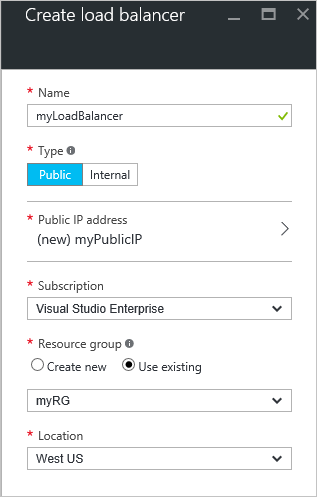

<properties
   pageTitle="Créer un équilibrage de charge via Internet dans le Gestionnaire de ressources à l’aide du portail Azure | Microsoft Azure"
   description="Apprenez à créer un équilibrage de charge via Internet dans le Gestionnaire de ressources à l’aide du portail Azure"
   services="load-balancer"
   documentationCenter="na"
   authors="anavinahar"
   manager="narayan"
   editor=""
   tags="azure-resource-manager"
/>
<tags
   ms.service="load-balancer"
   ms.devlang="na"
   ms.topic="hero-article"
   ms.tgt_pltfrm="na"
   ms.workload="infrastructure-services"
   ms.date="09/14/2016"
   ms.author="annahar" />

# Création d’un équilibrage de charge via Internet à l’aide du portail Azure

[AZURE.INCLUDE [load-balancer-get-started-internet-arm-selectors-include.md](../../includes/load-balancer-get-started-internet-arm-selectors-include.md)]

[AZURE.INCLUDE [load-balancer-get-started-internet-intro-include.md](../../includes/load-balancer-get-started-internet-intro-include.md)]

[AZURE.INCLUDE [azure-arm-classic-important-include](../../includes/azure-arm-classic-important-include.md)]Cet article décrit le modèle de déploiement du Gestionnaire de ressources. Vous pouvez également [découvrir comment créer un équilibrage de charge via Internet à l’aide de déploiement classique](load-balancer-get-started-internet-classic-portal.md)

[AZURE.INCLUDE [load-balancer-get-started-internet-scenario-include.md](../../includes/load-balancer-get-started-internet-scenario-include.md)]

Il s’agit de la séquence des tâches individuelles, qu'elle doit être effectuée pour créer un programme d’équilibrage de charge et expliquent en détail ce qui est effectué pour atteindre l’objectif.

## Ce qui est requis pour créer un équilibrage de charge via Internet ?

Vous devez créer et configurer les objets suivants pour déployer un équilibrage de charge.

- Configuration IP frontale - contient les adresses IP publiques pour le trafic réseau entrant.

- Adresse principale pool - contient interfaces réseau (cartes réseau) pour les ordinateurs virtuels recevoir le trafic réseau l’équilibrage de charge.

- L’équilibrage de charge des règles - contient des règles de mappage d’un port public sur l’équilibrage de charge sur le port du pool d’adresses principale.

- NAT règles de trafic entrant - contient les règles de mappage d’un port public sur l’équilibrage de charge vers un port pour une machine virtuelle spécifique du pool d’adresses principale.

- Teste - contient sondes santé utilisées pour vérifier la disponibilité d’instances de machines virtuelles du pool d’adresses principale.

Vous pouvez obtenir plus d’informations sur la charge composants équilibrage avec le Gestionnaire de ressources Azure au [Gestionnaire de ressources Azure prend en charge pour l’équilibrage de charge](load-balancer-arm.md).

## Configurer un équilibrage de charge portail Azure

> [AZURE.IMPORTANT] Cela suppose que vous disposez d’un réseau virtuel appelé **myVNet**. Voir la rubrique [créer réseau virtuel](../virtual-network/virtual-networks-create-vnet-arm-pportal.md) pour effectuer cette action. Il suppose également qu’il existe un sous-réseau au sein d' **myVNet** appelé **Kg sous-réseau être** et deux machines virtuelles intitulé **web1** et **web2** respectivement dans le même jeu de disponibilité appelé **myAvailSet** dans **myVNet**. Cliquez sur [ce lien](../virtual-machines/virtual-machines-windows-hero-tutorial.md) pour créer des machines virtuelles.

1. À partir d’un navigateur, accédez au portail Azure : [http://portal.azure.com](http://portal.azure.com) et connectez-vous avec votre compte Azure.

2. Sur le côté supérieur gauche de l’écran, sélectionnez **Nouveau** > **réseau** > **équilibrage de charge.**

3. Dans la carte **créer l’équilibrage de charge** , tapez un nom pour votre équilibrage de charge. Ici, il est appelé **myLoadBalancer**.

4. Sous **Type**, sélectionnez **Public**.

5. Sous **adresse IP publique**, créez une nouvelle adresse IP publique appelée **myPublicIP**.

6. Sous groupe de ressources, sélectionnez **myRG**. Puis sélectionnez un **emplacement**approprié, puis cliquez sur **OK**. L’équilibrage de charge puis commence à déployer et prendra quelques minutes pour réussir le déploiement.

## Créer un groupe d’adresses principale

1. Une fois que votre équilibrage de charge a déployée avec succès, sélectionnez-le depuis vos ressources. Sous paramètres, sélectionnez Pools principal. Tapez un nom pour votre pool principal. Cliquez ensuite sur le bouton **Ajouter** dans la partie supérieure de la cuillère qui s’affiche.

2. Cliquez sur **Ajouter une machine virtuelle** dans la carte du **pool principal d’ajouter** .  Sélectionnez **Choisir un jeu de disponibilité** sous **le jeu de disponibilité** , puis **myAvailSet**. Ensuite, sélectionnez **Choisir les machines virtuelles** sous la section Machines virtuelles dans la carte, cliquez sur **web1** et **web2**, les deux ordinateurs virtuels créées pour l’équilibrage de charge. Vérifier que les deux ont coches bleues vers la gauche comme le montre l’image ci-dessous. Ensuite, cliquez sur **Sélectionner** dans cette carte suivie OK dans la carte de **machines virtuelles choisir** , puis sur **OK** dans la carte **Ajouter un pool principal** .

    

3. Vérifiez que les notifications de zone de liste déroulante comporte une mise à jour en ce qui concerne l’enregistrement du pool charge équilibrage principal en plus de mise à jour de l’interface réseau pour les ordinateurs virtuels **web1** et **web2**.

## Créer une sonde kg règle et règles NAT

1. Créer une sonde d’intégrité.

    Sous paramètres de votre charge équilibrage, sélectionnez teste. Puis cliquez sur **Ajouter** situé en haut de la carte.

    Il existe deux façons de configurer une sonde : HTTP ou TCP. Cet exemple montre HTTP, mais TCP peut être configuré de manière similaire.
    Mettre à jour les informations nécessaires. Comme indiqué, **myLoadBalancer** charge équilibrer le trafic sur le Port 80. Le chemin d’accès sélectionné est HealthProbe.aspx, est 15 secondes et seuil mauvais état est 2. Une fois que vous avez terminé, cliquez sur **OK** pour créer la sonde.

    Placez le pointeur sur le « i » icône pour en savoir plus sur ces configurations individuelles et comment ils peuvent être modifiés pour répondre à vos besoins.

    

2. Créer une règle d’équilibrage de charge.

    Cliquez sur règles dans la section Paramètres de votre programme d’équilibrage de charge d’équilibrage de charge. Dans la nouvelle carte, cliquez sur **Ajouter**. Nommez votre règle. Dans ce cas, il est HTTP. Choisissez le port frontend et le port principal. Ici, 80 est choisie pour les deux. Choisissez **kg principal** comme votre pool principal et le précédemment créé **HealthProbe** en tant que la sonde. Autres configurations peuvent être définies en fonction de vos besoins. Cliquez ensuite sur OK pour enregistrer la règle d’équilibrage de charge.

    

3. Créer des règles NAT entrants

    Cliquez sur règles de trafic entrant NAT sous la section Paramètres de votre programme d’équilibrage de charge. Dans la nouvelle carte, cliquez sur **Ajouter**. Nommez votre règle NAT entrante. Ici, il est appelé **inboundNATrule1**. La destination doit être l’adresse IP publique créé précédemment. Sélectionnez personnalisé sous Service et sélectionnez le protocole que vous voulez utiliser. Ici TCP est sélectionnée. Entrez le port, 3441 et le port cible, dans ce cas, 3389. Cliquez ensuite sur OK pour enregistrer cette règle.

    Une fois que la première règle est créée, répétez cette étape pour la deuxième règle NAT entrante appelée inboundNATrule2 du port 3442 au port cible 3389.

    

## Supprimer un programme d’équilibrage de charge

Pour supprimer un programme d’équilibrage de charge, sélectionnez l’équilibrage de charge que vous voulez supprimer. Dans la carte *Équilibrage de charge* , cliquez sur **Supprimer** située en haut de la cuillère. Puis cliquez sur **Oui** lorsque vous y êtes invité.

## Étapes suivantes

[Démarrer la configuration d’un programme d’équilibrage de charge interne](load-balancer-get-started-ilb-arm-cli.md)

[Configurer un mode de distribution d’équilibrage de charge](load-balancer-distribution-mode.md)

[Configurer les paramètres de délai d’expiration TCP inactives pour votre équilibrage de charge](load-balancer-tcp-idle-timeout.md)
