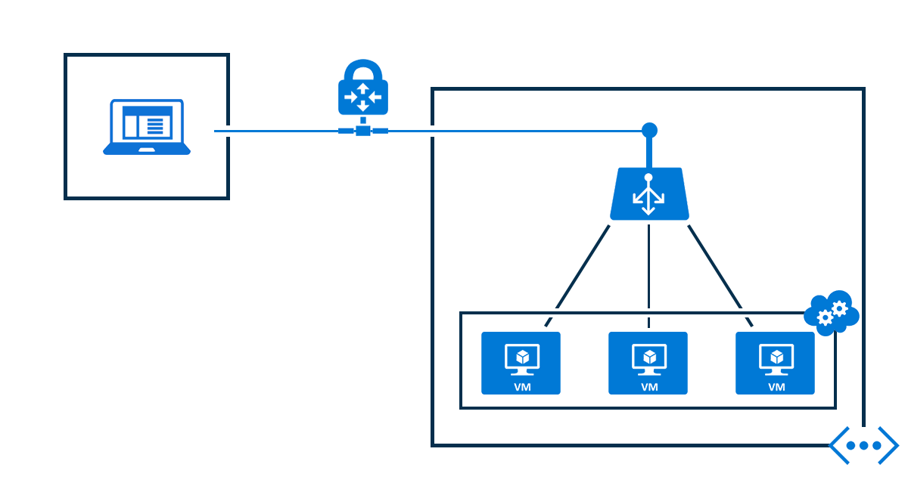

<properties
   pageTitle="Équilibrage de charge interne présentation | Microsoft Azure"
   description="Vue d’ensemble d’équilibrage de charge interne et ses fonctionnalités. Fonctionne d’un équilibrage de charge pour les scénarios possibles et Azure configurer les points de terminaison internes"
   services="load-balancer"
   documentationCenter="na"
   authors="sdwheeler"
   manager="carmonm"
   editor="tysonn" />
<tags
   ms.service="load-balancer"
   ms.devlang="na"
   ms.topic="article"
   ms.tgt_pltfrm="na"
   ms.workload="infrastructure-services"
   ms.date="10/24/2016"
   ms.author="sewhee" />

# Vue d’ensemble des équilibrage de charge interne

Contrairement aux puis Internet qui fait face à équilibrage de charge, l’équilibrage de charge interne (ILB) achemine le trafic uniquement aux ressources à l’intérieur du service cloud ou à l’aide de VPN pour accéder à l’infrastructure Azure. L’infrastructure limite l’accès à l’équilibrage de charge adresses IP virtuelles (VIP) d’un Service Cloud ou un réseau virtuel afin qu’ils seront jamais directement exposées à un point de terminaison Internet. Cela permet de ligne interne des applications métier d’exécution dans Azure et est accessible à partir au sein du cloud ou ressources locales.

## Pourquoi vous devrez peut-être un programme d’équilibrage de charge interne

Azure interne charger équilibrage de charge (ILB) fournit équilibrage de charge entre machines virtuelles qui résident à l’intérieur d’un service cloud ou un réseau virtuel avec une portée régionaux. Pour plus d’informations sur l’utilisation et la configuration des réseaux virtuels avec une portée régionale, consultez [Régionaux réseaux virtuels](https://azure.microsoft.com/blog/2014/05/14/regional-virtual-networks/) dans le blog Azure. Réseaux virtuels existants qui ont été configurés pour un groupe affinité Impossible d’utiliser ILB.

ILB Active les types d’équilibrage de charge suivants :

- Au sein d’un service cloud, des machines virtuelles à un ensemble de machines virtuelles qui résident dans le même service cloud (voir Figure 1).
- Au sein d’un réseau virtuel, des machines virtuelles dans le réseau virtuel à un ensemble de machines virtuelles qui résident dans le service cloud même du répertoire réseau (voir Figure 2).
- Pour un réseau virtuel entre local, à partir d’ordinateurs locaux à un ensemble de machines virtuelles qui résident dans le service cloud même du répertoire réseau (voir Figure 3).
- Applications via Internet, à plusieurs niveaux dans lequel les couches principale ne sont pas orientés Internet mais nécessitent l’équilibrage de charge pour le trafic de la couche via Internet.
- Équilibrage de charge pour les applications métiers hébergées dans Azure sans matériel d’équilibrage de charge supplémentaire ou logiciel. Y compris les serveurs en local dans l’ensemble des ordinateurs dont le trafic est charge équilibrée.

## Internet susceptibles d’affecter les applications à plusieurs niveaux

La couche web possède des points de terminaison qui fait face vers Internet pour les clients Internet et fait partie d’un ensemble d’équilibrage de charge. L’équilibrage de charge répartit le trafic entrant à partir de clients web pour le port TCP 443 (HTTPS) vers les serveurs web.

Les serveurs de base de données sont trouvent derrière un point de terminaison ILB qui utilisent les serveurs web pour le stockage. Cette charge de service de base de données équilibrée point de terminaison, le trafic qui équilibrée de charge est sur les serveurs de base de données dans le jeu de ILB.

Voici une illustration Internet en application à plusieurs niveaux au sein du même service cloud.

Figure 1 : Internet en application à plusieurs niveaux

Une autre utilisation possible pour une application à plusieurs niveaux est lorsque la ILB déployée vers un service cloud autre que celui par le service pour la ILB d’autres programmes.

Services de cloud à l’aide de la même réseau virtuel a accès au point de terminaison ILB.

Figure 2 montre web frontaux serveurs se trouvent dans un service de nuage différent à partir de la base de données principale et en utilisant le point de terminaison ILB au sein du même réseau virtuel.

Figure 2 : serveurs frontaux dans un service de nuage différent

## Ligne intranet des applications métier

Le trafic des clients sur le réseau local véhiculer équilibrage l’ensemble des serveurs métiers à l’aide de la connexion VPN au réseau Azure.

L’ordinateur client a accès à une adresse IP service VPN Azure à l’aide de point à site VPN. Elle permet d’utiliser l’application métier hébergée derrière le point de terminaison ILB.

Figure 3 : applications métiers hébergées derrière le point de terminaison kg

Un autre scénario pour le système métier est d’avoir un réseau privé virtuel de site au réseau virtuel où le point de terminaison ILB est configuré. Ainsi, le trafic réseau local être routés vers le point de terminaison ILB.

Figure 4 : le trafic du réseau local routé vers le point de terminaison ILB

## Étapes suivantes

[Azure prise en charge du Gestionnaire de ressources pour équilibrage de charge Azure](load-balancer-arm.md)

[Démarrer la configuration Internet facing équilibrage de charge](load-balancer-get-started-internet-arm-ps.md)

[Démarrer la configuration d’un programme d’équilibrage de charge interne](load-balancer-get-started-ilb-arm-ps.md)

[Configurer un mode de distribution d’équilibrage de charge](load-balancer-distribution-mode.md)

[Configurer les paramètres de délai d’expiration TCP inactives pour votre équilibrage de charge](load-balancer-tcp-idle-timeout.md)

