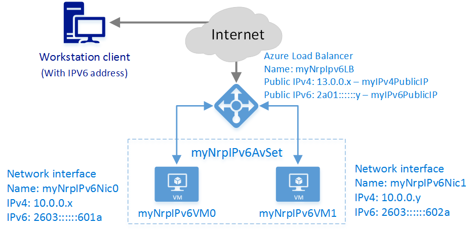

<properties
    pageTitle="Créer un Internet facing équilibrage de charge avec IPv6 à l’aide de PowerShell pour le Gestionnaire de ressources | Microsoft Azure"
    description="Apprenez à créer un Internet facing équilibrage de charge avec IPv6 à l’aide de PowerShell pour le Gestionnaire de ressources"
    services="load-balancer"
    documentationCenter="na"
    authors="sdwheeler"
    manager="carmonm"
    editor=""
    tags="azure-resource-manager"
    keywords="le protocole IPv6, équilibrage de charge azure, double pile, adresse ip publique, ipv6 natif, mobile, iot"
/>
<tags
    ms.service="load-balancer"
    ms.devlang="na"
    ms.topic="article"
    ms.tgt_pltfrm="na"
    ms.workload="infrastructure-services"
    ms.date="09/14/2016"
    ms.author="sewhee"
/>

# Créer un Internet facing équilibrage de charge avec IPv6 à l’aide de PowerShell pour le Gestionnaire de ressources

> [AZURE.SELECTOR]
- [PowerShell](./load-balancer-ipv6-internet-ps.md)
- [Azure infrastructure du langage commun](./load-balancer-ipv6-internet-cli.md)
- [Modèle](./load-balancer-ipv6-internet-template.md)

Un équilibrage de charge Azure est un équilibrage de charge calque-4 (TCP et UDP). L’équilibrage de charge offre une grande disponibilité en distribuer le trafic entrant entre les instances de service exact dans les services en nuage ou machines virtuelles dans un jeu d’équilibrage de charge. Équilibrage de charge Azure peut également présenter ces services sur plusieurs ports, plusieurs adresses IP ou les deux.

## Exemple de scénario de déploiement

Le diagramme suivant illustre la solution déployée dans cet article d’équilibrage de charge.

Dans ce scénario, vous allez créer les ressources Azure suivantes :

- un équilibrage de charge via Internet IPv4 et une adresse IP publique du protocole IPv6
- deux charger équilibrage de charge des règles pour mapper la VIP publique aux points de terminaison privés
- un ensemble de disponibilité à qui contient les deux ordinateurs virtuels
- deux machines virtuelles (machines virtuelles)
- une interface de réseau virtuel pour chaque machine virtuelle avec des adresses IPv4 et IPv6 affectées

## Déploiement de la solution à l’aide de la session PowerShell Azure

Les étapes suivantes montrent comment créer un Internet facing équilibrage de charge à l’aide du Gestionnaire de ressources Azure avec PowerShell. Avec le Gestionnaire de ressources Azure, chaque ressource est créé et configuré individuellement, puis place ensemble pour créer une ressource.

Pour déployer un équilibrage de charge, vous créez et configurez les objets suivants :

- Configuration IP frontale - contient les adresses IP publiques pour le trafic réseau entrant.
- Adresse principale pool - contient interfaces réseau (cartes réseau) pour les ordinateurs virtuels recevoir le trafic réseau l’équilibrage de charge.
- L’équilibrage de charge des règles - contient des règles de mappage d’un port public sur l’équilibrage de charge sur le port du pool d’adresses principale.
- NAT règles de trafic entrant - contient les règles de mappage d’un port public sur l’équilibrage de charge vers un port pour une machine virtuelle spécifique du pool d’adresses principale.
- Teste - contient sondes santé utilisées pour vérifier la disponibilité d’instances de machines virtuelles du pool d’adresses principale.

Pour plus d’informations, voir [Gestionnaire de ressources Azure prend en charge pour l’équilibrage de charge](load-balancer-arm.md).

## Configurer PowerShell pour utiliser le Gestionnaire de ressources

Vérifiez que vous disposez de la dernière version de production du module Azure le Gestionnaire de ressources pour PowerShell.

1. Connectez-vous à Azure

        Login-AzureRmAccount

    Entrez vos informations d’identification lorsque vous y êtes invité.

2. Vérifier les abonnements du compte

        Get-AzureRmSubscription

3. Sélectionner les options de vos abonnements Azure à utiliser.

        Select-AzureRmSubscription -SubscriptionId 'GUID of subscription'

4. Créer un groupe de ressources (ignorer cette étape si vous utilisez un groupe de ressources existant)

        New-AzureRmResourceGroup -Name NRP-RG -location "West US"

## Créer un réseau virtuel et une adresse IP publique pour le pool frontal d’IP

1. Créer un réseau virtuel avec un sous-réseau.

        $backendSubnet = New-AzureRmVirtualNetworkSubnetConfig -Name LB-Subnet-BE -AddressPrefix 10.0.2.0/24
        $vnet = New-AzureRmvirtualNetwork -Name VNet -ResourceGroupName NRP-RG -Location 'West US' -AddressPrefix 10.0.0.0/16 -Subnet $backendSubnet

2. Créer des ressources (PIP) pour le pool frontal d’adresses IP adresse IP publique Azure.

        $publicIPv4 = New-AzureRmPublicIpAddress -Name 'pub-ipv4' -ResourceGroupName NRP-RG -Location 'West US' -AllocationMethod Static -IpAddressVersion IPv4 -DomainNameLabel lbnrpipv4
        $publicIPv6 = New-AzureRmPublicIpAddress -Name 'pub-ipv6' -ResourceGroupName NRP-RG -Location 'West US' -AllocationMethod Dynamic -IpAddressVersion IPv6 -DomainNameLabel lbnrpipv6

    >[AZURE.IMPORTANT] L’équilibrage de charge utilise le nom de domaine de l’adresse IP publique comme préfixe de son nom complet. Dans cet exemple, les noms de domaine complets sont *lbnrpipv4.westus.cloudapp.azure.com* et *lbnrpipv6.westus.cloudapp.azure.com*.

## Créer un configurations IP frontal et un Pool d’adresses principale

1. Créer une configuration adresse frontale qui utilise les adresses IP Public que vous avez créé.

        $FEIPConfigv4 = New-AzureRmLoadBalancerFrontendIpConfig -Name "LB-Frontendv4" -PublicIpAddress $publicIPv4
        $FEIPConfigv6 = New-AzureRmLoadBalancerFrontendIpConfig -Name "LB-Frontendv6" -PublicIpAddress $publicIPv6

2. Créer des pools d’adresses principale.

        $backendpoolipv4 = New-AzureRmLoadBalancerBackendAddressPoolConfig -Name "BackendPoolIPv4"
        $backendpoolipv6 = New-AzureRmLoadBalancerBackendAddressPoolConfig -Name "BackendPoolIPv6"

## Créer des livres règles NAT règles, une sonde et un équilibrage de charge

Cet exemple montre comment créer les éléments suivants :

- une règle NAT pour traduire tout le trafic entrant sur le port 443 au port 4443
- une règle d’équilibrage de charge équilibrer tout le trafic entrant sur le port 80 au port 80 sur les adresses dans la liste principale.
- une règle d’équilibrage de charge pour autoriser la connexion RDP sur les ordinateurs virtuels sur le port 3389.
- une règle sonde pour vérifier l’état d’intégrité sur une page intitulée *HealthProbe.aspx* ou un service sur le port 8080
- un équilibrage de charge qui utilise tous ces objets

1. Créez les règles NAT.

        $inboundNATRule1v4 = New-AzureRmLoadBalancerInboundNatRuleConfig -Name "NicNatRulev4" -FrontendIpConfiguration $FEIPConfigv4 -Protocol TCP -FrontendPort 443 -BackendPort 4443
        $inboundNATRule1v6 = New-AzureRmLoadBalancerInboundNatRuleConfig -Name "NicNatRulev6" -FrontendIpConfiguration $FEIPConfigv6 -Protocol TCP -FrontendPort 443 -BackendPort 4443

2. Créer une sonde d’intégrité. Il existe deux façons de configurer une sonde :

    Sonde HTTP

        $healthProbe = New-AzureRmLoadBalancerProbeConfig -Name 'HealthProbe-v4v6' -RequestPath 'HealthProbe.aspx' -Protocol http -Port 80 -IntervalInSeconds 15 -ProbeCount 2

    ou sonde TCP

        $healthProbe = New-AzureRmLoadBalancerProbeConfig -Name 'HealthProbe-v4v6' -Protocol Tcp -Port 8080 -IntervalInSeconds 15 -ProbeCount 2
        $RDPprobe = New-AzureRmLoadBalancerProbeConfig -Name 'RDPprobe' -Protocol Tcp -Port 3389 -IntervalInSeconds 15 -ProbeCount 2

    Dans cet exemple, nous allons utiliser les sondes TCP.

3. Créer une règle d’équilibrage de charge.

        $lbrule1v4 = New-AzureRmLoadBalancerRuleConfig -Name "HTTPv4" -FrontendIpConfiguration $FEIPConfigv4 -BackendAddressPool $backendpoolipv4 -Probe $healthProbe -Protocol Tcp -FrontendPort 80 -BackendPort 8080
        $lbrule1v6 = New-AzureRmLoadBalancerRuleConfig -Name "HTTPv6" -FrontendIpConfiguration $FEIPConfigv6 -BackendAddressPool $backendpoolipv6 -Probe $healthProbe -Protocol Tcp -FrontendPort 80 -BackendPort 8080
        $RDPrule = New-AzureRmLoadBalancerRuleConfig -Name "RDPrule" -FrontendIpConfiguration $FEIPConfigv4 -BackendAddressPool $backendpoolipv4 -Probe $RDPprobe -Protocol Tcp -FrontendPort 3389 -BackendPort 3389

4. Créer l’équilibrage de charge en utilisant les objets créés précédemment.

        $NRPLB = New-AzureRmLoadBalancer -ResourceGroupName NRP-RG -Name 'myNrpIPv6LB' -Location 'West US' -FrontendIpConfiguration $FEIPConfigv4,$FEIPConfigv6 -InboundNatRule $inboundNATRule1v6,$inboundNATRule1v4 -BackendAddressPool $backendpoolipv4,$backendpoolipv6 -Probe $healthProbe,$RDPprobe -LoadBalancingRule $lbrule1v4,$lbrule1v6,$RDPrule

## Créer des cartes réseau pour les ordinateurs virtuels principale

1. Obtenez les réseau virtuel sous-réseau réseau virtuel, où les cartes réseau doivent être créés.

        $vnet = Get-AzureRmVirtualNetwork -Name NRPVNet -ResourceGroupName NRP-RG
        $backendSubnet = Get-AzureRmVirtualNetworkSubnetConfig -Name LB-Subnet-BE -VirtualNetwork $vnet

2. Créer des configurations IP et cartes réseau pour les ordinateurs virtuels.

        $nic1IPv4 = New-AzureRmNetworkInterfaceIpConfig -Name "IPv4IPConfig" -PrivateIpAddressVersion "IPv4" -Subnet $backendSubnet -LoadBalancerBackendAddressPool $backendpoolipv4 -LoadBalancerInboundNatRule $inboundNATRule1v4
        $nic1IPv6 = New-AzureRmNetworkInterfaceIpConfig -Name "IPv6IPConfig" -PrivateIpAddressVersion "IPv6" -LoadBalancerBackendAddressPool $backendpoolipv6 -LoadBalancerInboundNatRule $inboundNATRule1v6
        $nic1 = New-AzureRmNetworkInterface -Name 'myNrpIPv6Nic0' -IpConfiguration $nic1IPv4,$nic1IPv6 -ResourceGroupName NRP-RG -Location 'West US'

        $nic2IPv4 = New-AzureRmNetworkInterfaceIpConfig -Name "IPv4IPConfig" -PrivateIpAddressVersion "IPv4" -Subnet $backendSubnet -LoadBalancerBackendAddressPool $backendpoolipv4
        $nic2IPv6 = New-AzureRmNetworkInterfaceIpConfig -Name "IPv6IPConfig" -PrivateIpAddressVersion "IPv6" -LoadBalancerBackendAddressPool $backendpoolipv6
        $nic2 = New-AzureRmNetworkInterface -Name 'myNrpIPv6Nic1' -IpConfiguration $nic2IPv4,$nic2IPv6 -ResourceGroupName NRP-RG -Location 'West US'

## Créer des machines virtuelles et affecter les cartes réseau nouvellement créés

Pour plus d’informations sur la création d’une machine virtuelle, voir [créer et préconfigurer une Machine virtuelle Windows avec le Gestionnaire de ressources et Azure PowerShell](..\virtual-machines\virtual-machines-windows-ps-create.md)

1. Créer un compte de stockage et de définir de disponibilité

        New-AzureRmAvailabilitySet -Name 'myNrpIPv6AvSet' -ResourceGroupName NRP-RG -location 'West US'
        $availabilitySet = Get-AzureRmAvailabilitySet -Name 'myNrpIPv6AvSet' -ResourceGroupName NRP-RG
        New-AzureRmStorageAccount -ResourceGroupName NRP-RG -Name 'mynrpipv6stacct' -Location 'West US' -SkuName $LRS
        $CreatedStorageAccount = Get-AzureRmStorageAccount -ResourceGroupName NRP-RG -Name 'mynrpipv6stacct'

2. Créez chaque machine virtuelle et attribuez précédent créé cartes réseau

        $mySecureCredentials= Get-Credential -Message “Type the username and password of the local administrator account.”

        $vm1 = New-AzureRmVMConfig -VMName 'myNrpIPv6VM0' -VMSize 'Standard_G1' -AvailabilitySetId $availabilitySet.Id
        $vm1 = Set-AzureRmVMOperatingSystem -VM $vm1 -Windows -ComputerName 'myNrpIPv6VM0' -Credential $mySecureCredentials -ProvisionVMAgent -EnableAutoUpdate
        $vm1 = Set-AzureRmVMSourceImage -VM $vm1 -PublisherName MicrosoftWindowsServer -Offer WindowsServer -Skus 2012-R2-Datacenter -Version "latest"
        $vm1 = Add-AzureRmVMNetworkInterface -VM $vm1 -Id $nic1.Id -Primary
        $osDisk1Uri = $CreatedStorageAccount.PrimaryEndpoints.Blob.ToString() + "vhds/myNrpIPv6VM0osdisk.vhd"
        $vm1 = Set-AzureRmVMOSDisk -VM $vm1 -Name 'myNrpIPv6VM0osdisk' -VhdUri $osDisk1Uri -CreateOption FromImage
        New-AzureRmVM -ResourceGroupName NRP-RG -Location 'West US' -VM $vm1

        $vm2 = New-AzureRmVMConfig -VMName 'myNrpIPv6VM1' -VMSize 'Standard_G1' -AvailabilitySetId $availabilitySet.Id
        $vm2 = Set-AzureRmVMOperatingSystem -VM $vm2 -Windows -ComputerName 'myNrpIPv6VM1' -Credential $mySecureCredentials -ProvisionVMAgent -EnableAutoUpdate
        $vm2 = Set-AzureRmVMSourceImage -VM $vm2 -PublisherName MicrosoftWindowsServer -Offer WindowsServer -Skus 2012-R2-Datacenter -Version "latest"
        $vm2 = Add-AzureRmVMNetworkInterface -VM $vm2 -Id $nic2.Id -Primary
        $osDisk2Uri = $CreatedStorageAccount.PrimaryEndpoints.Blob.ToString() + "vhds/myNrpIPv6VM1osdisk.vhd"
        $vm2 = Set-AzureRmVMOSDisk -VM $vm2 -Name 'myNrpIPv6VM1osdisk' -VhdUri $osDisk2Uri -CreateOption FromImage
        New-AzureRmVM -ResourceGroupName NRP-RG -Location 'West US' -VM $vm2

## Étapes suivantes

[Démarrer la configuration d’un programme d’équilibrage de charge interne](load-balancer-get-started-ilb-arm-ps.md)

[Configurer un mode de distribution d’équilibrage de charge](load-balancer-distribution-mode.md)

[Configurer les paramètres de délai d’expiration TCP inactives pour votre équilibrage de charge](load-balancer-tcp-idle-timeout.md)
