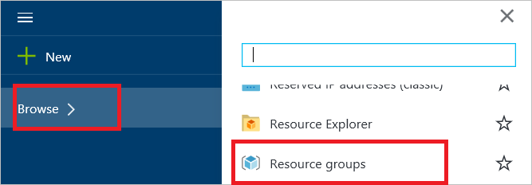

<properties
    pageTitle="Déploiement d’une via Internet équilibrage solution avec IPv6 à l’aide d’un modèle | Microsoft Azure"
    description="Comment déployer prise en charge du protocole IPv6 équilibrage de charge Azure et machines virtuelles équilibrage de charge."
    services="load-balancer"
    documentationCenter="na"
    authors="sdwheeler"
    manager="carmonm"
    editor=""
    tags="azure-resource-manager"
    keywords="le protocole IPv6, équilibrage de charge azure, double pile, adresse ip publique, ipv6 natif, mobile, iot"
/>
<tags
    ms.service="load-balancer"
    ms.devlang="na"
    ms.topic="article"
    ms.tgt_pltfrm="na"
    ms.workload="infrastructure-services"
    ms.date="09/14/2016"
    ms.author="sewhee"
/>

# Déploiement d’une solution d’équilibrage de charge via Internet avec IPv6 à l’aide d’un modèle

> [AZURE.SELECTOR]
- [PowerShell](./load-balancer-ipv6-internet-ps.md)
- [Azure infrastructure du langage commun](./load-balancer-ipv6-internet-cli.md)
- [Modèle](./load-balancer-ipv6-internet-template.md)

Un équilibrage de charge Azure est un équilibrage de charge calque-4 (TCP et UDP). L’équilibrage de charge offre une grande disponibilité en distribuer le trafic entrant entre les instances de service exact dans les services en nuage ou machines virtuelles dans un jeu d’équilibrage de charge. Équilibrage de charge Azure peut également présenter ces services sur plusieurs ports, plusieurs adresses IP ou les deux.

## Exemple de scénario de déploiement

Le diagramme suivant illustre la solution d’équilibrage de charge déployées à l’aide de l’exemple de modèle décrit dans cet article.

Dans ce scénario, vous allez créer les ressources Azure suivantes :

- une interface de réseau virtuel pour chaque machine virtuelle avec des adresses IPv4 et IPv6 affectées
- un équilibrage de charge via Internet IPv4 et une adresse IP publique du protocole IPv6
- deux charger équilibrage de charge des règles pour mapper la VIP publique aux points de terminaison privés
- un ensemble de disponibilité qui contient les deux ordinateurs virtuels
- deux machines virtuelles (machines virtuelles)

## Déploiement du modèle à l’aide du portail Azure

Cet article fait référence à un modèle qui est publié dans la galerie de [Modèles de démarrage rapide d’Azure](https://azure.microsoft.com/documentation/templates/201-load-balancer-ipv6-create/) . Vous pouvez télécharger le modèle à partir de la galerie ou lancer le déploiement dans Azure directement à partir de la galerie. Cet article suppose que vous avez téléchargé le modèle sur votre ordinateur local.

1. Ouvrez le portail Azure et connectez-vous à l’aide d’un compte disposant des autorisations nécessaires pour créer des machines virtuelles et des ressources réseau au sein d’un abonnement Azure. En outre, sauf si vous utilisez les ressources existantes, le compte doit autorisé à créer un groupe de ressources et un compte de stockage.

2. Cliquez sur « + Nouveau » dans le menu puis type « modèle » dans la zone de recherche. Sélectionnez « Déploiement de modèle » dans les résultats de recherche.

    

3. Dans la tout carte, cliquez sur « Déploiement de modèle ».

    

4. Cliquez sur « Créer ».

    

5. Cliquez sur « Modifier le modèle. » Supprimer le contenu existant et copier/coller dans tout le contenu du fichier de modèle (pour inclure le début et fin {}), puis cliquez sur « Enregistrer ».

    > [AZURE.NOTE] Si vous utilisez Microsoft Internet Explorer, lorsque vous collez vous recevez une boîte de dialogue vous invitant à autoriser l’accès dans le Presse-papiers Windows. Cliquez sur « Autoriser l’accès ».

    

6. Cliquez sur « Modifier les paramètres ». Dans la carte de paramètres, spécifiez les valeurs par les instructions dans la section Paramètres de modèle, puis cliquez sur « Enregistrer » pour fermer la carte de paramètres. Dans la carte de déploiement personnalisé, sélectionnez votre abonnement, un groupe de ressources existant ou créez-en un. Si vous créez un groupe de ressources, puis sélectionnez un emplacement pour le groupe de ressources. Ensuite, cliquez sur **conditions juridiques**, puis cliquez sur **acheter** pour les conditions juridiques. Azure commence à déployer les ressources. Il faut plusieurs minutes pour déployer toutes les ressources.

    

    Pour plus d’informations sur ces paramètres, consultez la section [variables et des paramètres de modèle](#template-parameters-and-variables) plus loin dans cet article.

7. Pour afficher les ressources créées par le modèle, cliquez sur Parcourir, faites défiler la liste vers le bas jusqu'à ce que vous consultez « Groupes de ressources », puis cliquez dessus.

    

8. Dans la carte de groupes de ressources, cliquez sur le nom du groupe de ressources que vous avez spécifié à l’étape 6. Vous consultez une liste de toutes les ressources qui ont été déployés. Si tout va bien, vous devriez voir « Réussite » sous « Dernier déploiement. » Dans le cas contraire, assurez-vous que le compte que vous utilisez dispose des autorisations nécessaires pour créer les ressources nécessaires.

    

    > [AZURE.NOTE] Si vous naviguez sur vos groupes de ressources immédiatement après l’exécution de l’étape 6, « Dernier déploiement » affiche l’état de « Déploiement » tandis que les ressources sont déployées.

9. Cliquez sur « myIPv6PublicIP » dans la liste des ressources. Vous voyez qu’il a une adresse IPv6 sous adresse IP et que son nom DNS est la valeur que vous avez spécifié pour le paramètre dnsNameforIPv6LbIP à l’étape 6. Cette ressource est le public IPv6 adresse et nom d’hôte qui n’est accessible aux clients Internet.

    

## Valider la connectivité

Lorsque le modèle est déployé avec succès, vous pouvez valider la connectivité en effectuant les opérations suivantes :

1. Connectez-vous au portail Azure et se connecter à chacun des ordinateurs virtuels créés par le déploiement du modèle. Si vous avez déployé un ordinateur Windows serveur virtuel, exécutez ipconfig/à partir d’une invite de commande. Vous voyez que les ordinateurs virtuels possèdent des adresses IPv4 et IPv6. Si vous avez déployé machines virtuelles Linux, vous devez configurer le système d’exploitation Linux pour recevoir les adresses IPv6 dynamiques en suivant les instructions de votre distribution Linux.
2. À partir d’un client connecté à Internet IPv6, établir une connexion vers l’adresse IPv6 de l’équilibrage de charge. Pour confirmer l’équilibrage de l’équilibrage de charge entre les deux ordinateurs virtuels, vous pouviez installer un serveur web tel que Microsoft Internet Information Services (IIS) sur chacun des ordinateurs virtuels. La page web par défaut sur chaque serveur peut contenir le texte « Server0 » ou « Serveur1 » à identifier de façon unique. Ensuite, ouvrez un navigateur Internet sur un client connecté à Internet IPv6 et naviguez vers le nom d’hôte vous avez spécifiée pour le paramètre dnsNameforIPv6LbIP de l’équilibrage de charge pour confirmer la connectivité IPv6 de bout en bout pour chaque machine virtuelle. Si vous ne voyez que la page web à partir d’un seul serveur, vous devrez peut-être vider le cache du navigateur. Ouvrez plusieurs sessions de navigation privées. Vous devriez voir une réponse chaque serveur.
3. À partir d’un client connecté à Internet IPv4, établir une connexion à l’adresse IPv4 publique de l’équilibrage de charge. Pour vérifier que l’équilibrage de charge est équilibrage de charge les deux ordinateurs virtuels, vous pouvez tester à l’aide de IIS, comme indiqué à l’étape 2.
4. À partir de chaque machine virtuelle, lancer une connexion sortante vers un périphérique IPv6 ou IPv4-connexion Internet. Dans les deux cas, l’adresse IP source vu par le périphérique de destination est l’adresse IPv4 ou IPv6 de l’équilibrage de charge.

>[AZURE.NOTE]
ICMP pour IPv4 et IPv6 est bloqué dans le réseau Azure. Par conséquent, les outils ICMP tels que ping toujours échouent. Pour tester la connectivité, utilisez une alternative TCP tels que TCPing ou l’applet de commande PowerShell Test-NetConnection. Notez que les adresses IP indiquées dans le diagramme sont des exemples de valeurs qui peut s’afficher. Dans la mesure où les adresses IPv6 sont affectées dynamiquement, les adresses que vous recevez seront différent et peuvent varier par région. En outre, il est courant pour l’adresse IPv6 sur l’équilibrage de charge commencer avec un préfixe autre que les adresses IPv6 privées dans la liste principale.

## Variables et des paramètres de modèle

Un modèle de gestionnaire de ressources Azure contient plusieurs variables et des paramètres que vous pouvez personnaliser selon vos besoins. Variables sont utilisées pour les valeurs fixes que vous ne souhaitez pas un utilisateur à modifier. Paramètres sont utilisés pour les valeurs que vous souhaitez qu’un utilisateur à fournir lorsque vous déployez le modèle. L’exemple de modèle est configuré pour le scénario décrit dans cet article. Vous pouvez personnaliser cette aux besoins de votre environnement.

L’exemple de modèle utilisée dans cet article inclut les variables et les paramètres suivants :

| Paramètre / Variable | Notes |
|-----------|-------|
| adminUsername | Spécifiez le nom du compte d’administrateur utilisé pour vous connecter aux machines virtuelles avec. |
| adminPassword | Spécifiez le mot de passe du compte d’administrateur utilisé pour se connecter aux machines virtuelles avec. |
| dnsNameforIPv4LbIP | Spécifiez le nom d’hôte DNS que vous souhaitez désigner comme le nom de l’équilibrage de charge public. Adresses IPv4 public de l’équilibrage de charge résolvent ce nom. Le nom doit être en minuscules et correspondre à l’expression régulière : ^ [a-z][a-z0-9-]{1,61}[a-z0-9]$. |
| dnsNameforIPv6LbIP | Spécifiez le nom d’hôte DNS que vous souhaitez désigner comme le nom de l’équilibrage de charge public. Ce nom est résolu en adresse IPv6 publique de l’équilibrage de charge. Le nom doit être en minuscules et correspondre à l’expression régulière : ^ [a-z][a-z0-9-]{1,61}[a-z0-9]$. Cela peut être le même nom que l’adresse IPv4. Lorsqu’un client envoie une requête DNS pour ce nom Azure renverra A et AAAA enregistrements lorsque le nom est partagé. |
| vmNamePrefix | Spécifiez le préfixe nom machine virtuelle. Le modèle ajoute un chiffre (0, 1, etc.) au nom lorsque les ordinateurs virtuels sont créés. |
| nicNamePrefix | Spécifiez le préfixe du nom interface réseau. Le modèle ajoute un chiffre (0, 1, etc.) au nom lorsque les interfaces réseau sont créés. |
| storageAccountName | Entrez le nom d’un compte de stockage existant ou indiquez le nom d’un nouveau doit être créé par le modèle. |
| availabilitySetName | Entrez puis nom de la disponibilité définie pour être utilisés avec les ordinateurs virtuels |
| addressPrefix | Le préfixe d’adresse permet de définir la plage d’adresses du réseau virtuel |
| subnetName | Le nom du sous-réseau dans créé pour la VNet |
| subnetPrefix | Le préfixe d’adresse permet de définir la plage d’adresses du sous-réseau |
| vnetName | Spécifiez le nom de la VNet utilisé par les ordinateurs virtuels. |
| ipv4PrivateIPAddressType | La méthode d’allocation utilisée pour l’adresse IP privée (statique ou dynamique) |
| ipv6PrivateIPAddressType | La méthode d’allocation utilisée pour l’adresse IP privée (dynamique). Le protocole IPv6 ne prend en charge allocation dynamique. |
| numberOfInstances | Le nombre d’instances d’équilibrage de charge déployées par le modèle |
| ipv4PublicIPAddressName | Spécifiez le nom DNS que vous voulez utiliser pour communiquer avec l’adresse IPv4 publique de l’équilibrage de charge. |
| ipv4PublicIPAddressType | La méthode d’allocation utilisée pour l’adresse IP publique (statique ou dynamique) |
| Ipv6PublicIPAddressName | Spécifiez le nom DNS que vous voulez utiliser pour communiquer avec l’adresse IPv6 de l’équilibrage de charge. |
| ipv6PublicIPAddressType | La méthode d’allocation utilisée pour l’adresse IP publique (dynamique). Le protocole IPv6 ne prend en charge allocation dynamique. |
| lbName | Indiquez le nom de l’équilibrage de charge. Ce nom est affiché dans le portail ou utilisé lorsque vous faites référence à celui-ci avec une commande infrastructure du langage commun ou PowerShell. |

Les autres variables dans le modèle contiennent des valeurs dérivées qui sont affectées lorsque Azure crée les ressources. Ne modifiez pas ces variables.
