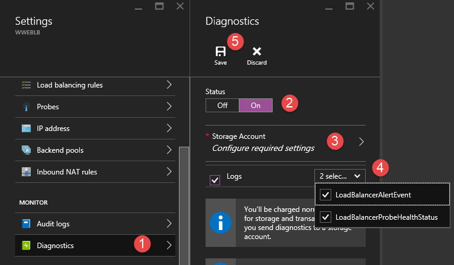

<properties
   pageTitle="Surveiller les opérations, les événements et compteurs pour équilibrage de charge | Microsoft Azure"
   description="Apprenez à activer les événements d’alerte et sonde d’enregistrement de l’état d’intégrité d’équilibrage de charge Azure"
   services="load-balancer"
   documentationCenter="na"
   authors="sdwheeler"
   manager="carmonm"
   editor="tysonn"
   tags="azure-resource-manager"
/>
<tags
   ms.service="load-balancer"
   ms.devlang="na"
   ms.topic="article"
   ms.tgt_pltfrm="na"
   ms.workload="infrastructure-services"
   ms.date="10/24/2016"
   ms.author="sewhee" />

# Journal analytique pour équilibrage de charge Azure (Preview)

Vous pouvez utiliser différents types de journaux dans Azure pour gérer et résoudre les problèmes des programmes d’équilibrage de charge. Certaines de ces journaux sont accessibles via le portail. Tous les journaux peuvent être extraits à partir d’un stockage d’objets blob Azure et affichés dans différents outils, tels que Excel et PowerBI. Vous pouvez en savoir plus sur les différents types de journaux dans la liste ci-dessous.

- **Des journaux d’audit :** Vous pouvez utiliser [Les journaux d’Audit Azure](../../articles/monitoring-and-diagnostics/insights-debugging-with-events.md) (auparavant appelé journaux opérationnelles) pour afficher toutes les opérations envoyées vers vos abonnements Azure et leur statut. Journaux d’audit sont activées par défaut et peuvent être affichés dans le portail Azure.
- **Les journaux d’événements d’alerte :** Vous pouvez utiliser ce journal pour afficher les alertes pour équilibrage de charge sont déclenchés. L’état de l’équilibrage de charge est collectée toutes les cinq minutes. Ce journal écrit uniquement si un événement alerte équilibrage de charge est élevé.
- **Les journaux d’intégrité sonde :** Vous pouvez utiliser ce journal pour vérifier les sonde santé vérifier le statut, le nombre d’instances est en ligne dans la charge équilibrage principale et le pourcentage de machines virtuelles recevant du trafic réseau de l’équilibrage de charge. Journal de modification de l’événement état sonde.

>[AZURE.IMPORTANT] Ouvrez une session analytique travaille actuellement uniquement pour ouvert programmes d’équilibrage de charge sur Internet. Les journaux ne sont disponibles pour les ressources déployées dans le modèle de déploiement du Gestionnaire de ressources. Vous ne pouvez pas utiliser les journaux des ressources dans le modèle de déploiement classique. Pour plus d’informations sur les modèles de déploiement, voir [Présentation du gestionnaire ressource déploiement et déploiement classique](../../articles/resource-manager-deployment-model.md).

## Activer la journalisation

Enregistrement d’audit est activée automatiquement pour chaque ressource Gestionnaire de ressources. Vous devez activer les événements et la santé sonde journalisation pour commencer à collecter les données disponibles via les journaux. Procédez comme suit pour activer la journalisation.

Connectez-vous au [portail Azure](http://portal.azure.com). Si vous n’avez pas un équilibrage de charge, [créez un équilibrage de charge](load-balancer-get-started-internet-arm-ps.md) avant de poursuivre.

1. Dans le portail, cliquez sur **Parcourir**.
2. Sélectionnez les **programmes d’équilibrage de charge**.

    

3. Sélectionnez un équilibrage de charge existant >> **Tous les paramètres**.
4. Sur le côté droit de la boîte de dialogue sous le nom de l’équilibrage de charge, faites défiler jusqu'à **analyse**, cliquez sur **Diagnostics**.

    

5. Dans le volet des **Diagnostics** , sous **état**, sélectionnez **sur**.
6. Cliquez sur **compte de stockage**.
7. Sous **journaux**, sélectionnez un compte de stockage existant ou créez-en un. Utilisez le curseur afin de déterminer le nombre jours événement dat est conservés dans les journaux d’événements. 8. Cliquez sur **Enregistrer**.

    

>[AZURE.INFORMATION] journaux d’Audit ne nécessitent pas un compte de stockage distincte. L’utilisation de stockage pour les événements et la santé sonde journalisation peut entraîner des frais de service.

## Journal d’audit

Le journal d’audit est généré par défaut. Les journaux sont conservées pendant 90 jours Store des journaux d’événements d’Azure. Apprenez-en davantage sur ces journaux en lisant l’article [Afficher les événements et les journaux d’audit](../../articles/monitoring-and-diagnostics/insights-debugging-with-events.md) .

## Alerte journal des événements

Ce journal est généré uniquement si vous l’avez activé sur une base d’équilibrage de charge par. Les événements sont enregistrés au format JSON et stockées dans le compte de stockage que vous avez spécifié lorsque vous avez activé la journalisation. Voici un exemple d’un événement.

    {
    "time": "2016-01-26T10:37:46.6024215Z",
    "systemId": "32077926-b9c4-42fb-94c1-762e528b5b27",
    "category": "LoadBalancerAlertEvent",
    "resourceId": "/SUBSCRIPTIONS/XXXXXXXXXXXXXXXXX-XXXX-XXXX-XXXXXXXXX/RESOURCEGROUPS/RG7/PROVIDERS/MICROSOFT.NETWORK/LOADBALANCERS/WWEBLB",
    "operationName": "LoadBalancerProbeHealthStatus",
    "properties": {
        "eventName": "Resource Limits Hit",
        "eventDescription": "Ports exhausted",
        "eventProperties": {
            "public ip address": "40.117.227.32"
        }
    }

Le résultat JSON montre la propriété *eventname* décrivant la raison de l’équilibrage de charge créé une alerte. Dans ce cas, l’alerte générée a été en raison de carence de ports TCP provoquée par source IP NAT limites (SNAT).

## Journal de sonde d’intégrité

Ce journal est généré uniquement si vous l’avez activé sur une chaque charge équilibrage comme indiqué ci-dessus. Les données sont stockées dans le compte de stockage que vous avez spécifié lorsque vous avez activé la journalisation. Un conteneur nommé « perspectives-journaux-loadbalancerprobehealthstatus » est créé et les données suivantes sont enregistrées :

    {
        "records":
        {
            "time": "2016-01-26T10:37:46.6024215Z",
            "systemId": "32077926-b9c4-42fb-94c1-762e528b5b27",
            "category": "LoadBalancerProbeHealthStatus",
            "resourceId": "/SUBSCRIPTIONS/XXXXXXXXXXXXXXXXX-XXXX-XXXX-XXXX-XXXXXXXXX/RESOURCEGROUPS/RG7/PROVIDERS/MICROSOFT.NETWORK/LOADBALANCERS/WWEBLB",
            "operationName": "LoadBalancerProbeHealthStatus",
            "properties": {
                "publicIpAddress": "40.83.190.158",
                "port": "81",
                "totalDipCount": 2,
                "dipDownCount": 1,
                "healthPercentage": 50.000000
            }
        },
        {
            "time": "2016-01-26T10:37:46.6024215Z",
            "systemId": "32077926-b9c4-42fb-94c1-762e528b5b27",
            "category": "LoadBalancerProbeHealthStatus",
            "resourceId": "/SUBSCRIPTIONS/XXXXXXXXXXXXXXXXX-XXXX-XXXX-XXXX-XXXXXXXXX/RESOURCEGROUPS/RG7/PROVIDERS/MICROSOFT.NETWORK/LOADBALANCERS/WWEBLB",
            "operationName": "LoadBalancerProbeHealthStatus",
            "properties": {
                "publicIpAddress": "40.83.190.158",
                "port": "81",
                "totalDipCount": 2,
                "dipDownCount": 0,
                "healthPercentage": 100.000000
            }
        }
    }

La sortie JSON indique dans le champ propriétés les informations de base pour l’état d’intégrité sonde. La propriété *dipDownCount* affiche le nombre total d’instances sur le serveur principal qui ne reçoivent pas le trafic réseau en raison de réponses sonde a échoué.

## Afficher et analyser le journal d’audit

Vous pouvez afficher et analyser les données du journal d’audit à l’aide d’une des méthodes suivantes :

- **Outils azure :** Récupérer des informations à partir des journaux d’audit via PowerShell Azure, l’Interface de ligne de commande Azure (CLI), l’API REST Azure ou le portail Azure preview. Des instructions détaillées pour chaque méthode sont détaillées dans l’article [opérations d’Audit avec le Gestionnaire de ressources](../../articles/resource-group-audit.md) .
- **Power BI :** Si vous n’avez pas déjà un compte de [Power BI](https://powerbi.microsoft.com/pricing) , vous pouvez l’essayer gratuitement. Avec les [journaux d’Audit Azure contenu pack pour Power BI](https://powerbi.microsoft.com/documentation/powerbi-content-pack-azure-audit-logs), vous pouvez analyser vos données avec des tableaux de bord préconfiguré, ou vous pouvez personnaliser les vues selon vos besoins.

## Afficher et analyser la sonde de santé et le journal des événements

Vous devez vous connecter à votre compte de stockage et récupérer les entrées du journal JSON pour les événements et la santé journaux sonde. Une fois que vous téléchargez les fichiers JSON, vous pouvez les convertir en CSV et les afficher dans Excel, PowerBI ou tout autre outil de visualisation des données.

>[AZURE.TIP] Si vous êtes habitué à Visual Studio et concepts de base de la modification des valeurs de constantes et de variables en c#, vous pouvez utiliser les [journaux convertisseur outils](https://github.com/Azure-Samples/networking-dotnet-log-converter) disponibles sur Github.

## Ressources supplémentaires

- Billet de blog [visualiser vos journaux d’Audit Azure avec Power BI](http://blogs.msdn.com/b/powerbi/archive/2015/09/30/monitor-azure-audit-logs-with-power-bi.aspx) .
- [Afficher et analyser les journaux d’Audit Azure dans Power BI et bien plus encore](https://azure.microsoft.com/blog/analyze-azure-audit-logs-in-powerbi-more/) billet de blog.

## Étapes suivantes

[Comprendre les sondes d’équilibrage de charge](load-balancer-custom-probe-overview.md)
