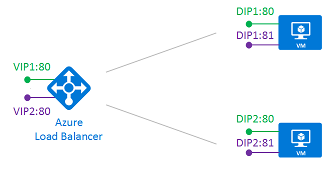

<properties
   pageTitle="Équilibrage de charge de plusieurs VIP pour Azure | Microsoft Azure"
   description="Vue d’ensemble de plusieurs VIP sur équilibrage de charge Azure"
   services="load-balancer"
   documentationCenter="na"
   authors="chkuhtz"
   manager="narayan"
   editor=""
/>
<tags
   ms.service="load-balancer"
   ms.devlang="na"
   ms.topic="article"
   ms.tgt_pltfrm="na"
   ms.workload="infrastructure-services"
   ms.date="08/11/2016"
   ms.author="chkuhtz"
/>

# Équilibrage de charge de plusieurs VIP pour Azure

Équilibrage de charge Azure vous permet de charger services solde sur plusieurs ports, plusieurs adresses IP ou les deux. Vous pouvez utiliser les définitions d’équilibrage de charge publics et internes charger solde flux sur un ensemble de machines virtuelles.

Cet article décrit les notions de base de cette possibilité, concepts importants et les contraintes. Si vous souhaitez uniquement exposer des services d’une adresse IP, vous trouverez des instructions simplifiées pour [interne](load-balancer-get-started-ilb-arm-portal.md) ou [public](load-balancer-get-started-internet-portal.md) chargement des configurations équilibrage. L’ajout de plusieurs VIP est incrémentiel pour une configuration VIP unique. Utilisez les concepts dans cet article, vous pouvez développer une configuration simplifiée à tout moment.

Lorsque vous définissez un équilibrage de charge Azure, un site Web frontal et une configuration serveur principal sont connectés avec les règles. La sonde de santé référencée par la règle est utilisée pour déterminer comment les nouveaux flux sont envoyés à un nœud dans la liste principale. Frontend est définie par une IP (virtuelle), qui est un 3-tuple constitué d’une adresse IP (publique ou interne), un protocole de transport (UDP ou TCP) et un numéro de port. Un fondu est une adresse IP sur une carte réseau Azure virtuelle jointe à un ordinateur virtuel du pool principal.

Le tableau suivant contient quelques exemples de configurations frontend :

| VIP | Adresse IP | protocole | port |
|-----|------------|----------|------|
|1|65.52.0.1|TCP|80|
|2|65.52.0.1|TCP|_8080_|
|3|65.52.0.1|_UDP_|80|
|4|_65.52.0.2_|TCP|80|

Le tableau présente les quatre frontends différents. Frontends #1, 2 # et #3 sont un VIP unique avec plusieurs règles. La même adresse IP est utilisée, mais le port ou le protocole est différente pour chaque frontend. Frontends n ° 1 et 4 # sont un exemple de plusieurs VIP, où le protocole frontend et le port sont réutilisées plusieurs VIP.

Équilibrage de charge Azure offre une flexibilité en définissant la règles d’équilibrage de charge. Une règle déclare comment une adresse et un port sur le site Web frontal est mappé à l’adresse de destination et le port sur le serveur principal. Ou non ports principaux sont réutilisées règles dépendant du type de la règle. Chaque type de règle a des besoins spécifiques peuvent influencer création sonde et configuration hôte. Il existe deux types de règles :

1. La règle par défaut avec aucune réutilisation de port du serveur principal
2. La règle flottante IP où sont réutilisées ports serveur principal

Équilibrage de charge Azure vous permet de combiner les deux types de règles de la même configuration d’équilibrage de charge. L’équilibrage de charge peut les utiliser simultanément pour une machine virtuelle donnée, ou n’importe quelle combinaison, tant que vous respectez les contraintes de la règle. Quel type de règle que vous choisissez dépend de la configuration requise de votre application et la complexité de la prise en charge de cette configuration. Vous devez évaluer les types de règles sont adaptés à votre situation.

Nous Explorez ces scénarios davantage en commençant par le comportement par défaut.

## Règle de type #1 : aucune réutilisation de port de serveur principal

Dans ce scénario, le VIP frontend est configurés comme suit :

| VIP | Adresse IP | protocole | port |
|-----|------------|----------|------|
| 1|65.52.0.1|TCP|80|
| 2|*65.52.0.2*|TCP|80|

Le fondu est la destination du flux entrant. Dans le pool principal, chaque machine virtuelle expose au service voulu dans un port unique sur un fondu. Ce service est associé à frontend via une définition de la règle.

Nous définir deux règles :

| Règle | Mapper frontend | Au pool de serveur principal |
|------|--------------|-----------------|
| 1 |  VIP1:80 |  DIP1:80,  DIP2:80 |
| 2 |  VIP2:80 |  DIP1:81,  DIP2:81 |

Le mappage complet dans l’équilibrage de charge Azure est désormais comme suit :

| Règle | Adresse IP VIP | protocole | port | Destination | port |
|------|----------------|----------|------|-----|------|
| 1|65.52.0.1|TCP|80|Adresse IP de fondu|80|
| 2|65.52.0.2|TCP|80|Adresse IP de fondu|81|

Chaque règle doit produire un flux avec une combinaison unique d’adresse IP de destination et le port de destination. En modifiant le port de destination du flux, plusieurs règles pour pouvoir délivrer flux à la même fondu sur des ports différents.

Santé sondes sont toujours dirigées vers le fondu d’un ordinateur virtuel. Vous devez vous assurer que votre sonde reflète l’état de la machine virtuelle.

## Règle de type #2 : réutilisation de port principal à l’aide de IP flottant

Équilibrage de charge Azure suffisamment souple pour réutiliser le port frontend sur plusieurs VIP quel que soit le type de règle utilisé. En outre, certains scénarios d’application préfèrent ou requièrent le même port devant être utilisé par plusieurs instances de l’application sur un seul ordinateur virtuel du pool principal. Exemples de réutilisation port inclure cluster de disponibilité, authentification multifacteur et exposer plusieurs points de terminaison TLS sans ré-chiffrement réseau.

Si vous voulez réutiliser le port principal dans plusieurs règles, vous devez activer IP flottant dans la définition de la règle.

Flottant IP est une portion de connectée retourner en tant que serveur Direct (DSR). DSR se compose de deux parties : une topologie de flux et une adresses IP schéma de configuration. Un niveau de la plateforme, équilibrage de charge Azure fonctionne toujours dans une topologie de flux DSR indépendamment si IP flottants est activé ou non. Cela signifie que le composant d’un flux sortant est toujours correctement réécrits pour flux directement à l’origine.

Avec le type de règle par défaut, Azure expose une modèle de mappage d’adresses IP pour faciliter leur utilisation d’équilibrage de charge traditionnelle. L’activation IP flottante modifie le schéma de configuration d’adresse IP afin de permettre davantage de flexibilité comme décrit ci-dessous.

Le diagramme suivant illustre cette configuration :

Dans ce scénario, chaque ordinateur virtuel du pool principal comporte trois interfaces réseau :

* FONDU : une carte réseau virtuelle associée à la machine virtuelle (ressource de carte réseau d’Azure)
* VIP1 : une interface de boucle au sein du système d’exploitation est configuré avec l’adresse IP de VIP1 invité
* VIP2 : une interface de boucle au sein du système d’exploitation est configuré avec l’adresse IP de VIP2 invité

>[AZURE.IMPORTANT] La configuration des interfaces logiques s’effectue dans la système d’exploitation invité. Cette configuration n’est pas exécutée ou gérée par Azure. Sans cette configuration, les règles ne fonctionnera pas. Santé sonde définitions utilisent le fondu de la machine virtuelle plutôt que l’adresse IP virtuelle logique. Par conséquent, votre service doit fournir les réponses sonde sur un port fondu qui reflètent l’état du service offert sur l’adresse VIP logique.

Supposons que la même configuration frontend comme dans l’exemple précédent :

| VIP | Adresse IP | protocole | port |
|-----|------------|----------|------|
| 1|65.52.0.1|TCP|80|
| 2|*65.52.0.2*|TCP|80|

Nous définir deux règles :

| Règle | Mapper frontend | Au pool de serveur principal |
|------|--------------|-----------------|
| 1 |  VIP1:80 |  VIP1:80 (dans VM1 et ordinateur virtuel 2) |
| 2 |  VIP2:80 |  VIP2:80 (dans VM1 et ordinateur virtuel 2) |

Le tableau suivant montre le mappage complet dans l’équilibrage de charge :

| Règle | Adresse IP VIP | protocole | port | Destination | port |
|------|----------------|----------|------|-------------|------|
| 1|65.52.0.1|TCP|80|identique VIP (65.52.0.1)|identique VIP (80)|
| 2|65.52.0.2|TCP|80|identique VIP (65.52.0.2)|identique VIP (80)|

La destination du flux entrant est l’adresse VIP dans l’interface en boucle dans la machine virtuelle. Chaque règle doit produire un flux avec une combinaison unique d’adresse IP de destination et le port de destination. En modifiant l’adresse IP de destination du flux, réutilisation de port est possible sur le même ordinateur virtuel. Votre service est exposé à l’équilibrage de charge en liant à l’adresse IP virtuelle adresse IP et port de l’interface de boucle correspondantes.

Notez que cet exemple ne change pas le port de destination. Même s’il s’agit d’un scénario IP flottante, équilibrage de charge Azure prend également en charge la définition d’une règle de réécriture le port de destination principal et le rendre différent du port de destination frontend.

Le type de règle flottante IP est la base de plusieurs modèles de configuration d’équilibrage de charge. Un exemple est actuellement disponible est la configuration [SQL AlwaysOn avec les récepteurs plusieurs](../virtual-machines/virtual-machines-windows-portal-sql-ps-alwayson-int-listener.md) . Dans le temps, nous allez documenter plusieurs de ces scénarios.

## Limitations

* Plusieurs configurations VIP sont uniquement pris en charge avec machines virtuelles IaaS.
* Avec la règle IP flottante, votre application doit utiliser le fondu pour les flux sortants. Si votre application crée une liaison vers l’adresse VIP configurée sur l’interface de boucle dans la système d’exploitation invité, puis SNAT n’est pas disponible pour le flux sortant de réécriture et le flux échoue.
* Adresses IP publiques ont une incidence sur facturation. Pour plus d’informations, voir [adresse IP tarifs](https://azure.microsoft.com/pricing/details/ip-addresses/)
* Abonnement limitations s’appliquent. Pour plus d’informations, voir [limites de Service](../azure-subscription-service-limits.md#networking-limits) pour plus d’informations.
