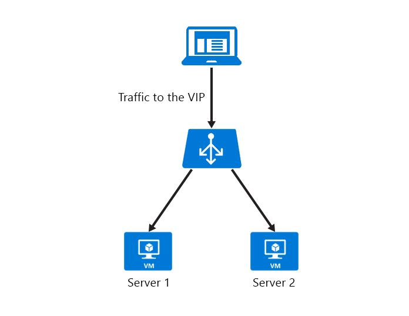

<properties
   pageTitle="Configurer le délai d’inactivité TCP d’équilibrage de charge | Microsoft Azure"
   description="Configurer le délai d’inactivité TCP d’équilibrage de charge"
   services="load-balancer"
   documentationCenter="na"
   authors="sdwheeler"
   manager="carmonm"
   editor="" />
<tags
   ms.service="load-balancer"
   ms.devlang="na"
   ms.topic="article"
   ms.tgt_pltfrm="na"
   ms.workload="infrastructure-services"
   ms.date="10/24/2016"
   ms.author="sewhee" />

# Configurer les paramètres de délai d’inactivité TCP d’équilibrage de charge Azure

Dans sa configuration par défaut, équilibrage de charge Azure possède un paramètre de délai d’inactivité de 4 minutes. Si une période d’inactivité est supérieure à la valeur du délai, il n’existe aucune garantie que la session TCP ou HTTP est conservée entre le client et votre service cloud.

Lorsque la connexion est fermée, votre application cliente peut s’afficher le message d’erreur suivant : « la connexion sous-jacente a été fermée : une connexion qui a été censée être maintenu actif a été fermée par le serveur. »

Une pratique courante consiste à utiliser un TCP persistante. Cette pratique conserve la connexion active pendant une durée plus longue. Pour plus d’informations, consultez ces [exemples .NET](https://msdn.microsoft.com/library/system.net.servicepoint.settcpkeepalive.aspx). Conservation activé, les paquets sont envoyés au cours des périodes d’inactivité sur la connexion. Ces paquets assurent que la valeur du délai d’inactivité n’est jamais atteint et la connexion est conservée pendant une longue période.

Ce paramètre fonctionne pour les connexions entrantes. Pour éviter de perdre la connexion, vous devez configurer les ports TCP persistante avec un intervalle de moins que le paramètre de délai d’inactivité ou augmentez la valeur du délai d’inactivité. Pour prendre en charge ces scénarios, nous avons ajouté prise en charge pour un délai d’inactivité configurable. Vous pouvez maintenant le configurer pour une durée de 4 à 30 minutes.

TCP persistante fonctionne bien pour les scénarios où la durée de la batterie n’est pas une contrainte. Il n’est pas recommandé pour les applications mobiles. À l’aide d’un TCP persistante dans une application mobile peut se vider la batterie de l’appareil plus rapidement.

Les sections suivantes décrivent comment modifier les paramètres de délai d’inactivité dans des machines virtuelles et services cloud.

## Configurer le délai d’expiration TCP pour votre adresse IP public au niveau de l’instance à 15 minutes

    Set-AzurePublicIP -PublicIPName webip -VM MyVM -IdleTimeoutInMinutes 15

`IdleTimeoutInMinutes`est facultative. Si elle n’est pas définie, le délai par défaut est 4 minutes. La plage de délai d’attente acceptable est 4 à 30 minutes.

## Définir le délai d’inactivité lors de la création d’un point de terminaison Azure sur une machine virtuelle

Pour modifier le paramètre de délai d’expiration pour un point de terminaison, utilisez la commande suivante :

    Get-AzureVM -ServiceName "mySvc" -Name "MyVM1" | Add-AzureEndpoint -Name "HttpIn" -Protocol "tcp" -PublicPort 80 -LocalPort 8080 -IdleTimeoutInMinutes 15| Update-AzureVM

Pour récupérer votre configuration d’inactivité, utilisez la commande suivante :

    PS C:\> Get-AzureVM -ServiceName "MyService" -Name "MyVM" | Get-AzureEndpoint
    VERBOSE: 6:43:50 PM - Completed Operation: Get Deployment
    LBSetName : MyLoadBalancedSet
    LocalPort : 80
    Name : HTTP
    Port : 80
    Protocol : tcp
    Vip : 65.52.xxx.xxx
    ProbePath :
    ProbePort : 80
    ProbeProtocol : tcp
    ProbeIntervalInSeconds : 15
    ProbeTimeoutInSeconds : 31
    EnableDirectServerReturn : False
    Acl : {}
    InternalLoadBalancerName :
    IdleTimeoutInMinutes : 15

## Définir le délai d’expiration TCP un ensemble de point de terminaison équilibrage

Si les points de terminaison font partie d’un ensemble de point de terminaison équilibrage de charge, le délai d’expiration TCP doit être définie sur le jeu d’équilibrage de charge le point de terminaison. Par exemple :

    Set-AzureLoadBalancedEndpoint -ServiceName "MyService" -LBSetName "LBSet1" -Protocol tcp -LocalPort 80 -ProbeProtocolTCP -ProbePort 8080 -IdleTimeoutInMinutes 15

## Modifier les paramètres de délai d’expiration des services en nuage

Vous pouvez utiliser le Kit de développement Azure pour mettre à jour votre service cloud. Vous vérifiez les paramètres de point de terminaison pour les services de cloud dans le fichier .csdef. Mise à jour le délai d’expiration TCP pour le déploiement d’un service cloud requiert une mise à niveau du déploiement. Une exception est si le délai d’expiration TCP est spécifié uniquement pour une adresse IP publique. Paramètres IP public figurent dans le fichier .cscfg, et vous pouvez les mettre à jour via mise à jour de déploiement et de mise à niveau.

Les modifications .csdef pour les paramètres de point de terminaison sont :

    <WorkerRole name="worker-role-name" vmsize="worker-role-size" enableNativeCodeExecution="[true|false]">
      <Endpoints>
        <InputEndpoint name="input-endpoint-name" protocol="[http|https|tcp|udp]" localPort="local-port-number" port="port-number" certificate="certificate-name" loadBalancerProbe="load-balancer-probe-name" idleTimeoutInMinutes="tcp-timeout" />
      </Endpoints>
    </WorkerRole>

Les modifications .cscfg pour le paramètre de délai d’adresses IP public sont :

    <NetworkConfiguration>
      <VirtualNetworkSite name="VNet"/>
      <AddressAssignments>
        <InstanceAddress roleName="VMRolePersisted">
        <PublicIPs>
          <PublicIP name="public-ip-name" idleTimeoutInMinutes="timeout-in-minutes"/>
        </PublicIPs>
        </InstanceAddress>
      </AddressAssignments>
    </NetworkConfiguration>

## Exemple de l’API REST

Vous pouvez configurer le délai d’inactivité TCP à l’aide de l’API de gestion de service. Assurez-vous que la `x-ms-version` en-tête est défini sur version `2014-06-01` ou version ultérieure. Mettre à jour la configuration de la spécifié terminaison d’entrée équilibrage de charge sur tous les ordinateurs virtuels dans un déploiement.

### Demande

    POST https://management.core.windows.net/<subscription-id>/services/hostedservices/<cloudservice-name>/deployments/<deployment-name>

### Réponse

    <LoadBalancedEndpointList xmlns="http://schemas.microsoft.com/windowsazure" xmlns:i="http://www.w3.org/2001/XMLSchema-instance">
      <InputEndpoint>
        <LoadBalancedEndpointSetName>endpoint-set-name</LoadBalancedEndpointSetName>
        <LocalPort>local-port-number</LocalPort>
        <Port>external-port-number</Port>
        <LoadBalancerProbe>
          <Path>path-of-probe</Path>
          <Port>port-assigned-to-probe</Port>
          <Protocol>probe-protocol</Protocol>
          <IntervalInSeconds>interval-of-probe</IntervalInSeconds>
          <TimeoutInSeconds>timeout-for-probe</TimeoutInSeconds>
        </LoadBalancerProbe>
        <LoadBalancerName>name-of-internal-loadbalancer</LoadBalancerName>
        <Protocol>endpoint-protocol</Protocol>
        <IdleTimeoutInMinutes>15</IdleTimeoutInMinutes>
        <EnableDirectServerReturn>enable-direct-server-return</EnableDirectServerReturn>
        <EndpointACL>
          <Rules>
            <Rule>
              <Order>priority-of-the-rule</Order>
              <Action>permit-rule</Action>
              <RemoteSubnet>subnet-of-the-rule</RemoteSubnet>
              <Description>description-of-the-rule</Description>
            </Rule>
          </Rules>
        </EndpointACL>
      </InputEndpoint>
    </LoadBalancedEndpointList>

## Étapes suivantes

[Vue d’ensemble des équilibrage de charge interne](load-balancer-internal-overview.md)

[Démarrer la configuration d’un équilibrage de charge via Internet](load-balancer-get-started-internet-arm-ps.md)

[Configurer un mode de distribution d’équilibrage de charge](load-balancer-distribution-mode.md)
