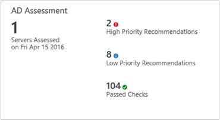
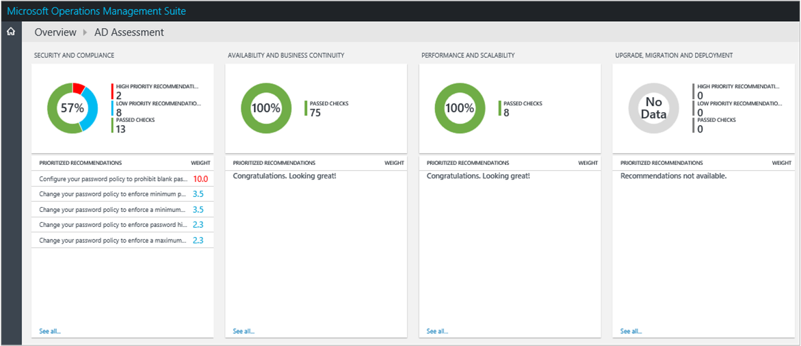

<properties
    pageTitle="Optimiser votre environnement avec la solution Active Directory évaluation dans le journal Analytique | Microsoft Azure"
    description="Vous pouvez utiliser la solution Active Directory évaluation afin d’évaluer le risque et l’état de vos environnements serveur à intervalles réguliers."
    services="log-analytics"
    documentationCenter=""
    authors="bandersmsft"
    manager="jwhit"
    editor=""/>

<tags
    ms.service="log-analytics"
    ms.workload="na"
    ms.tgt_pltfrm="na"
    ms.devlang="na"
    ms.topic="article"
    ms.date="10/10/2016"
    ms.author="banders"/>

# <a name="optimize-your-environment-with-the-active-directory-assessment-solution-in-log-analytics"></a>Optimiser votre environnement avec la solution Active Directory évaluation dans le journal Analytique

Vous pouvez utiliser la solution Active Directory évaluation afin d’évaluer le risque et l’état de vos environnements serveur à intervalles réguliers. Cet article vous aidera à installer et utiliser la solution de sorte que vous pouvez effectuer les actions verres les éventuels problèmes.

Cette solution fournit une liste hiérarchisée des recommandations spécifiques à votre infrastructure serveur déployé. Les recommandations sont classées sur quatre domaines clés qui vous aident à rapidement les risques et effectuez l’action.

Les recommandations sont basées sur les connaissances et l’expérience acquise par les ingénieurs Microsoft à partir des milliers de visites client. Chaque recommandation fournit des conseils sur la raison pour laquelle un problème peut avoir une importance à votre et comment mettre en œuvre les modifications suggérées.

Vous pouvez choisir les domaines qui sont les plus importantes à votre organisation et suivre la progression vers un environnement gratuit et exact risque en cours d’exécution.

Une fois que vous avez ajouté la solution et une évaluation est terminée, résumé des informations pour les domaines s’affichent dans le tableau de bord **évaluation AD** pour l’infrastructure dans votre environnement. Les sections suivantes décrivent comment utiliser les informations sur le tableau de bord **évaluation AD** , où vous pouvez afficher et ensuite procéder recommandés pour votre infrastructure de serveur Active Directory.






## <a name="installing-and-configuring-the-solution"></a>Installation et configuration de la solution
Utilisez les informations suivantes pour installer et configurer les solutions.

- Agents doivent être installés sur superflus sont membres du domaine doit être évaluée.
- La solution Active Directory évaluation requiert .NET Framework 4 est installé sur chaque ordinateur sur lequel est un agent OMS.
- Ajouter la solution Active Directory évaluation à votre espace de travail OMS à l’aide de la procédure décrite dans [solutions ajouter journal Analytique à partir de la galerie de Solutions](log-analytics-add-solutions.md).  Il n’existe aucune autre configuration requise.

    >[AZURE.NOTE] Une fois que vous avez ajouté la solution, le fichier AdvisorAssessment.exe est ajouté aux serveurs avec agents. Données de configuration lues et puis envoyées au service OMS dans le cloud pour traitement. Logique est appliquée aux données reçues et le service cloud enregistre les données.

## <a name="active-directory-assessment-data-collection-details"></a>Détails de collection de sites de données actives Directory évaluation

Active Directory évaluation collecte des données WMI, les données du Registre et des données de performance à l’aide d’agents que vous avez activés.

Le tableau suivant indique les méthodes de collecte de données pour « agents », Operations Manager (SCOM) est requis et la façon dont souvent les données sont collectées par un agent.

| plateforme | Agent directe | Agent SCOM | Stockage Azure | SCOM obligatoire ? | Données de l’agent SCOM envoyées par groupe d’administration | fréquence de collection de sites |
|---|---|---|---|---|---|---|
|Windows||||   || 7 jours|


## <a name="understanding-how-recommendations-are-prioritized"></a>Comprendre la priorité des recommandations

Une valeur de pondération qui identifie l’importance relative de la recommandation est attribuée à chaque recommandation apportée. Uniquement les dix recommandations les plus importantes sont affichées.

### <a name="how-weights-are-calculated"></a>Mode de calcul des épaisseurs

Pondérations sont des valeurs de regroupement en fonction de trois facteurs clés :

- La *probabilité* qu’un problème identifié va entraîner des problèmes. Probabilité est égale à un plus grande score est pour la recommandation.

- L' *impact* du problème sur votre organisation si elle entraîne un problème. Un impact plus important équivaut à un score est plus grande pour la recommandation.

- L' *effort* requis pour mettre en œuvre la recommandation. Un effort supérieur équivaut à un plus petit score global de la recommandation.

La pondération pour chaque recommandation est exprimée sous forme de pourcentage du total score disponible pour chaque zone le focus. Par exemple, si une recommandation dans le centre d’intérêt sécurité et conformité a un score d’égal à 5 %, mise en œuvre cette recommandation augmentera votre globale score à 5 % de sécurité et conformité.

### <a name="focus-areas"></a>Il est axé

**Sécurité et conformité** - cette zone focus montre recommandations pour menaces de sécurité potentielles et les violations des règles, les stratégies d’entreprise et les exigences de conformité, technique et aux régulations.

**Disponibilité et continuité des activités** -cette zone focus montre recommandations pour la disponibilité du service, résilience de votre infrastructure et protection des données métiers.

**Performances et extensibilité élevées** - cette zone le focus affiche des recommandations à l’aide de votre organisation l’infrastructure agrandir, assurez-vous que votre environnement informatique répond à des exigences de performances en cours et est en mesure de répondre à l’évolution des besoins d’infrastructure.

**Mise à niveau, le déploiement et Migration** - cette zone le focus affiche des recommandations pour vous aider à mettre à niveau, migrer et déployer Active Directory à votre infrastructure existante.

### <a name="should-you-aim-to-score-100-in-every-focus-area"></a>Doit visent score 100 % dans chaque zone focus ?

Pas nécessairement. Les recommandations sont basées sur les connaissances et l’expérience acquise par les ingénieurs Microsoft sur des milliers de visites client. Toutefois, aucune infrastructure deux serveurs n’est les mêmes, et des recommandations spécifiques peuvent être plus ou moins pertinentes pour vous. Par exemple, quelques conseils de sécurité peuvent être submergées si vos machines virtuelles ne sont pas exposés à Internet. Quelques recommandations disponibilité peuvent être moins pertinentes pour les services qui fournissent basse priorité données ad hoc collecte et rapport. Problèmes qui sont importantes pour une entreprise peuvent être moins importants pour un démarrage. Vous voudrez peut-être identifier quelles zones focus vos priorités et observez comment vos résultats changent au fil du temps.

Chaque recommandation inclut des instructions sur la raison pour laquelle il est important. Vous devez utiliser ce guide pour déterminer si la mise en œuvre la recommandation est approprié pour vous, compte tenu de la nature de vos services informatiques et des besoins de votre organisation.

## <a name="use-assessment-focus-area-recommendations"></a>Utiliser les évaluation focus zone recommandations

Avant de pouvoir utiliser une solution d’évaluation dans OMS, vous devez disposer de la solution est installée. Pour en savoir plus sur l’installation de solutions, voir [Ajouter journal Analytique solutions à partir de la galerie de Solutions](log-analytics-add-solutions.md). Une fois qu’il est installé, vous pouvez afficher le résumé des recommandations à l’aide de la vignette d’évaluation dans la page Vue d’ensemble dans OMS.

Afficher les évaluations de conformité synthétisées pour votre infrastructure puis une exploration des niveaux dans des recommandations.


### <a name="to-view-recommendations-for-a-focus-area-and-take-corrective-action"></a>Pour afficher les recommandations pour un centre d’intérêt et surviennent

1. Dans la page **vue d’ensemble** , cliquez sur la vignette **d’évaluation** pour votre infrastructure de serveur.
2. Dans la page **d’évaluation** , passez en revue les informations de synthèse dans un des cartes de zone le focus, puis sur un pour consulter des recommandations pour cette zone le focus.
3. Dans les pages de zone le focus, vous pouvez afficher les recommandations hiérarchisées pour votre environnement. Cliquez sur une recommandation sous **Objets affectés** pour afficher plus d’informations sur la raison pour laquelle la recommandation est effectuée.  
    
4. Vous pouvez effectuer les actions verres suggérées dans **Les Actions suggérées**. Lorsque l’élément a été résolu, évaluations ultérieure enregistre recommandé actions exécutées et votre score conformité augmente. Éléments corrigés apparaissent comme des **Objets passé**.

## <a name="ignore-recommendations"></a>Ignorer les recommandations

Si vous avez recommandations que vous souhaitez ignorer, vous pouvez créer un fichier texte qui utilisera OMS pour empêcher les recommandations ne s’affiche pas dans les résultats d’évaluation.

### <a name="to-identify-recommendations-that-you-will-ignore"></a>Pour identifier les recommandations qui vous ignore

1.  Se connecter à votre espace de travail et ouvrir la recherche de journal. Utiliser la requête suivante recommandations liste qui n’ont pas pour les ordinateurs dans votre environnement.

    ```
    Type=ADAssessmentRecommendation RecommendationResult=Failed | select  Computer, RecommendationId, Recommendation | sort  Computer
    ```

    Voici une capture d’écran montrant la requête de recherche dans un journal : 

2.  Choisissez recommandations que vous souhaitez ignorer. Vous allez utiliser les valeurs pour RecommendationId dans la procédure suivante.


### <a name="to-create-and-use-an-ignorerecommendationstxt-text-file"></a>Pour créer et utiliser un fichier texte IgnoreRecommendations.txt

1.  Créez un fichier nommé IgnoreRecommendations.txt.
2.  Collez ou tapez chaque RecommendationId pour chaque recommandation que vous voulez Analytique journal pour ignorer sur une ligne distincte, puis enregistrez et fermez le fichier.
3.  Placez le fichier dans le dossier suivant sur chaque ordinateur sur lequel OMS pour ignorer les recommandations.
    - Sur les ordinateurs avec l’Agent de Microsoft surveillance (connecté directement ou via Operations Manager) - *lecteur_système*: \Program Files\Microsoft Agent\Agent de surveillance
    - Sur le serveur de gestion des Operations Manager - *lecteur_système*: \Program Files\Microsoft System Center 2012 R2\Operations Manager\Server

### <a name="to-verify-that-recommendations-are-ignored"></a>Pour vérifier que les recommandations sont ignorées

Une fois que le prochain évaluation s’exécute, par défaut tous les 7 jours, les recommandations spécifiées sont marquées *ignoré* et n’apparaissent pas dans le tableau de bord d’évaluation.

1. Vous pouvez utiliser les requêtes de recherche de journal suivantes pour répertorier tous les recommandations ignorées.

    ```
    Type=ADAssessmentRecommendation RecommendationResult=Ignored | select  Computer, RecommendationId, Recommendation | sort  Computer
    ```

2.  Si vous décidez plus tard que vous voulez voir Recommandations ignorées, supprimez tous les fichiers IgnoreRecommendations.txt, ou vous pouvez supprimer RecommendationIDs d’eux.

## <a name="ad-assessment-solutions-faq"></a>Solutions d’évaluation AD Forum aux questions

*À quelle fréquence fonctionne avec une évaluation ?*
- L’évaluation s’exécute tous les 7 jours.

*Existe-t-il une façon de configurer la fréquence d’exécution l’évaluation ?*
- Pas pour le moment.

*Si un autre serveur pour est détecté une fois que j’ai ajouté une solution d’évaluation, sera il évalué ?*
- Oui, lorsque ce dernier est détecté il est évalué à partir de là, tous les 7 jours.

*Si un serveur est désactivé, lorsqu’il sont supprimée de l’évaluation ?*
- Si un serveur ne présente pas de données pour 3 semaines, celui-ci est supprimé.

*Quel est le nom du processus qui effectue la collecte de données ?*
- AdvisorAssessment.exe

*Combien de temps faut-il pour collecter les données ?*
- La collecte de données réelles sur le serveur prend environ 1 heure. Il peut prendre plus de temps sur des serveurs qui ont un grand nombre de serveurs Active Directory.

*Type de données recueillie ?*
- Les types de données suivants sont collectées :
    - WMI
    - Registre
    - Compteurs de performance

*Existe-t-il une façon de configurer la collecte de données ?*
- Pas pour le moment.

*Pourquoi afficher uniquement les recommandations 10 premiers ?*
- Au lieu de ce qui vous donne une liste écrasante exhaustive des tâches, nous vous recommandons de que vous vous concentrer sur les recommandations hiérarchisées tout d’abord. Une fois que vous y remédier, recommandations supplémentaires sont disponibles. Si vous préférez afficher la liste détaillée, vous pouvez afficher toutes les recommandations à l’aide de la recherche dans un journal.

*Est-il possible d’ignorer une recommandation ?*
- Oui, voir [recommandations ignorer](#ignore-recommendations) section ci-dessus.


## <a name="next-steps"></a>Étapes suivantes

- [Recherches de journaux dans journal Analytique](log-analytics-log-searches.md) permet d’afficher des recommandations et des données AD évaluation détaillées.
