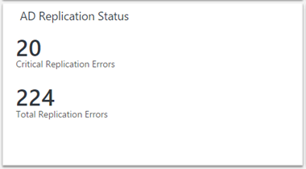

<properties
    pageTitle="Solution d’état de la réplication annuaire Active dans journal Analytique | Microsoft Azure"
    description="Le pack de solution d’état de la réplication Active Directory régulièrement surveille votre environnement Active Directory pour les échecs de réplication les rapports et les résultats dans votre tableau de bord OMS."
    services="log-analytics"
    documentationCenter=""
    authors="bandersmsft"
    manager="jwhit"
    editor=""/>

<tags
    ms.service="log-analytics"
    ms.workload="na"
    ms.tgt_pltfrm="na"
    ms.devlang="na"
    ms.topic="article"
    ms.date="10/10/2016"
    ms.author="banders"/>

# Solution d’état de la réplication annuaire Active dans journal Analytique

Active Directory est un composant clé d’un environnement informatique d’entreprise. Pour vous assurer que les performances et disponibilité, chaque contrôleur de domaine a sa propre copie de la base de données Active Directory. Domaine réplique entre eux afin de propager les modifications au sein de l’entreprise. Échecs de ce processus de réplication peuvent entraîner une variété de problèmes dans l’entreprise.

Le pack de solution d’état de la réplication AD régulièrement surveille votre environnement Active Directory pour les échecs de réplication les rapports et les résultats dans votre tableau de bord OMS.

## Installation et configuration de la solution
Utilisez les informations suivantes pour installer et configurer la solution.

- Agents doivent être installés sur superflus sont membres du domaine doit être évaluée, ou sur des serveurs membres configurés pour envoyer des données de la réplication AD à OMS. Pour mieux comprendre comment se connecter ordinateurs Windows à OMS, voir [ordinateurs Windows de se connecter au journal Analytique](log-analytics-windows-agents.md). Si votre contrôleur de domaine est déjà partie d’un environnement de System Center Operations Manager existant que vous voulez vous connecter à OMS, voir [Se connecter Operations Manager pour journal Analytique](log-analytics-om-agents.md).
- Ajouter la solution d’état de la réplication Active Directory dans votre espace de travail OMS à l’aide de la procédure décrite dans [solutions ajouter journal Analytique à partir de la galerie de Solutions](log-analytics-add-solutions.md).  Il n’existe aucune autre configuration requise.

## Informations sur la collecte des données AD état de la réplication

Le tableau suivant montre les méthodes de collecte de données et autres informations sur la façon dont les données sont collectées pour l’état de la réplication AD.

| plateforme | Agent directe | Agent SCOM | Stockage Azure | SCOM obligatoire ? | Données de l’agent SCOM envoyées par groupe d’administration | fréquence de collection de sites |
|---|---|---|---|---|---|---|
|Windows|||||| chaque 5 jours|

## Vous pouvez également activer un contrôleur de domaine non s’envoyer des données AD OMS
Si vous ne voulez pas vous connecter tout votre contrôleur de domaine directement à OMS, vous pouvez utiliser n’importe quel autre ordinateur connecté OMS dans votre domaine pour collecter les données pour le pack de solution d’état de la réplication AD et lui envoyer les données.

### Pour permettre à un contrôleur de domaine non s’envoyer des données AD OMS
1.  Vérifiez que l’ordinateur est membre du domaine que vous souhaitez analyser à l’aide de la solution d’état de la réplication AD.
2.  [Se connecter OMS de l’ordinateur Windows](log-analytics-windows-agents.md) ou [se connecter à l’aide de votre environnement Operations Manager existant OMS](log-analytics-om-agents.md), s’il n’est pas déjà connecté.
3.  Sur cet ordinateur, définissez la clé de Registre suivante :
    - Clé : **HKEY_LOCAL_MACHINE\SYSTEM\CurrentControlSet\Services\HealthService\Parameters\Management groupes\<ManagementGroupName > \Solutions\ADReplication**
    - Valeur : **IsTarge**
    - Données de valeur : **true**

    >[AZURE.NOTE]Ces modifications ne prendront pas effet jusqu'à ce que votre redémarrer le service Agent de surveillance Microsoft (HealthService.exe).

## Présentation des erreurs de réplication
Une fois que les données de l’état de réplication AD envoyées à OMS, vous verrez une vignette semblable au suivant dans le tableau de bord OMS indiquant que des erreurs de réplication combien vous avez actuellement.  

**Erreurs de réplication critiques** sont celles qui sont en ou supérieure à 75 % la durée de [vie de désactivation](https://technet.microsoft.com/library/cc784932%28v=ws.10%29.aspx) de la forêt Active Directory.

Lorsque vous cliquez sur la vignette, vous verrez plus d’informations sur les erreurs.

### État du serveur destination et état du serveur Source
Ces cartes affichent l’état des serveurs de destination et source qui rencontrent des erreurs de réplication. Le nombre après chaque nom du contrôleur de domaine indique le nombre d’erreurs de réplication sur ce contrôleur de domaine.

Les erreurs pour les serveurs de destination et source sont affichées parce que certains problèmes sont plus faciles à résoudre les problèmes à partir du point de vue du serveur source et d’autres personnes à partir de la perspective de serveur de destination.

Dans cet exemple, vous pouvez voir que de nombreux serveurs destination ont à peu près le même nombre d’erreurs, mais il existe un serveur source (ADDC35) qui comporte de nombreuses erreurs de toutes les autres. Il est probable qu’il existe un problème sur ADDC35 qu’il ne parviennent pas à envoyer des données à ses partenaires de réplication à l’origine. Résoudre les problèmes sur ADDC35 probablement résout la plupart des messages d’erreur qui s’affichent dans la carte de serveur de destination.

### Types d’erreurs de réplication
Cette carte vous donne des informations sur les types d’erreurs détectées au sein de votre entreprise. Chaque erreur possède un code numérique unique et un message qui peut vous aider à déterminer la cause de l’erreur.

La couronne en haut vous donne une idée des erreurs s’affichent plus et moins fréquemment dans votre environnement.

Cela peut afficher lorsque plusieurs superflus rencontrent l’erreur de réplication même. Dans ce cas, vous pourrez peut-être découvrir identifier une solution sur un contrôleur de domaine, puis répétez sur d’autres domaine affectés par le même message d’erreur.

### Durée de vie désactivation
La durée de vie de désactivation détermine la durée pendant laquelle un objet supprimé, appelé une désactivation, est conservé dans la base de données Active Directory. Lorsqu’un objet supprimé passe la durée de vie de désactivation, un processus de nettoyage supprime automatiquement à partir de la base de données Active Directory.

La durée de vie de désactivation par défaut est 180 jours pour les versions plus récentes de Windows, mais il a été 60 jours dans les versions antérieures, et il peut être modifié explicitement par un administrateur Active Directory.

Il est important de savoir si vous rencontrez des erreurs de réplication qui sont approche ou sont passée la durée de vie de désactivation. Si deux superflus rencontrent une erreur de réplication persiste au-delà de la durée de vie de désactivation, réplication est désactivée entre ces deux contrôleurs de domaine, même si l’erreur de réplication sous-jacente est fixe.

La carte de vie de désactivation permet d’identifier les emplacements où il s’agit risque de cela se produise. Chaque erreur de la **100 % expiration** catégorie représente une partition qui n’a pas répliquée entre son serveur source et de destination pour au moins la durée de vie de désactivation de la forêt.

Dans ce cas, le tout simplement corriger l’erreur de réplication sera pas assez. Au minimum, vous devez examiner manuellement pour identifier et nettoyage des objets en attente avant que vous pouvant relancer la réplication. Vous devrez même désaffecter un contrôleur de domaine.

Outre l’identification des erreurs de réplication qui ont conservé au-delà de la durée de vie de désactivation, vous souhaiterez également soyez attentif aux éventuelles erreurs entrant dans les catégories **d’expiration de 50 à 75 %** ou **d’expiration de 75 à 100 %** .

Il s’agit des erreurs sont clairement en attente, pas transitoires, afin qu’ils probablement besoin votre intervention pour résoudre. La bonne nouvelle est qu’ils n’ont pas encore atteint la durée de vie de désactivation. Si vous résoudre ces problèmes rapidement et redémarrez *avant* qu’ils atteignent la durée de vie de désactivation, réplication avec intervention manuelle minimale.

Comme indiqué précédemment, la vignette du tableau de bord pour la solution d’état de la réplication AD affiche le nombre de *critiques* des erreurs de réplication dans votre environnement, qui est définie comme erreurs qui sont supérieures à 75 % de durée de vie de désactivation (y compris les erreurs qui sont supérieures à 100 % d’expiration). Chercher à réduire ce nombre à 0.

>[AZURE.NOTE] Tous les calculs de pourcentage de la durée de vie désactivation sont basés sur la durée de vie de désactivation réel pour votre forêt Active Directory, afin que vous pouvez faire confiance que ces pourcentages sont exacts, même si vous avez une valeur de durée de vie de désactivation personnalisé défini.

### Détails de l’état de réplication AD
Lorsque vous cliquez sur n’importe quel élément dans une des listes, vous verrez des informations supplémentaires à l’aide de la recherche dans un journal. Les résultats sont filtrées pour afficher uniquement les erreurs liées à cet élément. Par exemple, si vous cliquez sur le premier contrôleur de domaine répertorié sous **État du serveur de Destination (ADDC02)**, vous verrez les résultats de recherche filtrés pour afficher les erreurs avec ce contrôleur de domaine répertorié en tant que le serveur de destination :

À partir de là, vous pouvez filtrer davantage, modifiez la requête de recherche et ainsi de suite. Pour plus d’informations sur l’utilisation de la recherche du journal, voir [journal des recherches](log-analytics-log-searches.md).

Le champ **HelpLink** affiche l’URL d’une page TechNet avec des détails supplémentaires sur cette erreur spécifique. Vous pouvez copier et coller ce lien dans la fenêtre de votre navigateur pour plus d’informations sur la résolution des problèmes et corriger l’erreur.

Vous pouvez également cliquer sur **Exporter** pour exporter les résultats dans Excel. Cela permet de visualiser des données d’erreur de réplication dans n’importe quel aspect voulu.

## État de la réplication AD Forum aux questions
**Q : la fréquence à laquelle sont mis à jour les données AD réplication état ?**
R : les informations sont mis à jour chaque 5 jours.

**Q : est-il possible de configurer la fréquence de mise à jour de ces données ?**
R : pas pour le moment.

**Q : dois-je ajouter tous de mon domaine dans mon espace de travail OMS pour afficher l’état de la réplication ?**
R : non, uniquement un contrôleur de domaine doit être ajouté. Si vous avez plusieurs superflus dans votre espace de travail OMS, toutes les données sont envoyées à OMS.

**Q : je ne souhaite ajouter aucun contrôleur de domaine à mon espace de travail OMS. Puis-je toujours utiliser la solution d’état de la réplication AD ?**
R : Oui. Vous pouvez définir la valeur d’une clé de Registre pour activer cette option. Consultez [pour activer un contrôleur de domaine non envoyer des données AD à OMS](#to-enable-a-non-domain-controller-to-send-ad-data-to-oms).

**Q : quel est le nom du processus qui effectue la collecte de données ?**
R : AdvisorAssessment.exe

**Q : combien de temps faut-il pour collecter les données ?**
A : heure de collecte de données dépend de la taille de l’environnement Active Directory, mais ne prend moins de 15 minutes.

**Q : quel type de données recueillie ?**
R : réplication informations sont collectées via LDAP.

**Q : est-il possible de configuration lors de la collecte des données ?**
R : pas pour le moment.

**Q : quelles autorisations ai-je besoin recueillir des données ?**
R : normal autorisations utilisateur dans Active Directory sont généralement suffisantes.

## Résoudre les problèmes de collecte de données
Pour collecter les données, le module de solution d’état de la réplication AD requiert au moins un contrôleur de domaine d’être connecté à votre espace de travail OMS. Jusqu'à ce que cela, vous verrez un message indiquant que **les données sont toujours en cours collectées**.

Si vous avez besoin d’aide connexion d’un contrôleur de domaine, vous pouvez consulter la documentation sur les [ordinateurs Windows de se connecter au journal Analytique](log-analytics-windows-agents.md). Par ailleurs, si votre contrôleur de domaine est déjà connecté à un environnement de System Center Operations Manager, vous pouvez afficher la documentation à [Se connecter System Center Operations Manager au journal Analytique](log-analytics-om-agents.md).

Si vous ne voulez pas vous connecter tout votre contrôleur de domaine directement au OMS ou SCOM, consultez [pour activer un contrôleur de domaine non envoyer des données AD à OMS](#to-enable-a-non-domain-controller-to-send-ad-data-to-oms).

## Étapes suivantes

- [Recherches de journaux dans journal Analytique](log-analytics-log-searches.md) permet d’afficher des données de l’état de la réplication Active Directory détaillées.
