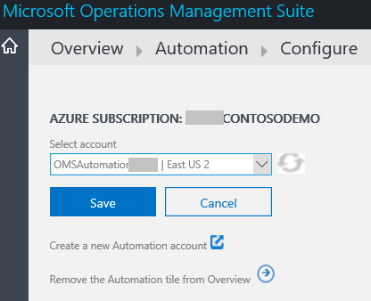

<properties
    pageTitle="Ajouter des solutions journal Analytique à partir de la galerie de Solutions | Microsoft Azure"
    description="Journal Analytique solutions sont qu'un ensemble de logique, visualisation et acquisition de données des règles qui donnent des indications réorganisées autour d’une zone de problème particulier."
    services="log-analytics"
    documentationCenter=""
    authors="bandersmsft"
    manager="jwhit"
    editor=""/>

<tags
    ms.service="log-analytics"
    ms.workload="na"
    ms.tgt_pltfrm="na"
    ms.devlang="na"
    ms.topic="article"
    ms.date="10/10/2016"
    ms.author="banders"/>

# Ajouter des solutions journal Analytique à partir de la galerie de Solutions

Journal Analytique solutions sont une collection de **logique**, de **visualisation** et de **règles d’acquisition des données** qui donnent des indications réorganisées autour d’une zone de problème particulier. Cet article les solutions listes pris en charge de journal Analytique et vous explique comment ajouter et supprimer à l’aide de la galerie de Solutions.

Les solutions permettent une analyse plus approfondie à :

- aider à identifier et résoudre les problèmes de fonctionnement plus rapidement
- collecte et corrélation des différents types de données de l’ordinateur
- vous aider à être proactive des activités telles que la planification des capacités, rapport d’état du correctif et l’audit de sécurité.

>[AZURE.NOTE] Journal Analytique inclut une fonctionnalité de recherche dans un journal, afin que vous n’avez pas besoin d’installer une solution pour l’activer. Toutefois, vous pouvez obtenir des visualisations de données, des recherches suggérées et des idées en ajoutant des solutions à partir de la galerie de solutions.

Une fois que vous avez ajouté une solution, les données sont collectées à partir des serveurs dans votre infrastructure et envoyées au service OMS. Traitement par l’OMS service prend généralement quelques minutes et une heure. Une fois le service traite les données, vous pouvez l’afficher dans OMS.

Vous pouvez facilement supprimer une solution lorsqu’elle n’est plus nécessaire. Lorsque vous supprimez une solution, ses données ne sont pas envoyées à OMS, qui permet de réduire la quantité de données utilisées par votre quota quotidien, si vous en avez.

## Solutions pris en charge par l’Agent de surveillance Microsoft

Pour l’instant, les serveurs qui sont connectés à OMS à l’aide de l’Agent de surveillance Microsoft peuvent utiliser la plupart des solutions disponibles, notamment :

- Évaluation Active Directory
- Gestion des alertes (sans alertes SCOM)
- Contre les logiciels malveillants
- Suivi des modifications
- Sécurité
- Évaluation SQL
- Mises à jour système

Toutefois, les solutions suivantes ne sont *pas* pris en charge avec l’Agent de surveillance Microsoft et exiger agent de System Center Operations Manager (SCOM).

- Gestion des alertes (y compris les alertes SCOM)
- Gestion de la capacité
- Évaluation de configuration

Pour plus d’informations sur la connexion de l’agent SCOM à journal Analytique, consultez [Connexion Operations Manager pour journal Analytique](log-analytics-om-agents.md) .

### Pour ajouter une solution à l’aide de la galerie de Solutions

1. Dans la page Vue d’ensemble dans OMS, cliquez sur la vignette de la **Galerie de Solutions** .    
    
2. Dans la page Galerie de Solutions OMS, découvrez chaque solution disponible. Cliquez sur le nom de la solution que vous voulez ajouter à OMS.
3. Dans la page de la solution que vous avez choisi, des informations détaillées sur la solution sont affiche. Cliquez sur **Ajouter**.
4. Une vignette de la solution que vous avez ajouté apparaît dans la vue d’ensemble page OMS et que vous pouvez commencer à l’utiliser une fois que le service OMS traite vos données.

## Pour configurer des solutions
1. Vous devez configurer des solutions. Par exemple, vous devrez configurer Automation Azure Site et restauration sauvegarde avant de les utiliser.
2. Pour chacune de ces solutions, cliquez sur sa vignette dans la page Vue d’ensemble.  
    
3. Ensuite, configurez la solution avec les informations nécessaires, puis sur **Enregistrer**.  
    

### Pour supprimer une solution à l’aide de la galerie de Solutions

1. Dans la page Vue d’ensemble dans OMS, cliquez sur la vignette **paramètres** .
2. Dans la page Paramètres, sous l’onglet Solutions, cliquez sur **Supprimer** de la solution que vous voulez supprimer.
3. Dans la boîte de dialogue de confirmation, cliquez sur **Oui** pour supprimer la solution.

## Détails de collecte de données pour les fonctionnalités OMS et solutions

Le tableau suivant indique les méthodes de collecte de données et autres informations sur la façon dont les données sont collectées pour solutions et fonctionnalités OMS. Agents directs et SCOM sont essentiellement les mêmes, alors que l’agent directe inclut des fonctionnalités supplémentaires pour qu’il puisse se connecter à l’espace de travail OMS et router via un proxy. Si vous utilisez un agent SCOM, il doit être ciblé comme un agent OMS pour communiquer avec OMS. Agents SCOM dans ce tableau sont exemptés OMS qui sont connectées à SCOM. Pour plus d’informations sur la connexion de votre environnement SCOM à OMS, voir [Se connecter Operations Manager pour journal Analytique](log-analytics-om-agents.md) .

>[AZURE.NOTE] Le type de l’agent que vous utilisez détermine la façon dont les données sont envoyées à OMS, avec les conditions suivantes :

- Vous utilisez soit l’agent direct ou une pièce jointe SCOM OMS.
- Lorsque SCOM est requise, les données de l’agent SCOM pour la solution sont toujours envoyées à OMS à l’aide du groupe d’administration SCOM. En outre, lorsque SCOM est requise, seul l’agent SCOM est utilisée par la solution.
- Lorsque SCOM n’est pas obligatoire et le tableau indique que les données de l’agent SCOM sont envoyées à OMS à l’aide du groupe d’administration, puis les données de l’agent SCOM sont toujours envoyées à OMS à l’aide de groupes d’administration. Agents directs ignorer le groupe d’administration et envoyer leurs données directement à OMS.
- Lorsque les données de l’agent SCOM ne sont pas envoyées à l’aide d’un groupe d’administration, les données sont envoyées directement à OMS — ignorer le groupe d’administration.

|type de données| plateforme | Agent directe | Agent SCOM | Stockage Azure | SCOM obligatoire ? | Données de l’agent SCOM envoyées par groupe d’administration | fréquence de collection de sites |
|---|---|---|---|---|---|---|---|
|Évaluation AD|Windows||||||  7 jours|
|État de la réplication AD|Windows||||||5 jours|
|Alertes (Nagios)|Linux||||||à l’arrivée|
|Alertes (Zabbix)|Linux||||||minute|
|Alertes (Operations Manager)|Windows||||||3 minutes|
|Contre les logiciels malveillants|Windows|||||| toutes les heures|
|Gestion de la capacité|Windows|||||| toutes les heures|
|Suivi des modifications|Windows|||||| toutes les heures|
|Suivi des modifications|Linux||||||toutes les heures|
|Évaluation de configuration (Advisor hérité)|Windows|||||| deux fois par jour|
|ETW|Windows||||||5 minutes|
|Journaux IIS|Windows||||||5 minutes|
|Chambres fortes clés|Windows||||||10 minutes|
|Passerelles d’Application réseau|Windows||||||10 minutes|
|Groupes de sécurité réseau|Windows||||||10 minutes|
|Office 365|Windows||||||notification|
|Compteurs de performance|Windows||||||comme prévu, minimale de 10 secondes|
|Compteurs de performance|Linux||||||comme prévu, minimale de 10 secondes|
|TISSU de service|Windows||||||5 minutes|
|Évaluation SQL|Windows|||||| 7 jours|
|SurfaceHub|Windows||||||à l’arrivée|
|Journal système|Linux||||||à partir du stockage Azure : 10 minutes. à partir de l’agent : à l’arrivée|
|Mises à jour système|Windows|||||| au moins de 2 fois par jour et 15 minutes après l’installation d’une mise à jour|
|Journaux d’événements de sécurité de Windows|Windows|||||| espace de stockage Azure : 10 min ; pour l’agent : à l’arrivée|
|Journaux du pare-feu Windows|Windows|||||| à l’arrivée|
|Journaux d’événements Windows|Windows|||||| espace de stockage Azure : 1 min ; pour l’agent : à l’arrivée|
|Données fils|Windows (2012 R2 / 8.1 ou version ultérieure)|||||| toutes les minutes|

## Ouvrez une session Analytique Preview Solutions et fonctionnalités

Exécution d’un service » et « suivre devops pratiques nous sont en mesure de collaborer avec les clients pour développer des solutions et fonctionnalités.

Lors de l’aperçu privé nous donner un petit groupe de clients d’accéder à une implémentation de la fonction ou d’une solution pour obtenir des commentaires et apporter des améliorations au plus tôt. Cette implémentation au plus tôt comporte des fonctionnalités minimales opérationnel.

Notre objectif consiste à essayer rapidement les choses afin de nous permettre de retrouver ce qui fonctionne, et ce qui ne fonctionne pas. Nous Parcourir ce processus jusqu'à ce que les commentaires des clients Aperçu privé nous vous informe que nous sommes prêts pour une version d’évaluation.

Au cours de la version d’évaluation, nous rendre la fonctionnalité ou une solution pour tous les utilisateurs pour obtenir des commentaires plus et valider notre mise à l’échelle et l’efficacité. Au cours de cette phase :

- Fonctionnalités d’aperçu seront affichent dans l’onglet Paramètres et peuvent être activées par les utilisateurs
- Aperçu des solutions peuvent être ajoutées via la galerie ou en utilisant un script publié

### Que dois-je savoir sur les Solutions et les fonctionnalités ?

Nous sommes enthousiasme nouvelles fonctionnalités et les solutions et nous aime travailler avec vous pour les développer.

Fonctionnalités et solutions ne sont pas adaptées à tout le monde, pour permettre à avant de demander à rejoindre un aperçu privé ou l’activation d’une version d’évaluation que vous travaillez OK avec quelque chose qui est en cours de développement.

Lors de l’activation d’une fonction d’aperçu via le portail que vous serez voir un avertissement s’affiche pour vous rappeler que la fonctionnalité se trouve dans l’aperçu.

#### Pour *publiques* et *privées* preview

Les éléments suivants s’applique aux aperçus publiques et privées :

- Éléments ne peuvent pas toujours fonctionner correctement.
  - Plage de problèmes ne soient une gêne secondaire par le biais pour qu’elle soit ne fonctionne ne pas du tout
- Possibilités de l’aperçu pour avoir un impact négatif sur vos systèmes / environnement
  - Nous tenter d’éviter que négatifs certains événements pour les systèmes que vous utilisez avec OMS mais parfois inattendus choses se produisent
- Prévention des pertes / corruption peut se produire
- Nous pouvons vous demander de collecter les journaux de diagnostic ou d’autres données afin de résoudre les problèmes
- La fonctionnalité ou une solution d’être supprimée (temporairement ou définitivement)
  - En fonction de notre appris lors de la visualisation que nous pouvons décidez ne libère pas la fonctionnalité ou une solution
- Aperçus peuvent ne pas fonctionnent ou a ne peut-être pas été testés avec toutes les configurations et nous pouvons limiter :
  - Les systèmes d’exploitation qui peuvent être utilisés (par exemple, une fonctionnalité peut s’applique uniquement aux Linux en mode Aperçu avant)
  - Le type d’agent (MMA, SCOM) qui peut être utilisé (par exemple, une fonctionnalité peut ne pas fonctionne avec SCOM en mode Aperçu avant)  
- Aperçu des solutions et fonctionnalités ne sont pas couverts par le contrat de niveau de Service
- L’utilisation de fonctionnalités implique des frais d’utilisation
- Fonctions ou fonctionnalités que vous avez besoin pour la fonctionnalité / solution utile peut être manquant ou incomplet
- Fonctionnalités / solutions peuvent ne pas être disponibles dans toutes les régions
- Fonctionnalités / solutions ne peuvent pas être localisées
- Fonctionnalités / solutions peuvent avoir une limite sur le nombre de clients ou d’un appareil qui peut l’utiliser
- Vous devrez peut-être utiliser des scripts pour effectuer la configuration et pour activer la fonctionnalité/solution
- L’interface utilisateur (IU) sera incomplète et peut changer d’un jour à l’autre
- Aperçus publics peuvent ne pas être adapté à votre production / critique systèmes

#### Pour preview *privé*

Outre les éléments ci-dessus, voici spécifiques aux aperçus privés :

- Nous prévoyons vous nous fournir des commentaires sur votre expérience afin que nous pouvons améliorer la fonctionnalité/solution
- Nous pouvons vous contacter pour obtenir des commentaires à l’aide des enquêtes, appels téléphoniques ou un message électronique
- Éléments ne fonctionnent toujours pas correctement
- Nous peuvent nécessiter une Non divulgation contrat accord de confidentialité de participation ou peut inclure du contenu confidentiel
  - Avant de création de blogs, Tweeter ou autre moyen de communication avec des tiers, veuillez vérifier avec le Gestionnaire de programmes responsable de l’aperçu de comprendre les restrictions associées à la divulgation
- Ne sont pas exécutées production / critique systèmes

### Comment obtenir de l’accès aux fonctionnalités privé et solutions ?

Nous y inviter les clients à aperçus privés via différentes manières en fonction de l’aperçu.

- Répondre à l’enquête client mensuel et nous donner l’autorisation de suivi avec vous améliorent les chances d’invité à un aperçu privé.
- Équipe de votre compte Microsoft peut désigner, vous.
- Vous pouvez vous inscrire en fonction des détails publiés sur twitter [msopsmgmt](https://twitter.com/msopsmgmt)
- Vous pouvez vous inscrire en fonction des détails de la Communauté partagé événements – examiner pour que nous puissions répondent aux sauvegardes, conférences et des Communautés en ligne.

## Étapes suivantes

- [Les journaux de recherche](log-analytics-log-searches.md) pour afficher des informations détaillées collectées par des solutions.
