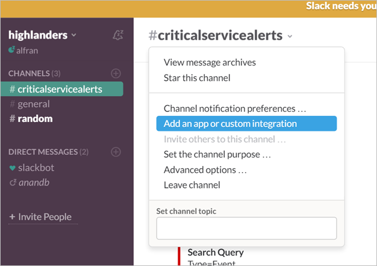
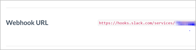

<properties
   pageTitle="Exemple d’alerte webhook journal Analytique"
   description="Une des opérations que vous pouvez exécuter en réponse à une alerte de journal Analytique est un *webhook*, qui permet de vous permet d’appeler un processus externe à une requête HTTP unique. Cet article décrit un exemple de création d’une action webhook une alerte de journal Analytique à l’aide de marge."
   services="log-analytics"
   documentationCenter=""
   authors="bwren"
   manager="jwhit"
   editor="tysonn" />
<tags
   ms.service="log-analytics"
   ms.devlang="na"
   ms.topic="article"
   ms.tgt_pltfrm="na"
   ms.workload="infrastructure-services"
   ms.date="10/27/2016"
   ms.author="bwren" />

# <a name="webhooks-in-log-analytics-alerts"></a>Webhooks dans les alertes de journal Analytique

Une des opérations que vous pouvez exécuter en réponse à une [alerte de journal Analytique](log-analytics-alerts.md) est un *webhook*, qui permet de vous permet d’appeler un processus externe à une requête HTTP unique.  Vous pouvez lire sur les détails des alertes et des webhooks dans [des alertes dans le journal Analytique](log-analytics-alerts.md)

Dans cet article, nous allons un exemple de création d’une action webhook une alerte de journal Analytique à l’aide de marge qui est un service de messagerie.

>[AZURE.NOTE] Vous devez disposer d’un compte de marge pour terminer cet exemple.  Vous pouvez vous inscrire pour obtenir un compte gratuit en [slack.com](http://slack.com).

## <a name="step-1---enable-webhooks-in-slack"></a>Étape 1 : activer webhooks dans la marge
2.  Se connecter à marge en [slack.com](http://slack.com).
3.  Dans la section **canaux** dans le volet gauche, sélectionnez un canal.  Il s’agit du canal que le message sera envoyé à.  Vous pouvez sélectionner un des canaux par défaut tels que **Général** ou **aléatoires**.  Dans un scénario de production, vous créerez probablement un canal spécial tel que **criticalservicealerts**. <br>

    

3. Cliquez sur **Ajouter une application ou service d’intégration personnalisée** pour ouvrir l’annuaire de l’application.
3.  Tapez *webhooks* dans la zone de recherche, puis sélectionnez **WebHooks entrants**. <br>

    

4.  Cliquez sur **installer** en regard du nom de votre équipe.
5.  Cliquez sur **Ajouter une Configuration**.
6.  Sélectionnez le canal que vous allez utiliser pour cet exemple, puis cliquez sur **Ajouter un entrants WebHooks intégration**.  
6. Copiez l' **URL Webhook**.  Vous pouvez coller cette dans la configuration des alertes. <br>

    

## <a name="step-2---create-alert-rule-in-log-analytics"></a>Étape 2 : créer une règle d’alerte dans un journal Analytique
1.  [Créer une règle d’alerte](log-analytics-alerts.md) avec les paramètres suivants.
    - Requête :```    Type=Event EventLevelName=error ```
    - Recherchez cette alerte chaque : 5 minutes
    - Le nombre de résultats est : supérieur à 10
    - Sur cette fenêtre délai : 60 minutes
    - Sélectionnez **Oui** pour **Webhook** et **non** pour les autres actions.
7. Collez l’URL de marge dans le champ **URL Webhook** .
8. Sélectionnez l’option pour **inclure une charge utile JSON personnalisée**.
9. Annuler la marge attend une charge mis en forme en JSON avec un paramètre nommé *texte*.  Il s’agit le texte qu’il affichera dans le message qu’il crée.  Vous pouvez utiliser une ou plusieurs des paramètres d’alerte à l’aide de la *#* tel symbole comme dans l’exemple suivant.

    ```
    {
    "text":"#alertrulename fired with #searchresultcount records which exceeds the over threshold of #thresholdvalue ."
    }
    ```

    

9.  Cliquez sur **Enregistrer** pour enregistrer la règle d’alerte.

10. Patientez suffisamment de temps pour une alerte pour être créé, puis vérifiez la marge pour un message qui sera semblable à ce qui suit.

    


### <a name="advanced-webhook-payload-for-slack"></a>Advanced webhook charge utile de marge

Vous pouvez personnaliser largement les messages entrants avec une marge. Pour plus d’informations, voir [Webhooks entrants](https://api.slack.com/incoming-webhooks) sur le site Web de marge. Voici une charge plus complexe pour créer un message enrichi avec mise en forme :

    {
        "attachments": [
            {
                "title":"OMS Alerts Custom Payload",
                "fields": [
                    {
                        "title": "Alert Rule Name",
                        "value": "#alertrulename"},
                    {
                        "title": "Link To SearchResults",
                        "value": "<#linktosearchresults|OMS Search Results>"},
                    {
                        "title": "Search Interval",
                        "value": "#searchinterval"},
                    {
                        "title": "Threshold Operator",
                        "value": "#thresholdoperator"},
                    {
                        "title": "Threshold Value",
                        "value": "#thresholdvalue"}
                ],
                "color": "#F35A00"
            }
        ]
    }


Cela génère un message dans la marge semblable au suivant.


## <a name="summary"></a>Résumé

Avec cette règle d’alerte en place, vous devez un message envoyé à marge chaque fois que le critère est satisfait.  

Il s’agit qu’un exemple d’une action que vous pouvez créer en réponse à une alerte.  Vous pouvez créer une action webhook qui appelle un autre service externe, une action runbook pour démarrer une procédure opérationnelle dans Azure Automation ou une action de messagerie pour envoyer un message à vous-même ou à d’autres destinataires.   

## <a name="next-steps"></a>Étapes suivantes

- Apprenez-en davantage sur [les alertes dans le journal Analytique](log-analytics-alerts.md) , notamment d’autres actions.
- [Créer procédures opérationnelles dans Azure Automation](../automation/automation-webhooks.md) pouvant être appelé à partir d’un webhook.
