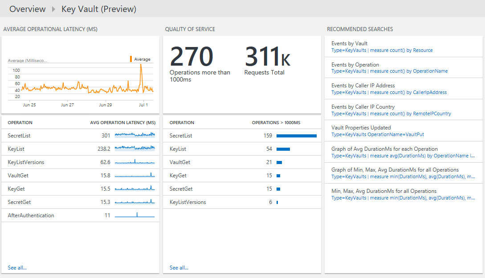

<properties
    pageTitle="Solution de l’archivage sécurisé clé Azure dans journal Analytique | Microsoft Azure"
    description="Vous pouvez utiliser la solution de l’archivage sécurisé de clé Azure dans journal Analytique passer en revue les journaux de l’archivage sécurisé de clé Azure."
    services="log-analytics"
    documentationCenter=""
    authors="richrundmsft"
    manager="jochan"
    editor=""/>

<tags
    ms.service="log-analytics"
    ms.workload="na"
    ms.tgt_pltfrm="na"
    ms.devlang="na"
    ms.topic="article"
    ms.date="07/12/2016"
    ms.author="richrund"/>

# Solution de l’archivage sécurisé clé (Preview) Azure dans journal Analytique

>[AZURE.NOTE] Il s’agit d’une [solution d’aperçu](log-analytics-add-solutions.md#log-analytics-preview-solutions-and-features).

Vous pouvez utiliser la solution de l’archivage sécurisé de clé Azure dans journal Analytique passer en revue les journaux Azure clé l’archivage sécurisé AuditEvent.

Vous pouvez activer la journalisation des événements d’audit pour l’archivage sécurisé de clé Azure. Ces fichiers journaux est écrits sur le stockage d’objets Blob Azure où ils peuvent ensuite être indexées par journal Analytique pour la recherche et analyse.

## Installer et configurer la solution

Suivez les instructions ci-dessous pour installer et configurer la solution de l’archivage sécurisé de Azure clé :

1.  Activer la [journalisation des diagnostics pour l’archivage sécurisé clé de](../key-vault/key-vault-logging.md) ressources que vous souhaitez surveiller
2.  Configurer Analytique journal pour lire les journaux de stockage d’objets blob à l’aide de la procédure décrite dans [les fichiers JSON au stockage d’objets blob](../log-analytics/log-analytics-azure-storage-json.md).
3.  Activer la solution de l’archivage sécurisé de clé Azure à l’aide de la procédure décrite dans [solutions ajouter journal Analytique à partir de la galerie de Solutions](log-analytics-add-solutions.md).  

## Passez en revue l’archivage sécurisé de clé Azure données collection détails

Solution de l’archivage sécurisé clé Azure collecte des journaux de diagnostics depuis le stockage blob Azure pour l’archivage sécurisé de clé Azure.
Aucun agent est requis pour la collecte de données.

Le tableau suivant montre les méthodes de collecte de données et autres informations sur la façon dont les données sont collectées pour l’archivage sécurisé de clé Azure.

| Plateforme | Agent directe | Agent de systèmes Center Operations Manager (SCOM) | Stockage Azure | SCOM obligatoire ? | Données de l’agent SCOM envoyées par groupe d’administration | Fréquence de collection de sites |
|---|---|---|---|---|---|---|
|Azure||||            || 10 minutes|

## Utiliser l’archivage sécurisé clé Azure

Après avoir installé la solution, vous pouvez afficher le résumé de demande statuts au fil du temps pour votre chambres fortes clé analysés à l’aide de **L’archivage sécurisé de clé Azure** vignette dans la page **vue d’ensemble** de journal Analytique.

Après avoir cliqué sur la vignette de **vue d’ensemble** , vous pouvez afficher des récapitulatifs de vos journaux et puis Explorer les détails pour les catégories suivantes :

- Volume de toutes les opérations de l’archivage sécurisé clés au fil du temps
- Échec de volumes opération au fil du temps
- Latence opérationnelle moyenne par opération
- Qualité de service pour les opérations avec le nombre d’opérations qui prennent plus de 1 000 ms et la liste des opérations qui prennent plus de 1 000 ms

### Pour afficher les détails pour toutes les opérations

1. Dans la page **vue d’ensemble** , cliquez sur la vignette de **L’archivage sécurisé de clé Azure** .
2. Dans le tableau de bord de **L’archivage sécurisé de clé Azure** , passez en revue les informations de synthèse dans un des cartes, puis cliquez sur un pour afficher des informations détaillées dans la page de recherche de journal.

    Sur n’importe lequel des pages de recherche de journal, vous pouvez afficher des résultats par heure, les résultats détaillés et votre historique de recherche de journal. Vous pouvez également filtrer par facettes pour limiter les résultats.

## Les enregistrements Analytique de journal

La solution de l’archivage sécurisé de clé Azure analyse les enregistrements qui ont un type de **KeyVaults** qui sont collectées à partir de [AuditEvent journaux](../key-vault/key-vault-logging.md) de diagnostic Azure.  Propriétés de ces enregistrements sont dans le tableau suivant.  

| Propriété | Description |
|:--|:--|
| Type | *KeyVaults* |
| SourceSystem | *AzureStorage* |
| CallerIpAddress | Adresse IP du client qui a effectué la demande |
| Catégorie      | Pour les journaux de l’archivage sécurisé clé, AuditEvent est la valeur unique et disponible.|
| ID de corrélation | GUID facultatif qui peut s’écouler le client pour faire correspondre les journaux côté client avec les journaux côté service (touche l’archivage sécurisé). |
| DurationMs | Durée que nécessaire pour répondre à la demande de l’API REST, en millisecondes. Cela n’inclut pas de latence du réseau, afin que l’heure à laquelle vous mesurez côté client peut-être correspondent pas à ce stade. |
| HttpStatusCode_d | Code d’état HTTP retourné par la demande |
| Id_s       | Nº unique de la demande |
| Identity_o | Identité à partir du jeton qui a été présentée lors de la demande de l’API REST. Il s’agit généralement un « utilisateurs », « principal de service » ou une combinaison « utilisateur + identificateur » comme dans le cas d’une requête qui résulte de l’une applet de commande PowerShell Azure. |
| NomOpération      | Nom de l’opération, comme indiqué dans [La journalisation de l’archivage sécurisé de clé Azure](../key-vault/key-vault-logging.md)|
| OperationVersion      | Version de l’API REST demandée par le client|
| RemoteIPLatitude | Latitude du client qui a effectué la demande |
| RemoteIPLongitude | Longitude du client qui a effectué la demande |
| RemoteIPCountry | Pays du client qui a effectué la demande  |
| RequestUri_s | URI de la requête |
| Ressource   | Nom de l’archivage sécurisé clé |
| ResourceGroup | Groupe de ressources de l’archivage sécurisé clé |
| ResourceId | ID de Azure ressource Gestionnaire de ressources. Pour les journaux de l’archivage sécurisé clé, il s’agit toujours l’ID de ressource clé l’archivage sécurisé. |
| ResourceProvider | *MICROSOFT. KEYVAULT* |
| ResultSignature  | État HTTP|
| ResultType      | Résultat de la demande de l’API REST|
| SubscriptionId | ID de l’abonnement Azure de l’abonnement contenant l’archivage sécurisé clé |

## Étapes suivantes

- [Recherches de journaux dans journal Analytique](log-analytics-log-searches.md) permet d’afficher des données de l’archivage sécurisé de clé Azure détaillées.
