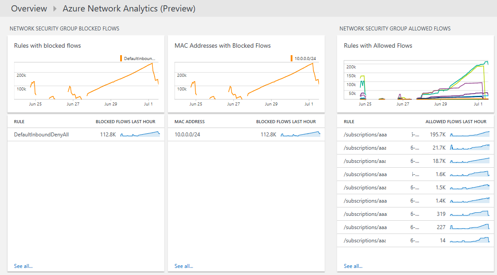

<properties
    pageTitle="Solution de mise en réseau Analytique Azure dans journal Analytique | Microsoft Azure"
    description="Vous pouvez utiliser la solution Azure réseau Analytique dans journal Analytique passer en revue les journaux de groupe sécurité réseau Azure et de passerelle d’Application Azure."
    services="log-analytics"
    documentationCenter=""
    authors="richrundmsft"
    manager="jochan"
    editor=""/>

<tags
    ms.service="log-analytics"
    ms.workload="na"
    ms.tgt_pltfrm="na"
    ms.devlang="na"
    ms.topic="article"
    ms.date="07/05/2016"
    ms.author="richrund"/>

# Solution de mise en réseau Analytique (Preview) Azure dans journal Analytique

>[AZURE.NOTE] Il s’agit d’une [solution d’aperçu](log-analytics-add-solutions.md#log-analytics-preview-solutions-and-features).

Vous pouvez utiliser la solution Azure réseau Analytique dans journal Analytique passer en revue les journaux de passerelle d’Application Azure et les journaux du groupe de sécurité réseau Azure.

Vous pouvez activer la journalisation pour les journaux de passerelle d’Application Azure et les groupes de sécurité réseau Azure. Ces fichiers journaux est écrits sur où ils peuvent ensuite être indexées par journal Analytique pour la recherche et analyse de stockage Blob.

Les fichiers journaux suivants sont pris en charge pour les passerelles d’Application :

+ ApplicationGatewayAccessLog
+ ApplicationGatewayPerformanceLog

Les fichiers journaux suivants sont pris en charge pour les groupes de sécurité réseau :

+ NetworkSecurityGroupEvent
+ NetworkSecurityGroupRuleCounter

## Installer et configurer la solution

Suivez les instructions ci-dessous pour installer et configurer la solution Azure réseau Analytique :

1.  Activer la journalisation des diagnostics pour les ressources que vous voulez analyser :
  + [Passerelle d’application](../application-gateway/application-gateway-diagnostics.md)
  + [Groupe de sécurité réseau](../virtual-network/virtual-network-nsg-manage-log.md)
2.  Configurer Analytique journal pour lire les journaux de stockage d’objets Blob à l’aide de la procédure décrite dans [les fichiers JSON au stockage d’objets blob](../log-analytics/log-analytics-azure-storage-json.md).
3.  Activer la solution Azure réseau Analytique à l’aide de la procédure décrite dans [solutions ajouter journal Analytique à partir de la galerie de Solutions](log-analytics-add-solutions.md).  

Si vous n’activez pas la journalisation des diagnostics pour un type de ressource particulier, les cartes de tableau de bord pour cette ressource sera vides.

## Passez en revue les détails de collection de données Azure réseau Analytique

La solution Azure réseau Analytique collecte des journaux de diagnostics depuis le stockage Blob Azure pour Azure Application passerelles et des groupes de sécurité réseau.
Aucun agent est requis pour la collecte de données.

Le tableau suivant montre les méthodes de collecte de données et autres informations sur la façon dont les données sont collectées pour Azure réseau Analytique.

| Plateforme | Agent directe | Agent de systèmes Center Operations Manager (SCOM) | Stockage Azure | SCOM obligatoire ? | Données de l’agent SCOM envoyées par groupe d’administration | Fréquence de collection de sites |
|---|---|---|---|---|---|---|
|Azure||||            || 10 minutes|

## Utiliser Azure Analytique de mise en réseau

Après avoir installé la solution, vous pouvez afficher le résumé du client et erreurs du serveur pour votre contrôlée passerelles d’Application à l’aide de **Azure réseau Analytique** vignette sur la page **vue d’ensemble** de journal Analytique.

Après avoir cliqué sur la vignette de **vue d’ensemble** , vous pouvez afficher des récapitulatifs de vos journaux et puis Explorer les détails pour les catégories suivantes :

+ Ouvre une application passerelle Access
  - Erreurs client et serveur pour les journaux de passerelle d’Application access
  - Demandes par heure pour chaque Application Gateway
  - Échec de requêtes par heure pour chaque Application Gateway
  - Erreurs par agent utilisateur de passerelles d’Application
+ Performances de la passerelle application
  - Santé hôte pour passerelle d’Application
  - Maximale et 95ème centile pour les demandes d’Application passerelle a échoué
+ Groupe de sécurité réseau bloqué flux
  - Règles de groupe de sécurité réseau avec des flux bloqués
  - Adresses MAC avec des flux bloqués
+ Groupe de sécurité réseau autorisé flux
  - Règles de groupe de sécurité réseau avec des flux autorisés
  - Adresses MAC avec des flux autorisés

### Pour afficher les détails pour un résumé des journaux

1. Dans la page **vue d’ensemble** , cliquez sur la vignette **Azure réseau Analytique** .
2. Dans le tableau de bord **Azure réseau Analytique** , passez en revue les informations de synthèse dans un des cartes, puis cliquez sur un pour afficher des informations détaillées dans la page de recherche de journal.

    Sur n’importe lequel des pages de recherche de journal, vous pouvez afficher des résultats par heure, les résultats détaillés et votre historique de recherche de journal. Vous pouvez également filtrer par facettes pour limiter les résultats.

## Étapes suivantes

- [Recherches de journaux dans journal Analytique](log-analytics-log-searches.md) permet d’afficher des données Azure réseau Analytique détaillées.
