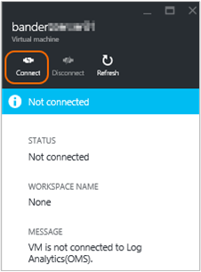

<properties
    pageTitle="Se connecter Azure machines virtuelles à journal Analytique | Microsoft Azure"
    description="Pour Windows et Linux machines virtuelles en cours d’exécution dans Azure, il est recommandé de collecter les journaux et les mesures en installant l’extension journal Analytique Azure machine virtuelle. Vous pouvez utiliser le portail Azure ou PowerShell pour installer l’extension de la machine virtuelle journal Analytique sur machines virtuelles Azure."
    services="log-analytics"
    documentationCenter=""
    authors="richrundmsft"
    manager="jochan"
    editor=""/>

<tags
    ms.service="log-analytics"
    ms.workload="na"
    ms.tgt_pltfrm="na"
    ms.devlang="na"
    ms.topic="article"
    ms.date="10/10/2016"
    ms.author="richrund"/>

# <a name="connect-azure-virtual-machines-to-log-analytics"></a>Se connecter Azure machines virtuelles à Analytique de journal

Pour les ordinateurs Windows et Linux, la méthode recommandée pour la collecte des journaux et indicateurs est en installant l’agent de journal Analytique.

Installer l’agent de journal Analytique sur Azure machines virtuelles le moyen le plus simple consiste à utiliser l’Extension journal Analytique machine virtuelle.  À l’aide de l’extension simplifie le processus d’installation et configure automatiquement l’agent pour envoyer des données à l’espace de travail Analytique journal que vous spécifiez. L’agent est également mis à niveau automatiquement, assurer d’avoir les dernières fonctionnalités et correctifs.

Pour les machines virtuelles Windows, vous activez l’extension de machine virtuelle *Agent de surveillance Microsoft* .
Pour les machines virtuelles Linux, vous activez l’extension de machine virtuelle *OMS Agent pour Linux* .

En savoir plus sur le [agent Linux] et [extensions de machine virtuelle Azure](../virtual-machines/virtual-machines-windows-extensions-features.md) (… / virtual-machines/virtual-machines-linux-agent-user-guide.md).

Lorsque vous utilisez collection basée sur agent pour les données du journal, vous devez configurer les [sources de données dans le journal Analytique](log-analytics-data-sources.md) pour spécifier les journaux et les mesures que vous souhaitez collecter.

>[AZURE.IMPORTANT] Si vous configurez Analytique journal d’indexer des données journal à l’aide des [diagnostics de Windows Azure](log-analytics-azure-storage.md), et vous configurez l’agent pour collecter les journaux de mêmes, les journaux sont collectées à deux reprises. Vous êtes chargé de deux sources de données. Si vous avez l’agent installé, puis vous devez rassembler des données du journal à l’aide de l’agent uniquement - ne configurez pas Analytique journal pour collecter les données des journaux de diagnostics de Windows Azure.

Il existe trois méthodes simples pour activer l’extension de machine virtuelle journal Analytique :

+ À l’aide du portail Azure
+ À l’aide de PowerShell Azure
+ À l’aide d’un modèle de gestionnaire de ressources Azure

## <a name="enable-the-vm-extension-in-the-azure-portal"></a>Activer l’extension de la mémoire virtuelle dans le portail Azure

Vous pouvez installer l’agent de journal Analytique et connecter la machine virtuelle Azure lequel il s’exécute à l’aide du [portail Azure](https://portal.azure.com).

### <a name="to-install-the-log-analytics-agent-and-connect-the-virtual-machine-to-a-log-analytics-workspace"></a>Pour installer l’agent de journal Analytique et vous connecter la machine virtuelle dans un espace de travail Analytique de journal

1.  Se connecter au [portail Azure](http://portal.azure.com).
2.  Sélectionnez **Parcourir** sur le côté gauche du portail, puis accédez au **Journal Analytique (OMS)** et sélectionnez-le.
3.  Dans votre liste d’espaces de travail journal Analytique, sélectionnez celui que vous voulez utiliser avec la machine virtuelle Azure.  
    
4.  Sous **gestion du journal analytique**, sélectionnez **machines virtuelles**.  
    
5.  Dans la liste des **machines virtuelles**, sélectionnez la machine virtuelle sur lequel vous voulez installer l’agent. L' **état de connexion OMS** de la machine virtuelle indique qu’il n’est **pas connecté**.  
    
6.  Dans les détails de votre machine virtuelle, sélectionnez **se connecter**. L’agent est automatiquement installé et configuré pour votre espace de travail journal Analytique. Ce processus peut prendre quelques minutes, au cours de laquelle l’état de connexion OMS est *connexion en cours...*  
    
7.  Après avoir installé et vous connecter à l’agent, l’état de **connexion OMS** est mise à jour pour afficher **cet espace de travail**.  
    


## <a name="enable-the-vm-extension-using-powershell"></a>Activer l’extension machine virtuelle à l’aide de PowerShell

Il existe différentes commandes pour Azure machines virtuelles classiques et machines virtuelles Gestionnaire de ressources. Voici des exemples de classique et machines virtuelles du Gestionnaire de ressources.

Pour les machines virtuelles classiques, utilisez l’exemple de PowerShell suivant :

```
Add-AzureAccount

$workspaceId = "enter workspace ID here"
$workspaceKey = "enter workspace key here"
$hostedService = "enter hosted service here"

$vm = Get-AzureVM –ServiceName $hostedService

# For Windows VM uncomment the following line
# Set-AzureVMExtension -VM $vm -Publisher 'Microsoft.EnterpriseCloud.Monitoring' -ExtensionName 'MicrosoftMonitoringAgent' -Version '1.*' -PublicConfiguration "{'workspaceId': '$workspaceId'}" -PrivateConfiguration "{'workspaceKey': '$workspaceKey' }" | Update-AzureVM -Verbose

# For Linux VM uncomment the following line
# Set-AzureVMExtension -VM $vm -Publisher 'Microsoft.EnterpriseCloud.Monitoring' -ExtensionName 'OmsAgentForLinux' -Version '1.*' -PublicConfiguration "{'workspaceId': '$workspaceId'}" -PrivateConfiguration "{'workspaceKey': '$workspaceKey' }" | Update-AzureVM -Verbose
```

Pour les machines virtuelles Gestionnaire de ressources, utilisez l’exemple de PowerShell suivant :

```
Login-AzureRMAccount
Select-AzureSubscription -SubscriptionId "**"

$workspaceName = "your workspace name"
$VMresourcegroup = "**"
$VMresourcename = "**"

$workspace = (Get-AzureRmOperationalInsightsWorkspace).Where({$_.Name -eq $workspaceName})

if ($workspace.Name -ne $workspaceName)
{
    Write-Error "Unable to find OMS Workspace $workspaceName. Do you need to run Select-AzureRMSubscription?"
}

$workspaceId = $workspace.CustomerId
$workspaceKey = (Get-AzureRmOperationalInsightsWorkspaceSharedKeys -ResourceGroupName $workspace.ResourceGroupName -Name $workspace.Name).PrimarySharedKey

$vm = Get-AzureRmVM -ResourceGroupName $VMresourcegroup -Name $VMresourcename
$location = $vm.Location

# For Windows VM uncomment the following line
# Set-AzureRmVMExtension -ResourceGroupName $VMresourcegroup -VMName $VMresourcename -Name 'MicrosoftMonitoringAgent' -Publisher 'Microsoft.EnterpriseCloud.Monitoring' -ExtensionType 'MicrosoftMonitoringAgent' -TypeHandlerVersion '1.0' -Location $location -SettingString "{'workspaceId': '$workspaceId'}" -ProtectedSettingString "{'workspaceKey': '$workspaceKey'}"

# For Linux VM uncomment the following line
# Set-AzureRmVMExtension -ResourceGroupName $VMresourcegroup -VMName $VMresourcename -Name 'OmsAgentForLinux' -Publisher 'Microsoft.EnterpriseCloud.Monitoring' -ExtensionType 'OmsAgentForLinux' -TypeHandlerVersion '1.0' -Location $location -SettingString "{'workspaceId': '$workspaceId'}" -ProtectedSettingString "{'workspaceKey': '$workspaceKey'}"


```
Lorsque vous configurez votre machine virtuelle à l’aide de PowerShell, vous devez fournir les **ID de l’espace de travail** et la **Clé primaire**. Vous pouvez trouver l’Id et la clé dans la page **paramètres** du portail OMS ou à l’aide de PowerShell comme le montre l’exemple précédent.


## <a name="deploy-the-vm-extension-using-a-template"></a>Déploiement de l’extension de la mémoire virtuelle à l’aide d’un modèle

En utilisant le Gestionnaire de ressources Azure, vous pouvez créer un modèle simple (au format JSON) qui définit le déploiement et la configuration de votre application. Ce modèle est appelé un modèle de gestionnaire de ressources et fournit déclarative pour définir le déploiement. En utilisant un modèle, vous pouvez à plusieurs reprises déployer votre application dans l’ensemble du cycle de vie d’application et avoir confiance que vos ressources sont déployées dans un état cohérent.

Dans le cadre de votre modèle de gestionnaire de ressources, y compris l’agent de journal Analytique, vous pouvez de garantir que chaque machine virtuelle est préconfigurée de manière à signaler à votre espace de travail journal Analytique.

Pour plus d’informations sur les modèles de gestionnaire de ressources, voir [Gestionnaire de ressources Azure de création de modèles](../resource-group-authoring-templates.md).

Voici un exemple d’un modèle de gestionnaire de ressources qui est utilisé pour le déploiement d’une machine virtuelle exécutant Windows avec l’extension de l’Agent de surveillance Microsoft installée. Ce modèle est un modèle de type machine virtuelle, avec les ajouts suivants :

+ paramètres workspaceId et workspaceName
+ Section d’extension Microsoft.EnterpriseCloud.Monitoring ressource
+ Sorties pour rechercher la workspaceId et workspaceSharedKey


```
{
  "$schema": "https://schema.management.azure.com/schemas/2015-01-01/deploymentTemplate.json#",
  "contentVersion": "1.0.0.0",
  "parameters": {
    "adminUsername": {
      "type": "string",
      "metadata": {
        "description": "Username for the Virtual Machine."
      }
    },
    "adminPassword": {
      "type": "securestring",
      "metadata": {
        "description": "Password for the Virtual Machine."
      }
    },
    "dnsLabelPrefix": {
       "type": "string",
       "metadata": {
          "description": "DNS Label for the Public IP. Must be lowercase. It should match with the following regular expression: ^[a-z][a-z0-9-]{1,61}[a-z0-9]$ or it will raise an error."
       }
    },
    "workspaceId": {
      "type": "string",
      "metadata": {
        "description": "OMS workspace ID"
      }
    },
    "workspaceName": {
      "type": "string",
      "metadata": {
         "description": "OMD workspace name"
      }
    },
    "windowsOSVersion": {
      "type": "string",
      "defaultValue": "2012-R2-Datacenter",
      "allowedValues": [
        "2008-R2-SP1",
        "2012-Datacenter",
        "2012-R2-Datacenter",
        "Windows-Server-Technical-Preview"
      ],
      "metadata": {
        "description": "The Windows version for the VM. This will pick a fully patched image of this given Windows version. Allowed values: 2008-R2-SP1, 2012-Datacenter, 2012-R2-Datacenter, Windows-Server-Technical-Preview."
      }
    }
  },
  "variables": {
    "storageAccountName": "[concat(uniquestring(resourceGroup().id), 'standardsa')]",
    "apiVersion": "2015-06-15",
    "imagePublisher": "MicrosoftWindowsServer",
    "imageOffer": "WindowsServer",
    "OSDiskName": "osdiskforwindowssimple",
    "nicName": "myVMNic",
    "addressPrefix": "10.0.0.0/16",
    "subnetName": "Subnet",
    "subnetPrefix": "10.0.0.0/24",
    "storageAccountType": "Standard_LRS",
    "publicIPAddressName": "myPublicIP",
    "publicIPAddressType": "Dynamic",
    "vmStorageAccountContainerName": "vhds",
    "vmName": "MyWindowsVM",
    "vmSize": "Standard_DS1",
    "virtualNetworkName": "MyVNET",
    "resourceId": "[resourceGroup().id]",
    "vnetID": "[resourceId('Microsoft.Network/virtualNetworks',variables('virtualNetworkName'))]",
    "subnetRef": "[concat(variables('vnetID'),'/subnets/',variables('subnetName'))]"
  },
  "resources": [
    {
      "type": "Microsoft.Storage/storageAccounts",
      "name": "[variables('storageAccountName')]",
      "apiVersion": "[variables('apiVersion')]",
      "location": "[resourceGroup().location]",
      "properties": {
        "accountType": "[variables('storageAccountType')]"
      }
    },
    {
      "apiVersion": "[variables('apiVersion')]",
      "type": "Microsoft.Network/publicIPAddresses",
      "name": "[variables('publicIPAddressName')]",
      "location": "[resourceGroup().location]",
      "properties": {
        "publicIPAllocationMethod": "[variables('publicIPAddressType')]",
        "dnsSettings": {
          "domainNameLabel": "[parameters('dnsLabelPrefix')]"
        }
      }
    },
    {
      "apiVersion": "[variables('apiVersion')]",
      "type": "Microsoft.Network/virtualNetworks",
      "name": "[variables('virtualNetworkName')]",
      "location": "[resourceGroup().location]",
      "properties": {
        "addressSpace": {
          "addressPrefixes": [
            "[variables('addressPrefix')]"
          ]
        },
        "subnets": [
          {
            "name": "[variables('subnetName')]",
            "properties": {
              "addressPrefix": "[variables('subnetPrefix')]"
            }
          }
        ]
      }
    },
    {
      "apiVersion": "[variables('apiVersion')]",
      "type": "Microsoft.Network/networkInterfaces",
      "name": "[variables('nicName')]",
      "location": "[resourceGroup().location]",
      "dependsOn": [
        "[concat('Microsoft.Network/publicIPAddresses/', variables('publicIPAddressName'))]",
        "[concat('Microsoft.Network/virtualNetworks/', variables('virtualNetworkName'))]"
      ],
      "properties": {
        "ipConfigurations": [
          {
            "name": "ipconfig1",
            "properties": {
              "privateIPAllocationMethod": "Dynamic",
              "publicIPAddress": {
                "id": "[resourceId('Microsoft.Network/publicIPAddresses',variables('publicIPAddressName'))]"
              },
              "subnet": {
                "id": "[variables('subnetRef')]"
              }
            }
          }
        ]
      }
    },
    {
      "apiVersion": "2015-06-15",
      "type": "Microsoft.Compute/virtualMachines",
      "name": "[variables('vmName')]",
      "location": "[resourceGroup().location]",
      "dependsOn": [
        "[concat('Microsoft.Storage/storageAccounts/', variables('storageAccountName'))]",
        "[concat('Microsoft.Network/networkInterfaces/', variables('nicName'))]"
      ],
      "properties": {
        "hardwareProfile": {
          "vmSize": "[variables('vmSize')]"
        },
        "osProfile": {
          "computername": "[variables('vmName')]",
          "adminUsername": "[parameters('adminUsername')]",
          "adminPassword": "[parameters('adminPassword')]"
        },
        "storageProfile": {
          "imageReference": {
            "publisher": "[variables('imagePublisher')]",
            "offer": "[variables('imageOffer')]",
            "sku": "[parameters('windowsOSVersion')]",
            "version": "latest"
          },
          "osDisk": {
            "name": "osdisk",
            "vhd": {
              "uri": "[concat('http://',variables('storageAccountName'),'.blob.core.windows.net/',variables('vmStorageAccountContainerName'),'/',variables('OSDiskName'),'.vhd')]"
            },
            "caching": "ReadWrite",
            "createOption": "FromImage"
          }
        },
        "networkProfile": {
          "networkInterfaces": [
            {
              "id": "[resourceId('Microsoft.Network/networkInterfaces',variables('nicName'))]"
            }
          ]
        },
        "diagnosticsProfile": {
          "bootDiagnostics": {
             "enabled": "true",
             "storageUri": "[concat('http://',variables('storageAccountName'),'.blob.core.windows.net')]"
          }
        }
      },
      "resources": [
        {
          "type": "extensions",
          "name": "Microsoft.EnterpriseCloud.Monitoring",
          "apiVersion": "[variables('apiVersion')]",
          "location": "[resourceGroup().location]",
          "dependsOn": [
            "[concat('Microsoft.Compute/virtualMachines/', variables('vmName'))]"
          ],
          "properties": {
            "publisher": "Microsoft.EnterpriseCloud.Monitoring",
            "type": "MicrosoftMonitoringAgent",
            "typeHandlerVersion": "1.0",
            "autoUpgradeMinorVersion": true,
            "settings": {
              "workspaceId": "[parameters('workspaceId')]"
            },
            "protectedSettings": {
              "workspaceKey": "[listKeys(resourceId('Microsoft.OperationalInsights/workspaces', parameters('workspaceName')), '2015-03-20').primarySharedKey]"
            }
          }
        }
      ]
    }
  ],
  "outputs": {
      "sharedKeyOutput": {
         "value": "[listKeys(resourceId('Microsoft.OperationalInsights/workspaces/', parameters('workspaceName')), '2015-03-20').primarySharedKey]",
         "type": "string"
      },
      "workspaceIdOutput": {
         "value": "[reference(concat('Microsoft.OperationalInsights/workspaces/', parameters('workspaceName')), '2015-03-20').customerId]",
        "type" : "string"
      }
  }
}
```

Vous pouvez déployer un modèle à l’aide de la commande PowerShell suivante :

```
New-AzureRmResourceGroupDeployment -ResourceGroupName $resourceGroupName -TemplateFile $templateFilePath
```

## <a name="troubleshooting-windows-virtual-machines"></a>Résolution des problèmes de Machines virtuelles Windows

Si l’extension de l’agent de machine virtuelle *Microsoft Agent de surveillance* n’est pas installer ou création de rapports, vous pouvez effectuer les étapes suivantes pour résoudre le problème.

1. Vérifier si l’agent machine virtuelle Azure est installé et fonctionner correctement en suivant les étapes de [base de connaissances 2965986](https://support.microsoft.com/kb/2965986#mt1).
  + Vous pouvez également examiner le fichier journal machine virtuelle`C:\WindowsAzure\logs\WaAppAgent.log`
  + Si le journal n’existe pas, l’agent machine virtuelle n’est pas installé.
    - [Installer l’Agent de machine virtuelle Azure sur machines virtuelles classiques](../virtual-machines/virtual-machines-windows-classic-agents-and-extensions.md)
2. Confirmez que la tâche Agent de surveillance Microsoft extension pulsation fonctionne comme suit :
  + Se connecter à la machine virtuelle
  + Ouvrez le Planificateur de tâches et recherchez le `update_azureoperationalinsight_agent_heartbeat` tâche
  + Vérifiez que la tâche est activée et s’exécute chaque minute
  + Archiver le fichier journal pulsation`C:\WindowsAzure\Logs\Plugins\Microsoft.EnterpriseCloud.Monitoring.MicrosoftMonitoringAgent\heartbeat.log`
3. Examinez les fichiers Microsoft surveillance Agent virtuelle extension journaux dans`C:\Packages\Plugins\Microsoft.EnterpriseCloud.Monitoring.MicrosoftMonitoringAgent`
3. Assurer que la machine virtuelle peut exécuter des scripts PowerShell
4. Vérifier les autorisations sur C:\Windows\temp n’ayant pas été modifiées
5. Afficher l’état de l’Agent de surveillance Microsoft en tapant ce qui suit dans une fenêtre PowerShell élevée sur l’ordinateur virtuel`  (New-Object -ComObject 'AgentConfigManager.MgmtSvcCfg').GetCloudWorkspaces() | Format-List`
6. Examinez les fichiers de journaux de configuration Microsoft Agent de surveillance dans`C:\Windows\System32\config\systemprofile\AppData\Local\SCOM\Logs`

Pour plus d’informations, reportez-vous à la [résolution des problèmes d’extensions de Windows](../virtual-machines/virtual-machines-windows-extensions-troubleshoot.md).

## <a name="troubleshooting-linux-virtual-machines"></a>Machines virtuelles Linux de résolution des problèmes

Si l’extension de l’agent machine virtuelle *Agent OMS pour Linux* n’est pas l’installation ou création de rapports, vous pouvez effectuer les étapes suivantes pour résoudre le problème.

1. Si le statut de l’extension est *inconnue* cases à cocher si l’agent machine virtuelle Azure est installé et fonctionner correctement en consultant le fichier journal machine virtuelle`/var/log/waagent.log`
  + Si le journal n’existe pas, l’agent machine virtuelle n’est pas installé.
  - [Installer l’Agent machine virtuelle Azure sur machines virtuelles Linux](../virtual-machines/virtual-machines-linux-agent-user-guide.md)
2. Pour les autres États incorrectes, passez en revue l’Agent OMS pour extension Linux VM les fichiers journaux `/var/log/azure/Microsoft.EnterpriseCloud.Monitoring.OmsAgentForLinux/*/extension.log` et`/var/log/azure/Microsoft.EnterpriseCloud.Monitoring.OmsAgentForLinux/*/CommandExecution.log`
3. Si le statut de l’extension fonctionne correctement, mais les données ne sont pas téléchargées passer en revue l’Agent OMS pour les fichiers journaux Linux dans`/var/opt/microsoft/omsagent/log/omsagent.log`

Pour plus d’informations, reportez-vous à la [résolution des problèmes d’extensions Linux](../virtual-machines/virtual-machines-linux-extensions-troubleshoot.md).


## <a name="next-steps"></a>Étapes suivantes

+ Configurer des [sources de données dans le journal Analytique](log-analytics-data-sources.md) pour spécifier les journaux et les mesures pour la collecte.
+ Pour collecter les données sur virtual machines [solutions ajouter journal Analytique à partir de la galerie de Solutions](log-analytics-add-solutions.md).
+ [Collecter les données à l’aide des Diagnostics Azure](log-analytics-azure-storage.md) pour d’autres ressources qui s’exécutent dans Azure.

Pour les ordinateurs qui ne sont pas dans Azure, vous pouvez installer l’agent de journal Analytique en utilisant les méthodes sont décrites dans les articles suivants :

+ [Connecter des ordinateurs Windows à Analytique de journal](log-analytics-windows-agents.md)
+ [Connecter des ordinateurs Linux au journal Analytique](log-analytics-linux-agents.md)
