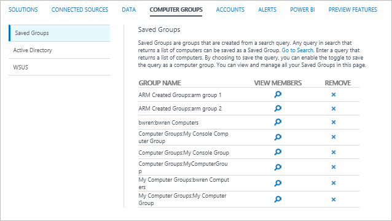

<properties
    pageTitle="Groupes d’ordinateurs de journal Analytique se recherches | Microsoft Azure"
    description="Groupes d’ordinateurs de journal Analytique permettent aux recherches de journal portée à un ensemble spécifique d’ordinateurs.  Cet article décrit les différentes méthodes que vous pouvez utiliser pour créer des groupes d’ordinateurs et comment les utiliser dans une recherche."
    services="log-analytics"
    documentationCenter=""
    authors="bwren"
    manager="jwhit"
    editor=""/>

<tags
    ms.service="log-analytics"
    ms.workload="na"
    ms.tgt_pltfrm="na"
    ms.devlang="na"
    ms.topic="article"
    ms.date="09/06/2016"
    ms.author="bwren"/>

# Groupes d’ordinateurs de journal Analytique se recherches
Groupes d’ordinateurs de journal Analytique vous permettent de portée [se recherches](log-analytics-log-searches.md) à un ensemble spécifique d’ordinateurs.  Chaque groupe est rempli avec ordinateurs soit à l’aide d’une requête que vous définissez ou en important des groupes de différentes sources.  Lorsque le groupe est inclus dans une recherche, les résultats sont limités aux enregistrements qui remplissent les ordinateurs dans le groupe.

## Création d’un groupe d’ordinateurs
Vous pouvez créer un groupe d’ordinateurs dans journal Analytique à l’aide d’une des méthodes dans le tableau suivant.  Plus d’informations sur chaque méthode sont fournies dans les sections ci-dessous. 

| Méthode | Description |
|:---|:---|
| Recherche des journaux       | Créer une recherche de journal qui renvoie une liste des ordinateurs et enregistrer les résultats dans un groupe d’ordinateurs. |
| Ouvrez une session API de recherche   | Utiliser l’API de recherche de journal pour créer par programme un groupe d’ordinateurs basé sur les résultats d’une recherche de journal. |
| Active Directory | Analyse automatiquement l’appartenance aux groupes de tous les ordinateurs agent qui font partie d’un domaine Active Directory et créer un groupe dans Analytique journal pour chaque groupe de sécurité.
| WSUS              | Numériser des serveurs WSUS ou clients afin de cibler les groupes et créer un groupe dans Analytique journal pour chaque automatiquement. |

### Recherche des journaux

Groupes d’ordinateurs créés à partir d’une recherche de journal contiendra tous les ordinateurs renvoyées par une requête de recherche que vous définissez.  Cette requête est exécutée chaque fois que le groupe d’ordinateurs est utilisé afin que toutes les modifications depuis le groupe création seront reflétées.

Utilisez la procédure suivante pour créer un groupe d’ordinateurs à partir d’une recherche de journal.

1. [Créer une recherche de journal](log-analytics-log-searches.md) qui renvoie une liste des ordinateurs.  La recherche doit renvoyer un ensemble distinct d’ordinateurs à l’aide de quelque chose comme **Ordinateur Distinct** ou **Nb() mesure par ordinateur** dans la requête.  
2. Cliquez sur le bouton **Enregistrer** dans la partie supérieure de l’écran.
3. Sélectionnez **Oui** pour **enregistrez cette requête sous un groupe d’ordinateurs :**.
4. Tapez un **nom** et une **catégorie** pour le groupe.  S’il existe déjà une recherche avec le même nom et catégorie, puis vous devrez remplacer.  Vous pouvez avoir plusieurs recherches portant le même nom dans différentes catégories. 

Voici des recherches exemple que vous pouvez enregistrer en tant qu’un groupe d’ordinateurs.

    Computer="Computer1" OR Computer="Computer2" | distinct Computer 
    Computer=*srv* | measure count() by Computer

### Ouvrez une session API de recherche

Groupes d’ordinateurs créés avec l’API de recherche de journal sont les mêmes que recherches créées avec un journal de la recherche.

Pour plus d’informations sur la création d’un groupe d’ordinateurs à l’aide de l’API de recherche de journal voir [groupes d’ordinateurs de journal Analytique se API REST de recherche](log-analytics-log-search-api.md#computer-groups).

### Active Directory

Lorsque vous configurez Analytique journal pour importer les appartenances à un groupe Active Directory, il analysera l’appartenance aux groupes de tous les ordinateurs avec l’agent OMS joint au domaine.  Un groupe d’ordinateurs est créé dans Analytique journal pour chaque groupe de sécurité dans Active Directory et chaque ordinateur est ajouté aux groupes d’ordinateurs correspondant aux groupes de sécurité que dont ils sont membres.  Cet abonnement est à jour en permanence toutes les 4 heures.  

Vous configurez Analytique journal pour importer des groupes de sécurité Active Directory dans le menu de **Groupes d’ordinateurs** de journal Analytique **paramètres**.  Sélectionnez **automatisation** , puis **appartenances Active Directory importer à partir d’ordinateurs**.  Il n’existe aucune autre configuration requise.

Lorsque les groupes ont été importées, le menu indique le nombre d’ordinateurs avec l’appartenance aux groupes détectées et le nombre de groupes importés.  Vous pouvez cliquer sur un de ces liens pour renvoyer les enregistrements **ComputerGroup tant** avec ces informations.

### Service de mise à jour Windows Server

Lorsque vous configurez Analytique journal pour importer les appartenances WSUS, il analysera l’appartenance aux groupes ciblage de tous les ordinateurs avec l’agent OMS.  Si vous utilisez côté client cible, n’importe quel ordinateur connecté à OMS et qui fait partie d’un WSUS ciblage groupes aura son appartenance au groupe importé dans journal Analytique. Si vous utilisez côté serveur ciblage, l’OMS agent doit être installé sur le serveur WSUS afin que les informations d’appartenance être importées sur OMS.  Cet abonnement est à jour en permanence toutes les 4 heures. 

Vous configurez Analytique journal pour importer des groupes de sécurité Active Directory dans le menu de **Groupes d’ordinateurs** de journal Analytique **paramètres**.  Sélectionnez **Active Directory** , puis **appartenances Active Directory importer à partir d’ordinateurs**.  Il n’existe aucune autre configuration requise.

Lorsque les groupes ont été importées, le menu indique le nombre d’ordinateurs avec l’appartenance aux groupes détectées et le nombre de groupes importés.  Vous pouvez cliquer sur un de ces liens pour renvoyer les enregistrements **ComputerGroup tant** avec ces informations.

## Gestion des groupes d’ordinateurs

Vous pouvez afficher les groupes d’ordinateurs qui ont été créés à partir d’une recherche de journal ou de l’API de recherche de journal dans le menu de **Groupes d’ordinateurs** de journal Analytique **paramètres**.  Cliquez sur le **x** dans la colonne **Supprimer** pour supprimer le groupe d’ordinateurs.  Cliquez sur l’icône **Afficher les membres** d’un groupe à exécuter recherche des journaux du groupe renvoyant ses membres. 

Pour modifier le groupe, créez un groupe avec même **catégorie** et un **nom** pour remplacer le groupe d’origine.

## À l’aide d’un groupe d’ordinateurs dans une recherche de journal
Vous utilisez la syntaxe suivante pour faire référence à un groupe d’ordinateurs dans une recherche.  Spécifier que la **catégorie** est facultatif et uniquement obligatoire si vous avez des groupes d’ordinateurs portant le même nom dans différentes catégories. 

    $ComputerGroups[Category: Name]

Lorsqu’une recherche est exécutée, les membres des groupes ordinateur inclus dans la recherche sont tout d’abord résolus.  Si le groupe est basé sur une recherche de journal, alors que la recherche s’exécute pour renvoyer les membres du groupe avant d’effectuer la recherche de journal de niveau supérieur.

Groupes d’ordinateurs sont généralement utilisés avec la clause **IN** dans les journaux comme dans l’exemple suivant.

    Type=UpdateSummary Computer IN $ComputerGroups[My Computer Group]

## Regrouper les enregistrements

Un enregistrement est créé dans le référentiel OMS pour chaque groupe ordinateur créé à partir d’Active Directory ou WSUS.  Ces enregistrements ont un type de **ComputerGroup tant** et les propriétés dans le tableau suivant.  Enregistrements ne sont pas créés pour les groupes d’ordinateurs basées sur les recherches de journal.

| Propriété | Description |
|:--|:--|
| Type                | *ComputerGroup tant* |
| SourceSystem        | *SourceSystem*  |
| Ordinateur            | Nom de l’ordinateur membre. |
| Groupe               | Nom du groupe. |
| GroupFullName       | Chemin d’accès complet au groupe, y compris la source et le nom de la source.
| GroupSource         | Source de ce groupe a été collectées à partir de.   Active Directory WSUS WSUSClientTargeting |
| GroupSourceName     | Nom de la source que les groupes a été collectées à partir de.  Pour Active Directory, il s’agit du nom de domaine. |
| ManagementGroupName | Nom du groupe d’administration pour agents SCOM.  Pour les autres agents, il s’agit des AOI -\<ID de l’espace de travail\> |
| TimeGenerated       | Date et heure de création ou mise à jour du groupe d’ordinateurs. |

## Étapes suivantes

- En savoir plus sur [les recherches de journal](log-analytics-log-searches.md) analyser les données collectées à partir de sources de données et des solutions.  