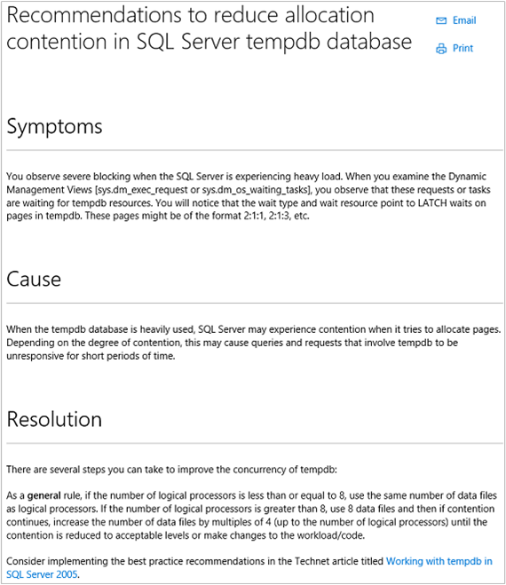

<properties
    pageTitle="Solution d’évaluation de configuration dans le journal Analytique | Microsoft Azure"
    description="La solution d’évaluation de Configuration dans journal Analytique vous donne des informations détaillées sur l’état actuel de votre infrastructure de serveur de System Center Operations Manager lors de l’utilisation d’agents Operations Manager ou un groupe d’administration Operations Manager."
    services="log-analytics"
    documentationCenter=""
    authors="bandersmsft"
    manager="jwhit"
    editor=""/>

<tags
    ms.service="log-analytics"
    ms.workload="na"
    ms.tgt_pltfrm="na"
    ms.devlang="na"
    ms.topic="article"
    ms.date="10/10/2016"
    ms.author="banders"/>

# Solution d’évaluation de configuration dans le journal Analytique

La solution d’évaluation de Configuration dans journal Analytique vous permet de rechercher d’éventuels problèmes de configuration serveur via des alertes et des connaissances recommandations.

Cette solution nécessite System Center Operations Manager. Configuration évaluation n’est pas disponible si vous utilisez uniquement agents directement connecté.

Affichage des informations dans une solution d’évaluation de Configuration nécessite le plug-in Silverlight pour votre navigateur.

>[AZURE.NOTE] Début 5 juillet 2016, la solution d’évaluation de Configuration ne sont plus peut être ajoutée aux espaces de travail journal Analytique et cette solution ne sera plus disponible pour les utilisateurs existants après le 1 août 2016. Pour les clients à l’aide de cette solution pour SQL Server ou Active Directory, nous vous recommandons de qu'utiliser à la place [l’Évaluation de SQL Server](log-analytics-sql-assessment.md), les solutions [Active Directory évaluation](log-analytics-ad-assessment.md) et [l’État de réplication Active Directory](log-analytics-ad-replication-status.md) . Pour les clients à l’aide d’évaluation de configuration pour Windows, Hyper-V et System Center Machine virtuelle Manager, nous vous recommandons d’utiliser la collection d’événements et de suivi des fonctionnalités pour obtenir une vue globale des problèmes dans votre environnement.

Données de configuration sont collectées à partir des serveurs analysés et puis envoyées au service OMS dans le cloud pour traitement. Logique est appliquée aux données reçues et le service cloud enregistre les données. Affichage des données transformées pour les serveurs pour les domaines suivants :

- **Alertes :** Affiche les alertes liées à la configuration et proactives qui ont été générées pour vos serveurs analysés. Ils sont générés par règles créés par Microsoft Customer et Support technique (CSS) avec les meilleures pratiques à partir du champ.
- **Recommandations de connaissances :** Affiche les articles de la Base de connaissances Microsoft sont recommandés pour les charges de travail qui sont trouvent dans votre infrastructure ; ils sont automatiquement suggérés en fonction de votre configuration via l’utilisation d’apprentissage automatique.
- **Serveurs et analysés les charges de travail :** Affiche les serveurs et les charges de travail qui sont analysés par OMS.

### Vous pouvez analyser avec Configuration évaluation technologies d’assistance

Évaluation de Configuration OMS analyse les charges de travail suivants :

- Windows Server 2012 et Microsoft Hyper-V Server 2012
- Windows Server 2008 et Windows Server 2008 R2, y compris :
    - Active Directory
    - Hôte Hyper-V
    - Système d’exploitation général
- SQL Server 2008 et versions ultérieur
    - Moteur de base de données SQL Server
- Microsoft SharePoint 2010
- Microsoft Exchange Server 2010 et Microsoft Exchange Server 2013
- Microsoft Lync Server 2013 et Lync Server 2010
- System Center 2012 SP1 – Gestionnaire de Machine virtuelle

Pour SQL Server, les éditions 32 bits et 64 bits suivantes sont pris en charge pour l’analyse :

- SQL Server 2016 - toutes les versions
- SQL Server 2014 - toutes les versions
- SQL Server 2008 et 2008 R2 - toutes les versions

Le moteur de base de données SQL Server est analysé sur toutes les éditions prises en charge. En outre, l’édition 32 bits de SQL Server est prise en charge lors de l’exécution de la mise en œuvre WOW64.

## Installation et configuration de la solution
Utilisez les informations suivantes pour installer et configurer la solution.

- Operations Manager est requis pour la solution d’évaluation de Configuration.
- Vous devez disposer d’un agent Operations Manager sur chaque ordinateur où vous voulez évaluer sa configuration.
- Ajouter la solution d’évaluation de Configuration à votre espace de travail OMS à l’aide de la procédure décrite dans [solutions ajouter journal Analytique à partir de la galerie de Solutions](log-analytics-add-solutions.md).  Il n’existe aucune autre configuration requise.

## Informations sur la configuration évaluation données collecte

Évaluation Configuration collecte des données de configuration, les métadonnées et les données d’état à l’aide d’agents que vous avez activés.

Le tableau suivant indique les méthodes de collecte de données et autres informations sur la façon dont les données sont collectées pour évaluation de Configuration.

| plateforme | Agent directe | Agent SCOM | Stockage Azure | SCOM obligatoire ? | Données de l’agent SCOM envoyées par groupe d’administration | fréquence de collection de sites |
|---|---|---|---|---|---|---|
|Windows||||            || deux fois par jour|

Le tableau suivant répertorie des exemples de types de données collectées par l’évaluation de Configuration :

|**Type de données**|**Champs**|
|---|---|
|Configuration|CustomerID, AgentID, EntityID, ManagedTypeID, ManagedTypePropertyID, CurrentValue, ChangeDate|
|Métadonnées|BaseManagedEntityId, ObjectStatus, unité d’organisation, ActiveDirectoryObjectSid, PhysicalProcessors, NetworkName, adresse IP, ForestDNSName, Nom_ordinateur_netbios, VirtualMachineName, LastInventoryDate, HostServerNameIsVirtualMachine, adresse IP, NetbiosDomainName, LogicalProcessors, NomDNS, DisplayName, DomainDnsName, ActiveDirectorySite, au PrincipalName, OffsetInMinuteFromGreenwichTime|
|État|StateChangeEventId, identifiant d’état, NewHealthState, OldHealthState, contexte, TimeGenerated, TimeAdded, StateId2, BaseManagedEntityId, MonitorId, HealthState, LastModified, LastGreenAlertGenerated, DatabaseTimeModified|

## Alertes de configuration d’évaluation
Vous pouvez afficher et gérer les alertes à partir de l’évaluation de Configuration avec la page alertes. Alertes vous indiquent le problème a été détecté, la cause et comment résoudre le problème. Ils fournissent également des informations sur les paramètres de configuration dans votre environnement qui peuvent entraîner des problèmes de performances.

>[AZURE.NOTE] Les alertes de Configuration évaluation sont différentes des autres alertes dans le journal Analytique. Affichage des alertes nécessite un plug-in Silverlight pour votre navigateur.

Lorsque vous sélectionnez un élément ou une catégorie d’éléments dans la page alertes, vous verrez une liste de serveurs ou charges de travail avec des alertes qui s’appliquent à chaque élément.

Chaque message d’alerte inclut un lien vers un article dans la Base de connaissances Microsoft. Les articles suivants fournissent des informations supplémentaires sur l’alerte.

>[AZURE.TIP] Par défaut, le nombre maximal d’alertes qui s’affiché est de 2 000. Pour afficher plus d’alertes, cliquez sur la barre de notification au-dessus de la liste des alertes.

Vous pouvez cliquer sur n’importe quel élément dans la liste pour afficher l’article KB qui peut-être vous aider à résoudre la cause du problème à l’origine de l’alerte.

Vous pouvez gérer les règles d’alerte pour ignorer des règles spécifiques ou un cours de règles.

## Recommandations de connaissances
Lorsque vous affichez les recommandations de connaissances, que vous voyez les résultats de recherche de journal répertoriant les articles KB Microsoft recommandés pour les charges de travail et les ordinateurs qui fournissent des informations supplémentaires sur l’alerte.

## Serveurs et analysés les charges de travail
Lorsque vous affichez les recommandations de connaissances, que vous voyez les résultats de recherche de journal répertoriant tous les serveurs et les charges de travail qui sont connus pour OMS d’Operations Manager.

## Étapes suivantes

- [Recherches de journaux dans journal Analytique](log-analytics-log-searches.md) permet d’afficher des données d’évaluation de configuration détaillées.
