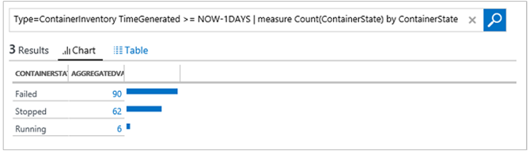

<properties
    pageTitle="Solution de conteneurs dans journal Analytique | Microsoft Azure"
    description="La solution conteneurs dans journal Analytique vous permet d’afficher et gérer vos hôtes conteneur Docker dans un emplacement unique."
    services="log-analytics"
    documentationCenter=""
    authors="bandersmsft"
    manager="jwhit"
    editor=""/>

<tags
    ms.service="log-analytics"
    ms.workload="na"
    ms.tgt_pltfrm="na"
    ms.devlang="na"
    ms.topic="article"
    ms.date="10/10/2016"
    ms.author="banders"/>


# <a name="containers-preview-solution-log-analytics"></a>Solution de conteneurs (Preview) journal Analytique

Cet article décrit comment configurer et utiliser la solution conteneurs dans journal Analytique, qui vous permet d’afficher et gérer vos hôtes conteneur Docker dans un emplacement unique. Docker est un système de virtualisation de logiciel utilisé pour créer des conteneurs permettant d’automatiser déploiement du logiciel à leur infrastructure informatique.

Avec la solution, vous pouvez voir quels conteneurs sont exécutent sur vos hôtes conteneur et les images sont exécutés dans les conteneurs. Vous pouvez afficher des informations d’audit détaillées montrant les commandes utilisées avec des conteneurs. Et, vous pouvez résoudre les conteneurs en consultant et recherche journaux centralisés sans avoir à afficher à distance des hôtes Docker. Vous pouvez trouver des conteneurs qui peuvent être bruits et prend beaucoup de ressources en excès sur un hôte. Et, vous pouvez afficher centralisé processeur, la mémoire, stockage et informations des conteneurs utilisation et les performances du réseau.

## <a name="installing-and-configuring-the-solution"></a>Installation et configuration de la solution

Utilisez les informations suivantes pour installer et configurer la solution.

Ajouter la solution conteneurs à votre espace de travail OMS à l’aide de la procédure décrite dans [solutions ajouter journal Analytique à partir de la galerie de Solutions](log-analytics-add-solutions.md).

Il existe deux façons pour installer et utiliser Docker avec OMS :

- Sur les systèmes d’exploitation Linux pris en charge, installer et exécuter Docker puis installer et configurer l’Agent OMS pour Linux
- Sur CoreOS, installez et exécutez Docker, puis configurez la OMSAgent à exécuter à l’intérieur d’un conteneur

Passez en revue les versions de système d’exploitation Docker et Linux pris en charge pour l’hôte du conteneur sur [GitHub](https://github.com/Microsoft/OMS-docker).

>[AZURE.IMPORTANT] Docker doit être en cours d’exécution **avant** que vous installez l' [Agent OMS pour Linux](log-analytics-linux-agents.md) sur vos hôtes conteneur. Si vous avez déjà installé l’agent avant d’installer Docker, vous devez réinstaller l’Agent OMS pour Linux. Pour plus d’informations sur Docker, consultez le [site Web Docker](https://www.docker.com).

Vous devez les paramètres suivants sont configurés sur vos hôtes conteneur avant de pouvoir analyser conteneurs.

## <a name="configure-settings-for-the-linux-container-host"></a>Configurer les paramètres de l’hôte de conteneur Linux

Une fois que vous avez installé Docker, utilisez les paramètres suivants pour votre hôte de conteneur pour configurer l’agent pour une utilisation avec Docker. CoreOS ne prend pas en charge cette méthode de configuration.

### <a name="to-configure-settings-for-the-container-host---systemd-suse-opensuse-centos-7x-rhel-7x-and-ubuntu-15x-and-higher"></a>Pour configurer les paramètres pour l’hôte de conteneur - systemd (SUSE, openSUSE, CentOS 7.x, RHEL 7.x et Ubuntu 15.x et versions ultérieures)

1. Modifier docker.service pour ajouter les éléments suivants :

    ```
    [Service]
    ...
    Environment="DOCKER_OPTS=--log-driver=fluentd --log-opt fluentd-address=localhost:25225"
    ...
    ```

2. Ajouter $DOCKER\_opte dans &quot;processus de = / usr/bin/docker ExecStart&quot; dans votre fichier docker.service. À l’aide de l’exemple suivant.

    ```
    [Service]
    Environment="DOCKER_OPTS=--log-driver=fluentd --log-opt fluentd-address=localhost:25225"
    ExecStart=/usr/bin/docker daemon -H fd:// $DOCKER_OPTS
    ```

3. Redémarrez le service Docker. Par exemple :

    ```
    sudo systemctl restart docker.service
    ```

### <a name="to-configure-settings-for-the-container-host---upstart-ubuntu-14x"></a>Pour configurer les paramètres pour l’hôte conteneur - Upstart (Ubuntu 14.x)

1. Modifiez /etc/default/docker et ajoutez les éléments suivants :

    ```
    DOCKER_OPTS="--log-driver=fluentd --log-opt fluentd-address=localhost:25225"
    ```

2. Enregistrer le fichier, puis redémarrez les services Docker et OMS.

    ```
    sudo service docker restart
    ```

### <a name="to-configure-settings-for-the-container-host---amazon-linux"></a>Pour configurer les paramètres pour l’hôte de conteneur - Linux Amazon

1. Modifiez /etc/sysconfig/docker et ajoutez les éléments suivants :

    ```
    OPTIONS="--log-driver=fluentd --log-opt fluentd-address=localhost:25225"
    ```

2. Enregistrer le fichier, puis redémarrez le service Docker.

    ```
    sudo service docker restart
    ```

## <a name="configure-settings-for-coreos-containers"></a>Configurer les paramètres des conteneurs CoreOS

Une fois que vous avez installé Docker, utilisez les paramètres suivants pour CoreOS pour exécuter Docker et créer un conteneur. Vous pouvez utiliser n’importe quelle version prise en charge de Linux, y compris CoreOS, avec cette méthode de configuration. Vous devez votre [ID d’espace de travail OMS et clé](log-analytics-linux-agents.md).

### <a name="to-use-oms-for-all-containers-with-coreos"></a>Utiliser OMS pour tous les conteneurs avec CoreOS

- Lancer le conteneur OMS que vous souhaitez analyser. Modifiez et utilisez l’exemple suivant.

  ```
sudo docker run --privileged -d -v /var/run/docker.sock:/var/run/docker.sock -e WSID="your workspace id" -e KEY="your key" -h=`hostname` -p 127.0.0.1:25224:25224/udp -p 127.0.0.1:25225:25225 --name="omsagent" --log-driver=none --restart=always microsoft/oms
```

### <a name="switching-from-using-an-installed-agent-to-one-in-a-container"></a>À partir d’à l’aide d’un agent installé une dans un conteneur

Si vous précédemment utilisé l’agent directement installé et que vous souhaitez utiliser à la place un agent qui s’exécute dans un conteneur de, vous devez d’abord supprimer OMSAgent. Consultez les [étapes pour installer l’Agent OMS pour Linux](https://github.com/Microsoft/OMS-Agent-for-Linux/blob/master/docs/OMS-Agent-for-Linux.md).

## <a name="containers-data-collection-details"></a>Détails de collecte de données conteneurs

La solution conteneurs collecte diverses performances métriques et journal de données à partir des hôtes conteneur et conteneurs à l’aide d’Agents OMS pour Linux que vous avez activés et de OMSAgent en cours d’exécution dans des conteneurs.

Le tableau suivant indique les méthodes de collecte de données et autres informations sur la manière dont les données sont collectées des conteneurs.

| plateforme | Agent OMS pour Linux | Agent SCOM | Stockage Azure | SCOM obligatoire ? | Données de l’agent SCOM envoyées par groupe d’administration | fréquence de collection de sites |
|---|---|---|---|---|---|---|
|Linux||||            || toutes les trois minutes|


Le tableau suivant illustrent des types de données collectées par la solution conteneurs :

| Type de données | Champs |
| --- | --- |
| Performances des hôtes et des conteneurs | Ordinateur, nom_objet, CounterName & #40 ; % temps processeur, disque lit Mo, disque écrit Mo, Mo de l’utilisation de la mémoire, réseau recevoir octets, réseau envoyer octets, processeur l’utilisation sec, réseau & #41 ; contre-valeurs, TimeGenerated, CounterPath, SourceSystem |
| Inventaire conteneur | TimeGenerated, ordinateur, nom du conteneur, code de sortie, ContainerHostname, Image, SourceSystem, ImageTag, ContinerState, EnvironmentVar, commande, StartedTime, CreatedTime, FinishedTime, ImageID, Id_conteneur |
| Inventaire d’image conteneur | TimeGenerated, ordinateur, Image, ImageTag, ImageSize, VirtualSize, en cours d’exécution, en pause, arrêté, a échoué, SourceSystem, ImageID, TotalContainer |
| Journal de conteneur | TimeGenerated, ordinateur, ID de l’image, nom du conteneur, LogEntrySource, LogEntry, SourceSystem, Id_conteneur |
| Journal des services de conteneur | TimeGenerated, ordinateur, TimeOfCommand, Image, commande, SourceSystem, Id_conteneur |

## <a name="monitor-containers"></a>Moniteur conteneurs

Une fois que vous avez la solution activée dans le portail OMS, vous verrez la vignette **conteneurs** affichant des informations récapitulatives sur vos hôtes conteneur et les conteneurs en cours d’exécution dans des hôtes.


La vignette présente un aperçu des conteneurs combien vous avez dans l’environnement et qu’ils vous a échoué, en cours d’exécution ou arrêté.

### <a name="using-the-containers-dashboard"></a>Le tableau de bord conteneurs

Cliquez sur la vignette de **conteneurs** . À partir de là, vous verrez affichages organisés par :

- Événements de conteneur
- Erreurs
- État de conteneurs
- Conteneur Image stock
- Performances du processeur et la mémoire

Chaque volet dans le tableau de bord est une représentation visuelle d’une recherche qui s’exécute sur les données collectées.


Dans la carte **Conteneur État** , cliquez sur à la partie supérieure, comme illustré ci-dessous.


Recherche de journal s’ouvre, affichant des informations sur les hôtes et les conteneurs en cours d’exécution dans les.


De là, vous pouvez modifier la requête de recherche pour le modifier pour trouver des informations spécifiques que qui vous intéresse. Pour plus d’informations sur les recherches de journal, voir [journal des recherches dans le journal Analytique](log-analytics-log-searches.md).

Par exemple, vous pouvez modifier la requête de recherche de sorte qu’elle affiche tous les conteneurs arrêtés au lieu des conteneurs en cours d’exécution en modifiant **en cours d’exécution** sur **bloqué** dans la requête de recherche.

## <a name="troubleshoot-by-finding-a-failed-container"></a>Résoudre les problèmes en recherchant d’un conteneur a échoué

OMS marque un conteneur comme **Échec** si elle s’est arrêté avec un code de sortie non nulle. Vous pouvez voir une vue d’ensemble des erreurs et des échecs de l’environnement dans la carte de **Conteneurs a échoué** .

### <a name="to-find-failed-containers"></a>Pour rechercher des conteneurs a échoué

1. Cliquez sur la carte **Les événements de conteneur** .  
  
2. Recherche de journal s’ouvre et affiche l’état de conteneurs, similaires à ce qui suit.  
  
3. Cliquez ensuite sur la valeur Échec pour afficher des informations supplémentaires telles que la taille de l’image et le nombre d’images arrêtés et a échoué. Développez **Afficher plus** pour afficher l’ID de l’image.  
  
4. Ensuite, recherchez le conteneur dans lequel s’exécute cette image. Tapez les informations suivantes dans la requête de recherche.
  `Type=ContainerInventory <ImageID>`Cela permet d’afficher les journaux. Vous pouvez faire défiler pour voir le conteneur a échoué.  
  


## <a name="search-logs-for-container-data"></a>Recherche les journaux de données conteneur

Lorsque vous êtes à résoudre une erreur spécifique, il peut vous aider à voir où il se produit dans votre environnement. Les types de journal suivants vous aideront à créer des requêtes pour renvoyer les informations souhaitées.

- **ContainerInventory** – Utilisez ce type lorsque vous souhaitez que les informations emplacement conteneur, quelles sont leurs noms et que les images ils exécutent.
- **ContainerImageInventory** – Utilisez ce type lorsque vous essayez de rechercher des informations organisées en image et d’afficher des informations sur l’image comme image ID ou tailles.
- **ContainerLog** – ce type lorsque vous souhaitez rechercher des écritures et les informations du journal d’erreur spécifique.
- **ContainerServiceLog** – Utilisez ce type lorsque vous essayez de rechercher des informations de piste d’audit pour le processus Docker, par exemple Démarrer, arrêter, supprimer ou extraire commandes.

### <a name="to-search-logs-for-container-data"></a>Pour rechercher les journaux de données conteneur

- Choisissez une image dont vous savez qu’il n’a pas pu récemment et recherchez les journaux d’erreurs. Commencez par rechercher un nom de conteneur qui exécute cette image avec une recherche **ContainerInventory** . Par exemple, recherche`Type=ContainerInventory ubuntu Failed`  
    

  Notez le nom du conteneur en regard de **nom**et recherchez ces fichiers journaux. Dans cet exemple, il est `Type=ContainerLog adoring_meitner`.

**Afficher les informations de performances**

Lorsque vous êtes au début afin de créer des requêtes, il peut vous aider à voir les possibilités offertes tout d’abord. Par exemple, pour afficher toutes les données de performance, essayez une requête large en tapant la requête suivante de la recherche.

```
Type=Perf
```


Vous pouvez voir ceci sous forme graphique plus lorsque vous cliquez sur le mot **mesures** dans les résultats.


Vous pouvez limiter les données de performance que vous voyez un conteneur spécifique en tapant le nom de celle-ci à droite de votre requête.

```
Type=Perf <containerName>
```

Qui affiche la liste des indicateurs de performances sont collectées pour un conteneur individuel.


## <a name="example-log-search-queries"></a>Requêtes de recherche de journal exemple

Il est souvent utile créer des requêtes en commençant par exemple ou les deux, puis en modifiant les adapter à votre environnement. Comme point de départ, vous pouvez tester la carte de **Requêtes remarquables** pour vous aider à créer des requêtes plus avancées.


## <a name="saving-log-search-queries"></a>Enregistrement du journal des requêtes de recherche

Enregistrer les requêtes est une fonctionnalité standard de journal Analytique. En les enregistrant, vous devrez ceux que vous avez trouvé utile pratique pour une utilisation ultérieure.

Après avoir créé une requête que vous trouvez utile, enregistrez-le en cliquant sur **Favoris** en haut de la page de recherche dans un journal. Puis vous pouvez accéder facilement plus tard à partir de la page **Mon tableau de bord** .

## <a name="next-steps"></a>Étapes suivantes

- [Les journaux de recherche](log-analytics-log-searches.md) pour afficher les enregistrements de données de conteneur détaillées.
