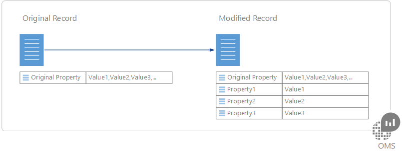
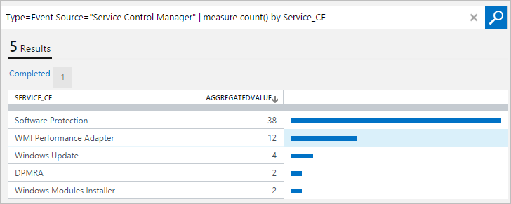

<properties
   pageTitle="Champs personnalisés de journal Analytique | Microsoft Azure"
   description="La fonctionnalité de champs personnalisés de journal Analytique permet de créer vos propres champs de recherche à partir de données OMS ajouter aux propriétés d’un enregistrement collecté.  Cet article décrit le processus pour créer un champ personnalisé et fournit une description détaillée avec un exemple d’événement."
   services="log-analytics"
   documentationCenter=""
   authors="bwren"
   manager="jwhit"
   editor="tysonn" />
<tags
   ms.service="log-analytics"
   ms.devlang="na"
   ms.topic="article"
   ms.tgt_pltfrm="na"
   ms.workload="infrastructure-services"
   ms.date="10/18/2016"
   ms.author="bwren" />

# Champs personnalisés de journal Analytique

La fonctionnalité de **Champs personnalisés** de journal Analytique vous permet d’étendre les enregistrements existants dans le référentiel OMS en ajoutant vos propres champs de recherche.  Champs personnalisés sont automatiquement renseignés à partir des données extraites d’autres propriétés dans le même enregistrement.

Par exemple, l’enregistrement d’exemple ci-dessous comporte les données utiles cachées description de l’événement.  Extraire ces données dans des propriétés séparées rend disponible pour les actions telles que le tri et filtrage.

>[AZURE.NOTE] Dans l’aperçu, vous êtes limité à 100 champs personnalisés dans votre espace de travail.  Cette limite est agrandie lorsque cette fonctionnalité atteint officielle.

## Création d’un champ personnalisé

Lorsque vous créez un champ personnalisé, journal Analytique doit comprendre les données à utiliser pour remplir sa valeur.  Il utilise une technologie par Microsoft Research appelé FlashExtract d’identifier rapidement ces données.  Plutôt que d’exiger vous permet de fournir des instructions explicites, journal Analytique a eu connaissance les données que vous voulez extraire d’exemples que vous spécifiez.

Les sections suivantes fournissent la procédure de création d’un champ personnalisé.  En bas de cet article est une procédure pas à pas d’un de l’échantillon.

> [!NOTE] Le champ personnalisé est rempli lorsque des enregistrements qui correspondent aux critères spécifiés sont ajoutés au magasin de données OMS, afin qu’il apparaîtra uniquement sur les enregistrements collectées après avoir créé le champ personnalisé.  Le champ personnalisé n’est pas ajouté à des enregistrements qui existent déjà dans le magasin de données lors de sa création.

### Étape 1 : identifier les enregistrements qui auront le champ personnalisé
La première étape consiste à identifier les enregistrements qui peuvent accéder au champ personnalisé.  Vous démarrez une [recherche dans un journal standard](log-analytics-log-searches.md) , puis sélectionnez agir en tant que le modèle de journal Analytique apprendrez à partir d’un enregistrement.  Lorsque vous spécifiez que vous voulez extraire les données dans un champ personnalisé, l' **Assistant d’Extraction de champ** est ouvert dans lequel vous validez et affinez les critères.

2. Accédez à la **Recherche dans un journal** et utiliser une [requête pour récupérer les enregistrements](log-analytics-log-searches.md) qui aura le champ personnalisé.
2. Sélectionnez un enregistrement journal Analytique utiliserez pour agir en tant que modèle permettant d’extraire des données pour remplir le champ personnalisé.  Vous pouvez identifier les données que vous souhaitez extraire à partir de cet enregistrement, puis Analytique journal utilise ces informations pour déterminer la logique pour remplir le champ personnalisé pour tous les enregistrements similaires.
3. Cliquez sur le bouton à gauche de n’importe quelle propriété texte de l’enregistrement, puis sélectionnez **extraire des champs à partir de**.
4. L' **Assistant d’Extraction de champ est ouvert**et l’enregistrement que vous avez sélectionné s’affiche dans la colonne **Exemple principal** .  Le champ personnalisé doit être défini pour les enregistrements avec les mêmes valeurs dans les propriétés qui sont sélectionnées.  
5. Si la sélection n’est pas exactement ce que vous voulez, sélectionner des champs supplémentaires pour affiner les critères.  Pour modifier les valeurs des champs pour les critères, vous devez annuler et sélectionner un autre enregistrement qui répondent aux critères que vous voulez.

### Étape 2 : exécuter extrait initial.
Une fois que vous avez identifié les enregistrements qui auront le champ personnalisé, vous identifiez les données que vous souhaitez extraire.  Journal Analytique va utiliser ces informations pour identifier les tendances similaires des enregistrements similaires.  Dans l’étape après cela, vous ne pourrez pas valider les résultats et fournir des détails de journal Analytique à utiliser dans son analyse complémentaires.

1. Mettez en surbrillance le texte dans l’exemple d’enregistrement que vous souhaitez remplir le champ personnalisé.  Vous obtiendrez avec une boîte de dialogue pour fournir un nom pour le champ et effectuer l’extrait initial.  Les caractères ** \_trésorerie** seront automatiquement ajoutées.
2. Cliquez sur **Extraire** pour effectuer une analyse des enregistrements collectées.  
3. Les sections de **synthèse** et de **Résultats de recherche** affichent les résultats de l’extrait afin que vous pouvez inspecter sa précision.  **Résumé** affiche les critères permettant d’identifier les enregistrements et un compteur pour chacune des valeurs de données identifiés.  **Résultats de recherche** fournit une liste détaillée des enregistrements qui répondent aux critères.

### Étape 3 : vérifier la précision de l’extrait et créer des champs personnalisés

Une fois que vous avez effectué l’extrait initial, journal Analytique s’affichent les résultats en fonction des données qui ont déjà été collectées.  Si les résultats ressemblent précis vous pouvez créer le champ personnalisé avec aucun travail supplémentaire.  Dans le cas contraire, puis vous pouvez affiner les résultats pour que journal Analytique peut améliorer sa logique.

2.  Si toutes les valeurs dans l’extrait initial sont incorrects, puis cliquez sur l’icône **Modifier** en regard d’un enregistrement inexact et sélectionnez **modifier cette mise en surbrillance** afin de pouvoir pour modifier la sélection.
3.  L’entrée est copiée dans la section **des exemples supplémentaires** en dessous de l' **Exemple principal**.  Vous pouvez ajuster la mise en surbrillance ici pour aider les journaux Analytique à comprendre la sélection, il y a lieu.
4.  Cliquez sur **Extraire** pour utiliser ces nouvelles informations doit être évaluée tous les enregistrements existants.  Les résultats peuvent être modifiées pour les enregistrements différent de celui que vous venez de modifier basé sur cette nouvelle intelligence.
5.  Continuez à ajouter des corrections jusqu'à ce que tous les enregistrements dans l’extrait identifient correctement les données pour remplir le nouveau champ personnalisé.
6. Lorsque vous êtes satisfait des résultats, cliquez sur **Enregistrer extraire** .  Le champ personnalisé est maintenant défini, mais elle ne sont pas encore être ajoutée à tous les enregistrements.
7.  Patienter pour les nouveaux enregistrements qui répondent aux critères spécifiés pour être collectées et puis exécutez à nouveau la recherche du journal. Nouveaux enregistrements doivent avoir le champ personnalisé.
8.  Utiliser le champ personnalisé comme toute autre propriété enregistrement.  Vous pouvez l’utiliser pour l’agrégation et regrouper des données et même l’utiliser pour générer de nouvelles perspectives.

## Affichage des champs personnalisés
Vous pouvez afficher une liste de tous les champs personnalisés dans votre groupe d’administration de la vignette **paramètres** du tableau de bord OMS.  Sélectionnez les **données** , puis sur **champs personnalisés** pour obtenir une liste de tous les champs personnalisés dans votre espace de travail.  

## Suppression d’un champ personnalisé
Il existe deux manières de supprimer un champ personnalisé.  La première est l’option **Supprimer** pour chaque champ lors de l’affichage de la liste complète des comme décrit ci-dessus.  L’autre méthode consiste à récupérer un enregistrement et cliquez sur le bouton à gauche du champ.  Le menu aura une option pour supprimer le champ personnalisé.

## Procédure d’exemple

La section suivante décrit un exemple complet de création d’un champ personnalisé.  Cet exemple extrait le nom du service dans les événements de Windows qui indiquent un service Modification état.  Cela s’appuie sur les événements créés par le Gestionnaire de contrôle de Service dans le journal système sur les ordinateurs Windows.  Si vous voulez suivre cet exemple, vous devez être [collecte des événements d’informations pour le journal système](log-analytics-data-sources-windows-events.md).

Nous Entrez la requête suivante pour renvoyer tous les événements à partir du Gestionnaire de contrôle de Service qui ont un ID d’événement de 7036 ce qui correspond à l’événement qui indique le service démarre ou s’arrête.

Nous puis sélectionnez un enregistrement avec l’événement ID 7036.

Nous voulons le nom du service qui apparaît dans la propriété **RenderedDescription** , sélectionnez le bouton en regard de cette propriété.

Pour ouvrir l' **Assistant d’Extraction de champ** et les champs **journal des événements** et **EventID** sont sélectionnés dans la colonne **Exemple principal** .  Cela indique que le champ personnalisé est défini pour les événements du système journal dont l’ID événement 7036.  Ceci est suffisant afin que nous n’avez pas besoin de sélectionner tous les autres champs.

Nous mettre en surbrillance le nom du service dans la propriété **RenderedDescription** et l’utilisation des **services** pour identifier le nom du service.  Le champ personnalisé sera appelé **Service_CF**.

Nous voyons que le nom du service est identifié correctement pour certains enregistrements, mais pas pour d’autres personnes.   Les **Résultats de la recherche** afficher que le nom de la **Carte de Performance WMI** du n’est pas sélectionné.  Le **Résumé** indique que les quatre enregistrements avec le service **DPRMA** incluses à tort un mot supplémentaire, et deux enregistrements identifiés **Modules Installer** à la place de **Modules Windows Installer**.  

Nous allons commencer avec l’enregistrement de **Carte de Performance WMI** .  Nous cliquez sur son icône de modification, puis **modifier cette mise en surbrillance**.  

Nous augmenter la mise en surbrillance pour indiquer le terme **WMI** , puis réexécutez l’extrait.  

Nous pouvons voir que les entrées de la **Carte de Performance WMI** ont été corrigées et journal Analytique utilisé également ces informations pour corriger les enregistrements pour **Module Windows Installer**.  Bien que ce **DPMRA** est toujours pas identifié correctement, nous pouvons voir dans la section **Résumé** .

Nous faire défiler à un enregistrement avec le service DPMRA et utilisez la même procédure pour corriger cet enregistrement.

 Quand nous exécutez l’extraction, nous voyons que tous les résultats sont désormais corrects.

Nous pouvons voir que **Service_CF** est créé mais n’est pas encore ajouté à tous les enregistrements.

Une fois que peu de temps écoulé new événements sont collectées, nous pouvons voir que que le champ **Service_CF** est désormais être ajouté à des enregistrements qui correspondent à nos critères.

Nous pouvons à présent utiliser le champ personnalisé comme toute autre propriété de l’enregistrement.  Pour illustrer cela, nous créer une requête qui regroupe par le nouveau champ de **Service_CF** à inspecter quels services sont les plus actifs.

## Étapes suivantes

- En savoir plus sur [les recherches de journal](log-analytics-log-searches.md) créer des requêtes à l’aide de champs personnalisés pour les critères.
- Surveiller [les fichiers journaux personnalisés](log-analytics-data-sources-custom-logs.md) que vous analysez à l’aide de champs personnalisés.