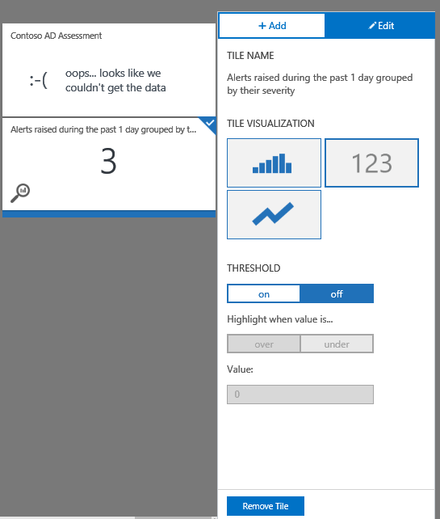

<properties
    pageTitle="Créer un tableau de bord personnalisé dans journal Analytique | Microsoft Azure"
    description="Ce guide vous aide à comprendre comment des tableaux de bord Analytique journal de visualiser tous vos recherches journal enregistré, vous donnant un objectif unique pour afficher votre environnement."
    services="log-analytics"
    documentationCenter=""
    authors="bandersmsft"
    manager="jwhit"
    editor=""/>

<tags
    ms.service="log-analytics"
    ms.workload="na"
    ms.tgt_pltfrm="na"
    ms.devlang="na"
    ms.topic="article"
    ms.date="10/10/2016"
    ms.author="banders"/>

# Créer un tableau de bord personnalisé dans journal Analytique

Ce guide vous aide à comprendre comment les tableaux de bord journal Analytique peuvent visualiser tous vos recherches journal enregistré, vous donnant un objectif unique pour afficher votre environnement.

Tous les tableaux de bord personnalisés que vous créez dans le portail OMS est également disponibles dans l’application Mobile OMS. Consultez les pages suivantes pour plus d’informations sur les applications.

- [Application mobile OMS Microsoft Store](http://www.windowsphone.com/store/app/operational-insights/4823b935-83ce-466c-82bb-bd0a3f58d865)
- [Application mobile OMS à partir d’Apple iTunes](https://itunes.apple.com/app/microsoft-operations-management/id1042424859?mt=8)

## Comment créer mon tableau de bord ?

Pour commencer, accédez à la page Vue d’ensemble OMS. Vous verrez la vignette **Mon tableau de bord** gauche. Cliquez dessus pour Explorer votre tableau de bord.

## Ajout d’une vignette

Dans les tableaux de bord, les mosaïques sont optimisés par vos recherches journal enregistré. OMS est fourni avec de nombreux apportées des recherches de journal enregistré, afin que vous puissiez commencer immédiatement. Utilisez les étapes suivantes expliquent comment commencer.

Dans la vue de mon tableau de bord, cliquez simplement sur **Personnaliser** pour entrer personnaliser mode.

 Le panneau de configuration qui s’ouvre sur le côté droit de la page affiche toutes les recherches de journal enregistré de votre espace de travail. Pour visualiser un journal enregistré de recherche sous forme de mosaïque, pointez sur une recherche enregistrée, puis sur le symbole **plus** .

Lorsque vous cliquez sur le symbole **plus** , une vignette apparaît dans la vue de mon tableau de bord.

## Modifier un thème

Dans la vue de mon tableau de bord, cliquez simplement sur **Personnaliser** pour entrer personnaliser mode. Cliquez sur la vignette que vous voulez modifier. Les modifications du volet de droite à modifier et vous propose une sélection des options :

### Visualisations de mosaïque#
Il existe trois types de visualisations de mosaïque pour choisir parmi :

|type de graphique|fonction|
|---|---|
||Affiche une chronologie de vos résultats de journal enregistré comme un graphique à barres, ou une liste des résultats par un champ en fonction de si votre recherche journal regroupe les résultats en fonction d’un champ ou non.
||Affiche votre accès au journal total recherche des résultats sous la forme d’un nombre dans une vignette. Vignettes métriques permettent de définir un seuil qui met en évidence la vignette lorsque le seuil est atteint.|
||Affiche une barre de planning votre journal enregistré résultat de résultats de recherche avec les valeurs sous la forme d’un graphique en courbes.|

### Seuil
Vous pouvez créer un seuil sur une vignette à l’aide de la visualisation métrique. Sélectionnez Créer une valeur de seuil sur la vignette. Choisissez si vous souhaitez mettre en surbrillance la vignette lorsque la valeur est supérieure ou inférieure au seuil choisi, puis définissez la valeur de seuil ci-dessous.

## Organiser le tableau de bord
Pour organiser votre tableau de bord, accédez à la vue de mon tableau de bord, cliquez sur **Personnaliser** pour entrer personnaliser mode. Cliquez et faites glisser la vignette que vous voulez déplacer, puis déplacez-le vers l’emplacement souhaité pour votre vignette pour être.

## Supprimer une vignette
Pour supprimer une vignette, accédez à la vue de mon tableau de bord, cliquez sur **Personnaliser** pour entrer personnaliser mode. Sélectionnez la vignette que vous voulez supprimer, puis dans le volet de droite, sélectionnez **Supprimer la vignette**.

## Étapes suivantes

- Créer des [alertes](log-analytics-alerts.md) dans le journal Analytique pour générer les notifications et de corriger les problèmes.
