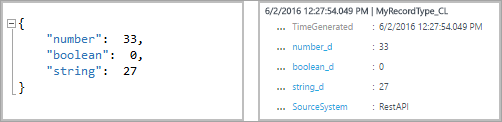

<properties
    pageTitle="Ouvrez une session collecteur de données HTTP Analytique API | Microsoft Azure"
    description="Vous pouvez utiliser l’API journal Analytique HTTP données collecteur pour ajouter des données de billet JSON vers le référentiel Analytique journal de tous les clients qui peuvent appeler l’API REST. Cet article explique comment utiliser l’API et présente des exemples de la publication de données à l’aide de différents langages de programmation."
    services="log-analytics"
    documentationCenter=""
    authors="bwren"
    manager="jwhit"
    editor=""/>

<tags
    ms.service="log-analytics"
    ms.workload="na"
    ms.tgt_pltfrm="na"
    ms.devlang="na"
    ms.topic="article"
    ms.date="10/26/2016"
    ms.author="bwren"/>


# <a name="log-analytics-http-data-collector-api"></a>Ouvrez une session collecteur de données HTTP Analytique API

Lorsque vous utilisez l’API de collecteur de données Azure journal Analytique HTTP, vous pouvez ajouter des données POST JSON JavaScript Object Notation () vers le référentiel Analytique journal de tous les clients qui peuvent appeler l’API REST. À l’aide de cette méthode, vous pouvez envoyer des données à partir des applications tierces ou à partir de scripts, comme à partir d’un runbook dans Azure Automation.  

## <a name="create-a-request"></a>Créer une requête

Les deux tables suivantes répertorient les attributs requis pour chaque demande à l’API journal Analytique HTTP données collecteur. Nous décrire chaque attribut plus en détail plus loin dans l’article.

### <a name="request-uri"></a>URI de la demande

| Attribut | Propriété |
|:--|:--|
| Méthode | Publier |
| URI | https://\<CustomerId\>.ods.opinsights.azure.com/api/logs?api-version=2016-04-01 |
| Type de contenu | application/json |

### <a name="request-uri-parameters"></a>Paramètres de demande d’URI
| Paramètre | Description |
|:--|:--|
| CustomerID  | Identificateur unique pour l’espace de travail Microsoft Operations Management Suite. |
| Ressource    | Le nom de la ressource API : / api/journaux. |
| Version de l’API | La version de l’API à utiliser avec cette requête. Il n’existe actuellement 2016-04-01. |

### <a name="request-headers"></a>En-têtes de requête
| En-tête | Description |
|:--|:--|
| Autorisation | La signature d’autorisation. Plus loin dans l’article, vous pouvez lire sur la création d’un en-tête HMAC SHA256. |
| Type de journal | Spécifier le type d’enregistrement des données qui sont envoyées. Pour l’instant, le type de journal prend en charge uniquement les caractères alpha. Il ne prend pas en charge les valeurs numériques ou des caractères spéciaux. |
| x-ms-date | Date à laquelle la demande a été traitée, au format RFC 1123. |
| champ générés par heure | Le nom d’un champ dans les données qui contient l’horodatage de l’élément de données. Si vous spécifiez un champ son contenu est utilisé pour **TimeGenerated**. Si ce champ n’est pas spécifié, la valeur par défaut pour **TimeGenerated** est l’heure à laquelle le message est intégré. Le contenu du champ message doit suivre le format ISO 8601 aaaa-MM-JJThh. |


## <a name="authorization"></a>Autorisation

Toute demande à l’API journal Analytique HTTP données collecteur doit inclure un en-tête d’autorisation. Pour authentifier une demande, vous devez vous connecter la demande avec le serveur principal ou la clé secondaire pour l’espace de travail qui effectue la demande. Passer ensuite qu’une signature dans le cadre de la demande.   

Voici le format de l’en-tête d’autorisation :

```
Authorization: SharedKey <WorkspaceID>:<Signature>
```

*WorkspaceID* est l’identificateur unique pour l’espace de travail opérations Management Suite. *Signature* est un [Code de l’authentification de Message basé sur hachage (HMAC)](https://msdn.microsoft.com/library/system.security.cryptography.hmacsha256.aspx) qui est créé à partir de la demande et puis est calculé à l’aide de l' [algorithme SHA256](https://msdn.microsoft.com/library/system.security.cryptography.sha256.aspx). Ensuite, vous le coder à 64 bits.

Utilisez ce format pour coder la chaîne de signature **SharedKey** :

```
StringToSign = VERB + "\n" +
               Content-Length + "\n" +
               Content-Type + "\n" +
               x-ms-date + "\n" +
               "/api/logs";
```

Voici un exemple d’une chaîne de signature :

```
POST\n1024\napplication/json\nx-ms-date:Mon, 04 Apr 2016 08:00:00 GMT\n/api/logs
```

Lorsque vous avez la chaîne de signature, coder à l’aide de l’algorithme HMAC SHA256 dans la chaîne encodée UTF-8 et puis encoder le résultat en tant qu’en base 64. Utilisez ce format :

```
Signature=Base64(HMAC-SHA256(UTF8(StringToSign)))
```

Les exemples dans les sections suivantes ont des exemples de code pour vous aider à créer un en-tête d’autorisation.

## <a name="request-body"></a>Corps de la requête

Le corps du message doit être placé dans JSON. Elle doit inclure un ou plusieurs enregistrements avec les paires de nom et la valeur de propriété au format suivant :

```
{
"property1": "value1",
" property 2": "value2"
" property 3": "value3",
" property 4": "value4"
}
```

Vous pouvez lot plusieurs enregistrements dans une requête en utilisant le format suivant. Tous les enregistrements doivent être du même type d’enregistrement.

```
{
"property1": "value1",
" property 2": "value2"
" property 3": "value3",
" property 4": "value4"
},
{
"property1": "value1",
" property 2": "value2"
" property 3": "value3",
" property 4": "value4"
}
```

## <a name="record-type-and-properties"></a>Propriétés et type d’enregistrement

Vous définissez un type d’enregistrement personnalisé lorsque vous envoyez des données via l’API journal Analytique HTTP données collecteur. Pour l’instant, vous ne pouvez pas écrire des données dans types d’enregistrements existants qui ont été créées par d’autres types de données et les solutions. Journal Analytique lit les données entrantes, puis crée des propriétés qui correspondent aux types de données des valeurs que vous entrez.

Chaque demande à l’API Analytique journal doit comporter un en-tête de **Type journal** avec le nom du type d’enregistrement. Le suffixe **_CL** est ajouté automatiquement le nom que vous entrez pour distinguer des autres types de journal comme un journal personnalisé. Par exemple, si vous entrez le nom **MyNewRecordType**, journal Analytique crée un enregistrement avec le type **MyNewRecordType_CL**. Cela permet de garantir qu’il n’y a pas de conflits entre les noms de type créés par l’utilisateur et ceux fournis dans les solutions Microsoft actuelles ou futures.

Pour identifier le type de données d’une propriété, journal Analytique ajoute le suffixe au nom de propriété. Si une propriété contient une valeur null, la propriété n’est pas incluse dans l’enregistrement. Ce tableau répertorie le type de données de propriété et le suffixe correspondant :

| Type de données de propriété | Suffixe |
|:--|:--|
| Chaîne    | _S |
| Valeur booléenne   | _b |
| Double    | _D |
| Date/heure | _T |
| GUID      | _g |


Le type de données qui utilise Analytique journal pour chaque propriété dépend si le type d’enregistrement pour le nouvel enregistrement existe déjà.

- Si le type d’enregistrement n’existe pas, journal Analytique crée un nouveau. Journal Analytique utilise l’inférence de type JSON pour déterminer le type de données pour chaque propriété du nouvel enregistrement.
- Si le type d’enregistrement existe, journal Analytique essaie de créer un enregistrement en fonction de propriétés existantes. Si le type de données pour une propriété dans le nouvel enregistrement ne correspondent pas au et ne peut pas être convertie en type existant, ou si l’enregistrement inclut une propriété qui n’existe pas, journal Analytique crée une nouvelle propriété qui comporte le suffixe pertinent.

Par exemple, cette entrée soumission serait créer un enregistrement avec trois propriétés, **number_d**, **boolean_b**et **string_s**:


Si vous avez envoyé puis cette entrée suivante, avec toutes les valeurs mises en forme comme des chaînes, les propriétés n’est pas changent. Les valeurs suivantes peuvent être converties aux types de données existante :


Mais, si vous avez effectué puis cette soumission suivante, journal Analytique créez le nouveau propriétés **boolean_d** et **string_d**. Impossible de convertir les valeurs suivantes :



Si vous avez envoyé puis l’entrée suivante, avant le type d’enregistrement a été créé, journal Analytique crée un enregistrement avec trois propriétés **nombre_succès**, **boolean_s**et **string_s**. Dans cette entrée, chacune des valeurs initiales est mis en forme sous forme de chaîne :


## <a name="data-limits"></a>Limites pour les données
Il existe certaines contraintes en matière de données publiées à la collection de données du journal Analytique API.

- Nombre maximal de 30 Mo par publier sur journal Analytique données collecteur API. Il s’agit d’une limite de taille pour une seule publication. Si les données à partir d’une seule validez qui est supérieure à 30 Mo, vous devez fractionner les données jusqu'à la plus petite tailles segments et les envoyer simultanément. 
- Limite de 32 Ko pour les valeurs du champ maximum. Si la valeur du champ est supérieure à 32 Ko, les données est tronquées. 
- Nombre maximal recommandé de champs pour un type de donnée est 50. Il s’agit d’une limite pratique du facilité d’utilisation et de la perspective d’expérience de recherche.  


## <a name="return-codes"></a>Codes de retour

Code d’état HTTP 202 signifie que la demande a été acceptée pour traitement, mais traitement n’a pas encore terminées. Cela indique que l’opération terminée avec succès.

Ce tableau répertorie l’ensemble des codes d’état du service peut renvoyer :

| Code | État | Code d’erreur | Description |
|:--|:--|:--|:--|
| 202 | Accepté |  | La demande a été acceptée. |
| 400 | Demande incorrecte | InactiveCustomer | L’espace de travail a été fermé. |
| 400 | Demande incorrecte | InvalidApiVersion | La version de l’API que vous avez spécifié n’est pas reconnue par le service. |
| 400 | Demande incorrecte | InvalidCustomerId | L’ID de l’espace de travail spécifié n’est pas valide. |
| 400 | Demande incorrecte | InvalidDataFormat | JSON non valide a été envoyé. Le corps de réponse peut contenir plus d’informations sur la façon de résoudre l’erreur. |
| 400 | Demande incorrecte | InvalidLogType | Le type de journal spécifié qu’il contient des caractères spéciaux ou des valeurs numériques. |
| 400 | Demande incorrecte | MissingApiVersion | La version de l’API n’a pas été spécifiée. |
| 400 | Demande incorrecte | MissingContentType | Le type de contenu n’a pas été spécifié. |
| 400 | Demande incorrecte | MissingLogType | Le type de journal valeur requise n’a pas été spécifié. |
| 400 | Demande incorrecte | UnsupportedContentType | Le type de contenu n’a pas été défini sur **application/json**. |
| 403 | Interdit | InvalidAuthorization | Le service a échoué authentifier la demande. Vérifiez que la clé ID et connexion espace de travail sont valides. |
| 500 | Erreur interne du serveur | UnspecifiedError | Le service a rencontré une erreur interne. Réessayez la demande. |
| 503 | Service non disponible | ServiceUnavailable | Le service est actuellement indisponible pour recevoir des requêtes. Veuillez renouveler votre requête. |

## <a name="query-data"></a>Interroger des données

Pour obtenir des données présentées par l’API collecteur de journal Analytique HTTP données, rechercher des enregistrements dont le **Type** est égal à la valeur **LogType** que vous avez spécifié, suivi d' **_CL**. Par exemple, si vous avez utilisé **MyCustomLog**, vous devrez retourner tous les enregistrements avec **Type = MyCustomLog_CL**.


## <a name="sample-requests"></a>Demande d’exemple

Dans les sections suivantes, vous trouverez des exemples d’envoyer des données à l’API journal Analytique HTTP données collecteur à l’aide de différents langages de programmation.

Pour chaque échantillon, procédez comme suit pour définir les variables pour l’en-tête d’autorisation :

1. Dans le portail opérations Management Suite, sélectionnez la vignette **paramètres** , puis l’onglet **Sources connectées** .
2. À droite de **l’ID de l’espace de travail**, sélectionnez l’icône de copie et collez le code en tant que la valeur de la variable **ID client** .
3. À droite de **Clé primaire**, sélectionnez l’icône de copie et collez le code en tant que la valeur de la variable de **Clé partagée** .

Vous pouvez également modifier les variables pour le type de journal et les données JSON.

### <a name="powershell-sample"></a>Exemple de PowerShell

```
# Replace with your Workspace ID
$CustomerId = "xxxxxxxx-xxxx-xxxx-xxxx-xxxxxxxxxxxx"  

# Replace with your Primary Key
$SharedKey = "xxxxxxxxxxxxxxxxxxxxxxxxxxxxxx"

# Specify the name of the record type that you'll be creating
$LogType = "MyRecordType"

# Specify a field with the created time for the records
$TimeStampField = "DateValue"


# Create two records with the same set of properties to create
$json = @"
[{  "StringValue": "MyString1",
    "NumberValue": 42,
    "BooleanValue": true,
    "DateValue": "2016-05-12T20:00:00.625Z",
    "GUIDValue": "9909ED01-A74C-4874-8ABF-D2678E3AE23D"
},
{   "StringValue": "MyString2",
    "NumberValue": 43,
    "BooleanValue": false,
    "DateValue": "2016-05-12T20:00:00.625Z",
    "GUIDValue": "8809ED01-A74C-4874-8ABF-D2678E3AE23D"
}]
"@

# Create the function to create the authorization signature
Function Build-Signature ($customerId, $sharedKey, $date, $contentLength, $method, $contentType, $resource)
{
    $xHeaders = "x-ms-date:" + $date
    $stringToHash = $method + "`n" + $contentLength + "`n" + $contentType + "`n" + $xHeaders + "`n" + $resource

    $bytesToHash = [Text.Encoding]::UTF8.GetBytes($stringToHash)
    $keyBytes = [Convert]::FromBase64String($sharedKey)

    $sha256 = New-Object System.Security.Cryptography.HMACSHA256
    $sha256.Key = $keyBytes
    $calculatedHash = $sha256.ComputeHash($bytesToHash)
    $encodedHash = [Convert]::ToBase64String($calculatedHash)
    $authorization = 'SharedKey {0}:{1}' -f $customerId,$encodedHash
    return $authorization
}


# Create the function to create and post the request
Function Post-OMSData($customerId, $sharedKey, $body, $logType)
{
    $method = "POST"
    $contentType = "application/json"
    $resource = "/api/logs"
    $rfc1123date = [DateTime]::UtcNow.ToString("r")
    $contentLength = $body.Length
    $signature = Build-Signature `
        -customerId $customerId `
        -sharedKey $sharedKey `
        -date $rfc1123date `
        -contentLength $contentLength `
        -fileName $fileName `
        -method $method `
        -contentType $contentType `
        -resource $resource
    $uri = "https://" + $customerId + ".ods.opinsights.azure.com" + $resource + "?api-version=2016-04-01"

    $headers = @{
        "Authorization" = $signature;
        "Log-Type" = $logType;
        "x-ms-date" = $rfc1123date;
        "time-generated-field" = $TimeStampField;
    }

    $response = Invoke-WebRequest -Uri $uri -Method $method -ContentType $contentType -Headers $headers -Body $body -UseBasicParsing
    return $response.StatusCode

}

# Submit the data to the API endpoint
Post-OMSData -customerId $customerId -sharedKey $sharedKey -body ([System.Text.Encoding]::UTF8.GetBytes($json)) -logType $logType  
```

### <a name="c-sample"></a>Exemple c#

```
using System;
using System.Net;
using System.Security.Cryptography;

namespace OIAPIExample
{
    class ApiExample
    {
// An example JSON object, with key/value pairs
        static string json = @"[{""DemoField1"":""DemoValue1"",""DemoField2"":""DemoValue2""},{""DemoField1"":""DemoValue3"",""DemoField2"":""DemoValue4""}]";

// Update customerId to your Operations Management Suite workspace ID
        static string customerId = "xxxxxxxx-xxx-xxx-xxx-xxxxxxxxxxxx";

// For sharedKey, use either the primary or the secondary Connected Sources client authentication key   
        static string sharedKey = "xxxxxxxxxxxxxxxxxxxxxxxxxxxxxx";

// LogName is name of the event type that is being submitted to Log Analytics
        static string LogName = "DemoExample";

// You can use an optional field to specify the timestamp from the data. If the time field is not specified, Log Analytics assumes the time is the message ingestion time
        static string TimeStampField = "";

        static void Main()
        {
// Create a hash for the API signature
            var datestring = DateTime.UtcNow.ToString("r");
            string stringToHash = "POST\n" + json.Length + "\napplication/json\n" + "x-ms-date:" + datestring + "\n/api/logs";
            string hashedString = BuildSignature(stringToHash, sharedKey);
            string signature = "SharedKey " + customerId + ":" + hashedString;

            PostData(signature, datestring, json);
        }

// Build the API signature
        public static string BuildSignature(string message, string secret)
        {
            var encoding = new System.Text.ASCIIEncoding();
            byte[] keyByte = Convert.FromBase64String(secret);
            byte[] messageBytes = encoding.GetBytes(message);
            using (var hmacsha256 = new HMACSHA256(keyByte))
            {
                byte[] hash = hmacsha256.ComputeHash(messageBytes);
                return Convert.ToBase64String(hash);
            }
        }

// Send a request to the POST API endpoint
        public static void PostData(string signature, string date, string json)
        {
            string url = "https://"+ customerId +".ods.opinsights.azure.com/api/logs?api-version=2016-04-01";
            using (var client = new WebClient())
            {
                client.Headers.Add(HttpRequestHeader.ContentType, "application/json");
                client.Headers.Add("Log-Type", LogName);
                client.Headers.Add("Authorization", signature);
                client.Headers.Add("x-ms-date", date);
                client.Headers.Add("time-generated-field", TimeStampField);
                client.UploadString(new Uri(url), "POST", json);
            }
        }
    }
}
```

### <a name="python-sample"></a>Exemple Python

```
import json
import requests
import datetime
import hashlib
import hmac
import base64

# Update the customer ID to your Operations Management Suite workspace ID
customer_id = 'xxxxxxx-xxxx-xxxx-xxxx-xxxxxxxxxxxx'

# For the shared key, use either the primary or the secondary Connected Sources client authentication key   
shared_key = "xxxxxxxxxxxxxxxxxxxxxxxxxxxxxx"

# The log type is the name of the event that is being submitted
log_type = 'WebMonitorTest'

# An example JSON web monitor object
json_data = [{
   "slot_ID": 12345,
    "ID": "5cdad72f-c848-4df0-8aaa-ffe033e75d57",
    "availability_Value": 100,
    "performance_Value": 6.954,
    "measurement_Name": "last_one_hour",
    "duration": 3600,
    "warning_Threshold": 0,
    "critical_Threshold": 0,
    "IsActive": "true"
},
{   
    "slot_ID": 67890,
    "ID": "b6bee458-fb65-492e-996d-61c4d7fbb942",
    "availability_Value": 100,
    "performance_Value": 3.379,
    "measurement_Name": "last_one_hour",
    "duration": 3600,
    "warning_Threshold": 0,
    "critical_Threshold": 0,
    "IsActive": "false"
}]
body = json.dumps(json_data)

#####################
######Functions######  
#####################

# Build the API signature
def build_signature(customer_id, shared_key, date, content_length, method, content_type, resource):
    x_headers = 'x-ms-date:' + date
    string_to_hash = method + "\n" + str(content_length) + "\n" + content_type + "\n" + x_headers + "\n" + resource
    bytes_to_hash = bytes(string_to_hash).encode('utf-8')  
    decoded_key = base64.b64decode(shared_key)
    encoded_hash = base64.b64encode(hmac.new(decoded_key, bytes_to_hash, digestmod=hashlib.sha256).digest())
    authorization = "SharedKey {}:{}".format(customer_id,encoded_hash)
    return authorization

# Build and send a request to the POST API
def post_data(customer_id, shared_key, body, log_type):
    method = 'POST'
    content_type = 'application/json'
    resource = '/api/logs'
    rfc1123date = datetime.datetime.utcnow().strftime('%a, %d %b %Y %H:%M:%S GMT')
    content_length = len(body)
    signature = build_signature(customer_id, shared_key, rfc1123date, content_length, method, content_type, resource)
    uri = 'https://' + customer_id + '.ods.opinsights.azure.com' + resource + '?api-version=2016-04-01'

    headers = {
        'content-type': content_type,
        'Authorization': signature,
        'Log-Type': log_type,
        'x-ms-date': rfc1123date
    }

    response = requests.post(uri,data=body, headers=headers)
    if (response.status_code == 202):
        print 'Accepted'
    else:
        print "Response code: {}".format(response.status_code)

post_data(customer_id, shared_key, body, log_type)
```

## <a name="next-steps"></a>Étapes suivantes

- [Concepteur de vue](log-analytics-view-designer.md) permet de créer des affichages personnalisés sur les données que vous envoyez.
