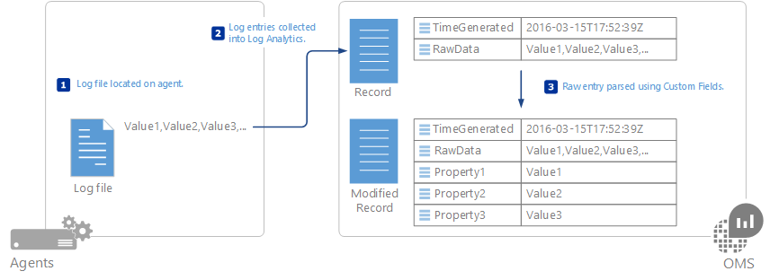
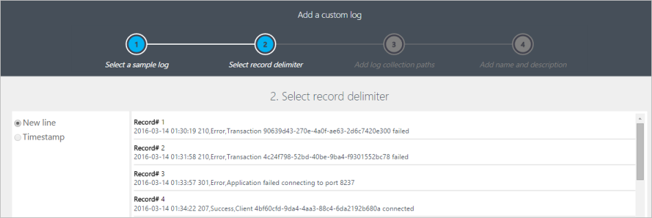
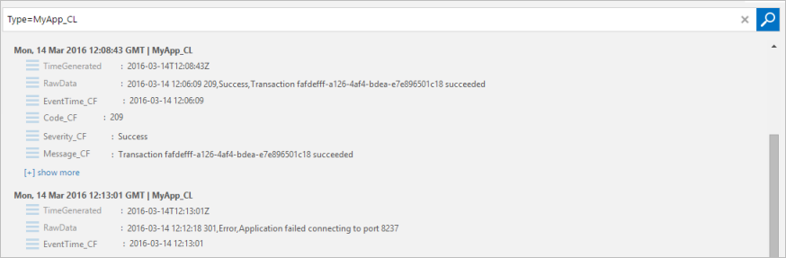

<properties 
   pageTitle="Journaux personnalisés dans le journal Analytique | Microsoft Azure"
   description="Journal Analytique recueille des événements à partir des fichiers texte sur un ordinateur Windows ou Linux.  Cet article décrit comment définir un nouveau journal personnalisé et les détails des enregistrements que créent dans le référentiel OMS."
   services="log-analytics"
   documentationCenter=""
   authors="bwren"
   manager="jwhit"
   editor="tysonn" />
<tags 
   ms.service="log-analytics"
   ms.devlang="na"
   ms.topic="article"
   ms.tgt_pltfrm="na"
   ms.workload="infrastructure-services"
   ms.date="10/18/2016"
   ms.author="bwren" />

# Journaux personnalisés dans le journal Analytique

La source de données des personnalisé dans le journal Analytique permet de collecter des événements à partir des fichiers texte sur un ordinateur Windows ou Linux. De nombreuses applications enregistrer les informations dans des fichiers texte au lieu de services d’enregistrement standard tels que le journal des événements Windows ou du journal système.  Une fois collectées, vous pouvez analyser chaque enregistrement dans le journal en champs individuels à l’aide de la fonctionnalité de [Champs personnalisés](log-analytics-custom-fields.md) de journal Analytique.

Les fichiers journaux doivent être collectés doivent correspondre les critères suivants.

- Le journal doit avoir une seule entrée par ligne ou utiliser un horodatage correspondant à un des formats suivants au début de chaque entrée.

    AAAA-MM-JJ HH : MM :  
  M/AAAA HH : MM : SS AM/PM  
  LUN jj, aaaa hh : mm :
    
- Le fichier journal doivent avoir autorisé pas mises à jour circulaires où le fichier est remplacé par les nouvelles entrées. 

## Définition d’un journal personnalisé

Utilisez la procédure suivante pour définir un fichier journal personnalisé.  Faites défiler jusqu'à la fin de cet article pour une procédure pas à pas d’un échantillon de l’ajout d’un journal personnalisé.

### Étape 1. Ouvrir l’Assistant journal personnalisé

L’Assistant de journal personnalisé s’exécute dans le portail OMS et vous permet de définir un nouveau journal personnalisé pour recueillir.

1.  Dans le portail OMS, accédez à **paramètres**.
2.  Cliquez sur **données** , puis **les journaux personnalisée**.
3.  Par défaut, toutes les modifications de configuration sont déplacées automatiquement à tous les agents.  Pour les agents Linux, un fichier de configuration est envoyé au collecteur de données Fluentd.  Si vous souhaitez modifier ce fichier manuellement sur chaque agent Linux, puis décochez la case *appliquer sous configuration à Mes ordinateurs Linux*.
4.  Cliquez sur **Add +** pour ouvrir l’Assistant de journal personnalisé.

### Étape 2. Télécharger et d’analyser un exemple de journal

Pour commencer, téléchargez un exemple du journal personnalisé.  L’Assistant analyser et afficher les entrées de ce fichier pour valider.  Journal Analytique utilise le séparateur que vous spécifiez pour identifier chaque enregistrement.

**Nouvelle ligne** est le séparateur par défaut et est utilisé pour les fichiers journaux qui ont une seule entrée par ligne.  Si la ligne commence par une date et heure dans un des formats disponibles, vous pouvez spécifier un séparateur **horodatage** qui prend en charge les entrées qui s’étalent sur plusieurs lignes. 

Si un séparateur horodatage est utilisé, puis la propriété TimeGenerated de chaque enregistrement stocké dans OMS contiendra avec la date/heure spécifiée pour cette entrée dans le fichier journal.  Si un séparateur de ligne nouvelle est utilisé, TimeGenerated est remplie avec la date et l’heure que journal Analytique collectées l’entrée. 

>[AZURE.NOTE]Journal Analytique traite actuellement la date/heure collectée à partir d’un journal à l’aide d’un délimiteur horodatage comme temps universel coordonné.  Cela changera bientôt pour utiliser le fuseau horaire de l’agent. 
 
1.  Cliquez sur **Parcourir** , puis naviguez vers un exemple de fichier.  Notez que cela peut bouton peut-être être étiqueté **Choisir un fichier** dans certains navigateurs.
2.  Cliquez sur **suivant**. 
3.  L’Assistant de journal personnalisé télécharger le fichier et répertorier les enregistrements qu’il identifie.
4.  Changer le délimiteur utilisé pour identifier un nouvel enregistrement, puis sélectionnez le séparateur qui identifie de façon optimale les enregistrements dans votre fichier journal.
5.  Cliquez sur **suivant**.

### Étape 3. Ajouter des chemins d’accès de la collection de sites journal

Vous devez définir un ou plusieurs chemins d’accès de l’agent qui permet de localiser le journal personnalisé.  Vous pouvez fournir un chemin d’accès spécifique et un nom pour le fichier journal, ou vous pouvez spécifier un chemin d’accès avec un caractère générique pour le nom.  Cela prend en charge les applications que vous créez un nouveau fichier chaque jour ou lorsqu’un fichier atteint une certaine taille.  Vous pouvez également fournir plusieurs chemins d’accès pour un fichier journal unique.

Par exemple, une application peut créer un fichier journal chaque jour avec la date incluse dans le nom comme dans log20100316.txt. Un modèle pour cet un journal peut-être être *journal\*.txt* qui s’appliquent à n’importe quel fichier journal après l’application du schéma de dénomination.

Le tableau suivant fournit des exemples de séquences valides pour spécifier les différents fichiers journaux. 

| Description | Chemin d’accès |
|:--|:--|
| Tous les fichiers stockés dans *C:\Logs* avec l’extension .txt sur agent Windows | C:\Logs\\\*.txt |
| Tous les fichiers stockés dans *C:\Logs* avec un nom commençant par journal ainsi que l’extension .txt sur agent Windows | C:\Logs\log\*.txt |
| Tous les fichiers */var/log/audit* avec l’extension .txt sur Linux agent | /var/log/audit/*.txt |
| Tous les fichiers dans */var/log/audit* avec un nom commençant par journal ainsi que l’extension .txt sur Linux agent | /var/log/audit/log\*.txt |
  

1.  Sélectionnez Windows ou Linux pour spécifier le format de chemin d’accès que vous ajoutez.
2.  Tapez le chemin d’accès et cliquez sur le **+** bouton.
3.  Répétez le processus pour les chemins d’accès supplémentaires.

### Étape 4. Fournir un nom et une description pour le journal

Le nom que vous spécifiez servira pour le type de journal comme décrit ci-dessus.  Il se termine toujours par _CL pour se distinguer comme un journal personnalisé.

1.  Tapez un nom pour le journal.  La ** \_CL** suffixe est fournie automatiquement.
2.  Ajoutez éventuellement une **Description**.
3.  Cliquez sur **suivant** pour enregistrer la définition de journal personnalisé.

### Étape 5. Valider que les journaux personnalisés sont collectées
Il peut prendre jusqu'à une heure pour que les données initiales à partir d’un nouveau journal personnalisé doivent apparaître dans le journal Analytique.  Elle commence la collecte des entrées dans les journaux figurant dans le chemin d’accès que vous avez spécifié à partir du point que vous avez défini le journal personnalisé.  Il conserve pas les entrées que vous avez téléchargée lors de la création de journal personnalisé, mais il collecterez existantes déjà entrées dans les fichiers journaux qui localise.

Une fois que le journal Analytique commence à collecter dans le journal personnalisé, ses enregistrements sera disponibles avec un journal de la recherche.  Utilisez le nom que vous avez attribué le journal personnalisé en tant que le **Type** de votre requête.

>[AZURE.NOTE] Si la propriété RawData manque de la recherche, vous devrez peut-être fermez et rouvrez votre navigateur.

### Étape 6. Analyser les entrées de journal personnalisé

L’entrée de journal entier sera stockée dans une propriété unique appelée **RawData**.  Vous souhaiterez probablement séparer les relations entre les informations contenues dans chaque entrée en propriétés individuelles stockée dans l’enregistrement.  Vous effectuez cette à l’aide de la fonctionnalité de [Champs personnalisés](log-analytics-custom-fields.md) de journal Analytique.

La procédure détaillée pour l’analyse de l’entrée de journal personnalisé n’est pas fournie ici.  Reportez-vous à la documentation de [Champs personnalisés](log-analytics-custom-fields.md) de ces informations.

## Désactiver un journal personnalisé

Vous ne pouvez pas supprimer une définition de journal personnalisé après sa création, mais vous pouvez le désactiver en supprimant tous ses chemins d’accès de la collection de sites.

1.  Dans le portail OMS, accédez à **paramètres**.
2.  Cliquez sur **données** , puis **les journaux personnalisée**.
3.  Cliquez sur **Détails** en regard de la définition du journal personnalisé à désactiver.
4.  Supprimez tous les chemins d’accès de collection de sites pour la définition de journal personnalisé.

## Collecte de données

Journal Analytique collecte des nouvelles entrées dans chaque journal personnalisé à environ 5 minutes.  L’agent enregistre son emplacement dans chaque fichier journal qu’il collecte à partir de.  Si l’agent déconnecte pendant une période donnée, puis journal Analytique collecte des entrées à partir de l’endroit où la dernière interruption, même si ces entrées créées alors que l’agent était en mode hors connexion.

Tout le contenu de l’entrée de journal est écrits sur une propriété unique appelée **RawData**.  Vous pouvez l’analyser dans plusieurs propriétés qui peuvent être analysées et recherchées séparément en définissant des [Champs personnalisés](log-analytics-custom-fields.md) après avoir créé le journal personnalisé.

## Propriétés de l’enregistrement journal personnalisé

Enregistrements de journal personnalisé avec un type avec le nom du journal que vous fournissez et les propriétés du tableau ci-dessous.

| Propriété | Description |
|:--|:--|
| TimeGenerated | Date et heure de l’enregistrement a été collecté par journal Analytique.  Si le journal utilise un séparateur de temps en fonction il s’agit du temps collecté à partir de l’entrée. |
| SourceSystem  | Type de l’enregistrement a été collecté à partir de l’agent.   Se connecter OpsManager – agent Windows, soit directement ou SCOM   Linux – tous les agents Linux  |
| RawData             | Texte complet de l’entrée collecte. |
| ManagementGroupName | Nom du groupe d’administration pour agents SCOM.  Pour les autres agents, il s’agit des AOI -\<ID de l’espace de travail\> |

## Recherches de journal avec les enregistrements de journal personnalisé

Les journaux personnalisés des enregistrements sont stockés dans le référentiel OMS comme enregistrements à partir de n’importe quelle autre source de données.  Ils ont un type correspondant au nom que vous fournissez lorsque vous définissez le journal, afin d’utiliser la propriété dans votre recherche pour récupérer des enregistrements collectées à partir d’un journal spécifique.

Le tableau suivant fournit des exemples de recherches de journaux qui extraient des enregistrements de journaux personnalisés.

| Requête | Description |
|:--|:--|
| Type = MyApp_CL | Tous les événements à partir d’un fichier personnalisé se MyApp_CL nommée. |
| Type = MyApp_CL Severity_CF = erreur | Tous les événements dans un journal personnalisé nommé MyApp_CL avec une valeur d' *erreur* dans un champ personnalisé nommé *Severity_CF*. |

## Procédure d’exemple de l’ajout d’un journal personnalisé

La section suivante décrit un exemple de création d’un journal personnalisé.  L’exemple de journal collectée contient une seule entrée dans chaque ligne commençant par une date et heure, puis une virgule délimitée par des champs pour code, état et le message.  Plusieurs exemples d’entrées sont affichées ci-dessous.

    2016-03-10 01:34:36 207,Success,Client 05a26a97-272a-4bc9-8f64-269d154b0e39 connected
    2016-03-10 01:33:33 208,Warning,Client ec53d95c-1c88-41ae-8174-92104212de5d disconnected
    2016-03-10 01:35:44 209,Success,Transaction 10d65890-b003-48f8-9cfc-9c74b51189c8 succeeded
    2016-03-10 01:38:22 302,Error,Application could not connect to database
    2016-03-10 01:31:34 303,Error,Application lost connection to database

### Télécharger et d’analyser un exemple de journal

Nous fournissons parmi les fichiers journaux et les événements auxquels il allez recueillir qui est visible.  Dans ce cas nouvelle ligne est un délimiteur suffisant.  Si une seule entrée dans le journal peut couvrir plusieurs lignes, puis un délimiteur horodatage devront être utilisée.

### Ajouter des chemins d’accès de la collection de sites journal

Les fichiers journaux seront situés dans *C:\MyApp\Logs*.  Un nouveau fichier sera créé chaque jour avec un nom qui inclut la date dans modèle *appYYYYMMDD.log*.  Un motif suffisant pour ce journal serait *C:\MyApp\Logs\\\*.log*.

### Fournir un nom et une description pour le journal

Nous utiliser un nom de *MyApp_CL* et tapez une **Description**.

### Valider que les journaux personnalisés sont collectées

Nous utilisons une requête de *Type = MyApp_CL* pour renvoyer tous les enregistrements à partir du journal collecté.

### Analyser les entrées de journal personnalisé

Nous utilisons des champs personnalisés pour définir la *EventTime*, *Code*, le *statut*, et champs du *Message* et nous pouvons voir la différence entre les enregistrements renvoyés par la requête.

## Étapes suivantes

- Utiliser [Des champs personnalisés](log-analytics-custom-fields.md) pour analyser les entrées dans le journal personnalisé dans les champs individuels.
- En savoir plus sur [les recherches de journal](log-analytics-log-searches.md) analyser les données collectées à partir de sources de données et des solutions. 