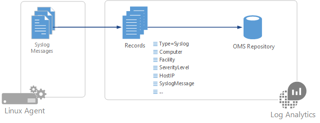
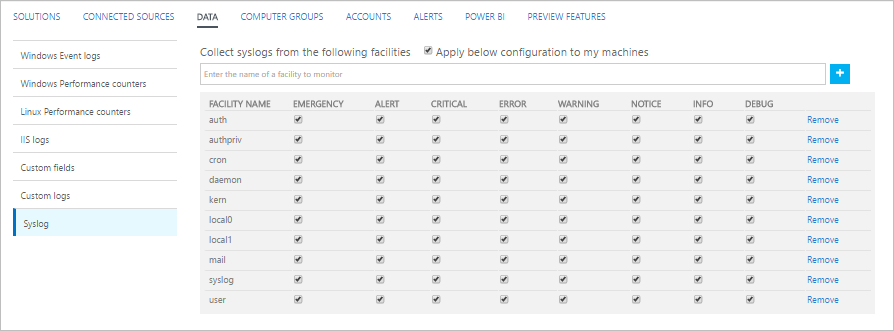

<properties 
   pageTitle="Messages de journal système dans le journal Analytique | Microsoft Azure"
   description="Journal système est un protocole de journalisation des événements qui sont commun à Linux.   Cet article décrit comment configurer la collection de messages journal système journal Analytique et les détails des enregistrements que créent dans le référentiel OMS."
   services="log-analytics"
   documentationCenter=""
   authors="bwren"
   manager="jwhit"
   editor="tysonn" />
<tags 
   ms.service="log-analytics"
   ms.devlang="na"
   ms.topic="article"
   ms.tgt_pltfrm="na"
   ms.workload="infrastructure-services"
   ms.date="09/06/2016"
   ms.author="bwren" />

# Sources de données de journal système dans le journal Analytique

Journal système est un protocole de journalisation des événements qui sont commun à Linux.  Applications vous envoie des messages pouvant être stockés sur l’ordinateur local ou remis à un collecteur de journal système.  Lorsque l’Agent OMS pour Linux est installé, il configure le processus de journal système local pour transférer des messages à l’agent.  L’agent puis envoie le message à Analytique journal où un enregistrement correspondant est créé dans le référentiel OMS.  

> [AZURE.NOTE]Journal Analytique prend en charge la collection de messages envoyés par rsyslog ou journal système naturel. Le processus de journal système par défaut dans la version 5 de version Red chapeau Enterprise Linux CentOS et Linux Oracle (sysklog) n’est pas prise en charge pour la collecte des événements de journal système. Pour collecter les données de journal système à partir de cette version de ces répartitions, le [processus rsyslog](http://rsyslog.com) doit être installé et configuré pour remplacer sysklog.

## Configuration de journal système
L’Agent OMS pour Linux collecterez uniquement les événements avec les installations et les niveaux de gravité qui est spécifiées dans sa configuration.  Vous pouvez configurer journal système via le portail OMS ou en gérant des fichiers de configuration sur vos agents Linux.

### Configurer le journal système dans le portail OMS

Configurer le journal système dans le [menu de données dans les paramètres du journal Analytique](log-analytics-data-sources.md#configuring-data-sources).  Cette configuration est remise au fichier de configuration sur chaque agent Linux.

Vous pouvez ajouter une nouvelle fonctionnalité en tapant son nom en cliquant sur **+**.  Pour chaque fonctionnalité, seuls les messages avec les niveaux de gravité sélectionné seront collectées.  Vérifier les niveaux de gravité pour l’établissement spécifique que vous souhaitez collecter.  Vous ne pouvez pas fournir des critères supplémentaires pour filtrer les messages.

Par défaut, toutes les modifications de configuration sont déplacées automatiquement à tous les agents.  Si vous voulez configurer manuellement le journal système sur chaque agent Linux, puis décochez la case *appliquer sous configuration à Mes ordinateurs Linux*.

### Configurer le journal système sur Linux agent

Lorsque l' [agent OMS est installé sur un client Linux](log-analytics-linux-agents.md), il installe un fichier de configuration de journal système par défaut qui définit l’installation et la gravité des messages qui sont collectées.  Vous pouvez modifier ce fichier pour modifier la configuration.  Le fichier de configuration est différent selon le processus de journal système le client a installé.

> [AZURE.NOTE] Si vous modifiez la configuration du journal système, vous devez redémarrer le processus de journal système pour que les modifications prennent effet.

#### rsyslog

Le fichier de configuration pour rsyslog se trouve à **/etc/rsyslog.d/95-omsagent.conf**.  Son contenu par défaut est affichées ci-dessous.  Cela permet de rassembler journal système messages envoyés à partir de l’agent local pour tous les services à un niveau d’avertissement ou une version ultérieure.

    kern.warning       @127.0.0.1:25224
    user.warning       @127.0.0.1:25224
    daemon.warning     @127.0.0.1:25224
    auth.warning       @127.0.0.1:25224
    syslog.warning     @127.0.0.1:25224
    uucp.warning       @127.0.0.1:25224
    authpriv.warning   @127.0.0.1:25224
    ftp.warning        @127.0.0.1:25224
    cron.warning       @127.0.0.1:25224
    local0.warning     @127.0.0.1:25224
    local1.warning     @127.0.0.1:25224
    local2.warning     @127.0.0.1:25224
    local3.warning     @127.0.0.1:25224
    local4.warning     @127.0.0.1:25224
    local5.warning     @127.0.0.1:25224
    local6.warning     @127.0.0.1:25224
    local7.warning     @127.0.0.1:25224

Vous pouvez supprimer une fonctionnalité en supprimant la partie du fichier de configuration.  Vous pouvez limiter les niveaux de gravité est collectées pour un établissement spécifique en modifiant l’entrée de cette fonctionnalité.  Par exemple, pour limiter la facilité d’utilisateur pour les messages dont la gravité d’erreur ou une version ultérieure vous souhaitez modifier cette ligne du fichier de configuration à ce qui suit :

    user.error  @127.0.0.1:25224

#### journal système naturel

Le fichier de configuration pour rsyslog est emplacement en **/etc/syslog-ng/syslog-ng.conf**.  Son contenu par défaut est affichées ci-dessous.  Cela permet de rassembler journal système messages envoyés à partir de l’agent local pour toutes les installations et tous les niveaux de gravité.   

    #
    # Warnings (except iptables) in one file:
    #
    destination warn { file("/var/log/warn" fsync(yes)); };
    log { source(src); filter(f_warn); destination(warn); };
    
    #OMS_Destination
    destination d_oms { udp("127.0.0.1" port(25224)); };

    #OMS_facility = auth
    filter f_auth_oms { level(alert,crit,debug,emerg,err,info,notice,warning) and facility(auth); };
    log { source(src); filter(f_auth_oms); destination(d_oms); };

    #OMS_facility = authpriv
    filter f_authpriv_oms { level(alert,crit,debug,emerg,err,info,notice,warning) and facility(authpriv); };
    log { source(src); filter(f_authpriv_oms); destination(d_oms); };

    #OMS_facility = cron
    filter f_cron_oms { level(alert,crit,debug,emerg,err,info,notice,warning) and facility(cron); };
    log { source(src); filter(f_cron_oms); destination(d_oms); };

    #OMS_facility = daemon
    filter f_daemon_oms { level(alert,crit,debug,emerg,err,info,notice,warning) and facility(daemon); };
    log { source(src); filter(f_daemon_oms); destination(d_oms); };

    #OMS_facility = kern
    filter f_kern_oms { level(alert,crit,debug,emerg,err,info,notice,warning) and facility(kern); };
    log { source(src); filter(f_kern_oms); destination(d_oms); };
    
    #OMS_facility = local0
    filter f_local0_oms { level(alert,crit,debug,emerg,err,info,notice,warning) and facility(local0); };
    log { source(src); filter(f_local0_oms); destination(d_oms); };
    
    #OMS_facility = local1
    filter f_local1_oms { level(alert,crit,debug,emerg,err,info,notice,warning) and facility(local1); };
    log { source(src); filter(f_local1_oms); destination(d_oms); };
    
    #OMS_facility = mail
    filter f_mail_oms { level(alert,crit,debug,emerg,err,info,notice,warning) and facility(mail); };
    log { source(src); filter(f_mail_oms); destination(d_oms); };
    
    #OMS_facility = syslog
    filter f_syslog_oms { level(alert,crit,debug,emerg,err,info,notice,warning) and facility(syslog); };
    log { source(src); filter(f_syslog_oms); destination(d_oms); };
    
    #OMS_facility = user
    filter f_user_oms { level(alert,crit,debug,emerg,err,info,notice,warning) and facility(user); };
    log { source(src); filter(f_user_oms); destination(d_oms); };

Vous pouvez supprimer une fonctionnalité en supprimant la partie du fichier de configuration.  Vous pouvez limiter les niveaux de gravité est collectées pour une installation donnée les supprimer de la liste.  Par exemple, pour limiter la facilité d’utilisateur aux messages simplement alertes et critiques, vous le feriez modifier cette section du fichier de configuration à ce qui suit :

    #OMS_facility = user
    filter f_user_oms { level(alert,crit) and facility(user); };
    log { source(src); filter(f_user_oms); destination(d_oms); };

### Modification du port du journal système

L’agent OMS écoute les messages de journal système sur le client local sur le port 25224.  Vous pouvez modifier ce port en ajoutant la section suivante dans le fichier de configuration de l’agent OMS situé sous **/etc/opt/microsoft/omsagent/conf/omsagent.conf**.  Remplacez 25224 dans l’entrée du **port** avec le numéro de port souhaité.  Notez que vous devrez également modifier le fichier de configuration pour le processus de journal système envoyer des messages vers ce port.

    <source>
      type syslog
      port 25224
      bind 127.0.0.1
      protocol_type udp
      tag oms.syslog
    </source>

## Collecte de données

L’agent OMS écoute les messages de journal système sur le client local sur le port 25224. Le fichier de configuration pour le processus de journal système transfère journal système messages envoyés à partir d’application à ce port où ils sont collectées par journal Analytique.

## Propriétés de l’enregistrement journal système

Journal système enregistrements ont un type de **journal système** et les propriétés dans le tableau suivant.

| Propriété | Description |
|:--|:--|
| Ordinateur | Ordinateur sur lequel l’événement a été collectée à partir de. |
| Locaux | Définit la partie du système ayant généré le message. |
| HostIP | Adresse IP du système n’envoie le message.  |
| Nom d’hôte | Nom du système envoi du message. |
| SeverityLevel | Niveau de gravité de l’événement. |
| SyslogMessage | Texte du message. |
| ProcessID | ID du processus ayant généré le message. |
| EventTime | Date et heure à laquelle l’événement a été généré.

## Journal des requêtes avec les enregistrements de journal système

Le tableau suivant fournit des exemples de requêtes de journal qui extraient des enregistrements de journal système.

| Requête | Description |
|:--|:--|
| Type = journal système | Toutes les alertes. |
| Type = Syslog SeverityLevel = erreur | Tous les enregistrements de journal système gravité d’erreur. |
| Type = journal système & #124 ; mesurer Nb() par ordinateur | Nombre de journal système les enregistrements par ordinateur. |
| Type = journal système & #124 ; mesurer Nb() par les locaux | Nombre de journal système les enregistrements par les locaux. |

## Étapes suivantes

- En savoir plus sur [les recherches de journal](log-analytics-log-searches.md) analyser les données collectées à partir de sources de données et des solutions. 
- Utilisez les [Champs personnalisés](log-analytics-custom-fields.md) pour analyser les données à partir d’enregistrements de journal système dans les champs individuels.
- [Linux configurer les agents](log-analytics-linux-agents.md) pour recueillir d’autres types de données. 
