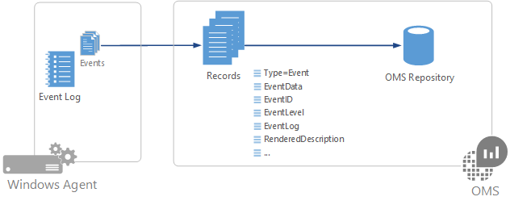

<properties 
   pageTitle="Les journaux des événements Windows dans journal Analytique | Microsoft Azure"
   description="Les journaux d’événements de Windows sont un des sources de données plus courantes utilisées par journal Analytique.  Cet article décrit comment configurer la collecte des journaux d’événements de Windows et les détails des enregistrements que créent dans le référentiel OMS."
   services="log-analytics"
   documentationCenter=""
   authors="bwren"
   manager="jwhit"
   editor="tysonn" />
<tags 
   ms.service="log-analytics"
   ms.devlang="na"
   ms.topic="article"
   ms.tgt_pltfrm="na"
   ms.workload="infrastructure-services"
   ms.date="10/18/2016"
   ms.author="bwren" />

# Sources de données de journal des événements Windows dans le journal Analytique

Les journaux d’événements de Windows sont parmi les plus courantes [des sources de données](log-analytics-data-sources.md) utilisées pour agents Windows car il s’agit de la méthode utilisée par la plupart des applications pour enregistrer des informations et des erreurs.  Vous pouvez collecter des événements à partir des journaux standards tels que le système et d’Application en plus de spécifier les journaux personnalisés créés par des applications, que vous devez surveiller.

     

## Journaux d’événements de Windows Configuration

Configurer les journaux d’événements de Windows dans le [menu de données dans les paramètres du journal Analytique](log-analytics-data-sources.md#configuring-data-sources).

Journal Analytique collecte uniquement des événements dans les journaux d’événements de Windows qui sont spécifiées dans les paramètres.  Vous pouvez ajouter un nouveau journal en tapant le nom du journal en cliquant sur **+**.  Pour chaque journal, seuls les événements avec les niveaux de gravité sélectionné seront collectées.  Vérifier les niveaux de gravité pour le journal particulier que vous souhaitez collecter.  Vous ne pouvez pas fournir des critères supplémentaires pour filtrer les événements.

## Collecte de données

Journal Analytique collecterez chaque événement qui correspond à une gravité sélectionnée à partir d’un journal des événements contrôlé en l’événement est créé.  L’agent enregistre son emplacement dans chaque journal des événements qu’il collecte à partir de.  Si l’agent déconnecte pendant une période donnée, puis journal Analytique collecte des événements à partir de l’endroit où la dernière interruption, même si les événements créés alors que l’agent était en mode hors connexion.

## Propriétés enregistrements des événements Windows

Les enregistrements d’événement Windows ont un type **d’événement** et les propriétés dans le tableau suivant.

| Propriété | Description |
|:--|:--|
| Ordinateur            | Nom de l’ordinateur sur lequel l’événement a été collectée à partir de. |
| EventCategory       | Catégorie de l’événement. |
| EventData           | Toutes les données d’événement au format brut. |
| ID de l’événement             | Numéro de l’événement. |
| EventLevel          | Gravité de l’événement sous forme numérique. |
| EventLevelName      | Gravité de l’événement sous forme de texte. |
| Journal des événements            | Nom de l’événement a été collectée à partir de journal des événements. |
| ParameterXml        | Valeurs de paramètre d’événement au format XML. |
| ManagementGroupName | Nom du groupe d’administration pour agents SCOM.  Pour les autres agents, il s’agit des AOI-<workspace ID> |
| RenderedDescription | Description de l’événement avec les valeurs de paramètre |
| Source              | Source de l’événement. |
| SourceSystem  | Type de l’événement a été collectée à partir de l’agent.   Se connecter OpsManager – agent Windows, soit directement ou SCOM   Linux – tous les agents Linux    AzureStorage – Diagnostics de Windows Azure |
| TimeGenerated       | Date et heure de que l’événement a été créé dans Windows. |
| Nom d’utilisateur            | Nom d’utilisateur du compte qui a enregistré l’événement. |

## Recherches de journal des événements Windows

Le tableau suivant fournit des exemples de recherches journal qui extraient des enregistrements d’événements de Windows.

| Requête | Description |
|:--|:--|
| Type = événement | Tous les événements de Windows. |
| Type = EventLevelName événement = Erreur | Tous les événements de Windows avec gravité d’erreur. |
| Type = événement & #124 ; Mesurer Nb() par Source | Événements de comptage de Windows par source. |
| Type = EventLevelName événement = erreur & #124 ; Mesurer Nb() par Source | Événements d’erreur Nb de Windows par source. |

## Étapes suivantes

- Configurer Analytique journal pour recueillir d’autres [sources de données](log-analytics-data-sources.md) pour l’analyse.
- En savoir plus sur [les recherches de journal](log-analytics-log-searches.md) analyser les données collectées à partir de sources de données et des solutions.  
- Utilisez les [Champs personnalisés](log-analytics-custom-fields.md) pour analyser les enregistrements d’événement en champs individuels.
- Configurer la [collection de compteurs de performance](log-analytics-data-sources-performance-counters.md) à partir de vos agents Windows.