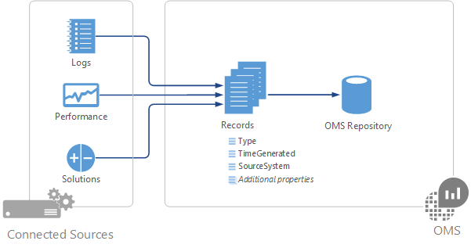

<properties 
   pageTitle="Sources de données dans le journal Analytique | Microsoft Azure"
   description="Sources de données définissent les données que collecte Analytique journal d’agents et d’autres sources connectées.  Cet article décrit le concept de comment journal Analytique utilise les sources de données, explique comment les configurer et fournit un résumé des sources de données différents disponibles."
   services="log-analytics"
   documentationCenter=""
   authors="bwren"
   manager="jwhit"
   editor="tysonn" />
<tags 
   ms.service="log-analytics"
   ms.devlang="na"
   ms.topic="article"
   ms.tgt_pltfrm="na"
   ms.workload="infrastructure-services"
   ms.date="10/18/2016"
   ms.author="bwren" />

# Sources de données dans le journal Analytique

Journal Analytique collecte des données à partir des Sources dans votre espace de travail OMS connecté et qu’il stocke dans référentiel OMS.  Les données collectées à partir de chaque définies par les Sources de données que vous configurez.  Données dans le référentiel OMS sont stockées comme un jeu d’enregistrements.  Chaque source de données crée des enregistrements d’un type particulier avec chaque type ayant son propre jeu de propriétés.

Sources de données sont différents des Solutions OMS qui également collecter les données provenant de Sources connecté et créer des enregistrements dans le référentiel OMS.  Solutions peuvent être ajoutées à votre espace de travail à partir de la galerie de Solutions et fourniront généralement les outils d’analyse supplémentaires dans le portail OMS.  

## Résumé des sources de données

Les sources de données qui sont actuellement disponibles dans le journal Analytique sont répertoriées dans le tableau suivant.  Chacune contient un lien vers un autre article fournir des détails pour cette source de données.

| Source de données | Type d’événement | Description |
|:--|:--|:--|
| [Journaux personnalisés](log-analytics-data-sources-custom-logs.md) | \<LogName\>_CL | Fichiers texte sur Windows ou Linux agents contenant des informations de journal. |
| [Journaux d’événements Windows](log-analytics-data-sources-windows-events.md) | Événement | Les événements collectés dans le journal des événements sur les ordinateurs Windows. |
| [Compteurs de Performance Windows](log-analytics-data-sources-performance-counters.md) | Performances | Compteurs de performance collectées à partir d’ordinateurs Windows. |
| [Compteurs de Performance Linux](log-analytics-data-sources-performance-counters.md) | Performances | Compteurs de performance collectées à partir d’ordinateurs Linux. |
| [Journaux IIS](log-analytics-data-sources-iis-logs.md) | W3CIISLog | Internet Information Services journaux au format W3C. |
| [Journal système](log-analytics-data-sources-syslog.md) | Journal système | Événements de journal système sur un ordinateur Windows ou Linux. |

## Configuration des sources de données

Configuration de sources de données à partir du menu **données** dans journal Analytique **paramètres**.  N’importe quelle configuration est remise à toutes les sources connectées dans votre espace de travail OMS.  Vous ne pouvez pas actuellement permet d’exclure les agents de cette configuration.

2. Dans la console OMS sélectionnez la vignette **paramètres** .
3. Sélectionnez **les données**.
4. Cliquez sur la source de données à configurer.
5. Suivez le lien vers la documentation pour chaque source de données dans le tableau ci-dessus pour plus d’informations sur leur configuration.

## Collecte de données

Configurations de source de données sont remies à agents qui sont connectés directement à OMS après quelques minutes.  Les données spécifiées sont collectées à partir de l’agent et remies directement au journal Analytique à des intervalles spécifiques à chaque source de données.  Consultez la documentation pour chaque source de données pour ces caractéristiques.

Pour agents de System Center Operations Manager (SCOM) dans un groupe d’administration connecté, configurations de source de données sont converties en packs d’administration et remies au groupe d’administration toutes les 5 minutes par défaut.  L’agent télécharge le pack d’administration comme n’importe quel autre et collecte les données spécifiées. En fonction de la source de données les données sera envoyé à un serveur de gestion qui transfère les données à l’Analytique journal ou l’agent vous envoie les données au journal Analytique sans passer par le serveur d’administration. Voir la rubrique [Détails de collecte de données pour les solutions et les fonctionnalités OMS](log-analytics-add-solutions.md#data-collection-details-for-oms-features-and-solutions) pour plus d’informations.  Vous pouvez en savoir plus sur Détails de connexion SCOM et OMS et la modification de la fréquence de cette configuration est remis à [Configurer l’intégration avec System Center Operations Manager](log-analytics-om-agents.md).

## Les enregistrements Analytique de journal

Toutes les données collectées par Analytique journal est stocké dans le référentiel OMS comme enregistrements.  Enregistrements collectées par différentes sources de données contient leur propre jeu de propriétés et être identifiés par sa propriété **Type** .  Consultez la documentation pour chaque source de données et solution pour plus d’informations sur chaque type d’enregistrement.

## Étapes suivantes

- Découvrez les [solutions](log-analytics-add-solutions.md) qui ajouter des fonctionnalités à journal Analytique et également collecter des données dans le référentiel OMS.
- En savoir plus sur [les recherches de journal](log-analytics-log-searches.md) analyser les données collectées à partir de sources de données et des solutions.  
- Configurer des [alertes](log-analytics-alerts.md) pour vous signaler le fait de données critiques collectées à partir de sources de données et des solutions.
