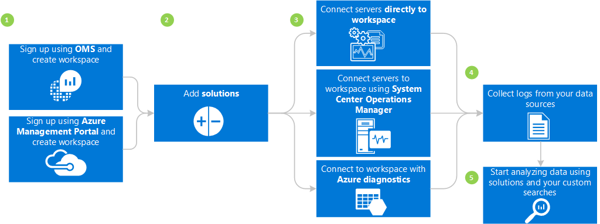
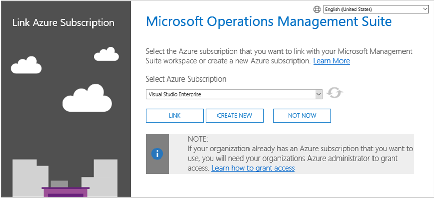
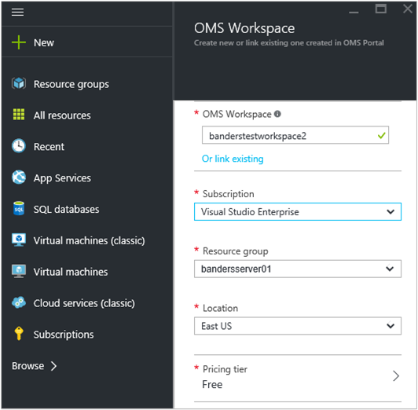
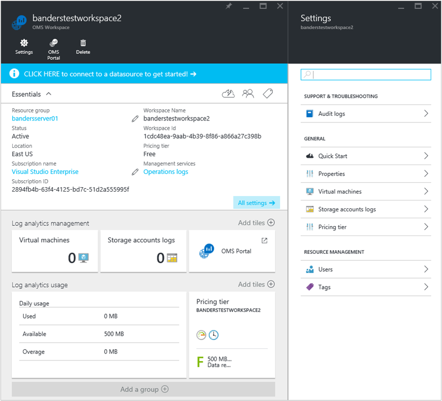

<properties
    pageTitle="Prise en main journal Analytique | Microsoft Azure"
    description="Vous pouvez obtenir en cours d’exécution avec journal Analytique dans la Suite de gestion des opérations (OMS) Microsoft en minutes."
    services="log-analytics"
    documentationCenter=""
    authors="bandersmsft"
    manager="jwhit"
    editor=""/>

<tags
    ms.service="log-analytics"
    ms.workload="na"
    ms.tgt_pltfrm="na"
    ms.devlang="na"
    ms.topic="get-started-article"
    ms.date="10/10/2016"
    ms.author="banders"/>

# Prise en main Analytique de journal

Vous pouvez obtenir en cours d’exécution avec journal Analytique dans la Suite de gestion des opérations (OMS) Microsoft en minutes. Vous avez deux possibilités lors du choix de la création d’un espace de travail OMS, qui est similaire à un compte :

- Site Web Microsoft opérations Management Suite
- Abonnement Microsoft Azure

Vous pouvez créer un espace de travail OMS gratuit via le site Web OMS. Ou bien, vous pouvez utiliser un abonnement Microsoft Azure pour créer un espace de travail OMS. Les deux espaces de travail sont équivalentes, sauf qu’un espace de travail OMS gratuit peut envoyer uniquement quotidiennement 500 Mo de données au service OMS. Si vous utilisez un abonnement Azure, vous pouvez également utiliser cet abonnement pour accéder à d’autres services Azure. Quelle que soit la méthode qui vous permet de créer l’espace de travail, vous devez créer l’espace de travail avec un compte Microsoft ou un compte professionnel.

Voici un aperçu du processus :

## Conditions préalables journal Analytique et les considérations relatives au déploiement

- Vous avez besoin d’un abonnement payant Microsoft Azure pour une utilisation optimale journal Analytique. Si vous n’avez un abonnement Azure, créez un [compte gratuit](https://azure.microsoft.com/free/) qui vous permet d’accéder à n’importe quel service Azure. Ou bien, vous pouvez créer un compte OMS gratuit sur le site Web [Opérations Management Suite](http://microsoft.com/oms) et cliquez sur **essayer gratuitement**.
- Un espace de travail OMS
- Chaque ordinateur Windows que vous voulez rassembler des données à partir de doivent exécuter Windows Server 2008 SP1 ou version ultérieure
- Accès de [pare-feu](log-analytics-proxy-firewall.md) pour l’OMS web adresses du service
- Un serveur [OMS journal Analytique redirecteurs](https://blogs.technet.microsoft.com/msoms/2016/03/17/oms-log-analytics-forwarder) (passerelle) pour transférer le trafic à partir des serveurs à OMS, si l’accès à Internet n’est pas disponible à partir d’ordinateurs
- Si vous utilisez Operations Manager, prend en charge de journal Analytique Operations Manager 2012 SP1 UR6 et au-dessus et Operations Manager 2012 R2 UR2 et au-dessus. Prise en charge proxy a été ajoutée dans Operations Manager 2012 SP1 Exclusion UR7 et Operations Manager 2012 R2 UR3. Déterminer comment il sera intégrée avec OMS.
- Déterminer si vos ordinateurs ont accès direct à Internet. Dans le cas contraire, ils nécessitent un serveur de passerelle pour accéder aux sites de service web OMS. Tous les accès sont via HTTPS.
- Déterminer les technologies d’assistance et les serveurs envoie des données à OMS. Par exemple, domaine, SQL Server, etc.
- Accorder aux utilisateurs dans OMS et Azure.
- Si vous êtes soucieux de l’utilisation des données, déployer chaque solution individuellement et tester l’impact sur les performances avant d’ajouter des solutions supplémentaires.
- Passez en revue l’utilisation de données et les performances lorsque vous ajoutez des solutions et fonctionnalités au journal Analytique. Cela inclut la collecte d’événements, journal de collection de sites, collecte de données de performance, etc.. Il s’agit mieux commencer minimale collection jusqu'à ce que l’utilisation des données ou impact sur les performances a été identifié.
- Vérifiez que les agents Windows ne sont pas également gérés à l’aide de Operations Manager, dans le cas contraire générera des données en double. Cela s’applique également à Azure-base-agents ayant des Diagnostics Azure activé.
- Après avoir installé agents, vérifiez que l’agent fonctionne correctement. Si pas, vérifiez que chiffrement API : nouvelle génération (CNG) clé isolement n’est pas désactivé à l’aide de la stratégie de groupe.
- Certaines solutions Analytique journal ont des exigences supplémentaires

## S’inscrire dans les 3 étapes à l’aide de la Suite de gestion des opérations

1. Accédez au site Web [Opérations Management Suite](http://microsoft.com/oms) et cliquez sur **essayer gratuitement**. Connectez-vous avec votre compte Microsoft tels que Outlook.com ou avec un compte professionnel fourni par votre entreprise ou établissement d’enseignement à utiliser avec Office 365 ou d’autres services Microsoft.
2. Attribuez un nom unique espace de travail. Un espace de travail est un conteneur logique l’emplacement de stockage de vos données de gestion. Il propose un moyen de données partition entre différentes équipes de votre organisation, comme les données sont disponible uniquement dans son espace de travail. Spécifiez une adresse de messagerie et la zone où vous voulez que vos données soient stockées.  
    
3. Ensuite, vous pouvez créer un nouvel abonnement Azure ou un lien à un abonnement Azure existant. Si vous voulez continuer à l’aide de la version d’évaluation gratuite, cliquez sur **Non**.  
  

Vous êtes prêt à commencer à utiliser le portail opérations Management Suite.

Vous pouvez en savoir plus sur la configuration de votre espace de travail et liaison Azure existant comptes aux espaces de travail créés avec la gamme de gestion des opérations à [gérer l’accès aux journaux Analytique](log-analytics-manage-access.md).

## S’inscrire rapidement à l’aide de Microsoft Azure

1. Accédez au [portail Azure](https://portal.azure.com) et se connecter, parcourir la liste des services et puis sélectionnez **Journaux Analytique (OMS)**.  
    
2. Cliquez sur **Ajouter**, puis sélectionnez les options pour les éléments suivants :
    - Nom de **l’Espace de travail OMS**
    - **Abonnement** - si vous avez plusieurs abonnements, choisissez celui que vous souhaitez associer à l’espace de travail.
    - **Groupe de ressources**
    - **Emplacement**
    - **Niveau de tarification**  
        
3. Cliquez sur **créer** et vous verrez les détails de l’espace de travail dans le portail Azure.       
             
4. Cliquez sur le lien **OMS Portal** pour ouvrir le site Web opérations Management Suite avec votre nouvel espace de travail.

Vous êtes prêt à commencer à utiliser le portail opérations Management Suite.

Vous pouvez en savoir plus sur la configuration de votre espace de travail et liaison des espaces de travail existants que vous avez créé avec la gamme de gestion des opérations aux abonnements Azure à [gérer l’accès aux journaux Analytique](log-analytics-manage-access.md).

## Prise en main du portail opérations Management Suite
Pour choisir des solutions et connectez les serveurs que vous voulez gérer, cliquez sur la vignette **paramètres** et suivez les étapes décrites dans cette section.  

  

1. **Ajouter des Solutions** - permet d’afficher vos solutions installées.  
      
    Cliquez sur **visiter la galerie** pour ajouter davantage de solutions.  
      
    Sélectionnez une solution, puis sur **Ajouter**.
2. **Connecter une source** - Choisissez comment vous voulez vous connecter à votre environnement de serveur pour collecter des données :
    - Se connecter tout Windows Server ou client directement en installant un agent.
    - Se connecter serveurs Linux avec l’Agent OMS Linux.
    - Utilisez un compte de stockage Azure configuré avec l’extension machine virtuelle diagnostic Windows ou Linux Azure.
    - Utilisez System Center Operations Manager pour joindre votre groupes d’administration ou tout votre déploiement Operations Manager.
    - Activer Windows télémétrie utiliser Analytique mise à niveau.
            

3. **Collecter des données** Configurer au moins une source de données pour remplir les données dans votre espace de travail. Lorsque vous avez terminé, cliquez sur **Enregistrer**.    

        

## Vous pouvez également connecter serveurs directement à la Suite de gestion des opérations en installant un agent

L’exemple suivant vous montre comment installer un agent Windows.

1. Cliquez sur la vignette **paramètres** , cliquez sur l’onglet **Sources connectées** , cliquez sur un onglet pour le type de source que vous souhaitez ajouter et download un agent ou en savoir plus sur l’activation d’un agent. Par exemple, cliquez sur **Télécharger un Agent Windows (64 bits)**. Pour les agents Windows, vous pouvez installer uniquement l’agent Windows Server 2008 SP 1 ou version ultérieure ou sous Windows 7 SP1 ou version ultérieure.
2. Installer l’agent sur un ou plusieurs serveurs. Vous pouvez installer des agents un par un ou en utilisant une méthode plus automatisée avec un [script personnalisé](log-analytics-windows-agents.md), ou vous pouvez utiliser une solution de distribution de logiciels existant que vous pourriez rencontrer.
3. Une fois que vous acceptez le contrat de licence et que vous choisissez votre dossier d’installation, sélectionnez **se connecter l’agent à Azure journal Analytique (OMS)**.   
    

4. Dans la page suivante, vous êtes invité pour votre ID de l’espace de travail et votre clé de l’espace de travail. Votre ID de l’espace de travail et la clé sont affichés dans l’écran où vous avez téléchargé le fichier de l’agent.  
      

    
5. Pendant l’installation, vous pouvez cliquer sur **Avancé** pour vous pouvez également configurer votre serveur proxy et fournir des informations d’authentification. Cliquez sur le bouton **suivant** pour revenir à l’écran informations espace de travail.
6. Cliquez sur **suivant** pour valider votre ID de l’espace de travail et la clé. Si des erreurs sont trouvées, vous pouvez cliquer sur **précédent** pour apporter des corrections. Lorsque votre espace de travail ID et votre clé sont validées, cliquez sur **installer** pour terminer l’installation de l’agent.
7. Dans le panneau de configuration, cliquez sur Agent de surveillance Microsoft > onglet Azure journal Analytique (OMS). Une icône représentant une coche verte s’affiche lorsque les agents de communiquent avec le service opérations Management Suite. Accédez à l’origine, environ 5 à 10 minutes.

>[AZURE.NOTE] Les solutions d’évaluation de configuration et la gestion capacité ne sont actuellement pas pris en charge par les serveurs connectés directement à la Suite de gestion des opérations.

Vous pouvez également vous connecter à l’agent à System Center Operations Manager 2012 SP1 et versions ultérieures. Pour ce faire, sélectionnez **se connecter l’agent de System Center Operations Manager**. Lorsque vous choisissez qu’option, vous envoyez des données au service sans matériel supplémentaire ou chargez votre groupe d’administration.

Vous pouvez en savoir plus sur la connexion d’agents à la Suite de gestion des opérations sur les [ordinateurs Windows de se connecter au journal Analytique](log-analytics-windows-agents.md).

## Vous pouvez également relier des serveurs à l’aide de System Center Operations Manager

1. Dans la console Operations Manager, sélectionnez **Administration**.
2. Développez le nœud **Perspectives opérationnelles** et sélectionnez **Connexion Insights opérationnelle**.

  >[AZURE.NOTE] Selon les mise à jour report de SCOM que vous utilisez, vous risquez de voir un nœud *System Center Advisor*, *Perspectives opérationnelles*ou *Suite de gestion des opérations*.

3. Cliquez sur le lien **Enregistrer analyse opérationnelles** dans le coin supérieur droit, puis suivez les instructions.
4. Fin de l’Assistant d’inscription, cliquez sur le lien **Ajouter un ordinateur ou du groupe** .
5. Dans la boîte de dialogue **Recherche de l’ordinateur** , vous pouvez rechercher des ordinateurs ou des groupes contrôlés par Operations Manager. Sélectionnez-les ordinateurs ou des groupes à intégré au journal Analytique, cliquez sur **Ajouter**, puis cliquez sur **OK**. Vous pouvez vérifier que le service OMS reçoit des données en accédant à la vignette de **l’utilisation** du portail opérations Management Suite. Données doivent apparaître dans environ 5 à 10 minutes.

Vous pouvez en savoir plus sur la connexion Operations Manager à la Suite de gestion des opérations à [Se connecter Operations Manager pour journal Analytique](log-analytics-om-agents.md).

## Vous pouvez également analyser des données provenant de services cloud Microsoft Azure

Grâce à la Suite de gestion des opérations, vous pouvez rapidement rechercher journaux des événements et IIS pour les services de cloud et machines virtuelles en activant les diagnostics pour les Services en nuage Azure. Vous pouvez également recevoir des informations supplémentaires pour vos machines virtuelles Azure en installant l’Agent de surveillance Microsoft. Vous pouvez en savoir plus sur la façon de configurer votre environnement Azure pour utiliser la Suite de gestion des opérations au [stockage Azure se connecter au journal Analytique](log-analytics-azure-storage.md).

## Étapes suivantes

- [Solutions ajouter journal Analytique à partir de la galerie de Solutions](log-analytics-add-solutions.md) pour ajouter des fonctionnalités et recueillir des données.
- Se familiariser avec des [recherches de journal](log-analytics-log-searches.md) afficher des informations détaillées collectées par les solutions.
- Utiliser des [tableaux de bord](log-analytics-dashboards.md) pour enregistrer et afficher vos propres critères de recherche personnalisés.
