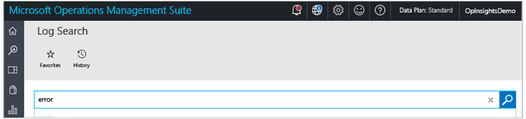
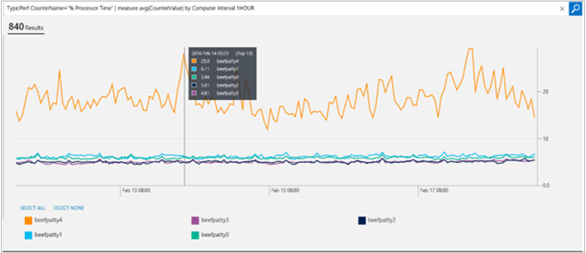

<properties
    pageTitle="Connectez-vous recherches journal Analytique | Microsoft Azure"
    description="Recherches de journaux vous permettent de vous permet de combiner et de faire correspondre toutes les données de plusieurs sources au sein de votre environnement machine."
    services="log-analytics"
    documentationCenter=""
    authors="bandersmsft"
    manager="jwhit"
    editor=""/>

<tags
    ms.service="log-analytics"
    ms.workload="na"
    ms.tgt_pltfrm="na"
    ms.devlang="na"
    ms.topic="article"
    ms.date="10/10/2016"
    ms.author="banders"/>

# <a name="log-searches-in-log-analytics"></a>Journal des recherches dans le journal Analytique

Cœur de journal Analytique inclut la fonctionnalité de recherche de journal qui permet de vous permet de combiner et de faire correspondre toutes les données de plusieurs sources au sein de votre environnement machine. Solutions sont également optimisées par journal recherche afin de vous métriques pivoter autour d’une zone de problème particulier.

Dans la page de recherche, vous pouvez créer une requête, et puis lorsque vous recherchez, vous pouvez filtrer les résultats à l’aide de contrôles facette. Vous pouvez également créer des requêtes avancées pour transformer, filtrer et rapport de vos résultats.

Requêtes de recherche courantes journal s’affichent dans la plupart des pages de la solution. Dans l’ensemble de la console OMS, vous pouvez cliquer vignettes ou Explorer les niveaux d’à d’autres éléments pour afficher plus d’informations sur l’élément à l’aide de recherche dans un journal.

Dans ce didacticiel, nous allons exemples expliquer les principes de base lors de l’utilisation de la recherche dans un journal.

Nous allons commencer avec des exemples simples et pratiques et générer les afin que vous pouvez obtenir une présentation pratique de cas d’utilisation sur l’utilisation de la syntaxe de la pour extraire les analyses souhaité à partir des données.

Une fois que vous avez familiarisé avec les techniques de recherche, vous pouvez consulter le [journal Analytique se référence de recherche](log-analytics-search-reference.md).

## <a name="use-basic-filters"></a>Utiliser des filtres de base

La première chose à savoir est que la première partie d’une recherche de la requête, avant tout « | » caractère barre verticale, est toujours un *filtre*. Vous pouvez considérer comme une clause WHERE dans TSQL--il détermine *le* sous-ensemble de données afin de tirer parti de la banque de données OMS de celle-ci. Recherche dans le magasin de données est largement sur la spécification les caractéristiques des données que vous souhaitez extraire, afin qu’elle soit naturelle qu’une requête s’ouvrira avec la clause WHERE.

Les filtres plus simples, que vous pouvez utiliser sont des *mots clés*, tels que « erreur » ou « délai d’expiration » ou un nom d’ordinateur. Ces types de requêtes simples retournent généralement diverses formes de données dans le même jeu de résultats. C’est parce que journal Analytique a différents *types* de données dans le système.


### <a name="to-conduct-a-simple-search"></a>Pour effectuer une recherche simple
1. Dans le portail OMS, cliquez sur **Recherche de journal**.  
    
2. Dans le champ de requête, tapez `error` , puis cliquez sur **recherche**.  
      
    Par exemple, la requête pour `error` dans l’image suivante renvoyée 100 000 enregistrements **événement** (collectées par la gestion des journaux), 18 enregistrements **ConfigurationAlert** (générées par évaluation de Configuration) et 12 **ConfigurationChange** enregistrements (capturés par le suivi des modifications).   
      

Ces filtres ne sont pas vraiment classes/types d’objets. *Le type* est simplement une balise, une propriété ou une chaîne/nom/catégorie, qui est associée à un élément de données. Certains documents dans le système sont automatiquement marqués comme **Type : ConfigurationAlert** et certaines sont marqués comme **Type : performance**ou **Type : événements**et ainsi de suite. Chaque résultat de recherche, document, enregistrement ou entrée affiche toutes les propriétés brutes et leurs valeurs pour chacun de ces éléments de données, et vous pouvez utiliser les noms de champs pour spécifier dans le filtre lorsque vous souhaitez récupérer uniquement les enregistrements dont le champ contient qui valeur donnée.

*Le type* est simplement un champ qui contient tous les enregistrements, il n’est pas différente de n’importe quel autre champ. Cela a été établie en fonction de la valeur du champ Type. Cet enregistrement a une autre forme ou. Par ailleurs, **Type = performance**, ou **Type = événement** est également la syntaxe que vous avez besoin interroger des données de performance ou des événements.

Vous pouvez utiliser un signe deux-points ( :)) ou un signe égal (=) après le nom du champ et avant la valeur. **Type : événements** et **Type = événement** sont une signification équivalente, vous pouvez choisir le style souhaité.

Ainsi, si le Type = performance enregistrements avec un champ nommé « CounterName », puis vous pouvez écrire une requête qui ressemble à `Type=Perf CounterName="% Processor Time"`.

Cela vous donne uniquement les données de performance où le nom de compteur de performances est « % temps processeur ».

### <a name="to-search-for-processor-time-performance-data"></a>Pour rechercher des données de performance processeur time
- Dans le champ de requête de recherche, tapez`Type=Perf CounterName="% Processor Time"`

Vous pouvez également être plus spécifique et utiliser **InstanceName = _ « Total »** dans la requête, qui est un compteur de performance Windows. Vous pouvez également sélectionner une facette et une autre **: valeur du champ**. Le filtre est ajouté automatiquement à votre filtre dans la barre de requête. Vous pouvez le voir dans l’image suivante. Il vous indique où cliquer pour ajouter **InstanceName : '_Total'** à la requête sans avoir à taper rien.


Votre requête est alors`Type=Perf CounterName="% Processor Time" InstanceName="_Total"`

Dans cet exemple, vous n’êtes pas obligé de spécifier **Type = performance** pour accéder à ce résultat. Étant donné que les champs CounterName et InstanceName existent uniquement pour les enregistrements de Type = performance, la requête est suffisamment spécifique pour renvoyer les mêmes résultats que l’option précédente, plus de temps :
```
CounterName="% Processor Time" InstanceName="_Total"
```

C’est parce que tous les filtres dans la requête sont évaluées comme étant *AND* entre eux. Efficace, plus de champs que vous ajoutez le critère, vous obtenez inférieure, des résultats plus spécifiques et soignés.

Par exemple, la requête `Type=Event EventLog="Windows PowerShell"` est identique à `Type=Event AND EventLog="Windows PowerShell"`. Elle renvoie tous les événements qui ont été connectés et collectées à partir du journal des événements Windows PowerShell. Si vous ajoutez un filtre plusieurs fois en sélectionnant plusieurs fois la même facette, puis le problème est purement cosmétique--il peut surcharger la barre de recherche, mais elle retourne toujours le même résultat, car l’opérateur AND implicite est toujours.

Vous pouvez facilement inverser l’opérateur AND implicite en utilisant un opérateur n’est pas explicitement. Par exemple :

`Type:Event NOT(EventLog:"Windows PowerShell")`ou son équivalent `Type=Event EventLog!="Windows PowerShell"` renvoyer tous les événements à partir de tous les autres journaux qui ne sont pas le journal de Windows PowerShell.

Ou, vous pouvez utiliser d’autres opérateurs booléens tels que « Ou ». La requête suivante renvoie les enregistrements dont le journal des événements sont un système ou Application.

```
EventLog=Application OR EventLog=System
```

À l’aide de la requête ci-dessus, vous obtiendrez entrées pour ces deux journaux dans le même jeu de résultats.

Cependant, si vous supprimez l’opérateur OR en laissant l’implicites et en place, puis la requête suivante ne produira aucun résultat, car il n’est pas une entrée de journal des événements appartenant à ces deux journaux. Chaque entrée de journal des événements écrite à un seul des deux journaux.

```
EventLog=Application EventLog=System
```


## <a name="use-additional-filters"></a>Utiliser des filtres supplémentaires

La requête suivante renvoie entrées pour 2 les journaux d’événements pour tous les ordinateurs qui ont envoyé des données.

```
EventLog=Application OR EventLog=System
```


Sélection de l’un des champs ou des filtres pour rétrécir la requête à un ordinateur spécifique, à l’exclusion de tous les autres à. La requête qui en résulte aurait l’aspect suivant.

```
EventLog=Application OR EventLog=System Computer=SERVER1.contoso.com
```

Qui équivaut à ce qui suit, en raison de l’opérateur AND. implicite

```
EventLog=Application OR EventLog=System AND Computer=SERVER1.contoso.com
```

Chaque requête est évaluée dans l’ordre suivant explicite. Remarque la parenthèse.

```
(EventLog=Application OR EventLog=System) AND Computer=SERVER1.contoso.com
```

Comme le champ journal des événements, vous pouvez extraire des données uniquement pour un ensemble d’ordinateurs spécifiques en ajoutant ou. Par exemple :

```
(EventLog=Application OR EventLog=System) AND (Computer=SERVER1.contoso.com OR Computer=SERVER2.contoso.com OR Computer=SERVER3.contoso.com)
```

De même, cela la requête suivante renvoie **% temps processeur** pour les deux ordinateurs sélectionnés uniquement.

```
CounterName="% Processor Time"  AND InstanceName="_Total" AND (Computer=SERVER1.contoso.com OR Computer=SERVER2.contoso.com)
```


### <a name="boolean-operators"></a>Opérateurs booléens
Avec la date/heure et les champs numériques, vous pouvez rechercher des valeurs à l’aide de *supérieur*, *moindre que*, et *inférieure ou égale*. Vous pouvez utiliser des opérateurs simples tel que >, <>, =, < =, ! = dans la barre de recherche de requête.


Vous pouvez interroger un journal des événements spécifique pour une période donnée. Par exemple, les dernières 24 heures est indiquée par l’expression suivante mnémonique.

```
EventLog=System TimeGenerated>NOW-24HOURS
```


#### <a name="to-search-using-a-boolean-operator"></a>Effectuer une recherche à l’aide d’un opérateur booléen
- Dans le champ de requête de recherche, tapez`EventLog=System TimeGenerated>NOW-24HOURS"`  
    

Bien que vous pouvez contrôler l’intervalle de temps sous forme graphique, et la plupart du temps que vous souhaiterez peut-être faire cela, il existe des avantages, y compris un filtre période directement dans la requête. Par exemple, cela fonctionne parfaitement avec des tableaux de bord dans laquelle vous pouvez ignorer la durée de chaque vignette, quel que soit le sélecteur d’heure *global* dans la page tableau de bord. Pour plus d’informations, voir [Questions de temps dans le tableau de bord](http://cloudadministrator.wordpress.com/2014/10/19/system-center-advisor-restarted-time-matters-in-dashboard-part-6/).

Lorsque vous filtrez par heure, n’oubliez pas que vous obtiendrez des résultats à l' *intersection* des deux périodes : celle indiquée dans le portail OMS (S1) et celui spécifié dans la requête (S2).


Cela signifie que si les périodes de temps ne se coupent, par exemple dans le portail OMS dans laquelle vous choisissez **cette semaine** et dans la requête où vous pouvez définir **la semaine dernière**, il n’y a pas d’intersection et vous ne recevez aucun résultat.

Opérateurs de comparaison utilisés pour le champ TimeGenerated sont également utiles dans d’autres situations. Par exemple, avec les champs numériques.

Par exemple, étant donné qu’alertes de Configuration évaluation ont les valeurs de gravité suivantes :

- 0 = informations
- 1 = avertissement
- 2 = critique

Vous pouvez interroger des alertes d’avertissement et critiques et également exclure d’information sont ceux avec la requête suivante :

```
Type=ConfigurationAlert  Severity>=1
```


Vous pouvez également utiliser des requêtes de plage. Cela signifie que vous pouvez fournir la plage de début et de fin des valeurs dans une séquence. Par exemple, si vous souhaitez que les événements dans le journal des événements Operations Manager où EventID est supérieur ou égal à 2100 mais inférieure ou égale à 2199, puis la requête suivante renvoie les.

```
Type=Event EventLog="Operations Manager" EventID:[2100..2199]
```


>[AZURE.NOTE] La syntaxe de la plage que vous devez utiliser est le séparateur de champ : valeur deux-points ( :)) et *pas* le signe égal (=). Entrez la fin inférieure et supérieure de la plage de crochets et séparez-les par deux points (.).

## <a name="manipulate-search-results"></a>Manipuler des résultats de recherche

Lorsque vous recherchez des données, vous souhaiterez affinez votre requête de recherche et ont un bon niveau de contrôle sur les résultats. Lorsque les résultats sont récupérés, vous pouvez appliquer des commandes leur transformation.

Commandes d’Analytique journal recherches *doivent* suivent après le caractère barre verticale (|). Un filtre doit toujours être la première partie d’une chaîne de requête. Il définit le jeu de données avec lequel vous travaillez et puis « injecte » ces résultats dans une ligne de commande. Vous pouvez ensuite utiliser le canal pour ajouter des commandes supplémentaires. Cela revient la plus dans le pipeline de Windows PowerShell.

En règle générale, la langue de recherche Analytique journal tente à respecter les instructions pour le rendre similaire à l’informatique et pour faciliter l’apprentissage et style de PowerShell.

Commandes portent des noms de verbes afin que vous pouvez facilement déterminer ce qu’elles font.  

### <a name="sort"></a>Tri

La commande trier vous permet de définir l’ordre de tri par un ou plusieurs champs. Même si vous n’utilisez pas, par défaut, une fois l’ordre décroissant est appliquée. Les résultats de la plus récentes sont toujours en haut des résultats de recherche. Cela signifie que lorsque vous exécutez une recherche, avec `Type=Event EventID=1234` ce qui est vraiment exécuté pour vous est :

```
Type=Event EventID=1234 **| Sort TimeGenerated desc**
```

C’est parce qu’il s’agit du type de l’expérience que vous connaissez dans les journaux. Par exemple, dans l’Observateur d’événements.

Vous pouvez utiliser tri pour modifier la façon dont les résultats sont retournés. Les exemples suivants montrent comment cela fonctionne.

```
Type=Event EventID=1234 | Sort TimeGenerated asc
```

```
Type=Event EventID=1234 | Sort Computer asc
```

```
Type=Event EventID=1234 | Sort Computer asc,TimeGenerated desc
```


Les exemples simples ci-dessus vous montrent comment fonctionnent les commandes--ils modifient la forme des résultats renvoyé le filtre.

### <a name="limit-and-top"></a>Limite et haut
La limite est une autre moins commande connue. La limite est un verbe j’aime PowerShell. Limite est fonctionne de la même manière que la commande supérieure. Les requêtes suivantes retournent le même résultat.

```
Type=Event EventID=600 | Limit 1
```

```
Type=Event EventID=600 | Top 1
```


#### <a name="to-search-using-top"></a>Effectuer une recherche à l’aide du haut
- Dans le champ de requête de recherche, tapez`Type=Event EventID=600 | Top 1`   
    

Dans l’image ci-dessus, il existe des enregistrements 358 mille avec EventID = 600. Les champs, facettes et filtres gauche toujours affichent les informations sur les résultats retournés *par la partie de filtre* de la requête, ce qui correspond à la partie avant tout caractère barre verticale. Le volet des **résultats** renvoie uniquement la valeur la plus récente de 1, car l’exemple de commande en forme et les résultats de la transformation.

### <a name="select"></a>Sélectionnez

La commande SELECT se comporte comme Select-Object dans PowerShell. Elle retourne les résultats filtrés qui n’ont pas toutes leurs propriétés d’origine. Au lieu de cela, il sélectionne uniquement les propriétés que vous spécifiez.

#### <a name="to-run-a-search-using-the-select-command"></a>Pour exécuter une recherche à l’aide de la commande select

1. Dans Rechercher, tapez `Type=Event` , puis cliquez sur **recherche**.
2. Cliquez sur **+ Afficher plus** dans un des résultats pour afficher toutes les propriétés dont les résultats.
3. Sélectionnez certaines d'entre elles explicitement et la requête transforme en `Type=Event | Select Computer,EventID,RenderedDescription`.  
    

Il s’agit de commande particulièrement utile lorsque vous souhaitez contrôler le résultat de la recherche et sélectionnez uniquement les parties de données qui importent vraiment pour votre exploration, qui n’est pas souvent de l’enregistrement complet. Il est également utile lorsque les enregistrements de différents types ont *certaines* propriétés communes, mais pas *tous les* de leurs propriétés sont communs. Le, vous pouvez générer des sorties qui ressemble plus naturellement à une table ou fonctionnent correctement lorsque exportés vers un fichier CSV et puis modifié dans Excel.


## <a name="use-the-measure-command"></a>Utilisez la commande de mesure

MESURE est une des commandes plus souple dans les recherches de journal Analytique. Il vous permet d’appliquer des statistiques *fonctions* à vos données et les résultats de regroupement regroupés par un champ donné. Il existe plusieurs fonctions statistiques qui prend en charge de mesure.

### <a name="measure-count"></a>Mesurer Nb()

La première fonction statistique permettent d’utiliser et celle de la plus simple à comprendre est la fonction *count()* .

Résultats d’une requête de recherche telles que `Type=Event`, afficher les filtres également appelées facettes sur le côté gauche de résultats de recherche. Les filtres représenter une distribution des valeurs par un champ donné pour obtenir les résultats de la recherche effectuée.


Par exemple, dans l’image ci-dessus, vous verrez le champ **ordinateur** et il indique que dans les événements presque 739 mille dans les résultats, il existe 68 valeurs uniques et distincts pour le champ **ordinateur** dans ces enregistrements. La mosaïque affiche uniquement les 5 principaux, qui sont les valeurs les plus courantes 5 écrites dans les champs de **l’ordinateur** ), triés par le nombre de documents contenant la valeur spécifique dans ce champ. Dans l’image que vous pouvez voir que – entre ces événements presque 369 mille – 90 mille provenir de l’ordinateur OpsInsights04.contoso.com, mille 83 à partir de l’ordinateur DB03.contoso.com et ainsi de suite.


Que se passe-t-il si vous voulez voir toutes les valeurs, étant donné que la vignette uniquement affiche uniquement le 5 principaux ?

C’est que la commande de mesure faire avec la fonction count(). Cette fonction n’utilise pas tous les paramètres. Vous spécifiez simplement le champ selon lequel vous voulez regrouper par – le champ **ordinateur** dans ce cas :

`Type=Event | Measure count() by Computer`


Toutefois, **ordinateur** se trouve juste un champ utilisé *dans* chaque élément de données – se décline aucune base de données relationnelles et il n’existe aucune distincte **ordinateur** objet où que vous soyez. Uniquement les valeurs *dans* les données peut être décrite quelle entité générées par les et un numéro d’autres caractéristiques et aspects des données –, par conséquent, le terme *facette*. Cependant, vous pouvez tout aussi bien regrouper par d’autres champs. Étant donné que les résultats d’origine des événements presque 739 mille qui sont transmis dans la commande de mesure disposent également d’un champ intitulé **EventID**, vous pouvez appliquer la même façon pour effectuer un regroupement selon ce champ et obtenir un nombre d’événements par EventID :

```
Type=Event | Measure count() by EventID
```

Si vous n’êtes pas d’informations sur le nombre d’enregistrements réel qui contiennent une valeur spécifique, mais plutôt si vous voulez uniquement une liste des valeurs eux-mêmes, vous pouvez ajouter une commande *Select* à la fin de celle-ci et simplement sélectionner la première colonne :

```
Type=Event | Measure count() by EventID | Select EventID
```

Vous pouvez obtenir plus complexes et les résultats de la requête avant le tri, ou vous pouvez simplement cliquer sur les colonnes dans la grille, trop.

```
Type=Event | Measure count() by EventID | Select EventID | Sort EventID asc
```

#### <a name="to-search-using-measure-count"></a>Effectuer une recherche à l’aide de mesure nombre

- Dans le champ de requête de recherche, tapez`Type=Event | Measure count() by EventID`
- Ajouter des `| Select EventID` à la fin de la requête.
- Enfin, ajoutez `| Sort EventID asc` à la fin de la requête.


Il existe quelques points importants à analyser et mettre en évidence :

Tout d’abord, les résultats qui se qu'affichent ne sont pas les résultats brutes d’origine plus. Au lieu de cela, il s’agit des résultats agrégés – essentiellement les groupes de résultats. Ce n’est pas un problème, mais vous devez comprendre que vous interagissez avec une forme très différente des données qui est différente de la forme brute d’origine qui est créée à la volée après la fonction d’agrégation/statistiques.

Ensuite, **mesure nombre** actuellement renvoie uniquement les résultats distinct 100 premiers. Cette limite ne s’applique pas aux autres fonctions statistiques. Par conséquent, vous devez généralement d’utiliser un filtre plus précis tout d’abord pour rechercher des éléments spécifiques avant d’appliquer Nb() mesure.

## <a name="use-the-max-and-min-functions-with-the-measure-command"></a>Utilisez les fonctions min et max avec la commande de mesure

Il existe différents scénarios où **Max() mesure** et **Mesure Min()** sont utiles. Toutefois, étant donné que chaque fonction est opposée de l’autre, nous allons illustrer Max() et vous pouvez tester les Min() vos propres.

Si vous recherchez des événements de sécurité, ils disposent d’une propriété de **niveau** peut varier. Par exemple :

```
Type=SecurityEvent
```


Si vous voulez afficher la valeur la plus élevée pour l’ensemble de la sécurité événements données un ordinateur commun, le groupe par champ, vous pouvez utiliser

```
Type=ConfigurationAlert | Measure Max(Level) by Computer
```


Il sera affichage que pour les ordinateurs qui contenait des enregistrements de **niveau** , la plupart d'entre elles ont niveau au moins 8, la plupart ont un niveau de 16.

```
Type=ConfigurationAlert | Measure Max(Severity) by Computer
```


Cette fonction fonctionne bien avec les nombres, mais il fonctionne également avec des champs de date/heure. Il est utile de vérifier de l’horodatage plus récent ou les derniers pour n’importe quelles données indexées pour chaque ordinateur. Par exemple : lorsque l’événement de sécurité plus récent a été signalé pour chaque ordinateur ?

```
Type=ConfigurationChange | Measure Max(TimeGenerated) by Computer
```

## <a name="use-the-avg-function-with-the-measure-command"></a>Utilisez la fonction avg avec la commande de mesure

La fonction statistique Avg() utilisée par mesure permet de vous permet de calculer la valeur moyenne de certains champs et regrouper des résultats par le champ même ou d’autre. Ceci est utile dans plusieurs cas, tels que des données de performance.

Nous allons commencer par des données de performance. Notez que OMS collecte actuellement ces compteurs pour les ordinateurs Windows et Linux.

Pour rechercher *toutes les* données de performance, la requête plus simple est la suivante :

```
Type=Perf
```


La première chose que vous remarquerez est que journal Analytique vous montre trois perspectives : liste, ce qui vous indique qui affiche les enregistrements réels derrière les graphiques ; Table, qui affiche une vue tabulaire des données de compteur de performance ; et d’indicateurs, qui affiche les graphiques des compteurs de performances.

Dans l’image ci-dessus, il existe deux jeux de champs marqués indiquant les éléments suivants :

- Le premier jeu identifie le nom de compteur de Performance Windows, nom de l’objet et nom de l’Instance dans le filtre de requête. Il s’agit des champs que probablement plus couramment servira de facettes/filtres
- **Contre-valeurs** est la valeur actuelle du compteur. Dans cet exemple, la valeur est *75*.
- **TimeGenerated** est 12:51, au format 24 heures.

Voici un aperçu des mesures dans un graphique.


Après lecture sur la forme d’enregistrement de performance et avoir en savoir plus sur d’autres techniques de recherche, vous pouvez utiliser mesure Avg() pour agréger ce type de données numériques.

Voici un exemple simple :

```
Type=Perf  ObjectName:Processor  InstanceName:_Total  CounterName:"% Processor Time" | Measure Avg(CounterValue) by Computer
```


Dans cet exemple, sélectionnez la durée totale du processeur compteur de performance et moyenne par ordinateur. Si vous souhaitez affiner vos résultats à 6 dernières heures uniquement, vous pouvez utiliser le contrôle de filtre de temps ou spécifier dans votre requête comme suit :

```
Type=Perf  ObjectName:Processor  InstanceName:_Total  CounterName:"% Processor Time" TimeGenerated>NOW-6HOURS | Measure Avg(CounterValue) by Computer
```

### <a name="to-search-using-the-avg-function-with-the-measure-command"></a>Effectuer une recherche à l’aide de la fonction avg avec la commande de mesure
- Dans la zone de requête de recherche, tapez `Type=Perf  ObjectName:Processor  InstanceName:_Total  CounterName:"% Processor Time" TimeGenerated>NOW-6HOURS | Measure Avg(CounterValue) by Computer`.


Vous pouvez agréger et corrélation des données *sur* ordinateurs. Par exemple, supposons que vous disposiez d’un ensemble d’hôtes dans une sorte de batterie de serveurs où chaque nœud équivaut aux autres et ils simplement tous du même type de travail et doit être à peu près équilibrage de charge. Vous pouvez obtenir leurs compteurs en un seul accédez avec les éléments suivants de la requête et obtenir des moyennes pour la batterie de serveurs entière. Vous pouvez démarrer en choisissant les ordinateurs avec l’exemple suivant :

```
Type=Perf AND (Computer="AzureMktg01" OR Computer="AzureMktg02" OR Computer="AzureMktg03")
```

Maintenant que vous avez les ordinateurs, vous souhaitez également uniquement sélectionner deux indicateurs de performance clés (KPI) : utilisation de l’UC et % espace disque disponible. Par conséquent, cette partie de la requête devient :

```
Type=Perf InstanceName:_Total  ((ObjectName:Processor AND CounterName:"% Processor Time") OR (ObjectName="LogicalDisk" AND CounterName="% Free Space")) AND TimeGenerated>NOW-4HOURS
```

Vous pouvez désormais ajouter des ordinateurs et compteurs avec l’exemple suivant :

```
Type=Perf InstanceName:_Total  ((ObjectName:Processor AND CounterName:"% Processor Time") OR (ObjectName="LogicalDisk" AND CounterName="% Free Space")) AND TimeGenerated>NOW-4HOURS AND (Computer="AzureMktg01" OR Computer="AzureMktg02" OR Computer="AzureMktg03")
```

Étant donné que vous avez une sélection très spécifique, la **mesure Avg()** commande peut retourner la moyenne pas par ordinateur, mais dans la batterie de serveurs, il vous suffit de regroupement par CounterName. Par exemple :

```
Type=Perf  InstanceName:_Total  ((ObjectName:Processor AND CounterName:"% Processor Time") OR (ObjectName="LogicalDisk" AND CounterName="% Free Space")) AND TimeGenerated>NOW-4HOURS AND (Computer="AzureMktg01" OR Computer="AzureMktg02" OR Computer="AzureMktg03") | Measure Avg(CounterValue) by CounterName
```

Cela vous donne une vue compacte utile de quelques indicateurs de performance clés de votre environnement.


Vous pouvez facilement utiliser la requête de recherche dans un tableau de bord. Par exemple, vous pourriez enregistrer la requête de recherche et créer un tableau de bord à partir de celui-ci nommé *KPI de batterie de serveurs Web*. Pour plus d’informations sur l’utilisation de tableaux de bord, voir [créer un tableau de bord personnalisé dans le journal Analytique](log-analytics-dashboards.md).


### <a name="use-the-sum-function-with-the-measure-command"></a>Utilisez la fonction somme avec la commande de mesure

La fonction somme est similaire à d’autres fonctions de la commande de mesure. Vous pouvez voir un exemple sur l’utilisation de la fonction somme [W3C IIS journaux](http://blogs.msdn.com/b/dmuscett/archive/2014/09/20/w3c-iis-logs-search-in-system-center-advisor-limited-preview.aspx)rechercher dans Microsoft Azure opérationnelles perspectives.

Vous pouvez utiliser Max() et Min() avec des nombres, des dates et des chaînes de texte. Chaînes de texte, elles sont triées par ordre alphabétique et obtenir premier et dernier.

Toutefois, vous ne pouvez pas utiliser Sum() avec rien d’autre que les champs numériques. Cela s’applique également aux Avg().

### <a name="use-the-percentile-function-with-the-measure-command"></a>Utilisez la fonction centile avec la commande de mesure

La fonction centile est similaire à Avg() et Sum() dans la mesure où vous pouvez l’utiliser uniquement pour les champs numériques. Vous pouvez utiliser n’importe quel centile entre 1 et 99 dans un champ numérique. Vous pouvez également utiliser les commandes **centile** et **pct** . Voici quelques exemples :  

```
Type:Perf CounterName:"DiskTransers/sec" |measure percentile95(CurrentValue) by Computer
```
```
Type:Perf ObjectName=LogicalDisk CounterName="Current Disk Queue Length" Computer="MyComputerName" | measure pct65(CurrentValue) by InstanceName
```

## <a name="use-the-where-command"></a>Utilisez l’emplacement de commande

Le cas commande fonctionne comme un filtre, mais elle peut être appliquée dans le pipeline pour filtrer davantage les résultats agrégés qui ont été générés par une commande mesure – Contrairement à des résultats brutes qui sont filtrées au début d’une requête.

Par exemple :

```
Type=Perf  CounterName="% Processor Time"  InstanceName="_Total" | Measure Avg(CounterValue) as AVGCPU by Computer
```

Vous pouvez ajouter un autre barre verticale « | » caractère et l’emplacement où commande pour afficher uniquement les ordinateurs dont processeur moyen est supérieure à 80 %, avec l’exemple suivant :

```
Type=Perf  CounterName="% Processor Time"  InstanceName="_Total" | Measure Avg(CounterValue) as AVGCPU by Computer | Where AVGCPU>80
```

Si vous avez l’habitude avec Microsoft System Center - Operations Manager, vous pouvez considérer la commande where en termes de gestion de module. Si une règle de l’exemple, la première partie de la requête sera la source de données et l’emplacement où commande serait la détection de condition.

Vous pouvez utiliser la requête comme une vignette dans **Mon tableau de bord**, comme un moniteur de tri, à savoir quand les processeurs de l’ordinateur sont surutilisées. Pour en savoir plus sur les tableaux de bord, voir [créer un tableau de bord personnalisé dans le journal Analytique](log-analytics-dashboards.md). Vous pouvez également créer et utiliser des tableaux de bord à l’aide de l’application mobile. Pour plus d’informations, voir [Application Mobile OMS ](http://www.windowsphone.com/en-us/store/app/operational-insights/4823b935-83ce-466c-82bb-bd0a3f58d865). Dans les mosaïques deux bas de l’image suivante, vous pouvez voir le moniteur affiche une liste et en tant que nombre. Pour l’essentiel, vous voulez toujours le nombre est zéro et la liste qui doit être vide. Sinon, elle indique une condition d’alerte. Si nécessaire, vous pouvez l’utiliser jetez un coup de œil à quels ordinateurs sont sous pression.


## <a name="use-the-in-operator"></a>Utilisez l’opérateur dans

L’opérateur *dans* , ainsi que *NOT IN* permet de vous permet d’utiliser subsearches, qui sont des recherches incluant une autre recherche en tant qu’argument. Ils sont contenues dans les accolades {} au sein d’une autre recherche *principale* ou *externe* . Le résultat d’une subsearch, souvent une liste de résultats distincts, est utilisé comme argument dans sa recherche principale.

Vous pouvez utiliser subsearches pour mettre en correspondance des sous-groupes de vos données que vous ne puissiez décrire directement dans une expression de recherche, mais qui peut être généré à partir d’une recherche. Par exemple, si vous êtes intéressé à l’aide d’une recherche pour trouver tous les événements à partir *d’ordinateurs mises à jour de sécurité manquantes*, vous devez concevoir une subsearch qui identifie tout d’abord que les *ordinateurs mises à jour de sécurité manquantes* avant de trouver événements appartenant à ces hôtes.

Par conséquent, vous pourriez exprimer *ordinateurs actuellement les mises à jour de sécurité requises manquantes* avec la requête suivante :

```
Type:Update UpdateState=Needed Optional=false Classification="Security Updates" TimeGenerated>NOW-24HOURS | measure count() by Computer
```    


Une fois que la liste, vous pouvez utiliser la recherche comme une recherche interne pour placer la liste des ordinateurs dans une recherche (principale) externe qui apparaîtra pour les événements pour les ordinateurs. Pour cela, en mettant la recherche interne entre accolades et alimentation ses résultats sous la forme les valeurs possibles pour un champ de filtre/dans la recherche externe en utilisant l’opérateur IN. La requête ressemble :

```
Type=Event Computer IN {Type:Update UpdateState=Needed Optional=false Classification="Security Updates" TimeGenerated>NOW-24HOURS | measure count() by Computer}
```


Notez également le filtre période utilisés dans la recherche interne, car l’évaluation de mise à jour du système prend un instantané de tous les ordinateurs toutes les 24 heures. Vous pouvez apporter la requête interne plus simple et précis en recherchant uniquement un jour. La recherche externe utilise à la place la sélection de l’heure dans l’interface utilisateur, récupération des événements au cours des 7 derniers jours. Pour plus d’informations sur les opérateurs de temps, consultez [les opérateurs booléens](#boolean-operators) .

Étant donné que vous vraiment utiliser uniquement les résultats de la recherche interne comme filtre de valeur pour l’option externe, vous pouvez toujours appliquer des commandes dans la recherche externe. Par exemple, vous pouvez toujours grouper les événements ci-dessus avec une autre commande de mesure :

```
Type=Event Computer IN {Type:Update UpdateState=Needed Optional=false Classification="Security Updates" TimeGenerated>NOW-24HOURS | measure count() by Computer} | measure count() by Source
```


En règle générale, vous souhaitez que la requête interne s’exécutent rapidement car journal Analytique a côté service des délais d’expiration pour cette et renvoyer une petite partie des résultats. Si la requête interne renvoie plus de résultats, la liste de résultats est tronquée, lequel peut provoquer la recherche externe à retourner des résultats incorrects.

Une autre règle est que la recherche interne doit actuellement fournir des résultats *agrégé* . En d’autres termes, elle doit contenir une commande *mesure* ; Vous ne pouvez pas actuellement flux résultats brutes à une recherche externe.

En outre, il est possible qu’un seul opérateur IN et il doit être le dernier filtre dans la requête. Plusieurs opérateurs IN ne peut pas être ou aurait – Ceci essentiellement empêche l’exécution subsearches plusieurs : il est important que seule la recherche sub/interne est possible pour chaque recherche externe.

Même avec ces limites, IN permet de nombreux types de recherches en corrélation, et vous permet de définir un écran semblable aux groupes tels que des ordinateurs, les utilisateurs, ou les fichiers – quelle que soit les champs dans vos données contiennent. Voici quelques exemples supplémentaires :

**Toutes les mises à jour manquantes à partir d’ordinateurs où paramètre mise à jour automatique est désactivé**

```
Type=Update UpdateState=Needed Optional=false Computer IN {Type=UpdateSummary WindowsUpdateSetting=Manual | measure count() by Computer} | measure count() by KBID
```

**Tous les événements d’erreur à partir d’ordinateurs exécutant SQL Server (= où évaluation SQL a exécuter)**

```
Type=Event EventLevelName=error Computer IN {Type=SQLAssessmentRecommendation | measure count() by Computer}
```

**Tous les événements de sécurité à partir d’ordinateurs contrôleur de domaine (= où évaluation AD a exécuter)**

```
Type=SecurityEvent Computer IN { Type=ADAssessmentRecommendation | measure count() by Computer }
```

**Qui d’autres comptes sont connectés aux mêmes ordinateurs lequel compte BACONLAND\jochan est connecté ?**

```
Type=SecurityEvent EventID=4624   Account!="BACONLAND\\jochan" Computer IN { Type=SecurityEvent EventID=4624   Account="BACONLAND\\jochan" | measure count() by Computer } | measure count() by Account
```

## <a name="use-the-distinct-command"></a>Utilisez la commande distincte

Comme le nom l’indique, cette commande fournit une liste de valeurs distinctes pour un champ. Il est étonnant simple mais très utile. La même pourrait être obtenue avec la commande Nb() mesure également, comme illustré ci-dessous.

```
Type=Event | Measure count() by Computer
```


Toutefois, si vous êtes intéressés est qu’une liste de valeurs distinctes et pas le nombre de documents associés que les valeurs, puis DISTINCT peut fournir plus clair et plus facile à lire sortie et syntaxe plus courte, comme indiqué ci-dessous.

```
Type=Event | Distinct Computer
```


## <a name="use-the-countdistinct-function-with-the-measure-command"></a>Utilisez la fonction countdistinct avec la commande de mesure
La fonction countdistinct compte le nombre de valeurs distinctes dans chaque groupe. Par exemple, elle peut être utilisée pour compter le nombre d’ordinateurs individuels pour chaque Type de création de rapports :

```
* | measure countdistinct(Computer) by Type
```


## <a name="use-the-measure-interval-command"></a>Utilisez la commande d’intervalle de mesure
Avec près de collecte de données de performance en temps réel, vous pouvez collecter et visualiser n’importe quel compteur de performances dans le journal Analytique. Entrant simplement la requête **Que type : performance** renverra des milliers de graphiques métriques en fonction du nombre de compteurs et les serveurs de votre environnement journal Analytique. Avec une agrégation métrique à la demande, vous pouvez consulter les mesures globales dans votre environnement à un niveau élevé et approfondie de données plus précises que nécessaire.

Supposons que vous voulez connaître la moyenne du processeur sur tous vos ordinateurs. Examiner la moyenne du processeur pour tous les ordinateurs peut s’avérer utile car résultats peuvent obtenir faibles sont supprimés. Pour rechercher dans le détail, vous pouvez regrouper le résultat dans un fenêtre segments de temps plus petites et apparence dans une série chronologique dans différentes dimensions. Par exemple, vous pouvez effectuer la moyenne horaire de l’UC sur tous vos ordinateurs comme suit :

```
Type:Perf CounterName="% Processor Time" InstanceName="_Total" | measure avg(CounterValue) by Computer Interval 1HOUR
```



Par défaut, ces résultats seront affichera dans un graphique en courbes interactifs plusieurs séries.  Ce graphique prend en charge la série activation/désactivation (avec l’axe des ordonnées remise à l’échelle), zoom et vous pointez.  L’option d’affichage tableau est toujours disponible pour l’affichage des données brutes si nécessaire.

Vous pouvez également regrouper par d’autres champs. Dans cet exemple, je recherche à tous les compteurs % pour un ordinateur spécifique, et je veux connaître les centiles horaire 70 de chaque compteur :

```
Type:Perf Computer=beefpatty4 CounterName=%* InstanceName=_Total | measure percentile70(CounterValue) by CounterName Interval 1HOUR
```
Il faut remarquer est que ces requêtes ne sont pas limités aux compteurs de performance. Vous pouvez les appliquer à n’importe quel métrique. Dans cet exemple, je cherche journaux IIS W3C. Je souhaite savoir quelle est la durée maximale que nécessaire sur un intervalle de 5 minutes pour traiter chaque requête :

```
Type:W3CIISLog | measure max(TimeTaken) by csMethod Interval 5MINUTES
```

### <a name="use-multiple-aggregates-in-one-query"></a>Utiliser plusieurs agrégats dans une requête
Vous pouvez spécifier plusieurs clauses agrégat dans une commande de mesure.  Chacun d'entre eux peut être un alias séparément.  Si elle n’est pas spécifié un alias le nom du champ qui en résulte sera la fonction d’agrégation qui a été utilisé (par exemple, « avg(CounterValue) » pour avg(CounterValue)).

 ```
Type=WireData | measure avg(ReceivedBytes), avg(SentBytes) by Direction interval 1hour
```


Voici un autre exemple :
 ```
* | measure countdistinct(Computer) as Computers, count() as TotalRecords by Type
```


## <a name="next-steps"></a>Étapes suivantes

Pour plus d’informations sur les recherches de journal, voir :

- Utiliser [des champs personnalisés dans le journal Analytique](log-analytics-custom-fields.md) pour étendre recherches de journaux.
- Passez en revue le [journal Analytique se référence de recherche](log-analytics-search-reference.md) pour afficher tous les champs de recherche et facettes disponibles dans le journal Analytique.
