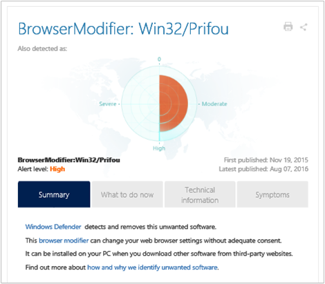

<properties
    pageTitle="Solution d’évaluation des programmes malveillants dans journal Analytique | Microsoft Azure"
    description="Vous pouvez utiliser la solution contre les logiciels malveillants dans Analytique journal pour créer des rapports sur l’état de la protection contre les logiciels malveillants dans votre infrastructure."
    services="log-analytics"
    documentationCenter=""
    authors="bandersmsft"
    manager="jwhit"
    editor=""/>

<tags
    ms.service="log-analytics"
    ms.workload="na"
    ms.tgt_pltfrm="na"
    ms.devlang="na"
    ms.topic="article"
    ms.date="10/10/2016"
    ms.author="banders"/>

# Solution d’évaluation des programmes malveillants dans journal Analytique

Vous pouvez utiliser la solution contre les logiciels malveillants dans Analytique journal pour créer des rapports sur l’état de la protection contre les logiciels malveillants dans votre infrastructure. Installation de la solution met à jour l’agent OMS et la configuration de base pour OMS. État de protection contre les logiciels malveillants et menaces détectées sur les serveurs analysés sont lus et puis les données sont envoyées au service de journal Analytique dans le cloud pour traitement. Logique est appliquée aux données reçues et le service cloud enregistre les données. Serveurs avec menaces détectées et bénéficiant d’une protection insuffisante sont représentées dans le tableau de bord **contre les logiciels malveillants** . En utilisant les informations du tableau de bord **contre les logiciels malveillants** , vous pouvez identifier un plan pour appliquer une protection aux serveurs qui en ont besoin.

## Installation et configuration de la solution
Utilisez les informations suivantes pour installer et configurer la solution.

- Ajouter la solution d’évaluation des programmes malveillants à votre espace de travail OMS à l’aide de la procédure décrite dans [solutions ajouter journal Analytique à partir de la galerie de Solutions](log-analytics-add-solutions.md).  Il n’existe aucune autre configuration requise.

## Utiliser contre les logiciels malveillants

Ouvrez une session Analytique rapports contre les logiciels malveillants état pour :

- Les ordinateurs exécutant Windows Defender dans Windows 8, Windows 8.1, Windows 10 et Windows Server 2016 TP4 ou version ultérieure
- Centre de sécurité Windows (composant) sur Windows 8, Windows 8.1, Windows 10, Windows Server 2016 TP4 ou version ultérieure
- Serveurs exécutant System Center Endpoint Protection (v4.5.216 ou version ultérieure), Azure machines virtuelles avec [l’extension contre les logiciels malveillants](http://go.microsoft.com/fwlink/?linkid=398023)et Windows logiciels suppression de l’outil (malveillants)  
- Serveurs avec Windows Management Framework 3 & #40 ; ou version ultérieure & #41 ; [WMF 3.0](https://support.microsoft.com/kb/2506143), [WMF 4.0](http://www.microsoft.com/download/details.aspx?id=40855).

La solution contre les logiciels malveillants ne signale pas sur :

- Serveurs exécutant Windows Server 2008 et versions antérieures
- Rôles Web et collaborateur dans Microsoft Azure
- produits de contre les logiciels malveillants 3e partie

Vous pouvez nous aider à hiérarchiser l’ajout de nouvelles fonctionnalités en vote ou en ajoutant une suggestion de nouveau sur notre [page de commentaires](http://feedback.azure.com/forums/267889-azure-operational-insights/category/88093-malware-assessment-solution).

## Détails de collecte de données évaluation des programmes malveillants

Évaluation des programmes malveillants collecte des données de configuration, les métadonnées et les données d’état à l’aide d’agents que vous avez activés.

Le tableau suivant indique les méthodes de collecte de données et autres informations sur le mode de collecte de données pour l’évaluation des programmes malveillants.

| plateforme | Agent directe | Agent SCOM | Stockage Azure | SCOM obligatoire ? | Données de l’agent SCOM envoyées par groupe d’administration | fréquence de collection de sites |
|---|---|---|---|---|---|---|
|Windows||||            || toutes les heures|

Le tableau suivant répertorie des exemples de types de données collectées par l’évaluation des programmes malveillants :

|**Type de données**|**Champs**|
|---|---|
|Configuration|CustomerID, AgentID, EntityID, ManagedTypeID, ManagedTypePropertyID, CurrentValue, ChangeDate|
|Métadonnées|BaseManagedEntityId, ObjectStatus, unité d’organisation, ActiveDirectoryObjectSid, PhysicalProcessors, NetworkName, adresse IP, ForestDNSName, Nom_ordinateur_netbios, VirtualMachineName, LastInventoryDate, HostServerNameIsVirtualMachine, adresse IP, NetbiosDomainName, LogicalProcessors, NomDNS, DisplayName, DomainDnsName, ActiveDirectorySite, au PrincipalName, OffsetInMinuteFromGreenwichTime|
|État|StateChangeEventId, identifiant d’état, NewHealthState, OldHealthState, contexte, TimeGenerated, TimeAdded, StateId2, BaseManagedEntityId, MonitorId, HealthState, LastModified, LastGreenAlertGenerated, DatabaseTimeModified|

## Passez en revue les menaces pour les serveurs

Lorsque vos ordinateurs sont protégés adéquate, menace active rapidement mis en quarantaine par votre logiciel contre les logiciels malveillants et doit apparaître rarement menace active. Pour cette raison, passez en revue les menaces corrigées qui s’affichent l’efficacité de la solution évaluation contre les logiciels malveillants dans cet exemple de procédure.

1. Dans la page **vue d’ensemble** , cliquez sur la vignette **d’Évaluation contre les logiciels malveillants** .  
    
2. Dans le tableau de bord **contre les logiciels malveillants** , passez en revue la carte **Menaces détectées** , puis cliquez sur un nom de serveur avec menaces corrigées.  
    
3. Dans la page **recherche** , vous pouvez voir des informations détaillées sur la menace mis en quarantaine. En regard de **menace**, cliquez sur **affichage**.  
    
4. Dans la page **recherche l’Encyclopédie des logiciels malveillants** , cliquez sur l’élément de programmes malveillants pour afficher plus de détails.  
    
5. Dans la page Microsoft **Centre de Protection contre les logiciels malveillants** pour l’élément de logiciels malveillants, passez en revue les informations dans la section **Résumé** . Cette section décrit comment détecte votre logiciel contre les logiciels malveillants et supprimer la menace et fournit des informations sur ce que le logiciel malveillant des menaces peut-être sur votre ordinateur.  
    

## État de la protection de la révision

1. Dans le tableau de bord **contre les logiciels malveillants** , passez en revue la carte de **L’état de Protection** , cliquez sur **aucune protection en temps réel**.  
    
2. Recherche affiche une liste des serveurs sans protection.  
    
3. Serveurs sans protection en temps réel sont affichés.

Ordinateurs ne pas avoir pris en charge logiciel contre les logiciels malveillants sont signalés comme **aucune protection en temps réel**.

## Étapes suivantes

- [Recherches de journaux dans journal Analytique](log-analytics-log-searches.md) permet d’afficher des données d’évaluation de logiciels malveillants détaillées.
