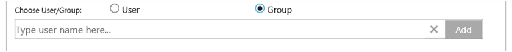
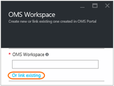
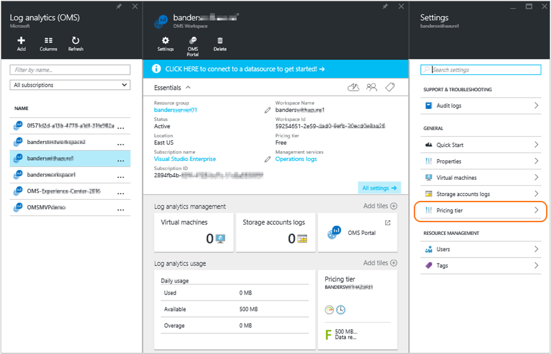
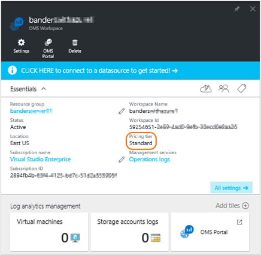
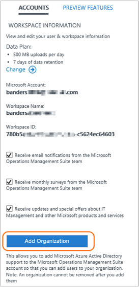

<properties
    pageTitle="Gérer l’accès aux journaux Analytique | Microsoft Azure"
    description="Gérer l’accès aux journaux Analytique à l’aide d’une variété de tâches administratives sur les utilisateurs, les comptes, espaces de travail OMS et comptes Azure."
    services="log-analytics"
    documentationCenter=""
    authors="bandersmsft"
    manager="jwhit"
    editor=""/>

<tags
    ms.service="log-analytics"
    ms.workload="na"
    ms.tgt_pltfrm="na"
    ms.devlang="na"
    ms.topic="get-started-article"
    ms.date="08/16/2016"
    ms.author="banders"/>

# Gérer l’accès aux journaux Analytique

Pour gérer l’accès aux journaux Analytique, vous allez utiliser une variété de tâches administratives sur les utilisateurs, les comptes, espaces de travail OMS et comptes Azure. Pour créer un espace de travail dans la Suite de gestion des opérations (OMS), vous choisissez un nom de l’espace de travail, associer à votre compte et que vous choisissez un emplacement géographique. Un espace de travail est essentiellement un conteneur qui comprend des informations de compte et configuration simple pour le compte. Vous ou autres membres de votre organisation peuvent utiliser plusieurs espaces de travail OMS pour gérer les différents jeux de données qui sont collectées toutes ou des parties de votre infrastructure informatique.

L’article de la [prise en main journal Analytique](log-analytics-get-started.md) montre comment être rapidement et en cours d’exécution et le reste de cet article décrit plus en détail certaines des actions que vous devez gérer l’accès à OMS.

Bien que vous ayez pas à effectuer chaque tâche de gestion tout d’abord, nous aborderons toutes les tâches courantes que vous pouvez utiliser dans les sections suivantes :

- Déterminer le nombre d’espaces de travail que vous avez besoin
- Gérer les comptes et les utilisateurs
- Ajouter un groupe à un espace de travail existant
- Lier un espace de travail existant à un abonnement Azure
- Mise à niveau d’un espace de travail à un plan de données payant
- Modifier un type de plan de données
- Ajouter une structure Azure d’Active Directory à un espace de travail existant
- Fermer votre espace de travail OMS

## Déterminer le nombre d’espaces de travail que vous avez besoin

Un espace de travail est une ressource Azure et est un conteneur dans lequel données sont collectées, agrégées, analysées et présentées dans le portail OMS.

Il est possible de créer plusieurs espaces de travail OMS journal Analytique et pour les utilisateurs à accéder à un ou plusieurs espaces de travail. En règle générale vous souhaitez réduire le nombre d’espaces de travail comme cela vous permettra à la requête et corrélation sur la plupart des données. Cette section décrit quand il peut être utile de créer plus d’un espace de travail.

Aujourd'hui, un espace de travail journal Analytique fournit :

- Un emplacement géographique de stockage des données
- Précision de facturation
- Isolement des données

Selon les caractéristiques ci-dessus, vous souhaiterez peut-être créer plusieurs espaces de travail si :

- Vous êtes une société globale et vous avez besoin des données stockées dans des régions spécifiques pour des raisons de souveraineté ou de la conformité des données.
- Vous utilisez Azure et que vous voulez éviter des frais de transfert de données sortant en demandant à un espace de travail journal Analytique dans la même région en tant que ressources Azure qu'il gère.
- Vous voulez répartir les frais sur les différents services ou des groupes d’entreprise en fonction de leur utilisation. Lorsque vous créez un espace de travail pour chaque service ou groupe Professionnel, votre relevé de facturation et l’utilisation Azure affiche les frais pour chaque espace de travail séparément.
- Vous êtes un fournisseur de services managés et vous avez besoin pour conserver les données d’analytique journal pour chaque client vous gérez isolé depuis d’autres données de client.
- Gérez plusieurs clients avec vous et vous voulez que chaque client ou service ou groupe Professionnel pour voir leurs propres données, mais pas les données pour d’autres clients ou départements ou des groupes d’entreprise.

Lorsque vous utilisez agents pour recueillir des données, vous pouvez configurer chaque agent pour signaler à l’espace de travail requis.

Si vous utilisez System Center Operations manager, chaque groupe d’administration Operations Manager pouvant être connecté avec un seul espace de travail. Vous pouvez installer l’Agent de surveillance Microsoft sur des ordinateurs gérés par Operations Manager et que l’état de l’agent Operations Manager et un autre espace de travail journal Analytique.

### Informations de l’espace de travail

Dans le portail OMS, vous pouvez consulter vos informations d’espace de travail et choisissez si vous souhaitez recevoir des informations auprès de Microsoft.

#### Afficher les informations espace de travail

1. OMS, cliquez sur la vignette **paramètres** .
2. Cliquez sur l’onglet **comptes** .
3. Cliquez sur l’onglet **Espace de travail** .  
  

## Gérer les comptes et les utilisateurs

Chaque espace de travail peut avoir plusieurs comptes d’utilisateur associés, et chaque compte d’utilisateur (compte Microsoft ou compte professionnel) peut avoir accès à plusieurs espaces de travail OMS.

Par défaut, le compte Microsoft ou le compte d’organisation permettant de créer l’espace de travail devient l’administrateur de l’espace de travail. L’administrateur peut ensuite inviter d’autres comptes de Microsoft ou sélectionnez des utilisateurs à partir d’Azure Active Directory.

Offrant aux utilisateurs l’accès à l’espace de travail OMS est contrôlée 2 emplacements :

- Dans Azure, vous pouvez utiliser le contrôle d’accès basé sur un rôle à fournir un accès à l’abonnement Azure et les ressources Azure associées. Il est également utilisé pour l’accès PowerShell et API REST.
- Dans le portail OMS, accéder au uniquement OMS portail - pas l’abonnement Azure associé.

Si vous octroyer l’accès au portail OMS mais pas à l’abonnement Azure auquel il est lié, puis les mosaïques de solution automatisation, la sauvegarde et restauration de Site ne pas affichent toutes les données aux utilisateurs quand ils connecter au portail OMS.

Pour autoriser tous les utilisateurs afficher les données dans ces solutions, assurez-vous qu’ils ont au moins **lecteur** d’accès pour l’archivage sécurisé compte Automation, l’archivage sécurisé de sauvegarde et restauration de Site qui est lié à l’espace de travail OMS.   

### Gérer l’accès aux journaux Analytique à l’aide du portail Azure

Si vous autoriser l’accès à l’espace de travail journal Analytique à l’aide d’autorisations Azure, dans le portail Azure par exemple, puis les mêmes utilisateurs peuvent accéder au journal Analytique portail. Si les utilisateurs se trouvent dans le portail Azure, ils peuvent accédez au portail OMS en cliquant sur la tâche **OMS portail** lors de l’affichage de la ressource d’espace de travail de journal Analytique.

Voici quelques points à garder à l’esprit concernant le portail Azure :

- Il s’agit pas de *contrôle d’accès basé sur un rôle*. Si vous disposez des autorisations d’accès au *lecteur de* dans le portail Azure pour l’espace de travail journal Analytique, puis vous pouvez apporter les modifications à l’aide du portail OMS. Le portail OMS comporte une notion d’administrateur, collaboration et utilisateur en lecture seule. Si le compte que vous êtes connecté à l’aide est dans Azure Active Directory lié à l’espace de travail vous serez un administrateur dans le portail OMS, dans le cas contraire, vous serez un collaborateur.

- Lorsque vous ouvrez une session dans le portail OMS à l’aide de http://mms.microsoft.com, puis par défaut, vous voyez la liste **Sélectionner un espace de travail** . Il ne contient que les espaces de travail qui ont été ajoutés à l’aide du portail OMS. Pour afficher les espaces de travail que vous avez accès à avec abonnements Azure, puis vous devez spécifier un client dans le cadre de l’URL. Par exemple :

  `mms.microsoft.com/?tenant=contoso.com`L’identificateur client est souvent cette dernière partie de l’adresse de messagerie que vous connecter avec.

- Si le compte que vous connecter avec un compte dans le client Azure Active Directory, qui est généralement le cas, sauf si vous êtes signature en tant qu’un fournisseur, vous serez un *administrateur* dans le portail OMS. Si votre compte n’est pas dans le client Azure Active Directory, vous serez un *utilisateur* dans le portail OMS.

- Si vous souhaitez accéder directement à un portail que vous avez accès à l’utilisation des autorisations Azure, vous devez spécifier la ressource dans le cadre de l’URL. Il est possible d’obtenir cette URL à l’aide de PowerShell.

  Par exemple, `(Get-AzureRmOperationalInsightsWorkspace).PortalUrl`.

  L’URL ressemble à :`https://eus.mms.microsoft.com/?tenant=contoso.com&resource=%2fsubscriptions%2faaa5159e-dcf6-890a-a702-2d2fee51c102%2fresourcegroups%2fdb-resgroup%2fproviders%2fmicrosoft.operationalinsights%2fworkspaces%2fmydemo12`

### Gestion des utilisateurs dans le portail OMS

Gestion des utilisateurs et groupe sous l’onglet **Gérer les utilisateurs** sous l’onglet **comptes** dans la page Paramètres. Là, vous pouvez effectuer les tâches dans les sections suivantes.  

#### Ajouter un utilisateur à un espace de travail existant

Procédez comme suit pour ajouter un utilisateur ou un groupe à un espace de travail OMS. L’utilisateur ou groupe sera en mesure d’afficher et d’agir sur toutes les alertes qui sont associés à cet espace de travail.

>[AZURE.NOTE] Si vous voulez ajouter un utilisateur ou un groupe à partir de votre compte professionnel Azure Active Directory, vous devez vous assurer que vous avez associé à votre compte OMS votre domaine Active Directory. Voir [Ajouter une structure Azure d’Active Directory dans un espace de travail existant](#add-an-azure-active-directory-organization-to-an-existing-workspace).

1. OMS, cliquez sur la vignette **paramètres** .
2. Cliquez sur l’onglet **comptes** , puis sur l’onglet **Gérer les utilisateurs** .
3. Dans la section **Gérer les utilisateurs** , choisissez le type de compte à ajouter : **Compte professionnel**, **Compte Microsoft**, **Support technique Microsoft**.
    - Si vous choisissez Microsoft Account, tapez l’adresse de messagerie de l’utilisateur associé au Account Microsoft.
    - Si vous choisissez compte professionnel, vous pouvez entrer partie de l’utilisateur ou l’alias de messagerie ou le nom du groupe et une liste des utilisateurs et groupes s’affiche. Sélectionnez un utilisateur ou groupe.
    - Utilisez le Support Microsoft pour donner à un Support Microsoft concevoir temporairement à accéder à votre espace de travail pour vous aider à résoudre les problèmes.

    >[AZURE.NOTE] Pour de meilleurs résultats, limiter le nombre de groupes Active Directory associés à un seul compte OMS à trois : une pour les administrateurs, une pour les collaborateurs et l’autre pour les utilisateurs en lecture seule. À l’aide d’autres groupes peut affecter les performances de journal Analytique.

5. Choisissez le type d’utilisateur ou groupe : **administrateur**, **collaborateur**ou **Utilisateur en lecture seule** .  
6. Cliquez sur **Ajouter**.

  Si vous ajoutez un compte Microsoft, une invitation à rejoindre l’espace de travail est envoyée à la messagerie électronique que vous avez fourni. Une fois que l’utilisateur clique sur les instructions présentées dans l’invitation à rejoindre OMS, l’utilisateur peut afficher les alertes et les informations de compte pour ce compte OMS, et vous ne pourrez pas afficher les informations utilisateur sous l’onglet **comptes** de la page **paramètres** .
  Si vous ajoutez un compte professionnel, l’utilisateur sera en mesure d’accéder immédiatement journal Analytique.  
  

#### Modifier un type d’utilisateur existant

Vous pouvez modifier le rôle de compte pour un utilisateur correspondant à votre compte OMS. Vous disposez des options de rôle suivantes :

 - *Administrateur*: peut gérer les utilisateurs, afficher et agir sur toutes les alertes et ajouter et supprimer des serveurs

 - *Collaboration*: peuvent afficher et agir sur toutes les alertes et ajouter et supprimer des serveurs

 - *Utilisateur en lecture seule*: utilisateurs marquées comme étant en lecture seule ne seront pas en mesure de :
   1. Ajout/Suppression de solutions. La galerie de solutions est masquée.
   2. Ajouter/modifier/supprimer des vignettes dans **Mon tableau de bord**.
   3. Afficher les pages de **paramètres** . Les pages sont masqués.
   4. Dans la recherche vue, PowerBI configuration, recherches enregistrées et d’alertes tâches sont masquées.

#### Pour modifier un compte

1. OMS, cliquez sur la vignette **paramètres** .
2. Cliquez sur l’onglet **comptes** , puis sur l’onglet **Gérer les utilisateurs** .
3. Sélectionnez le rôle de l’utilisateur que vous souhaitez modifier.
2. Dans la boîte de dialogue de confirmation, cliquez sur **Oui**.

### Déconnecter un utilisateur travaillant dans un espace de travail OMS

Procédez comme suit pour supprimer un utilisateur d’un espace de travail OMS. Notez que cela ne ferme pas d’espace de travail de l’utilisateur. Au lieu de cela, il supprime l’association entre cet utilisateur et l’espace de travail. Si un utilisateur est associé à plusieurs espaces de travail, cet utilisateur pourrez toujours se connecter à OMS et voir les autres espaces de travail.

1. OMS, cliquez sur la vignette **paramètres** .
2. Cliquez sur l’onglet **comptes** , puis sur l’onglet **Gérer les utilisateurs** .
3. Cliquez sur **Supprimer** en regard du nom d’utilisateur que vous voulez supprimer.
4. Dans la boîte de dialogue de confirmation, cliquez sur **Oui**.

### Ajouter un groupe à un espace de travail existant

1.  Suivez les étapes 1 -4 dans « To ajouter un utilisateur dans un espace de travail existant », ci-dessus.
2.  Sous **Choisir un utilisateur/groupe**, sélectionnez le **groupe**.
    
3.  Entrez l’adresse de messagerie ou le nom d’affichage du groupe que vous voulez ajouter.
4.  Sélectionnez le groupe dans les résultats de la liste, puis sur **Ajouter**.

## Lier un espace de travail existant à un abonnement Azure

Il est possible de créer un espace de travail à partir du site Web [microsoft.com/oms](https://microsoft.com/oms) .  Toutefois, certaines limites existent pour ces espaces de travail, les plus intéressantes en cours d’une limite de 500 Mo/jour de transferts de données si vous utilisez un compte gratuit. Pour apporter des modifications à cet espace de travail, vous devrez associer *votre espace de travail existant à un abonnement Azure*.

>[AZURE.IMPORTANT] Pour lier un espace de travail, votre compte Azure doit déjà avoir accès à l’espace de travail que vous voulez créer un lien.  En d’autres termes, le compte que vous utilisez pour accéder au portail Azure doit être **la même** que le compte que vous utilisez pour accéder à votre espace de travail OMS. Si ce n’est pas le cas, voir [Ajouter un utilisateur dans un espace de travail existant](#add-a-user-to-an-existing-workspace).

### Pour lier un espace de travail à un abonnement Azure dans le portail OMS

Pour lier un espace de travail à un abonnement Azure dans le portail OMS, l’utilisateur connecté doit possédez déjà un compte Azure payant. L’espace de travail que vous utilisez activement est lié au compte Azure.

1. OMS, cliquez sur la vignette **paramètres** .
2. Cliquez sur l’onglet **comptes** , puis sur l’onglet **abonnement Azure et Plan de données** .
3. Cliquez sur le plan de données que vous souhaitez utiliser.
4. Cliquez sur **Enregistrer**.  
  

Votre nouveau plan de données s’affiche dans le ruban portail OMS en haut de votre page web.

### Pour lier un espace de travail à un abonnement Azure dans le portail Azure

1.  Se connecter au [portail Azure](http://portal.azure.com).
2.  Rechercher des **Journaux Analytique (OMS)** et sélectionnez-le.
3.  Vous verrez votre liste des espaces de travail existants. Cliquez sur **Ajouter**.  
    
4.  Sous **Espace de travail OMS**, cliquez sur **ou créer un lien existant**.  
    
5.  Cliquez sur **configurer les paramètres requis**.  
    
6.  La liste d’espaces de travail qui ne sont pas encore lié à votre compte Azure s’affiche. Sélectionnez un espace de travail.  
    
7.  Si nécessaire, vous pouvez modifier les valeurs pour les éléments suivants :
    - Abonnement
    - Groupe de ressources
    - Emplacement
    - Niveau de tarification  
        
8.  Cliquez sur **créer**. L’espace de travail est à présent liée à votre compte Azure.

>[AZURE.NOTE] Si vous ne voyez pas l’espace de travail que vous voulez créer un lien, votre abonnement Azure n’a pas accès à l’espace de travail OMS que vous avez créé à l’aide du site Web OMS.  Vous avez besoin accorder l’accès à ce compte à partir d’à l’intérieur de votre espace de travail OMS via le site Web OMS. Pour ce faire, voir [Ajouter un utilisateur dans un espace de travail existant](#add-a-user-to-an-existing-workspace).

## Mise à niveau d’un espace de travail à un plan de données payant

Il existe trois données espace de travail planifier types pour OMS : **libre**, **Standard**et **Premium**.  Si vous exécutez une offre *gratuite* , vous avez peut-être atteint votre lettrine de données de 500 Mo.  Vous devez mettre à niveau votre espace de travail à un ***plan de paiement*** pour collecter les données au-delà de cette limite. À tout moment, vous pouvez convertir votre type de plan.  Pour plus d’informations sur les prix OMS, voir [Tarifs des détails](https://www.microsoft.com/en-us/server-cloud/operations-management-suite/pricing.aspx).

>[AZURE.IMPORTANT] Espace de travail planification peut uniquement être modifiée si elles sont *liées* à un abonnement Azure.  Si vous avez créé votre espace de travail dans Azure ou si vous avez *déjà* lié votre espace de travail, vous pouvez ignorer ce message.  Si vous avez créé votre espace de travail avec le [site Web OMS](http://www.microsoft.com/oms), vous avez besoin de suivre les étapes en cliquant sur [le lien un espace de travail existant à un abonnement Azure](#link-an-existing-workspace-to-an-azure-subscription).

### À l’aide de droits à partir du module complémentaire OMS pour System Center

Le module complémentaire OMS pour System Center fournit un droit pour le plan Premium de OMS journal Analytique, décrits sur le site [OMS tarifs](https://www.microsoft.com/en-us/server-cloud/operations-management-suite/pricing.aspx).

Lorsque vous achetez le module complémentaire OMS pour System Center, le module complémentaire OMS est ajouté comme un droit sur votre contrat de System Center. Aucun abonnement Azure est créé sous ce contrat possibles utiliser du contrat. Cela vous permet, par exemple, plusieurs espaces de travail OMS qui utilisent le bénéfice à partir du module complémentaire OMS.

Pour vous assurer que l’utilisation d’un espace de travail OMS est appliquée à vos droits à partir du module complémentaire OMS, vous devez :

1. Créer un lien à un abonnement Azure qui fait partie de l’accord entreprise qui inclut les OMS composant additionnel achat et l’utilisation d’abonnement Azure votre espace de travail OMS
2. Sélectionnez l’offre Premium pour l’espace de travail

Lorsque vous passez en revue vos utilisation dans le portail Azure ou OMS, vous ne verrez pas les droits de module complémentaire OMS. Toutefois, vous pouvez voir les droits d’accès dans le portail d’entreprise.  

Si vous devez modifier l’abonnement Azure lié à votre espace de travail OMS, vous pouvez utiliser l’applet de commande PowerShell Azure [Déplacer AzureRmResource](https://msdn.microsoft.com/library/mt652516.aspx) .

### À l’aide d’engagement Azure à partir d’un contrat d’entreprise

Si vous choisissez d’utiliser autonome tarification pour les composants OMS, vous devrez payer séparément pour chaque composant d’OMS et l’utilisation de l’apparaîtront sur votre facture Azure.

Si vous avez une validation monétaire Azure sur l’inscription de l’entreprise auquel sont liés vos abonnements Azure, toutes les utilisations de journal Analytique seront automatiquement débit par rapport à n’importe quel valider monétaire restant.

Si vous devez modifier l’abonnement Azure que l’espace de travail OMS est lié à vous pouvez utiliser l’applet de commande PowerShell Azure [Déplacer AzureRmResource](https://msdn.microsoft.com/library/mt652516.aspx) .  

### Pour modifier un espace de travail à un plan de données payant

1.  Se connecter au [portail Azure](http://portal.azure.com).
2.  Rechercher des **Journaux Analytique (OMS)** et sélectionnez-le.
3.  Vous verrez votre liste des espaces de travail existants. Sélectionnez un espace de travail.  
    
4.  Sous **paramètres**, cliquez sur **couche de tarification**.  
    
5.  Sous **niveau de tarification**, sélectionnez un plan de données, puis sur **Sélectionner**.  
    
6.  Lorsque vous actualisez votre affichage dans le portail Azure, vous verrez **tarification couche** mis à jour pour le plan que vous avez sélectionné.  
    

Désormais, vous pouvez collecter des données au-delà de la lettrine « libre » pour les données.

## Ajouter une structure Azure d’Active Directory à un espace de travail existant

Vous pouvez associer votre espace de travail journal Analytique (OMS) à un domaine Azure Active Directory. Ainsi, vous permet d’ajouter des utilisateurs depuis Active Directory directement à votre espace de travail OMS sans avoir besoin d’un compte Microsoft distinct.

Lorsque vous créez l’espace de travail à partir du portail Azure, ou créer un lien votre espace de travail à un abonnement Azure Azure Active Directory seront lié en tant que votre compte professionnel.

Lorsque vous créez l’espace de travail à partir du portail OMS que vous invitera à créer un lien vers un abonnement Azure et un compte professionnel.

### Pour ajouter une structure Azure d’Active Directory à un espace de travail existant

1. Dans la page Paramètres dans OMS, cliquez sur **comptes** , puis sur l’onglet **Espace de travail** .  
2. Passez en revue les informations à propos des comptes d’organisation, puis cliquez sur **Ajouter une organisation**.  
    
3. Entrez les informations d’identité de l’administrateur de votre domaine Azure Active Directory. Par la suite, vous verrez un accusé de réception indiquant que votre espace de travail est lié à votre domaine Azure Active Directory.
    

>[AZURE.NOTE] Une fois que votre compte est lié à un compte professionnel, liaison ne peut pas être supprimée ou modifiée.

## Fermer votre espace de travail OMS

Lorsque vous fermez un espace de travail OMS, toutes les données relatives à votre espace de travail est supprimé à partir du service OMS dans les 30 jours de fermeture de l’espace de travail.

Si vous êtes un administrateur et il existe plusieurs utilisateurs associés à l’espace de travail, l’association entre ces utilisateurs et de l’espace de travail est interrompue. Si les utilisateurs sont associés à d’autres espaces de travail, ils peuvent continuer à l’aide de OMS avec ces autres espaces de travail. Toutefois, si elles ne sont pas associés à d’autres espaces de travail puis elles devront créer un espace de travail pour utiliser OMS.

### Pour fermer un espace de travail OMS

1. OMS, cliquez sur la vignette **paramètres** .
2. Cliquez sur l’onglet **comptes** , puis sur l’onglet **Espace de travail** .
3. Cliquez sur **Fermer espace de travail**.
4. Sélectionnez une des raisons de fermeture de votre espace de travail, ou entrez un autre motif dans la zone de texte.
5. Cliquez sur **Fermer espace de travail**.

## Étapes suivantes

- Consultez des [ordinateurs Windows de se connecter à Analytique journal](log-analytics-windows-agents.md) pour ajouter des agents et recueillir des données.
- [Solutions ajouter journal Analytique à partir de la galerie de Solutions](log-analytics-add-solutions.md) pour ajouter des fonctionnalités et recueillir des données.
- [Configurer les paramètres de proxy et de pare-feu dans journal Analytique](log-analytics-proxy-firewall.md) si votre organisation utilise un serveur proxy ou un pare-feu afin que les agents puissent communiquer avec le service de journal Analytique.
