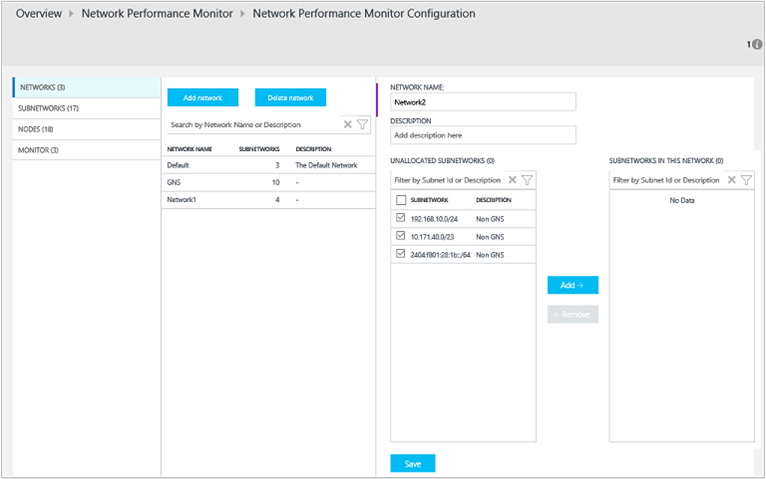

<properties
    pageTitle="Solution de l’Analyseur de performances dans OMS réseau | Microsoft Azure"
    description="Analyseur de performances réseau vous aide à vous surveiller les performances de vos réseaux dans près réel-temps à détecter et localiser dégradation des performances du réseau."
    services="log-analytics"
    documentationCenter=""
    authors="bandersmsft"
    manager="jwhit"
    editor=""/>

<tags
    ms.service="log-analytics"
    ms.workload="na"
    ms.tgt_pltfrm="na"
    ms.devlang="na"
    ms.topic="article"
    ms.date="07/28/2016"
    ms.author="banders"/>

# Solution de l’Analyseur de performances (Preview) dans OMS réseau

>[AZURE.NOTE] Il s’agit d’une [solution d’aperçu](log-analytics-add-solutions.md#log-analytics-preview-solutions-and-features).

Ce document explique comment configurer et utiliser la solution de l’Analyseur de performances réseau dans OMS, qui vous aide à vous surveiller les performances de vos réseaux dans près réel-temps à détecter et recherchez réseau dégradation des performances. Avec la solution de l’Analyseur de performances réseau, vous pouvez contrôler la perte et la latence entre deux réseaux, sous-réseaux ou les serveurs. Analyseur de performances réseau détecte des problèmes de réseau comme le trafic blackholing, routage erreurs et problèmes réseau classique surveillance méthodes ne sont pas en mesure de détecter. Analyseur de performances réseau génère des alertes et vous avertit au fur et à mesure de violation d’un seuil d’un lien de réseau. Ces seuils peuvent être apprises automatiquement par le système ou vous pouvez les configurer pour utiliser des règles d’alerte personnalisés. Analyseur de performances réseau assure opportune détection des problèmes de performances réseau et localise la source du problème à un segment de réseau particulier ou un périphérique.

Vous pouvez détecter les problèmes de réseau avec le tableau de bord solution qui affiche des informations récapitulatives sur votre réseau, y compris les événements d’intégrité réseau récents, les liens de réseau défectueux et liens sous-réseau qui sont confrontées à latence et perte de paquets importante. Vous pouvez en détail un lien de réseau pour afficher l’état actuel de liens sous-réseau ainsi que les liens de nœud à nœud. Vous pouvez également afficher la tendance historique de perte et la latence au niveau de nœud à nœud, sous-réseau et réseau. Vous pouvez détecter les problèmes de réseau temporaires en consultant les graphiques de tendance historique de perte de paquets et la latence et recherchez saturation du réseau sur une carte de topologie. Le graphique interactif topologie permet de vous permettent de visualiser les itinéraires saut par saut réseau et déterminer la source du problème. À d’autres solutions, vous pouvez utiliser journal recherche pour différentes exigences analytique pour créer des rapports personnalisés basés sur les données collectées par l’Analyseur de performances réseau.

La solution utilise les transactions de synthèse comme mécanisme principal pour détecter les erreurs de réseau. Par conséquent, vous pouvez l’utiliser sans tenir compte des fournisseurs ou le modèle d’un périphérique réseau spécifique. Il peut fonctionner avec les environnements hybrides en local et cloud (IaaS). La solution détecte automatiquement la topologie de réseau et des itinéraires différents dans votre réseau.

Produits de contrôle réseau classique se concentrer sur l’analyse de la maintenance des périphériques (routeurs, commutateurs, etc.) réseau mais ne fournissent pas de vue d’ensemble de la qualité de la connectivité réseau entre les deux points, analyseur de performances réseau réelle.

### À l’aide de la version autonome de solution

Si vous souhaitez contrôler la qualité des connexions réseau entre leurs charges de travail critiques, réseaux, des centres de données ou des sites office, puis vous pouvez utiliser la solution de l’Analyseur de performances réseau seul pour contrôler l’état de la connectivité entre :

- plusieurs sites centres de données ou office qui sont connectés à l’aide d’un réseau public ou privé
- critiques charges de travail en cours d’exécution des applications métier
- services de cloud public tels que Microsoft Azure ou Amazon Web Services (AWS) et réseaux en local, si vous avez IaaS (machine virtuelle) disponible et que vous avez configurés pour autoriser la communication de passerelles entre les réseaux locaux et cloud
- Réseaux Azure et en local lorsque vous utilisez itinéraire Express

### À l’aide de la solution avec d’autres outils de mise en réseau

Si vous voulez surveiller une ligne d’applications d’entreprise, vous pouvez utiliser la solution de l’Analyseur de performances réseau en tant que le Guide solution à d’autres outils réseau. Un réseau lent peut affecter les applications lentes et Analyseur de performances réseau peut vous aider à déterminer l’origine des problèmes de performances d’application sont créés par des problèmes réseau sous-jacents. Étant donné que la solution ne nécessite pas un accès aux périphériques réseau, l’administrateur d’application ne doit pas s’appuient sur une équipe de mise en réseau pour fournir des informations sur la façon dont le réseau affecte les applications.

En outre, si vous déjà investissez dans d’autres outils d’analyse de réseau, puis la solution pouvez compléter ces outils, car les solutions de contrôle réseau plus traditionnelles ne fournissent pas de vue d’ensemble de mesures de performances réseau de bout en bout comme perte et la latence.  La solution de l’Analyseur de performances réseau peut aider cet intervalle de remplissage.

## Installer et configurer les agents pour la solution

Utiliser les processus de base pour installer agents en [ordinateurs Windows de se connecter au journal Analytique](log-analytics-windows-agents.md) et [Vous connecter Operations Manager au journal Analytique](log-analytics-om-agents.md).

>[AZURE.NOTE]
Vous devez installer au moins 2 agents afin de disposer de suffisamment de données pour découvrir et contrôler les ressources de votre réseau. Dans le cas contraire, la solution reste dans un état configuration jusqu'à ce que vous installez et configurez des agents supplémentaires.

### Où installer les agents

Avant d’installer les agents, vous pouvez la topologie de votre réseau et quels composants du réseau que vous voulez analyser. Nous vous conseillons d’installer plusieurs agents de chaque sous réseau que vous souhaitez analyser. En d’autres termes, pour chaque sous-réseau que vous souhaitez surveiller, choisissez deux ou plusieurs serveurs ou machines virtuelles et installez l’agent dessus.

Si vous ne savez pas la topologie de votre réseau, installez les agents sur des serveurs avec les charges de travail critiques où vous souhaitez surveiller les performances du réseau. Par exemple, vous souhaiterez peut-être effectuer le suivi d’une connexion réseau entre un serveur Web et un serveur qui exécute SQL Server. Dans cet exemple, vous devez installer un agent sur les deux serveurs.

Agents surveillent la connectivité réseau (liaisons) entre les hôtes--pas les hôtes eux-mêmes. Par conséquent, pour analyser un lien de réseau, vous devez installer les agents sur les deux extrémités de ce lien.

### Configurer les agents

Une fois que vous avez installé exemptés, vous devez ouvrir les ports de pare-feu pour les ordinateurs pour vous assurer que les agents peuvent communiquer. Vous devez télécharger et puis exécuter le [script PowerShell EnableRules.ps1](https://gallery.technet.microsoft.com/OMS-Network-Performance-04a66634) sans paramètres dans une fenêtre PowerShell avec des privilèges d’administrateur

Le script crée des clés de Registre requises par l’Analyseur de performances réseau et qu’il crée des règles de pare-feu Windows pour autoriser les agents à créer des connexions TCP entre eux. Les clés de Registre créées par le script également spécifient s’il faut enregistrer les journaux de débogage et le chemin d’accès pour les fichiers journaux. Il définit également le port TCP agent utilisé pour les communications. Les valeurs de ces touches sont définis automatiquement par le script, afin que vous ne devez pas modifier manuellement ces touches.

Le port ouvert par défaut est 8084. Vous pouvez utiliser un port personnalisé en fournissant le paramètre `portNumber` pour le script. Cependant, le même port doit être utilisé sur tous les ordinateurs où le script est exécuté.

>[AZURE.NOTE] Le script EnableRules.ps1 configure les règles de pare-feu Windows uniquement sur l’ordinateur où le script est exécuté. Si vous avez un pare-feu, vérifiez qu’il permet le trafic destiné au port TCP utilisé par l’Analyseur de performances réseau.

## Configuration de la solution

Utilisez les informations suivantes pour installer et configurer la solution.

1. Acquisition de la solution de l’Analyseur de performances réseau par des données à partir d’ordinateurs exécutant Windows Server 2008 SP 1 ou version ultérieure ou Windows 7 SP1 ou version ultérieure, qui sont les mêmes conditions en tant que Microsoft surveillance Agent (MMA).
2. Ajouter la solution de l’Analyseur de performances réseau à votre espace de travail OMS à l’aide de la procédure décrite dans [solutions ajouter journal Analytique à partir de la galerie de Solutions](log-analytics-add-solutions.md).  
  
3. Dans le portail OMS, vous verrez une vignette intitulée **Analyseur de performances réseau** avec le message *Solution nécessite une configuration supplémentaire*. Vous devez configurer la solution pour ajouter des réseaux en fonction de sous-réseaux et nœuds découvert par les agents. Cliquez sur **L’Analyseur de performances réseau** pour commencer à configurer le réseau par défaut.  
  

### Configurer la solution avec un réseau par défaut

Dans la page de configuration, vous verrez un seul réseau nommé **par défaut**. Lorsque vous n’avez pas défini tous les réseaux, tous les sous-réseaux détectés automatiquement sont placées dans le réseau par défaut.

Chaque fois que vous créez une connexion réseau, vous y ajoutez un sous-réseau et ce sous-réseau est supprimé à partir du réseau par défaut. Si vous supprimez un réseau, toutes ses sous-réseaux sont retournés automatiquement au réseau par défaut.

En d’autres termes, le réseau par défaut est le conteneur pour tous les sous-réseaux qui ne figurent pas dans n’importe quel réseau définies par l’utilisateur. Vous ne pouvez pas modifier ou supprimer le réseau par défaut. Il reste toujours dans le système. Toutefois, vous pouvez créer autant de réseaux que nécessaire.

Dans la plupart des cas, les sous-réseaux de votre organisation seront organisées dans plusieurs réseaux et vous devez créer un ou plusieurs réseaux afin de regrouper vos sous-réseaux.

### Créer de nouveaux réseaux

Un réseau de l’Analyseur de performances réseau est un conteneur de sous-réseaux. Vous pouvez créer un réseau avec n’importe quel nom que vous voulez et ajoutez des sous-réseaux au réseau. Par exemple, vous pouvez créer un réseau nommé *bâtiment 1* , puis ajoutez sous-réseaux, ou vous pouvez créer un réseau nommé *DMZ* , puis ajouter tous les sous-réseaux appartenant au réseau de périmètre à ce réseau.

#### Pour créer un nouveau réseau

1. Cliquez sur **Ajouter un réseau** , puis tapez le nom du réseau et la description.
2.  Sélectionnez un ou plusieurs sous-réseaux, puis cliquez sur **Ajouter**.
3. Cliquez sur **Enregistrer** pour enregistrer la configuration.  
  

### Patienter pour l’agrégation de données

Après avoir enregistré la configuration pour la première fois, la solution démarre collecte des informations de latence et de perte de paquets réseau entre les nœuds dans lequel les agents sont installés. Ce processus peut prendre un certain temps, parfois 30 minutes. Pendant cet état, la vignette de l’Analyseur de performances réseau dans la page Vue d’ensemble affiche un message indiquant *l’agrégation de données dans le processus*.

Lorsque les données a été téléchargées, vous verrez les données affichant vignette mis à jour de l’Analyseur de performances réseau.

Cliquez sur la vignette pour afficher le tableau de bord de l’Analyseur de performances réseau.

### Modifier les paramètres de contrôle des sous-réseaux

Tous les sous-réseaux où au moins un agent a été installé sont répertoriés sous l’onglet **sous-réseaux** dans la page de configuration.

#### Pour activer ou désactiver l’analyse de sous-réseaux particuliers

1. Activez ou désactivez la case en regard de l' **ID de sous-réseau** et puis garantir que **l’utilisation de surveillance** est sélectionné ou désactivée, le cas échéant. Vous pouvez activer ou désactiver plusieurs sous réseaux. Lorsque désactivé, sous-réseaux ne sont pas analysés comme les agents seront mise à jour pour arrêter la commande ping autres agents.
2. Choisissez les nœuds que vous souhaitez analyser un sous-réseau particulier en sélectionnant le sous-réseau dans la liste et en déplaçant les nœuds requis entre les listes contenant des nœuds non contrôlées et contrôlés.
Vous pouvez ajouter une **description** personnalisée pour le sous-réseau, si vous le souhaitez.
3. Cliquez sur **Enregistrer** pour enregistrer la configuration.  
  

### Choisir de nœuds à surveiller

Tous les nœuds qui disposent d’un agent sont répertoriées dans l’onglet **nœuds** .

#### Pour activer ou désactiver l’analyse des nœuds

1. Activez ou désactivez les nœuds que vous souhaitez analyser ou arrêter la surveillance.
2. Cliquez sur **utiliser pour surveillance**ou désactivez-la, le cas échéant.
3. Cliquez sur **Enregistrer**.  
  

### Ensemble de règles d’analyse

Analyseur de performances réseau génère des événements d’état à propos de la connectivité entre deux nœuds ou de liens sous-réseau ou réseau lorsqu’un seuil est pas respecté. Ces seuils peuvent être apprises automatiquement par le système ou vous pouvez configurer les règles d’alerte personnalisés.

La *règle par défaut* est créé par le système et qu’il crée un événement d’état à chaque fois que perte ou latence entre toute paire de réseaux ou sous-réseau des liens violations le seuil appris système. Vous pouvez choisir de désactiver la règle par défaut et créer des règles d’analyse personnalisées

#### Pour créer des règles d’analyse personnalisées

1. Cliquez sur **Ajouter une règle** dans l’onglet **Moniteur** , puis entrez le nom de la règle et une description.
2. Sélectionnez la paire de liens réseau ou sous-réseau à surveiller dans les listes.
3. Sélectionnez tout d’abord le réseau dans laquelle se trouve le premier sous-réseau/s d’intérêt dans la liste déroulante réseau et sélectionnez le sous-réseau/s dans le menu déroulant sous-réseau correspondant.
Sélectionnez **toutes les sous-réseaux** si vous souhaitez analyser tous les sous-réseaux dans une liaison réseau. De même, sélectionnez l’autres applications Web/sous-réseau d’intérêt. Et, vous pouvez cliquer sur **Ajouter une Exception** pour exclure l’analyse des liens sous-réseau particulier dans la sélection que vous avez apportées.
4. Si vous ne voulez pas créer d’intégrité des événements pour les éléments que vous avez sélectionné, puis désactivez **Activer le contrôle sur les liens couverts par cette règle d’état**.
5. Sélectionnez surveillance des conditions.
Vous pouvez définir des seuils personnalisés pour génération d’événements d’intégrité en tapant des valeurs de seuil. Chaque fois que la valeur de la condition dépasse son seuil sélectionné pour la paire de réseau/sous-réseau sélectionné, un événement d’état est généré.
6. Cliquez sur **Enregistrer** pour enregistrer la configuration.  
  

## Informations sur la collecte des données

Analyseur de performances réseau utilise des paquets de négociation SYNACK TCP SYN-ACK pour collecter les pertes et détermination d’itinéraire et informations de latence est également utilisé pour obtenir des informations sur la topologie.

Le tableau suivant montre les méthodes de collecte de données et autres informations sur la façon dont les données sont collectées pour Analyseur de performances réseau.

| plateforme | Agent directe | Agent SCOM | Stockage Azure | SCOM obligatoire ? | Données de l’agent SCOM envoyées par groupe d’administration | fréquence de collection de sites |
|---|---|---|---|---|---|---|
| Windows ||||            || Négociations TCP toutes les 5 secondes, données envoyés toutes les trois minutes |

La solution utilise transactions de synthèse pour évaluer l’intégrité du réseau. Agents OMS installés au point différents dans les paquets réseau exchange TCP entre eux, puis dans le processus, découvrez la perte de temps et de paquets aller et retour, le cas échéant. Régulièrement, chaque agent effectue également un itinéraire de suivi à d’autres agents pour trouver tous les itinéraires différents dans le réseau qui doit être testé. À l’aide de ces données, les agents sont en mesure de déduire la latence du réseau et les chiffres de perte de paquets. Répéter les épreuves toutes les cinq secondes et les données sont regroupées pour une période de trois minutes par les agents avant de télécharger à OMS.

>[AZURE.NOTE] Bien que les agents de communiquent avec eux fréquemment, elles ne pas génèrent un grand nombre de trafic réseau lors de la réalisation des essais. Agents dépendent uniquement des paquets de négociation SYNACK TCP SYN-ACK pour déterminer la perte et la latence--aucune donnée paquets échangés. Pendant ce processus, agents de communiquer avec d’autres cas de nécessité uniquement et la topologie de communication agent est optimisée pour réduire le trafic réseau.

## À l’aide de la solution

Cette section décrit le tableau de bord fonctions et comment les utiliser.

### Vignette de vue d’ensemble de solution

Une fois que vous avez activé la solution de l’Analyseur de performances réseau, la vignette de solution dans la page Vue d’ensemble OMS fournit un aperçu rapide de l’état du réseau. Il affiche un graphique en anneau affichant le nombre de liens sous-réseau et incorrects. Lorsque vous cliquez sur la vignette, il ouvre le tableau de bord solution.

### Tableau de bord solution de l’Analyseur de performances réseau

La carte **Réseau récapitulative** affiche un résumé des réseaux ainsi que leur taille relative. Ceci est suivi mosaïques affichant le nombre total de liens de réseau, les liens de sous-réseau et les chemins d’accès dans le système (un chemin d’accès se compose des adresses IP de deux hôtes avec agents et tous les sauts entre elles).

La carte **Réseau haut des événements d’état** fournit la liste des derniers événements santé et les alertes dans le système et l’heure dans la mesure où l’événement a été active. Un événement d’état ou une alerte est généré à chaque fois que la perte de paquets ou la latence d’une liaison réseau ou sous-réseau dépasse un seuil.

La carte de **Liaisons réseau défectueux haut** affiche une liste de liens réseau incorrecte. Voici les liens réseau qui ont un ou plusieurs événements d’intégrité négatifs pour les pour le moment.

Les cartes de **Liens de sous-réseau haut avec perte plus** et les **Liens de sous-réseau avec une latence plus** affichent les liens sous-réseau supérieure par perte de paquets et les liens sous-réseau supérieure à la latence respectivement. Latence élevée ou certains montant de perte de paquets peut être attendu sur certains liens réseau. Ces liens apparaissent dans les listes des dix premiers mais ne sont pas marqués mauvais état.

La carte de **Requêtes communes** contient un ensemble de requêtes de recherche qui extraient réseau brutes pour analyser les données directement. Vous pouvez utiliser ces requêtes comme point de départ pour créer vos propres requêtes pour les rapports personnalisés.

### Exploration des niveaux inférieurs d’axe de profondeur

Vous pouvez cliquer sur différents liens de la solution tableau de bord pour exploration plus approfondie dans une zone d’intérêt. Par exemple, lorsque vous voyez une alerte ou un lien de réseau défectueux s’affichent dans le tableau de bord, vous pouvez cliquer dessus pour approfondir l’analyse. Vous serez redirigé vers une page qui répertorie tous les liens sous-réseau du lien de réseau particulier. Vous ne pourrez pas afficher le statut de perte, latence et la santé de chaque lien sous-réseau et rapidement savoir quels liens sous-réseau causent le problème. Vous pouvez puis cliquez sur **Afficher les liens nœud** pour afficher tous les liens de nœud du lien sous-réseau mauvais état. Puis, vous pouvez voir les liens de nœud à nœud et trouver les liens nœud mauvais état.

Vous pouvez cliquer sur **la topologie de vue** pour afficher la topologie de saut par saut itinéraires entre les nœuds source et de destination. La route défectueux ou sauts sont affichés en rouge afin que vous puissiez rapidement identifier le problème à une partie spécifique du réseau.

#### Graphiques de tendance.

À chaque niveau que vous avez une exploration des niveaux inférieurs, vous pouvez voir la tendance de perte et la latence pour un lien de réseau. Les graphiques de tendances sont également disponibles pour les liens sous-réseau et nœud. Vous pouvez modifier l’intervalle de temps pour que le graphique tracer en utilisant le contrôle d’heure dans la partie supérieure du graphique.

Les graphiques de tendances affichent une perspective historique des performances d’une liaison réseau. Certains problèmes réseau sont transitoires nature et seraient difficiles à intercepter uniquement en recherchant dans l’état actuel du réseau. C’est parce que problèmes peuvent retrouver rapidement et disparaissent avant tout le monde notifications uniquement pour réapparaître ultérieurement dans le temps. Ces problèmes temporaires peuvent également être difficiles pour les administrateurs d’application, car les problèmes souvent surface comme inexpliquées augmentations de temps de réponse de l’application, même si tous les composants d’application semblent fonctionner correctement.

Vous pouvez facilement détecter ces types de problèmes en recherchant dans un graphique de tendances où le problème s’afficheront sous la forme d’un pic soudain dans latence du réseau ou de perte de paquets.

#### Carte de topologie saut par saut

Analyseur de performances réseau vous montre la topologie saut par saut d’itinéraires entre deux nœuds sur une carte de topologie interactifs. Vous pouvez afficher la carte de topologie en sélectionnant un nœud de lien, puis en cliquant sur **la topologie de vue**. Vous pouvez également afficher la carte de topologie en cliquant sur la vignette de **chemins d’accès** dans le tableau de bord. Lorsque vous cliquez sur **chemins d’accès** dans le tableau de bord, vous devrez sélectionner les nœuds source et cible à partir du Panneau de gauche, puis sur **traçage** pour tracer les liaisons entre les deux nœuds.

La carte de topologie affiche combien itinéraires soient comprises entre les deux nœuds et que les chemins d’accès prennent les paquets de données. Dégradation des performances réseau est signalées en rouge sur la carte de topologie. Vous pouvez trouver une connexion réseau défectueux ou un appareil réseau défectueux en consultant les éléments de couleur rouge sur la carte de topologie.

Lorsque vous cliquez sur un nœud ou hover dessus sur la carte de topologie, vous verrez les propriétés du nœud comme nom de domaine complet et l’adresse IP. Cliquez sur un saut pour identifier l’adresse IP. Vous pouvez mettre en surbrillance itinéraires particuliers en désactivant et en sélectionnant uniquement les itinéraires dont vous souhaitez mettre en surbrillance sur la carte. Vous pouvez effectuer un zoom dans la carte de topologie facteur à l’aide de la roulette de votre souris.

Notez que la topologie présentée dans l’Explorateur de la topologie layer 3 et ne contient pas connexions et les périphériques de couche 2.

#### Localisation de défaillance

Analyseur de performances réseau ne peut trouver la saturation du réseau sans vous connecter aux périphériques réseau. Basé sur les données collectées à partir du réseau et en appliquant des algorithmes avancés sur le graphique de réseau, analyseur de performances réseau effectue une estimation de probabilité des parties du réseau qui sont probablement la source du problème.

Cette approche est utile pour déterminer la saturation du réseau lors de l’accès aux sauts n’est pas disponible, car il ne nécessite pas de toutes les données soient regroupées à partir des appareils réseau tels que le routeur ou commutateurs. Il est également utile lorsque les sauts entre deux nœuds ne sont pas dans votre contrôle d’administration. Par exemple, les sauts peuvent être routeurs de fournisseur de services Internet.

### Recherche des journaux d’Analytique

Toutes les données sous forme graphique exposée par le biais du tableau de bord de l’Analyseur de performances réseau et exploration des niveaux inférieurs de la page est également disponible en mode natif dans recherche journal Analytique. Vous pouvez interroger les données en utilisant le langage de requête de recherche et créer des rapports personnalisés, exportez les données vers Excel ou PowerBI. La carte de **Requêtes courantes** dans le tableau de bord dispose des requêtes utiles que vous pouvez utiliser comme point de départ pour créer vos propres rapports et requêtes.

## Recherchez l’origine d’une alerte d’intégrité

Maintenant que vous avez lu sur l’Analyseur de performances réseau, nous allons étudier une enquête simple dans la cause pour un événement d’état.

1. Dans la page Vue d’ensemble, vous obtiendrez un aperçu rapide de l’état de votre réseau en observant l' **Analyseur de performances réseau** avec la vignette. Notez que déconnecter les liens 80 sous-réseaux en cours d’analyse, 43 sont incorrects. Ceci justifie enquête. Cliquez sur la vignette pour afficher le tableau de bord solution.  
  

2. Dans l’image d’exemple ci-dessous, vous remarquerez qu’il n’y a 4 événements d’état actuellement et 4 liens réseau qui sont incorrects. Vous décidez d’étudier le problème et cliquez sur le lien de réseau **Web Sharepoint** pour déterminer la cause du problème.  
  

3. La page d’exploration des niveaux inférieurs affiche tous les liens sous-réseau lien de réseau **Web Sharepoint** . Vous remarquerez que pour les deux liens sous-réseau, la latence a atteint le seuil de mettre en place la liaison réseau incorrecte. Vous pouvez également afficher les tendances de latence des deux liens sous-réseau. Vous pouvez utiliser la sélection de temps contrôle dans le graphique pour vous concentrer sur la plage horaire requis. Vous pouvez voir l’heure du jour lorsque latence a atteint sa pointe. Vous pouvez rechercher ultérieurement les journaux pour cet intervalle de temps rechercher le problème. Cliquez sur **Afficher les liens de nœud** pour une exploration des niveaux inférieurs davantage.  
  

4.  Similaire à la page précédente, la page d’exploration des niveaux inférieurs du lien sous-réseau particulier répertorie vers le bas ses liens nœud constituants. Vous pouvez effectuer des actions similaires ici, comme vous le faisiez à l’étape précédente. Cliquez sur la **topologie de l’affichage** pour afficher la topologie entre les 2 nœuds.  
  

5. Tous les chemins d’accès entre 2 nœuds sélectionnés sont représentées dans la carte de topologie. Vous pouvez visualiser la topologie de saut par saut d’itinéraires entre deux nœuds sur la carte de topologie. Il vous donne une idée précise des itinéraires combien existent entre les deux nœuds et que les chemins d’accès prenant les paquets de données. Dégradation des performances réseau est signalées en rouge. Vous pouvez trouver une connexion réseau défectueux ou un appareil réseau défectueux en consultant les éléments de couleur rouge sur la carte de topologie.  
  

6. Vous pouvez consulter la perte, latence et le nombre de sauts dans chaque chemin d’accès dans le volet **Détails du chemin d’accès** . Dans cet exemple, vous pouvez voir qu’il existe 3 chemins incorrectes comme indiqué dans le volet. Utilisez la barre de défilement pour afficher les détails de ces chemins d’accès incorrectes.  Utilisez les cases à cocher pour sélectionner parmi les chemins d’accès afin que la topologie pour qu’un seul chemin d’accès est tracée. Vous pouvez utiliser la roulette de votre souris pour effectuer un zoom avant ou arrière la carte de topologie.

  Dans le sous l’image que vous pouvez le constater la cause des zones problème à la section du réseau en consultant les chemins d’accès et les sauts de couleur rouge. Cliquer sur un nœud dans l’Explorateur de topologie pour afficher les propriétés du nœud, y compris le nom de domaine complet et l’adresse IP. Cliquez sur un saut affiche l’adresse IP du saut.  
  

## Étapes suivantes

- [Les journaux de recherche](log-analytics-log-searches.md) pour afficher les enregistrements de données de performances réseau détaillé.
