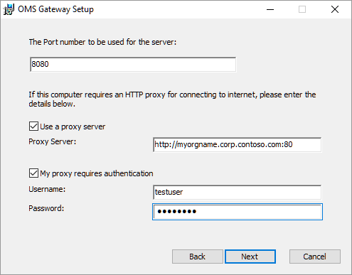

<properties
    pageTitle="Connecter des ordinateurs et appareils à OMS à l’aide de la passerelle OMS | Microsoft Azure"
    description="Connectez vos périphériques gérés OMS et ordinateurs gérés Operations Manager avec la passerelle OMS pour envoyer des données au service OMS lorsqu’ils n’ont pas accès à Internet."
    services="log-analytics"
    documentationCenter=""
    authors="bandersmsft"
    manager="jwhit"
    editor=""/>
<tags
    ms.service="log-analytics"
    ms.workload="na"
    ms.tgt_pltfrm="na"
    ms.devlang="na"
    ms.topic="article"
    ms.date="10/26/2016"
    ms.author="banders"/>

# Connecter des ordinateurs et appareils à OMS à l’aide de la passerelle OMS

Ce document décrit comment vos périphériques gérés OMS et ordinateurs gérés System Center Operations Manager SCOM peuvent envoyer des données au service OMS lorsqu’ils ne disposent pas accès à Internet. Collecter les données et d’envoi au service OMS sur leur nom de la passerelle OMS.

La passerelle est un proxy transférer HTTP qui prend en charge HTTP tunnel à l’aide de la commande HTTP se connecter. La passerelle peut gérer jusqu'à 2000 appareils OMS connecté simultanément sur une UC 4 cœurs, 16 Go serveur exécutant Windows.

Par exemple, votre entreprise ou organisation de grande taille serveurs avec la connectivité réseau est peut-être mais ne dispose pas de connexion à Internet. Dans un autre exemple, vous devrez point nombre des périphériques de vente avec aucun moyen de leur contrôle directement. Et dans un autre exemple, Operations Manager peuvent utiliser la passerelle OMS comme un serveur proxy. Dans ces exemples, la passerelle OMS pouvez transférer des données depuis les agents sont installés sur ces serveurs ou équipements de points à OMS.

Au lieu de chaque agent individuels envoie des données directement OMS et exiger une connexion Internet directe, toutes les données de l’agent est envoyé à la place via un seul ordinateur qui possède une connexion Internet. Cet ordinateur est l’endroit où vous installer et utiliser la passerelle. Dans ce scénario, vous pouvez installer des agents sur tous les ordinateurs où vous souhaitez collecter les données. La passerelle puis transfère les données provenant des agents vers OMS directement : la passerelle n’analyse pas les données qui sont transférées.

Pour contrôler la passerelle OMS et analyser les performances ou les données d’événement pour le serveur où il est installé, vous devez installer l’agent OMS sur l’ordinateur où est également installée la passerelle.

La passerelle doit avoir accès à Internet pour télécharger des données sur OMS. Chaque agent doit avoir également la connectivité réseau vers sa passerelle pour qu’agents pouvant transférer automatiquement des données à partir de la passerelle. Pour obtenir de meilleurs résultats, n’installez pas la passerelle sur un ordinateur sur lequel est également un contrôleur de domaine.

Voici un diagramme qui montre le flux de données à partir d’agents directs OMS.

Voici un diagramme qui montre le flux de données à partir de Operations Manager OMS.

## Installer la passerelle OMS

L’installation de cette passerelle remplace les versions précédentes de la passerelle que vous avez installé (journal Analytique redirecteurs).

Conditions préalables : .net Framework 4.5, Windows Server 2012 R2 SP1 et versions ultérieures

1. Téléchargez la dernière version de la passerelle OMS à partir du [Centre de téléchargement Microsoft](http://download.microsoft.com/download/2/5/C/25CF992A-0347-4765-BD7D-D45D5B27F92C/OMS%20Gateway.msi).
2. Pour démarrer l’installation, double-cliquez sur **Gateway.msi OMS**.
3. Dans la page Bienvenue, **suivante**.  
    
4. Dans la page Contrat de licence, sélectionnez **J’accepte les termes du contrat de licence** pour accepter le CLUF puis cliquez sur **suivant**.
5. Dans la page adresse proxy et du port :
    1. Tapez le numéro de port TCP à utiliser pour la passerelle. Le programme d’installation s’ouvre ce numéro de port du pare-feu Windows. La valeur par défaut est 8080.
    La plage valide du numéro de port est 1-65535. Si l’entrée n’est pas comprise dans la plage, un message d’erreur s’affiche.
    2. Vous pouvez également si le serveur où est installée la passerelle a besoin d’utiliser un proxy, tapez l’adresse proxy où la passerelle doit se connecter. Par exemple, `http://myorgname.corp.contoso.com:80` si vide, la passerelle essaient de se connecter à Internet directement. Dans le cas contraire, la passerelle qui se connecte au serveur proxy. Si votre serveur proxy requiert une authentification, tapez votre nom d’utilisateur et mot de passe.
          
    3. Cliquez sur **suivant**
6. Si vous n’avez pas Microsoft Updates activé, la page Microsoft Update s’affiche dans laquelle vous pouvez choisir d’activer Microsoft Updates. Effectuer une sélection, puis cliquez sur **suivant**. Dans le cas contraire, passez à l’étape suivante.
7. Dans la page dossier de Destination, laissez la de dossier par défaut **%ProgramFiles%\OMS passerelle** ou tapez l’emplacement où vous voulez installer passerelle, puis cliquez sur **suivant**.
8. Dans la page prêt à installer, cliquez sur **installer**. Un contrôle de compte d’utilisateur peuvent apparaître demander l’autorisation d’installer. Si c’est le cas, cliquez sur **Oui**.
9. Une fois l’installation terminée, cliquez sur **Terminer**. Vous pouvez vérifier que le service est en cours d’exécution en ouvrant le composant logiciel enfichable services.msc et vérifiez que la **Passerelle OMS** s’affiche dans la liste des services.  
    

## Installer un agent sur les appareils

Si nécessaire, voir agents connectés [ordinateurs Windows de se connecter à Analytique journal](log-analytics-windows-agents.md) pour plus d’informations sur l’installation directement. Cet article explique comment vous pouvez installer l’agent à l’aide d’un Assistant de configuration ou à l’aide de la ligne de commande.

## Configurer les agents OMS

Voir [configurer les paramètres de proxy et de pare-feu avec l’Agent de surveillance Microsoft](log-analytics-proxy-firewall.md) pour plus d’informations sur la configuration d’un agent pour utiliser un serveur proxy, qui est le cas présent est la passerelle.

Agents Operations Manager envoient des données tels que les alertes, évaluation de configuration, espace instance et données capacité, via le serveur d’administration Operations Manager. Autres données volumineuses, telles que les journaux IIS, de performances et de sécurité sont envoyées directement à la passerelle OMS. Pour une liste complète des données qui sont envoyées à chaque canal, consultez [Ajouter journal Analytique solutions à partir de la galerie de Solutions](log-analytics-add-solutions.md) .

>[AZURE.NOTE]
Si vous prévoyez d’utiliser la passerelle avec équilibrage de charge, voir [vous pouvez également configurer l’équilibrage de charge réseau](#optionally-configure-network-load-balancing).

## Configurer un serveur proxy SCOM

Vous configurez Operations Manager pour ajouter la passerelle pour l’utiliser comme un serveur proxy. Lorsque vous mettez à jour la configuration du proxy, la configuration du proxy est appliquée automatiquement à tous les agents rendant compte à Operations Manager.

Pour utiliser la passerelle pour prendre en charge Operations Manager, vous devez disposer :

- Agent de surveillance Microsoft (version de l’agent – **8.0.10900.0** et versions ultérieures) installé sur le serveur de passerelle et configuré pour les espaces de travail OMS avec laquelle vous souhaitez communiquer.
- La passerelle doit se connecter à Internet ou être connectée à un serveur proxy qui effectue.

### Pour configurer SCOM pour la passerelle

1. Ouvrez la console Operations Manager, sous **Opérations Management Suite**, cliquez sur **connexion** , puis sur **Configurer le serveur Proxy**:  
    
2. Sélectionnez **utiliser un serveur proxy pour accéder à la Suite de gestion des opérations** et tapez l’adresse IP du serveur passerelle OMS. Vous assurer que vous démarrez avec la `http://` préfixe :  
    
3. Cliquez sur **Terminer**. Votre serveur Operations Manager est connecté à votre espace de travail OMS.

## Configurer l’équilibrage de charge réseau

Vous pouvez configurer la passerelle de disponibilité à l’aide d’équilibrage de charge réseau en créant un cluster. Le cluster gère le trafic à partir de vos agents en redirigeant les connexions demandées à partir de Microsoft surveillance Agents entre ses nœuds. Si un serveur de passerelle s’arrête, le trafic redirigé vers d’autres nœuds.

1. Ouvrez le Gestionnaire d’équilibrage de charge réseau et créez un cluster.
2. Avec le bouton droit le cluster avant d’ajouter des passerelles, puis sélectionnez **Propriétés Cluster.** Configurer le cluster pour que sa propre adresse IP :  
    
3. Pour vous connecter à un serveur de passerelle OMS avec l’Agent de surveillance Microsoft installés, avec le bouton droit adresse IP du cluster, puis cliquez sur **Ajouter un hôte au Cluster**.  
    
4. Entrez l’adresse IP du serveur de la passerelle que vous voulez vous connecter :  
    
5. Sur les ordinateurs qui n’ont pas de connexion à Internet, veillez à utiliser l’adresse IP du cluster lorsque vous configurez les **Propriétés de l’Agent de surveillance Microsoft**:  
    

## Configurer pour les travailleurs automation hybride

Si vous avez les travailleurs hybride automation dans votre environnement, les étapes suivantes fournissent des solutions de contournement temporaires, manuelles pour configurer la passerelle pour prendre en charge les.

Dans la procédure suivante, vous devez connaître la région Azure où réside le compte d’automatisation. Pour localiser l’emplacement :

1. Connectez-vous au [portail Azure](https://portal.azure.com/).
2. Sélectionnez le service Automation Azure.
3. Sélectionnez le compte Azure Automation approprié.
4. Afficher la zone sous **emplacement**.  
    

Utiliser les tableaux suivants pour identifier le URL correspondant à chaque emplacement :

**URL de service de travail pour l’exécution des données**

| **emplacement** | **URL** |
| --- | --- |
| États-Unis centre nord | automation.net du su1.azure produit ncus jobruntimedata |
| Europe occidentale | Nous-jobruntimedata-produit-su1.azure-automation.net |
| États-Unis centre sud | automation.net du su1.azure produit scus jobruntimedata |
| États-Unis Extrême-Orient | phase-jobruntimedata-produit-su1.azure-automation.net |
| Canada central | CC-jobruntimedata-produit-su1.azure-automation.net |
| Europe du Nord | garanties-jobruntimedata-produit-su1.azure-automation.net |
| Asie du Sud-est | automation.net du su1.azure produit mer jobruntimedata |
| Inde central | automation.net du su1.azure produit cid jobruntimedata |
| Japon | automation.net du su1.azure produit jpe jobruntimedata |
| Australie | automation.net du su1.azure produit ASE jobruntimedata |

**URL du service Agent**

| **emplacement** | **URL** |
| --- | --- |
| États-Unis centre nord | automation.net du 1.azure produit ncus agentservice |
| Europe occidentale | Nous-agentservice-produit-1.azure-automation.net |
| États-Unis centre sud | automation.net du 1.azure produit scus agentservice |
| États-Unis Extrême-Orient | automation.net du 1.azure produit eus2 agentservice |
| Canada central | CC-agentservice-produit-1.azure-automation.net |
| Europe du Nord | automation.net du 1.azure produit garanties agentservice |
| Asie du Sud-est | automation.net du 1.azure produit mer agentservice |
| Inde central | automation.net du 1.azure produit cid agentservice |
| Japon | automation.net du 1.azure produit jpe agentservice |
| Australie | automation.net du 1.azure produit ASE agentservice |

Si votre ordinateur est inscrit comme un collaborateur hybride automatiquement pour la correction à l’aide de la solution de gestion de la mise à jour, procédez comme suit :

1. Ajouter les URL de service de données pour l’exécution des tâches à la liste des hôtes autorisés sur la passerelle OMS. Par exemple : `Add-OMSGatewayAllowedHost we-jobruntimedata-prod-su1.azure-automation.net`
2. Redémarrez le Service de passerelle OMS à l’aide de l’applet de commande PowerShell suivante :`Restart-Service OMSGatewayService`

Si votre ordinateur est sur-lieu à Azure Automation à l’aide de l’applet de commande d’enregistrement de collaborateur hybride, utilisez comme suit :

1. Ajoutez l’URL de l’enregistrement du service agent à la liste des hôtes autorisés sur la passerelle OMS. Par exemple :`Add-OMSGatewayAllowedHost ncus-agentservice-prod-1.azure-automation.net`
2. Ajouter les URL de service de données pour l’exécution des tâches à la liste des hôtes autorisés sur la passerelle OMS. Par exemple : `Add-OMSGatewayAllowedHost we-jobruntimedata-prod-su1.azure-automation.net`
3. Redémarrez le Service de passerelle OMS.
    `Restart-Service OMSGatewayService`

## Applets de commande PowerShell utiles

Applets de commande peut vous aider à effectuer les tâches qui sont nécessaires pour mettre à jour les paramètres de configuration de la passerelle OMS. Avant de les utiliser, veillez à :

1. Installez la passerelle OMS (MSI).
2. Ouvrez la fenêtre PowerShell.
3. Pour importer le module, tapez cette commande :`Import-Module OMSGateway`
4. Si aucune erreur ne s’est produite dans l’étape précédente, le module a été importé avec succès, et les applets de commande peut être utilisé. Type`Get-Module OMSGateway`
5. Une fois que vous apportez des modifications en utilisant les applets de commande, vérifiez que vous redémarrez le service de passerelle.

Si vous obtenez une erreur à l’étape 3, le module n’a pas été importé. L’erreur peut se produire lorsque PowerShell ne parvient pas à trouver le module. Vous pouvez le trouver dans le chemin d’installation de la passerelle : C:\Program File\Microsoft OMS Gateway\PowerShell.

| **Applet de commande** | **Paramètres** | **Description** | **Exemples** |
| --- | --- | --- | --- |
| `Set-OMSGatewayConfig` | Clé (obligatoire)   Valeur | Modifie la configuration du service | `Set-OMSGatewayConfig -Name ListenPort -Value 8080` |
| `Get-OMSGatewayConfig` | Clé | Obtient la configuration du service | `Get-OMSGatewayConfig`     `Get-OMSGatewayConfig -Name ListenPort` |
| `Set-OMSGatewayRelayProxy` | Adresse   Nom d’utilisateur   Mot de passe | Définit l’adresse (et les informations d’identification) du proxy (en amont) relais | 1. définir un proxy répondre et les informations d’identification :`Set-OMSGatewayRelayProxy -Address http://www.myproxy.com:8080 -Username user1 -Password 123`     2. définir un proxy réponse qui n’a pas besoin d’authentification :`Set-OMSGatewayRelayProxy -Address http://www.myproxy.com:8080`     3. Désactivez le paramètre, du proxy réponse autrement dit, n’avez pas besoin un proxy réponse :`Set-OMSGatewayRelayProxy -Address ""` |
| `Get-OMSGatewayRelayProxy` |   | Obtient l’adresse du serveur proxy (en amont) relais | `Get-OMSGatewayRelayProxy` |
| `Add-OMSGatewayAllowedHost` | Host (obligatoire) | Ajoute l’hôte à la liste autorisée | `Add-OMSGatewayAllowedHost -Host www.test.com` |
| `Remove-OMSGatewayAllowedHos`t | Host (obligatoire) | Supprime l’hôte de la liste autorisée | `Remove-OMSGatewayAllowedHost -Host www.test.com` |
| `Get-OMSGatewayAllowedHost` |   | Obtient l’hôte actuellement autorisé (seuls configurée localement autorisés hôte, n’incluez pas automatiquement téléchargés hôtes autorisés) | `Get-OMSGatewayAllowedHost` |
| `Add-OMSGatewayAllowedClientCertificate` | Objet (obligatoire) | Ajoute le certificat client soumis à la liste autorisée | `Add-OMSGatewayAllowedClientCertificate -Subject mycert` |
| `Remove-OMSGatewayAllowedClientCertificate` | Objet (obligatoire) | Supprime l’objet du certificat client à partir de la liste autorisée | `Remove- OMSGatewayAllowedClientCertificate -Subject mycert` |
| `Get-OMSGatewayAllowedClientCertificat`e |   | Obtient le client actuellement autorisé sujets de certificat (uniquement les sujets autorisés configurées localement, n’incluez pas automatiquement téléchargés sujets autorisés) | `Get-OMSGatewayAllowedClientCertificate` |

## Résoudre les problèmes

Nous vous conseillons d’installer l’agent OMS ordinateurs sur lesquels la passerelle installée. Vous pouvez ensuite utiliser l’agent pour collecter les événements qui sont enregistrés par la passerelle.

**ID d’événement passerelle OMS et les descriptions**

Le tableau suivant indique les ID d’événements et les descriptions des événements de journal de passerelle OMS.

| **ID** | **Description** |
| --- | --- |
| 400 | Les erreurs d’application qui n’ont pas d’un ID spécifique |
| 401 | Configuration incorrecte. Par exemple : listenPort = « texte » au lieu d’un nombre entier |
| 402 | Exception lors de l’analyse des messages de négociation TLS |
| 403 | Erreur de mise en réseau. Par exemple : Impossible de se connecter au serveur cible |
| 100 | Informations générales |
| 101 | Le service a démarré |
| 102 | A cessé de service |
| 103 | Réception d’une commande HTTP se connecter à partir du client |
| 104 | Pas une commande HTTP CONNECT |
| 105 | Serveur de destination n’est pas dans la liste autorisée ou le port de destination n’est pas port sécurisé (443)     Assurez-vous que l’agent MMA sur votre serveur de passerelle et les agents de communiquer avec la passerelle sont connectés à l’espace de travail Analytique journal même.|
| 105 | ERREUR TcpConnection – certificat Client non valides : CN = passerelle    Vérifiez que :     & #149 ; Vous utilisez une passerelle avec numéro de version 1.0.395.0 ou version ultérieure.   & #149 ; L’agent MMA sur votre serveur de passerelle et les agents de communiquer avec la passerelle sont connectés à l’espace de travail Analytique journal même. |
| 106 | Une raison quelconque, la session TLS est suspect et rejeté |
| 107 | La session TLS a été vérifiée. |

**Compteurs de performance à collecter**

Le tableau suivant montre les compteurs de performance disponibles pour la passerelle OMS. Vous pouvez ajouter des compteurs à l’aide de l’Analyseur de performances.

| **Nom** | **Description** |
| --- | --- |
| Connexion au Client OMS passerelle/actif | Nombre de connexions réseau (TCP) client active |
| Nombre de passerelle/erreurs OMS | Nombre d’erreurs |
| Client/passerelle connectée OMS | Nombre de clients connectés |
| Nombre de passerelle/refus OMS | Nombre de refus d’invitation en raison d’une erreur de validation TLS |

## Obtenir de l’aide

Lorsque vous êtes connecté au portail Azure, vous pouvez créer une demande d’assistance avec la passerelle OMS ou tout autre service Azure ou fonctionnalité d’un service.
Pour demander une assistance, cliquez sur le symbole de point d’interrogation dans le coin supérieur droit du portail, puis sur **Nouveau prend en charge la demande**. Complétez le nouveau formulaire de demande de support.

Vous pouvez également laisser des commentaires sur OMS ou journal Analytique lors du [évaluations Microsoft Azure](https://feedback.azure.com/forums/267889).

## Étapes suivantes

- [Ajouter des sources de données](log-analytics-data-sources.md) pour collecter les données à partir des Sources connecté dans votre espace de travail OMS et le stocker dans le référentiel OMS.
