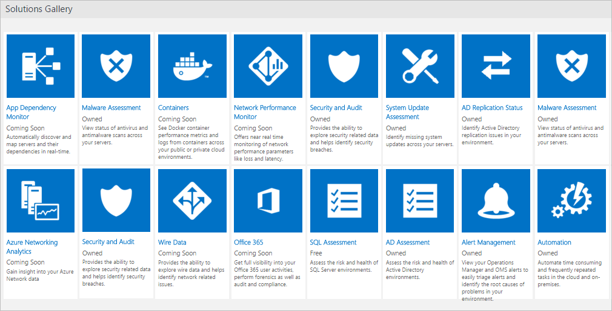

<properties
   pageTitle="Qu’est Analytique journal ? | Microsoft Azure"
   description="Journal Analytique est un service dans opérations gestion Suite (OMS) qui vous permet de collecter et analyser les données opérationnelles générées par des ressources dans le cloud et environnement local.  Cet article fournit une vue d’ensemble des différents composants de journal Analytique et des liens vers contenu détaillé."
   services="log-analytics"
   documentationCenter=""
   authors="bwren"
   manager="jwhit"
   editor="tysonn" />
<tags
   ms.service="log-analytics"
   ms.devlang="na"
   ms.topic="hero-article"
   ms.tgt_pltfrm="na"
   ms.workload="infrastructure-services"
   ms.date="09/06/2016"
   ms.author="bwren" />

# Qu’est Analytique journal ?
Journal Analytique est un service de [opérations Management Suite \(OMS\) ](../operations-management-suite/operations-management-suite-overview.md) qui vous permet de collecter et analyser les données générées par des ressources dans le cloud et les environnements locaux. Il vous donne des informations en temps réel à l’aide de la recherche intégrée et tableaux de bord personnalisés pour analyser aisément des millions d’enregistrements dans l’ensemble de vos charges de travail et les serveurs quel que soit leur emplacement physique.

## Ouvrez une session composants Analytique
Auprès du centre de journal Analytique est le référentiel OMS qui est hébergé dans le nuage Azure.  Collecte de données dans le référentiel de sources connectées par la configuration des sources de données et ajout de solutions à votre abonnement.  Sources de données et des solutions chacune crée différents types d’enregistrements qui ont leur propre jeu de propriétés, mais peuvent toujours être analysées ensemble dans les requêtes vers le référentiel.  Cela vous permet d’utiliser les mêmes outils et méthodes pour travailler avec différents types de données collectées par différentes sources.

Sources connectées sont les ordinateurs et autres ressources qui génèrent des données collectées par journal Analytique.  Cela peut inclure des agents installés sur des ordinateurs [Windows](log-analytics-windows-agents.md) et [Linux](log-analytics-linux-agents.md) qui se connectent directement ou dans un [groupe de gestion de System Center Operations Manager connecté](log-analytics-om-agents.md).  Journal Analytique peut également collecter des données à partir du [stockage Azure](log-analytics-azure-storage.md).

[Sources de données](log-analytics-data-sources.md) sont les différents types de données collectées à partir de chaque source connecté.  Cela inclut les événements et les [données de performance](log-analytics-data-sources-performance-counters.md) à partir de [Windows](log-analytics-data-sources-windows-events.md) et Linux exemptés en plus de sources telles que [les journaux IIS](log-analytics-data-sources-iis-logs.md)et les [journaux de type texte personnalisé](log-analytics-data-sources-custom-logs.md).  Vous configurez chaque source de données que vous souhaitez collecter et la configuration est remise automatiquement à chaque source connecté.

## Analyse des données de journal Analytique
La plupart de vos interactions avec journal Analytique seront via le portail OMS qui s’exécute dans n’importe quel navigateur et vous offre avec l’accès aux paramètres de configuration et plusieurs outils pour analyser et agir sur les données collectées.  À partir du portail vous pouvez tirer parti de [recherches de journaux](log-analytics-log-searches.md) où vous construisez des requêtes pour analyser les données recueillies, [tableaux de bord](log-analytics-dashboards.md) que vous pouvez personnaliser avec les affichages graphiques de vos recherches plus importants et les [solutions](log-analytics-add-solutions.md) qui fournissent des fonctionnalités supplémentaires et des outils d’analyse.

Journal Analytique fournit une syntaxe de requête pour récupérer rapidement et consolider les données dans le référentiel.  Vous pouvez créer et enregistrer des [Recherches de journaux](log-analytics-log-searches.md) pour analyser des données dans le portail OMS directement ou journal recherches exécutés automatiquement pour créer une alerte si les résultats de la requête indiquent une condition importantes.

Pour donner une vue graphique rapide de l’état de votre environnement global, vous pouvez ajouter des visualisations pour les recherches de journal enregistré de votre [tableau de bord](log-analytics-dashboards.md).   

Afin d’analyser des données en dehors de journal Analytique, vous pouvez exporter les données à partir du référentiel OMS dans les outils tels que [Power BI](log-analytics-powerbi.md) ou Excel.  Vous pouvez également tirer parti l' [API de recherche de journal](log-analytics-log-search-api.md) pour développer des solutions personnalisées qui s’appuient sur les données de journal Analytique ou intégrer avec d’autres systèmes.

## Solutions
Solutions ajoutent des fonctionnalités journal Analytique.  Principalement, ils s’exécutent dans le cloud et fournissent une analyse des données recueillies dans le référentiel OMS. Ils peuvent également définir des nouveaux types d’enregistrements à collecter qui peuvent être analysés avec des recherches de journal ou à une interface utilisateur supplémentaires fournies par la solution dans le tableau de bord OMS.  

Solutions sont disponibles pour une variété de fonctions, et vous pouvez facilement parcourir solutions disponibles et [Ajoutez-les à votre espace de travail OMS](log-analytics-add-solutions.md) à partir de la galerie de Solutions.  Beaucoup seront automatiquement déployées et commencer à travailler immédiatement tandis que d’autres personnes peuvent nécessiter une configuration.

## Architecture du journal Analytique
Les exigences de déploiement de journal Analytique sont minimales étant donné que les composants centraux sont hébergés dans le nuage Azure.  Cela inclut le référentiel outre les services qui vous permettent de regrouper et analyser les données collectées.  Le portail est accessibles à partir de n’importe quel navigateur n’est pas obligatoire pour logiciel client.

Vous devez installer les agents sur les ordinateurs [Windows](log-analytics-windows-agents.md) et [Linux](log-analytics-linux-agents.md) , mais il n’existe aucun agent supplémentaire requis pour les ordinateurs qui font déjà partie d’un [groupe de gestion SCOM connecté](log-analytics-om-agents.md).  Agents SCOM continuent à communiquer avec les serveurs de gestion qui transmettent leurs données au journal Analytique.  Obtenir des solutions nécessite cependant agents de communiquer directement avec journal Analytique.  La documentation de chaque solution spécifierez exigences de communication.

Lorsque vous [vous inscrire journal Analytique](log-analytics-get-started.md), vous allez créer un espace de travail OMS.  Vous pouvez considérer l’espace de travail comme un environnement OMS unique avec sa propre référentiel de données, des sources de données et des solutions. Vous pouvez créer plusieurs espaces de travail dans votre abonnement prennent en charge plusieurs environnements tels que de production et le test.

## Étapes suivantes

- [S’inscrire à un compte Analytique journal gratuit](log-analytics-get-started.md) à tester dans votre environnement.
- Permet d’afficher les différentes [Sources de données](log-analytics-data-sources.md) disponibles pour recueillir des données dans le référentiel OMS.
- Pour ajouter des fonctionnalités à journal Analytique, [Parcourir les solutions disponibles dans la galerie de Solutions](log-analytics-add-solutions.md) .
