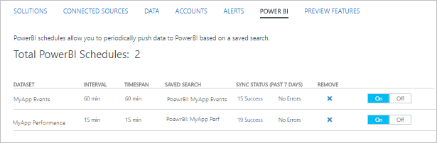

<properties
   pageTitle="Exporter des données de journal Analytique à Power BI | Microsoft Azure"
   description="Power BI est un service basé sur le cloud entreprise analytique à partir de Microsoft, qui fournit les visualisations enrichies et les rapports d’analyse de différents jeux de données.  Journal Analytique peut en permanence exporter des données à partir du référentiel OMS dans Power BI afin que vous pouvez exploiter ses visualisations et outils d’analyse.  Cet article décrit comment configurer des requêtes dans Analytique de journal exporter automatiquement dans Power BI à intervalles réguliers."
   services="log-analytics"
   documentationCenter=""
   authors="bwren"
   manager="jwhit"
   editor="tysonn" />
<tags
   ms.service="log-analytics"
   ms.devlang="na"
   ms.topic="article"
   ms.tgt_pltfrm="na"
   ms.workload="infrastructure-services"
   ms.date="10/18/2016"
   ms.author="bwren" />

# Exporter des données de journal Analytique à Power BI

[Power BI](https://powerbi.microsoft.com/documentation/powerbi-service-get-started/) est un service basé sur le cloud entreprise analytique à partir de Microsoft, qui fournit les visualisations enrichies et les rapports d’analyse de différents jeux de données.  Journal Analytique peut automatiquement exporter des données à partir du référentiel OMS dans Power BI afin que vous pouvez exploiter ses visualisations et outils d’analyse.

Lorsque vous configurez Power BI avec journal Analytique, vous créez des requêtes de journal qui exporter leurs résultats aux groupes de données correspondantes dans Power BI.  La requête et l’exportation continue à s’exécuter automatiquement sur un planning que vous définissez pour maintenir le jeu de données à jour avec les dernières données collectées par journal Analytique.

## Power BI planifications

Un *Power BI planification* inclut une recherche de journal qui permet d’exporter un ensemble de données à partir du référentiel OMS à un jeu de données correspondante dans Power BI et un calendrier qui définit la fréquence d’exécution de cette recherche pour conserver le jeu de données en cours.

Les champs du DataSet donneront les propriétés des enregistrements renvoyés par la recherche de journal.  Si la recherche renvoie les enregistrements des différents types dataset doit inclure toutes les propriétés de chacun des types d’enregistrements inclus.  

> [AZURE.NOTE] Il est recommandé d’utiliser une requête de recherche de journal qui renvoie des données brutes au lieu d’une consolidation à l’aide des commandes par exemple [mesure](log-analytics-search-reference.md#measure).  Vous pouvez effectuer des calculs et toute l’agrégation dans Power BI à partir des données brutes.

## Connexion d’espace de travail OMS à Power BI

Avant de pouvoir exporter à partir de journal Analytique à Power BI, vous devez vous connecter à votre espace de travail OMS à votre compte de Power BI à l’aide de la procédure suivante.  

1. Cliquez sur la vignette de **paramètres de** la console OMS.
2. Sélectionnez **comptes**.
3. Dans la section **Informations d’espace de travail** , cliquez sur **se connecter à Power BI compte**.
4. Entrez les informations d’identification de votre compte de Power BI.

## Créer une planification de Power BI

Planifier les Power BI pour chaque jeu de données à l’aide de la procédure suivante.

1. Cliquez sur la vignette de **Recherche de journal de** la console OMS.
2. Tapez dans une nouvelle requête ou sélectionnez une recherche enregistrée qui renvoie les données que vous voulez exporter à **Power BI**.  
3. Cliquez sur le bouton **Power BI** en haut de la page pour ouvrir la boîte de dialogue **Power BI** .
4. Fournissez les informations dans le tableau suivant, puis cliquez sur **Enregistrer**.

| Propriété | Description |
|:--|:--|
| Nom | Nom qui identifie la planification lorsque vous affichez la liste des planifications de Power BI. |
| Recherche enregistrée | La recherche du journal à exécuter.  Vous pouvez sélectionner la requête actuelle ou sélectionnez une recherche enregistrée existante dans la zone de liste déroulante. |
| Planification | La fréquence d’exécution de la recherche enregistrée et exporter dans le groupe de données Power BI.  La valeur doit être comprise entre 15 minutes et 24 heures. |
| Nom du jeu de données | Le nom du groupe de données dans Power BI.  Il sera créé s’il n’existe et mis à jour s’il existe. |

## Affichage et suppression des Power BI planifications

Afficher la liste des planifications de BI Power existantes avec la procédure suivante.

1. Cliquez sur la vignette de **paramètres de** la console OMS.
2. Sélectionnez **Power BI**.

Outre les détails de la planification, le nombre de fois fonctionnant par la planification de la semaine et l’état de la dernière synchronisation sont affichées.  Si la synchronisation a rencontré des erreurs, vous pouvez cliquer sur le lien pour exécuter une recherche de journal pour les enregistrements avec les détails de l’erreur.

Vous pouvez supprimer une planification en cliquant sur le **X** dans la **colonne de supprimer**.  Vous pouvez désactiver une planification en sélectionnant **désactiver**.  Pour modifier une planification, vous devez supprimer et recréer avec les nouveaux paramètres.

## Procédure d’exemple
La section suivante décrit un exemple de création d’une planification de BI Power et à l’aide de son jeu de données pour créer un état simple.  Dans cet exemple, toutes les données de performance pour un ensemble d’ordinateurs est exporté à Power BI et puis un graphique en courbes est créé pour afficher l’utilisation du processeur.

### Créer la recherche des journaux
Nous allons commencer par la création d’une recherche de journal pour les données que nous voulons envoyer au groupe de données.  Dans cet exemple, nous allons utiliser une requête qui renvoie toutes les données de performance pour les ordinateurs dont le nom commence par *srv*.  

### Créer Power BI recherche
Cliquez sur le bouton **Power BI** pour ouvrir la boîte de dialogue Power BI et fournissez les informations requises.  Nous voulons cette recherche pour exécuter une fois par heure et créer un jeu de données appelée *Performance Contoso*.  Étant donné que nous avons déjà la recherche ouvrir qui crée les données nous voulons, nous conserver la valeur par défaut de *requête de recherche en cours utiliser* pour la **Recherche enregistrée**.

### Vérifiez que Power BI recherche
Pour vérifier que nous correctement créé l’Échéancier, nous permet d’afficher la liste de Power BI recherches sous la vignette **paramètres** dans le tableau de bord OMS.  Nous Patientez quelques minutes et actualisez cet affichage jusqu'à ce qu’il signale que la synchronisation a été exécutée.

### Vérifier le jeu de données dans Power BI
Vous vous connectez à notre compte [powerbi.microsoft.com](http://powerbi.microsoft.com/) et faites défiler jusqu'à **jeux de données** en bas du volet gauche.  Nous pouvons voir que le jeu de données de *Performance de Contoso* est répertorié indiquant que notre exportation a été exécutée.

### Créer le rapport basé sur le jeu de données
Nous sélectionnez le jeu de données de **Performance de Contoso** , puis sur les **résultats** dans le volet **champs** sur la droite pour afficher les champs qui font partie de ce groupe de données.  Pour créer un graphique en courbes affichant l’utilisation du processeur pour chaque ordinateur, nous effectuer les opérations suivantes.

1. Sélectionnez la visualisation de graphique de ligne.
2. Faites glisser **nom_objet** pour **signaler le filtre de niveau** et vérifier **processeur**.
3. Faites glisser **CounterName** pour **signaler le filtre de niveau** et vérifier **% temps processeur**.
4. Faites glisser **contre-valeurs** aux **valeurs**.
5. Faites glisser **ordinateur** à la **légende**.
6. Faites glisser **TimeGenerated** vers **l’axe**.

Nous pouvons voir que la courbe résultante s’affiche avec les données à partir de notre dataset.

### Enregistrez le rapport
Nous enregistrez le rapport en cliquant sur le bouton Enregistrer dans la partie supérieure de l’écran et valider qu’il est maintenant répertorié dans la section rapports dans le volet gauche.

## Étapes suivantes

- En savoir plus sur [les recherches de journal](log-analytics-log-searches.md) créer des requêtes qui peuvent être exportés vers Power BI.
- En savoir plus sur [Power BI](http://powerbi.microsoft.com) et créer des visualisations basées sur journal Analytique exportations.
