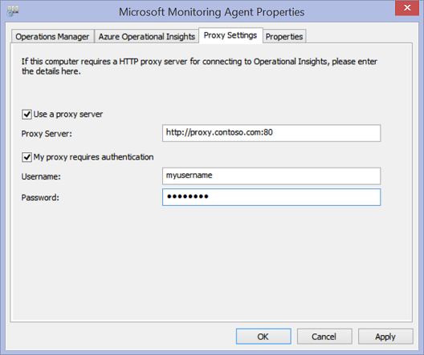
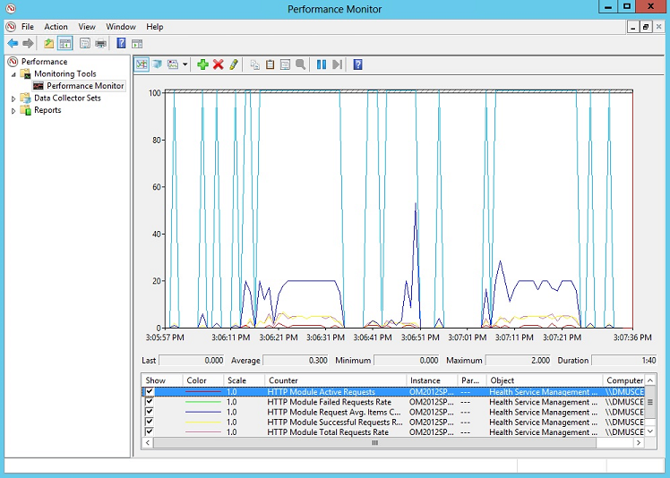

<properties
    pageTitle="Configurer les paramètres de proxy et de pare-feu dans journal Analytique | Microsoft Azure"
    description="Configurer les paramètres de proxy et de pare-feu lorsque vos agents ou services OMS doivent utiliser des ports spécifiques."
    services="log-analytics"
    documentationCenter=""
    authors="bandersmsft"
    manager="jwhit"
    editor=""/>

<tags
    ms.service="log-analytics"
    ms.workload="na"
    ms.tgt_pltfrm="na"
    ms.devlang="na"
    ms.topic="get-started-article"
    ms.date="08/23/2016"
    ms.author="banders;magoedte"/>

# <a name="configure-proxy-and-firewall-settings-in-log-analytics"></a>Configurer les paramètres de proxy et de pare-feu dans journal Analytique

Actions nécessaires pour configurer le proxy et les paramètres de pare-feu pour journal Analytique dans OMS diffèrent lorsque vous utilisez Operations Manager et ses agents par rapport à Microsoft surveillance Agents qui se connectent directement aux serveurs. Passez en revue les sections suivantes pour le type d’agent que vous utilisez.

## <a name="configure-proxy-and-firewall-settings-with-the-microsoft-monitoring-agent"></a>Configurer les paramètres de proxy et de pare-feu avec l’Agent de surveillance Microsoft

Pour l’Agent de surveillance de Microsoft pour vous connecter à et inscrire auprès du service OMS, il doit avoir accès au numéro de port de vos domaines et les URL. Si vous utilisez un serveur proxy pour la communication entre l’agent et le service OMS, vous devez vous assurer que les ressources appropriées sont accessibles. Si vous utilisez un pare-feu pour limiter l’accès à Internet, vous devez configurer votre pare-feu pour autoriser l’accès à OMS. Les tableaux suivants répertorient les ports nécessitant l’OMS.

|**Ressource de l’agent**|**Ports**|**Ignorer inspection HTTPS**|
|--------------|-----|--------------|
|\*. ods.opinsights.azure.com|443|Oui|
|\*. oms.opinsights.azure.com|443|Oui|
|\*. blob.core.windows.net|443|Oui|
|ODS.systemcenteradvisor.com|443| |

Vous pouvez utiliser la procédure suivante pour configurer les paramètres de proxy pour l’Agent de surveillance Microsoft en utilisant le panneau de configuration. Vous devez utiliser la procédure pour chaque serveur. Si vous disposez de nombreux serveurs dont vous avez besoin pour configurer, vous trouverez plus facile à utiliser un script pour automatiser ce processus. Si c’est le cas, consultez la procédure suivante [pour configurer les paramètres de proxy pour l’Agent de surveillance Microsoft à l’aide d’un script](#to-configure-proxy-settings-for-the-microsoft-monitoring-agent-using-a-script).

### <a name="to-configure-proxy-settings-for-the-microsoft-monitoring-agent-using-control-panel"></a>Pour configurer les paramètres de proxy pour l’Agent de surveillance Microsoft en utilisant le panneau de configuration

1. Ouvrez **le panneau de configuration**.

2. Ouvrez **Microsoft l’Agent de surveillance**.

3. Cliquez sur l’onglet **Paramètres de Proxy** .<br>  
  

4. Sélectionnez **utiliser un serveur proxy** et entrez l’URL et numéro de port, s’il en si nécessaire, comme dans l’exemple affiché. Si votre serveur proxy requiert une authentification, tapez le nom d’utilisateur et mot de passe pour accéder au serveur proxy.

Utilisez la procédure suivante pour créer un script PowerShell que vous pouvez exécuter pour définir les paramètres de proxy pour chaque agent qui se connecte directement aux serveurs.

### <a name="to-configure-proxy-settings-for-the-microsoft-monitoring-agent-using-a-script"></a>Pour configurer les paramètres de proxy pour l’Agent de surveillance Microsoft à l’aide d’un script

Copier l’exemple suivant, mettre à jour des informations spécifiques à votre environnement, enregistrez-le avec une extension de nom de fichier PS1 et puis exécuter le script sur chaque ordinateur connecté directement au service OMS.

        
    param($ProxyDomainName="http://proxy.contoso.com:80", $cred=(Get-Credential))

    # First we get the Health Service configuration object.  We need to determine if we
    #have the right update rollup with the API we need.  If not, no need to run the rest of the script.
    $healthServiceSettings = New-Object -ComObject 'AgentConfigManager.MgmtSvcCfg'

    $proxyMethod = $healthServiceSettings | Get-Member -Name 'SetProxyInfo'

    if (!$proxyMethod)
    {
         Write-Output 'Health Service proxy API not present, will not update settings.'
         return
    }

    Write-Output "Clearing proxy settings."
    $healthServiceSettings.SetProxyInfo('', '', '')

    $ProxyUserName = $cred.username

    Write-Output "Setting proxy to $ProxyDomainName with proxy username $ProxyUserName."
    $healthServiceSettings.SetProxyInfo($ProxyDomainName, $ProxyUserName, $cred.GetNetworkCredential().password)
        

## <a name="configure-proxy-and-firewall-settings-with-operations-manager"></a>Configurer les paramètres de proxy et de pare-feu avec Operations Manager

Pour un groupe d’administration Operations Manager pour vous connecter à et inscrire auprès du service OMS, il doit avoir accès aux numéros de port de vos domaines et URL. Si vous utilisez un serveur proxy pour les communications entre le serveur d’administration Operations Manager et le service OMS, vous devez vous assurer que les ressources appropriées sont accessibles. Si vous utilisez un pare-feu pour limiter l’accès à Internet, vous devez configurer votre pare-feu pour autoriser l’accès à OMS. Même si un serveur de gestion Operations Manager n’est pas derrière un serveur proxy, ses agents peuvent être. Dans ce cas, le serveur proxy doit être configuré de la même manière comme agents sont pour activer et permettre la sécurité et de données de solution de gestion des journaux obtenir envoyées à la OMS de service web.

Dans l’ordre d’agents Operations Manager communiquer avec le service OMS, votre infrastructure Operations Manager (y compris les agents) doit avoir les paramètres de proxy correct et la version. Le paramètre d’agents proxy spécifié dans la console Operations Manager. Votre version doit être une des opérations suivantes :

- Operations Manager 2012 SP1 mise à jour cumulative 7 ou version ultérieure
- Operations Manager 2012 R2 mise à jour cumulative 3 ou version ultérieure


Les tableaux suivants répertorient les ports associés à ces tâches.

>[AZURE.NOTE] Parmi les ressources suivantes mentionner Advisor et les idées opérationnelles, les deux ont été les versions précédentes de OMS. Toutefois, les ressources répertoriées changera à l’avenir.

Voici une liste de ports et les ressources de l’agent :<br>

|**Ressource de l’agent**|**Ports**|
|--------------|-----|
|\*. ods.opinsights.azure.com|443|
|\*. oms.opinsights.azure.com|443|
|\*.BLOB.Core.Windows.NET/\*|443|
|ODS.systemcenteradvisor.com|443|
<br>
Voici une liste de ressources serveur de gestion et de ports :<br>

|**Ressource de serveur de gestion**|**Ports**|**Ignorer inspection HTTPS**|
|--------------|-----|--------------|
|service.systemcenteradvisor.com|443| |
|\*. service.opinsights.azure.com|443| |
|\*. blob.core.windows.net|443|Oui| 
|Data.systemcenteradvisor.com|443| | 
|ODS.systemcenteradvisor.com|443| | 
|\*. ods.opinsights.azure.com|443|Oui| 
<br>
Voici une liste de ressources de la console OMS et Operations Manager et de ports.<br>

|**Ressource console OMS et Operations Manager**|**Ports**|
|----|----|
|service.systemcenteradvisor.com|443|
|\*. service.opinsights.azure.com|443|
|\*. live.com|Ports 80 et 443|
|\*. microsoft.com|Ports 80 et 443|
|\*. microsoftonline.com|Ports 80 et 443|
|\*. mms.microsoft.com|Ports 80 et 443|
|Login.Windows.NET|Ports 80 et 443|
<br>

Utilisez les procédures suivantes pour enregistrer votre groupe d’administration Operations Manager auprès du service OMS. Si vous rencontrez des problèmes de communication entre le groupe d’administration et le service OMS, utilisez les procédures de validation pour résoudre les problèmes de transmission des données au service OMS.

### <a name="to-request-exceptions-for-the-oms-service-endpoints"></a>Pour demander des exceptions pour les points de terminaison du service OMS

1. Utilisez les informations de la première table présentée précédemment pour vous assurer que les ressources nécessaires pour le serveur d’administration Operations Manager sont accessibles via les pare-feu que vous deviez.
2. Utilisez les informations de la deuxième table présentée précédemment pour vous assurer que les ressources nécessaires à la console d’opérations dans Operations Manager et OMS sont accessibles via les pare-feu que vous deviez.
3. Si vous utilisez un serveur proxy avec Internet Explorer, assurez-vous qu’il est configuré et qu’il fonctionne correctement. Pour vérifier, vous pouvez ouvrir une connexion web sécurisé (HTTPS), par exemple [https://bing.com](https://bing.com). Si la connexion Internet sécurisée ne fonctionne pas dans un navigateur, il probablement ne fonctionne pas dans la console de gestion des Operations Manager avec les services web dans le cloud.

### <a name="to-configure-the-proxy-server-in-the-operations-manager-console"></a>Pour configurer le serveur proxy dans la console Operations Manager

1. Ouvrez la console Operations Manager et sélectionnez l’espace de travail **d’Administration** .

2. Développez **Perspectives opérationnelles**, puis sélectionnez **Connexion Insights opérationnelle**.<br>  
    
3. Dans la vue OMS connexion, cliquez sur **Configurer le serveur Proxy**.<br>  
    
4. Assistant Paramètres perspectives opérationnelles en : Serveur Proxy, sélectionnez **utiliser un serveur proxy pour accéder au Service Web perspectives opérationnelles**et tapez l’URL avec le port nombre, par exemple, **http://myproxy:80**.<br>  
    


### <a name="to-specify-credentials-if-the-proxy-server-requires-authentication"></a>Pour spécifier les informations d’identification si le serveur proxy requiert une authentification
 Paramètres et informations d’identification du serveur proxy doivent se propager sur les ordinateurs gérés signaleront à OMS. Ces serveurs doivent être dans le *Groupe de serveur de surveillance Microsoft système Centre Advisor*. Informations d’identification sont chiffrées dans le Registre de chaque serveur dans le groupe.

1. Ouvrez la console Operations Manager et sélectionnez l’espace de travail **d’Administration** .
2. Sous **Configuration RunAs**, sélectionnez **les profils**.
3. Ouvrez le profil **Système Centre Advisor exécuter en tant que Proxy de profil** .  
    
4. Dans l’Assistant exécution de comme profil, cliquez sur **Ajouter** pour utiliser un compte Exécuter en tant que. Vous pouvez créer un nouveau compte Exécuter en tant qu’ou utiliser un compte existant. Ce compte doit disposer des autorisations suffisantes pour passer par le serveur proxy.  
    
5. Pour définir le compte à gérer, cliquez sur **une classe sélectionnée, un groupe ou un objet** pour ouvrir la zone de recherche de l’objet.  
    
6. Recherchez, puis cliquez sur **Groupe de serveur de surveillance Microsoft système Centre Advisor**.  
    
7. Cliquez sur **OK** pour fermer la boîte Ajouter un exécuter en tant que compte.  
    
8. Exécuter l’Assistant et enregistrer les modifications.  
    


### <a name="to-validate-that-oms-management-packs-are-downloaded"></a>Pour valider le fait que la direction OMS modules sont téléchargés

Si vous avez ajouté des solutions à OMS, vous pouvez les afficher dans la console Operations Manager sous packs d’administration sous **Administration de la**. Recherchez *System Center Advisor* pour les retrouver rapidement.  
     ou, vous pouvez également vérifier OMS packs d’administration à l’aide de la commande Windows PowerShell suivante dans le serveur d’administration Operations Manager :

    ```
    Get-ScomManagementPack | where {$_.DisplayName -match 'Advisor'} | select Name,DisplayName,Version,KeyToken
    ```

### <a name="to-validate-that-operations-manager-is-sending-data-to-the-oms-service"></a>Pour valider ce Operations Manager envoie des données au service OMS

1. Dans le serveur d’administration Operations Manager, ouvrez l’Analyseur de performances (perfmon.exe) et sélectionnez **Analyseur de performances**.
2. Cliquez sur **Ajouter**et sélectionnez **Intégrité du Service Gestion des groupes**.
3. Ajouter tous les compteurs qui commencent par **HTTP**.  
    
4. Si votre configuration Operations Manager est préférable, que vous verrez l’activité des compteurs d’intégrité du Service Gestion des événements et autres éléments de données, selon les packs d’administration que vous avez ajouté dans OMS et la stratégie de collection de sites de journal configuré.  
    


## <a name="next-steps"></a>Étapes suivantes

- [Solutions ajouter journal Analytique à partir de la galerie de Solutions](log-analytics-add-solutions.md) pour ajouter des fonctionnalités et recueillir des données.
- Se familiariser avec des [recherches de journal](log-analytics-log-searches.md) afficher des informations détaillées collectées par les solutions.
