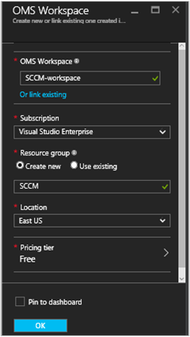
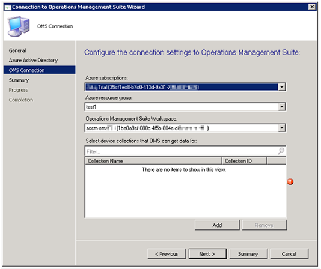
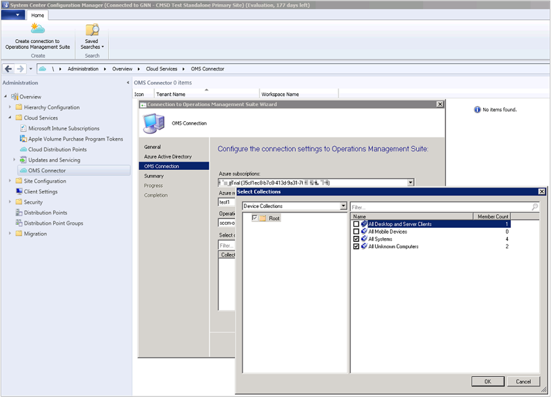

<properties
    pageTitle="Connecter le Gestionnaire de Configuration à journal Analytique | Microsoft Azure"
    description="Cet article vous explique comment se connecter le Gestionnaire de Configuration au journal Analytique et démarrer l’analyse des données."
    services="log-analytics"
    documentationCenter=""
    authors="bandersmsft"
    manager="jwhit"
    editor=""/>

<tags
    ms.service="log-analytics"
    ms.workload="na"
    ms.tgt_pltfrm="na"
    ms.devlang="na"
    ms.topic="article"
    ms.date="08/29/2016"
    ms.author="banders"/>

# Connecter le Gestionnaire de Configuration à Analytique de journal

Vous pouvez vous connecter Gestionnaire de Configuration de System Center à Analytique journal dans OMS aux données de collection de sites appareil de synchronisation. Cela rend les données à partir de votre gestionnaire de Configuration de déploiement disponibles dans OMS.

Il existe un nombre d’étapes nécessaires pour vous connecter le Gestionnaire de Configuration à OMS, donc Voici un récapitulatif rapide de l’ensemble du processus :

1. Dans le portail de gestion Azure, enregistrer le Gestionnaire de Configuration comme une application Web Application et/ou API Web et vérifier que vous disposez de l’ID de client et clé secrète client à partir de l’enregistrement à partir d’Azure Active Directory. Voir [portail utiliser pour créer une application Active Directory et le service principal qui peuvent accéder aux ressources](../resource-group-create-service-principal-portal.md) pour plus d’informations sur la façon de réaliser cette étape.
2. Dans le portail de gestion Azure, [fournissent Gestionnaire de Configuration (l’application web inscrit) avec des autorisations pour accéder aux OMS](#provide-configuration-manager-with-permissions-to-oms).
3. Dans Gestionnaire de Configuration, [Ajouter une connexion à l’aide de l’Assistant Ajout de connexion OMS](#add-an-oms-connection-to-configuration-manager).
4. Dans le Gestionnaire de Configuration, vous pouvez [mettre à jour les propriétés de connexion](#update-oms-connection-properties) si le code secret mot de passe ou d’un client expire jamais ou est perdu.
5. Qui contient des informations à partir du portail OMS [télécharger et installer l’Agent de surveillance Microsoft](#download-and-install-the-agent) sur l’ordinateur qui exécute la connexion au service Gestionnaire de Configuration point rôle système de site. L’agent envoie des données du Gestionnaire de Configuration d’OMS.
6. Dans OMS, [Importer des collections de sites à partir du Gestionnaire de Configuration](#import-collections) sous forme de groupes d’ordinateurs.
7. OMS, affiche les données à partir du Gestionnaire de Configuration sous forme de [groupes de l’ordinateur](log-analytics-computer-groups.md).

Vous pouvez en savoir plus sur la connexion Gestionnaire de Configuration à OMS en [données de synchronisation à partir du Gestionnaire de Configuration à la Suite de gestion des opérations de Microsoft](https://technet.microsoft.com/library/mt757374.aspx).

## Fournir le Gestionnaire de Configuration avec des autorisations à OMS

La procédure suivante décrit le portail de gestion Azure avec des autorisations pour accéder aux OMS. En particulier, vous devez accorder le *rôle de collaborateur* aux utilisateurs dans le groupe de ressources. Qui permet à son tour, le portail de gestion Azure pour vous connecter le Gestionnaire de Configuration à OMS.

>[AZURE.NOTE] Vous devez spécifier des autorisations d’OMS pour le Gestionnaire de Configuration. Dans le cas contraire, vous recevrez un message d’erreur lorsque vous utilisez l’Assistant de configuration dans le Gestionnaire de Configuration.

1. Ouvrez le [portail Azure](https://portal.azure.com/) et cliquez sur **Parcourir** > **Journal Analytique (OMS)** pour ouvrir la carte de journal Analytique (OMS).  
2. Dans la carte de **Journal Analytique (OMS)** , cliquez sur **Ajouter** pour ouvrir la carte de **l’Espace de travail OMS** .  
  
3. Dans la carte de **l’Espace de travail OMS** , fournissez les informations suivantes, puis sur **OK**.
  - **Espace de travail OMS**
  - **Abonnement**
  - **Groupe de ressources**
  - **Emplacement**
  - **Niveau de tarification**  
      

    >[AZURE.NOTE] L’exemple ci-dessus crée un nouveau groupe de ressources. Le groupe de ressources est utilisé uniquement pour fournir le Gestionnaire de Configuration avec les autorisations pour l’espace de travail OMS dans cet exemple.

4. Cliquez sur **Parcourir** > **groupes de ressources** pour ouvrir la carte de **groupes de ressources** .
5. Dans la carte de **groupes de ressources** , cliquez sur le groupe de ressources que vous avez créé précédemment pour ouvrir la &lt;nom du groupe ressource&gt; carte paramètres.  
  
6. Dans la &lt;nom du groupe ressource&gt; carte paramètres, cliquez sur contrôle d’accès (IAM) pour ouvrir la &lt;nom groupe de ressources&gt; carte utilisateurs.  
    
7. Dans la &lt;nom du groupe ressource&gt; carte utilisateurs, cliquez sur **Ajouter** pour ouvrir la carte **Ajouter access** .
8. Dans la carte **Ajouter access** , cliquez sur **Sélectionner un rôle**, puis sélectionnez le rôle de **collaborateur** .  
    
9. Cliquez sur **Ajouter des utilisateurs**, sélectionnez l’utilisateur Gestionnaire de Configuration, cliquez sur **Sélectionner**, puis cliquez sur **OK**.  
    

## Ajouter une connexion OMS pour le Gestionnaire de Configuration

Pour ajouter une connexion OMS, votre environnement Gestionnaire de Configuration doit avoir une [connexion au service pointez](https://technet.microsoft.com/library/mt627781.aspx) configuré pour le mode en ligne.

1. Dans l’espace de travail **Administration** du Gestionnaire de Configuration, sélectionnez **OMS Connector**. Cette action ouvre l' **Assistant Ajout de connexion OMS**. Cliquez sur **suivant**.

2. Dans l’écran **Général** , vérifiez que vous avez terminé les actions suivantes et que vous disposez des détails sur chaque élément, puis cliquez sur **suivant**.
  1. Dans le portail de gestion Azure, vous avez enregistré le Gestionnaire de Configuration sous forme d’une application Web Application et/ou API Web et que vous disposez de l' [ID de client de l’inscription](../active-directory/active-directory-integrating-applications.md).
  2. Dans le portail de gestion Azure, vous avez créé une clé secrète application pour l’application enregistrée dans Azure Active Directory.  
  3. Dans le portail de gestion Azure, vous avez fourni l’application web inscrit avec autorisation d’accès OMS.  
  

3. Dans l’écran **Azure Active Directory** , configurer vos paramètres de connexion à OMS grâce à votre **client** , **l’ID de Client** et **Clé Secret du Client** , puis cliquez sur **suivant**.  
  

4. Si vous avez accompli toutes les autres procédures avec succès, les informations sur l’écran de **Configuration de la connexion OMS** seront affiche automatiquement dans cette page. Informations pour les paramètres de connexion doivent apparaître pour votre **abonnement Azure** , un **groupe de ressources Azure** et un **Espace de travail Suite de gestion des opérations**.  
  

5. L’Assistant se connecte au service OMS en utilisant les informations que vous avez entrées. Sélectionnez les collections d’appareil que vous souhaitez synchroniser avec OMS, puis cliquez sur **Ajouter**.  
  

6. Vérifiez vos paramètres de connexion à l’écran de **Résumé** , puis sélectionnez **suivant**. L’écran de **l’avancement** affiche l’état de connexion, puis doit **achevé**.

>[AZURE.NOTE] Vous devez vous connecter OMS sur le site de niveau supérieur de votre hiérarchie. Si vous connectez OMS d’un site principal autonome et ajoutez un site de l’administration centrale à votre environnement, vous devez supprimer et recréer la connexion OMS dans la nouvelle hiérarchie.

Une fois que vous avez lié le Gestionnaire de Configuration à OMS, vous pouvez ajouter ou supprimer des collections et afficher les propriétés de la connexion OMS.

## Mettre à jour les propriétés de connexion OMS

Si une clé secrète mot de passe ou d’un client expire jamais ou est perdue, vous devez mettre à jour manuellement les propriétés de connexion OMS.

1. Dans le Gestionnaire de Configuration, accédez aux **Services Cloud** , puis sélectionnez **Connecteur OMS** pour ouvrir la page **Propriétés de connexion OMS** .
2. Dans cette page, cliquez sur l’onglet **Azure Active Directory** pour afficher votre **client**, **ID de Client**, **expiration clée secrète Client**. **Vérifier** votre **clé secrète Client** s’il a expiré.

## Télécharger et installer l’agent

1. Dans le portail OMS, [Téléchargez le fichier de configuration de l’agent à OMS](log-analytics-windows-agents.md#download-the-agent-setup-file-from-oms).
2. Utilisez une des méthodes suivantes pour installer et configurer l’agent sur l’ordinateur qui exécute le rôle Gestionnaire de Configuration service connexion point site système :
  - [Installer l’agent en utilisant le programme d’installation](log-analytics-windows-agents.md#install-the-agent-using-setup)
  - [Installer l’agent à l’aide de la ligne de commande](log-analytics-windows-agents.md#install-the-agent-using-the-command-line)
  - [Installer l’agent à l’aide de DSC dans Azure Automation](log-analytics-windows-agents.md#install-the-agent-using-dsc-in-azure-automation)

## Importer des collections de sites

Une fois que vous avez ajouté une connexion OMS pour le Gestionnaire de Configuration et d’installer l’agent sur l’ordinateur qui exécute la connexion au service Gestionnaire de Configuration, pointez sur rôle système de site, l’étape suivante consiste à importer des collections de sites à partir du Gestionnaire de Configuration dans OMS sous forme de groupes de l’ordinateur.

Après que l’importation est activée, les informations d’appartenance collection soient récupérées toutes les 3 heures pour maintenir à jour les appartenances de collection de sites. Vous pouvez choisir de désactiver importation à tout moment.

1. Dans le portail OMS, cliquez sur **paramètres**.
2. Cliquez sur l’onglet **Groupes d’ordinateurs** , puis sur l’onglet **SCCM** .
3. Sélectionnez **appartenances aux collections de gestionnaire de Configuration importer** , puis sur **Enregistrer**.  
  

## Afficher les données à partir du Gestionnaire de Configuration

Une fois que vous avez ajouté une connexion OMS pour le Gestionnaire de Configuration et installé l’agent sur l’ordinateur qui exécute le rôle Gestionnaire de Configuration service connexion point site système, les données de l’agent sont envoyées à OMS. Dans OMS, vos collections de gestionnaire de Configuration s’affichent sous forme de [groupes d’ordinateurs](log-analytics-computer-groups.md). Vous pouvez afficher les groupes à partir de la page **Gestionnaire de Configuration** sous **Groupes d’ordinateurs** dans **les paramètres**.

Une fois les collections importées, vous pouvez voir combien d’ordinateurs membres de la collection de sites a été détecté. Vous pouvez également afficher le nombre de collections de sites qui ont été importés.

Lorsque vous cliquez sur l’une, recherche s’ouvre et affiche tous les groupes importés ou tous les ordinateurs qui appartiennent à chaque groupe. À l’aide de la [Recherche dans un journal](log-analytics-log-searches.md), vous pouvez démarrer une analyse plus poussée pour les données du Gestionnaire de Configuration.

## Étapes suivantes

- [Recherche dans un journal](log-analytics-log-searches.md) permet d’afficher des informations détaillées sur vos données du Gestionnaire de Configuration.
