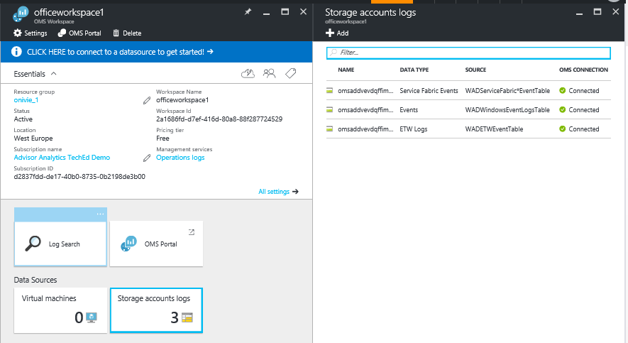
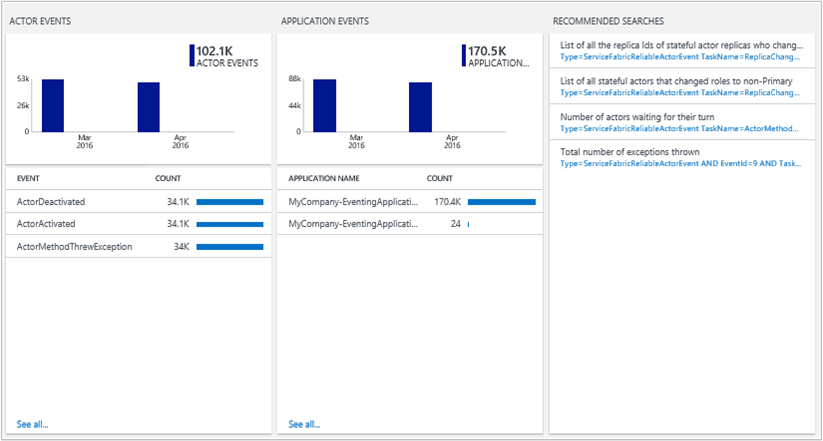

<properties
    pageTitle="Optimiser votre environnement avec la solution tissu de Service dans le journal Analytique | Microsoft Azure"
    description="Vous pouvez utiliser la solution tissu de Service afin d’évaluer le risque et l’état de votre Service tissu, micro-services, nœuds et les applications clusters."
    services="log-analytics"
    documentationCenter=""
    authors="niniikhena"
    manager="jochan"
    editor=""/>

<tags
    ms.service="log-analytics"
    ms.workload="na"
    ms.tgt_pltfrm="na"
    ms.devlang="na"
    ms.topic="article"
    ms.date="09/21/2016"
    ms.author="nini"/>


# <a name="service-fabric-solution-in-log-analytics"></a>Solution de tissu de service dans le journal Analytique

> [AZURE.SELECTOR]
- [Gestionnaire de ressources](log-analytics-service-fabric-azure-resource-manager.md)
- [PowerShell](log-analytics-service-fabric.md)

Cet article décrit comment utiliser la solution tissu de Service dans journal Analytique pour aider à identifier et résoudre les problèmes sur votre cluster tissu de Service.

La solution TISSU Service utilise des données Azure Diagnostics à partir de vos ordinateurs virtuels tissu de Service, par collecte des données à partir de vos tables WAD Azure. Journal Analytique lit ensuite les événements d’infrastructure tissu de Service, y compris les **Événements de Service fiables**, acteur, **Les événements opérationnels**et **Événements** **événements ETW personnalisé**. Avec le tableau de bord solution, vous êtes en mesure d’afficher les problèmes remarquables et événements importants dans votre environnement tissu de Service.

Pour commencer à utiliser la solution, vous avez besoin pour vous connecter votre cluster tissu de Service à un espace de travail journal Analytique. Voici trois scénarios à prendre en compte :

1. Si vous n’avez pas déployé votre cluster tissu de Service, suivez les étapes ***déployer un Cluster de tissu Service connecté à un espace de travail journal Analytique*** à déployer un nouveau cluster et avez configuré à l’état à journal Analytique.

2. Si vous avez besoin recueillir des compteurs de performance à partir de vos hôtes à utiliser d’autres solutions OMS tels que de sécurité sur votre Cluster tissu de Service, suivez les étapes de ***déployer un Cluster de tissu Service connecté à un espace de travail OMS avec une Extension machine virtuelle installé.***

3. Si vous avez déjà déployé votre cluster à structure de Service et que vous souhaitez pour vous connecter au journal Analytique, suivez les étapes de ***Ajout d’un compte de stockage existant à journal Analytique.***


##<a name="deploy-a-service-fabric-cluster-connected-to-a-log-analytics-workspace"></a>Déployer un Cluster de tissu Service connecté à un espace de travail journal Analytique.
Ce modèle effectue les opérations suivantes :


1. Déploie un cluster Azure Service TISSU déjà connecté à un espace de travail journal Analytique. Vous avez la possibilité de créer un espace de travail tout en déployant le modèle ou entrez le nom d’un espace de travail Analytique journal déjà existant.
2. Ajoute le compte de stockage des diagnostics à l’espace de travail journal Analytique.
3. Permet à la solution tissu de Service dans votre espace de travail journal Analytique.

[](https://portal.azure.com/#create/Microsoft.Template/uri/https%3A%2F%2Fraw.githubusercontent.com%2Fazure%2Fazure-quickstart-templates%2Fmaster%2Fservice-fabric-oms%2F%2Fazuredeploy.json)


Une fois que vous sélectionnez le bouton déployer ci-dessus, vous arriveront dans le portail Azure avec des paramètres pour pouvoir les modifier. N’oubliez pas de créer un nouveau groupe de ressources si vous entrez un nouveau nom d’espace de travail de journal Analytique : 


Acceptez les conditions juridiques et appuyez sur « Créer » pour démarrer le déploiement. Une fois le déploiement est terminé, vous devez voir le nouvel espace de travail et cluster créé et la WADServiceFabric * événement, WADWindowsEventLogs et WADETWEvent tables ajoutées :



##<a name="deploy-a-service-fabric-cluster-connected-to-an-oms-workspace-with-vm-extension-installed"></a>Déployer un Cluster de tissu Service connecté à un espace de travail OMS avec l’Extension machine virtuelle installé.
Ce modèle effectue les opérations suivantes :

1. Déploie un cluster Azure Service TISSU déjà connecté à un espace de travail journal Analytique. Vous pouvez créer un espace de travail ou utiliser une existante.
2. Ajoute les comptes de stockage des diagnostics à l’espace de travail journal Analytique.
3. Permet à la solution tissu de Service dans l’espace de travail journal Analytique.
4. Installe l’extension de l’agent MMA dans chaque échelle machine virtuelle définie dans votre cluster tissu de Service. Avec l’agent MMA est installé, vous êtes en mesure d’afficher les mesures de performances sur vos nœuds.


[](https://portal.azure.com/#create/Microsoft.Template/uri/https%3A%2F%2Fraw.githubusercontent.com%2Fazure%2Fazure-quickstart-templates%2Fmaster%2Fservice-fabric-vmss-oms%2F%2Fazuredeploy.json)


Suivre les mêmes étapes ci-dessus, entrez les paramètres nécessaires, puis démarrer un déploiement. Une fois de plus, vous devriez voir le nouvel espace de travail, cluster et des tableaux WAD créé tous les :


###<a name="viewing-performance-data"></a>L’affichage des données de Performance

Pour afficher les données de performance à partir de votre nœuds :
</br>
- Lancez l’espace de travail journal Analytique à partir du portail Azure.


- Accédez à paramètres dans le volet gauche, puis sélectionnez les données >> compteurs de Performance Windows >> « Ajouter des compteurs de performance sélectionnés » : 

- Dans recherche, utilisez les requêtes suivantes pour approfondir métriques clés sur les nœuds de :
</br>

    un. Comparer la moyenne de l’UC entre tous les nœuds de votre dans la dernière heure pour afficher les nœuds qui rencontrent des problèmes et à quelle fréquence un nœud avait un pic :

    ``` Type=Perf ObjectName=Processor CounterName="% Processor Time"|measure avg(CounterValue) by Computer Interval 1HOUR. ```

    


    b. Afficher les graphiques en courbes similaire pour la quantité de mémoire disponible sur chaque nœud avec cette requête :

    ```Type=Perf ObjectName=Memory CounterName="Available MBytes Memory" | measure avg(CounterValue) by Computer Interval 1HOUR.```

    Pour afficher une liste de tous les nœuds, affichant la valeur moyenne exacte pour mégaoctets disponibles pour chaque nœud, utilisez cette requête :

    ```Type=Perf (ObjectName=Memory) (CounterName="Available MBytes") | measure avg(CounterValue) by Computer ```

    


    c. Dans le cas où vous souhaitez extraire vers le bas vers un nœud spécifique en examinant la moyenne horaire, minimum, maximum et 75 centile de l’UC, vous ne pouvez procéder à l’aide de cette requête (champ de l’ordinateur en remplaçant) :

    ```Type=Perf CounterName="% Processor Time" InstanceName=_Total Computer="BaconDC01.BaconLand.com"| measure min(CounterValue), avg(CounterValue), percentile75(CounterValue), max(CounterValue) by Computer Interval 1HOUR```

    

    En savoir plus sur les performances dans Analytique journal [here]. (https://blogs.technet.microsoft.com/msoms/tag/metrics/)


##<a name="adding-an-existing-storage-account-to-log-analytics"></a>Ajout d’un compte de stockage existant à Analytique de journal

Ce modèle ajoute simplement vos comptes de stockage existant dans un espace de travail de journal Analytique nouvelle ou existante.
</br>

[](https://portal.azure.com/#create/Microsoft.Template/uri/https%3A%2F%2Fraw.githubusercontent.com%2FAzure%2Fazure-quickstart-templates%2Fmaster%2Foms-existing-storage-account%2Fazuredeploy.json)

>[AZURE.NOTE] Dans sélection d’un groupe de ressources, si vous travaillez avec un espace de travail Analytique journal déjà existant, sélectionnez « Utiliser existant » et recherchez le groupe de ressources qui contient l’espace de travail OMS. Créer une nouvelle une lorsque dans le cas contraire.


Une fois que ce modèle a été déployé, il se peut que vous ne pourrez pas voir le compte de stockage connecté à votre espace de travail journal Analytique. Dans ce cas, j’ai ajouté un compte de stockage supplémentaire à l’espace de travail Exchange que j’ai créée ci-dessus.


## <a name="view-service-fabric-events"></a>Afficher les événements de tissu de Service

Une fois que les déploiements sont terminées et la solution tissu de Service a été activée dans votre espace de travail, sélectionnez la vignette **Tissu de Service** dans le portail Analytique journal pour lancer le tableau de bord tissu de Service. Le tableau de bord inclut les colonnes dans le tableau suivant. Chaque colonne répertorie les événements de dix supérieure en fonction du nombre répondant à des critères de cette colonne pour la période spécifiée. Vous pouvez effectuer une recherche de journal qui fournit la liste entière en cliquant sur **Afficher toutes** en bas, à droite de chaque colonne, ou en cliquant sur l’en-tête de colonne.

| **Événement tissu de service** | **Description** |
| --- | --- |
| Problèmes remarquables | Affichage des problèmes tels que RunAsyncFailures RunAsynCancellations et nœud légende. |
| Événements opérationnels | Événements opérationnels remarquables telles que la mise à niveau de l’application et les déploiements. |
| Événements de Service fiable | Événements de service fiable remarquables une telle Runasyncinvocations. |
| Événements acteur | Événements acteur remarquables générés par votre micro-services, tels que des exceptions levées par une méthode d’un acteur, acteur activations et désactivations et ainsi de suite. |
| Événements d’application | Tous les événements ETW personnalisés générés par vos applications. |





Le tableau suivant montre les méthodes de collecte de données et autres informations sur la façon dont les données sont collectées pour tissu de Service.

| plateforme | Agent directe | Agent SCOM | Stockage Azure | SCOM obligatoire ? | Données de l’agent SCOM envoyées par groupe d’administration | fréquence de collection de sites |
|---|---|---|---|---|---|---|
|Windows||| |            ||10 minutes |


>[AZURE.NOTE] Vous pouvez modifier l’étendue de ces événements dans la solution TISSU Service en cliquant sur **données basées sur les 7 derniers jours** en haut du tableau de bord. Vous pouvez également afficher les événements générés depuis les 7 derniers jours, 1 jour ou 6 heures. Ou bien, vous pouvez sélectionner **personnalisée** pour spécifier une plage de dates personnalisée.


## <a name="next-steps"></a>Étapes suivantes

- [Journal des recherches dans le journal Analytique](log-analytics-log-searches.md) permet d’afficher des données d’événement Service TISSU détaillées.
