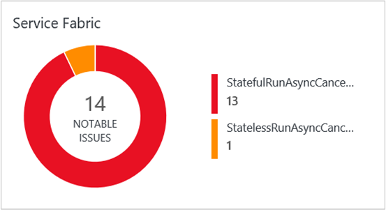

<properties
    pageTitle="Optimiser votre environnement avec la solution tissu de Service dans le journal Analytique | Microsoft Azure"
    description="Vous pouvez utiliser la solution tissu de Service afin d’évaluer le risque et l’état de votre Service tissu, micro-services, nœuds et les applications clusters."
    services="log-analytics"
    documentationCenter=""
    authors="niniikhena"
    manager="jochan"
    editor=""/>

<tags
    ms.service="log-analytics"
    ms.workload="na"
    ms.tgt_pltfrm="na"
    ms.devlang="na"
    ms.topic="article"
    ms.date="09/21/2016"
    ms.author="nini"/>


# <a name="service-fabric-solution-in-log-analytics"></a>Solution de tissu de service dans le journal Analytique

> [AZURE.SELECTOR]
- [Gestionnaire de ressources](log-analytics-service-fabric-azure-resource-manager.md)
- [PowerShell](log-analytics-service-fabric.md)

Cet article explique comment utiliser la solution tissu de Service dans le journal Analytique pour aider à identifier et résoudre les problèmes sur votre cluster tissu de Service, effectuent en obtenant visibilité dans la façon dont vos nœuds tissu de Service, et comment votre micro-services et applications en cours d’exécution.

La solution TISSU Service utilise des données Azure Diagnostics à partir de vos ordinateurs virtuels tissu de Service, par collecte des données à partir de vos tables WAD Azure. Journal Analytique lit ensuite les événements d’infrastructure tissu de Service, y compris les **Événements de Service fiables**, acteur, **Les événements opérationnels**et **Événements** **événements ETW personnalisé**. Le tableau de bord de solution tissu de Service affiche vous problèmes remarquables et événements importants dans votre environnement tissu de Service.

## <a name="installing-and-configuring-the-solution"></a>Installation et configuration de la solution

Suivez ces trois étapes simples pour installer et configurer la solution :

1. Vérifiez que l’espace de travail OMS que vous utilisez est associée à la même abonnement Azure qui vous permet de créer toutes les ressources de cluster, y compris les comptes de stockage. Pour plus d’informations sur la création d’un espace de travail OMS, voir [prise en main journal Analytique](log-analytics-get-started.md) .
2. Configurer OMS pour collecter et afficher les journaux tissu de Service.
3. Activer la solution tissu de Service dans votre espace de travail.

## <a name="configure-oms-to-collect-and-view-service-fabric-logs"></a>Configurer OMS pour collecter et afficher les journaux tissu de Service
Dans cette section, vous allez découvrir comment configurer OMS pour récupérer les journaux tissu de Service. Les journaux permettent de vous permet d’afficher, analysez et résoudre les problèmes dans votre cluster ou dans les applications et services qui s’exécutent dans ce cluster, à l’aide du portail OMS.

>[AZURE.NOTE] L’extension Azure Diagnostics doit être configurée pour télécharger les journaux des tables de stockage qui correspondent à ce que recherchez OMS. Découvrez [comment collecter les journaux de Diagnostics Azure](../service-fabric/service-fabric-diagnostics-how-to-setup-wad.md) pour plus d’informations sur la collecte des journaux. Les exemples de paramètres de configuration dans cet article afficher que quels les noms des tables stockage soyez. Une fois que Diagnostics est configuré sur le cluster et est télécharger les journaux à un compte de stockage, l’étape suivante consiste à configurer OMS pour collecter les journaux.

Assurez-vous que vous mettez à jour la section **EtwEventSourceProviderConfiguration** dans le fichier **template.json** pour ajouter des entrées pour la nouvelle EventSources avant d’appliquer la mise à jour de configuration en exécutant **deploy.ps1**. La table de téléchargement est différente de celle (ETWEventTable). Pour le moment, OMS peuvent uniquement lire les événements ETW d’application à partir de cette table. Toutefois, prise en charge des tableaux personnalisés ETW est en cours de développement.

Les outils suivants sont utilisés pour effectuer les opérations dans cette section :

-   PowerShell Azure
-   [Suite de gestion des opérations](http://www.microsoft.com/oms)

### <a name="configure-an-oms-workspace-to-show-the-cluster-logs"></a>Configurer un espace de travail OMS pour afficher les journaux de cluster

Une fois que vous avez créé un espace de travail OMS comme décrit ci-dessus, l’étape suivante consiste à configurer l’espace de travail pour extraire les journaux des tables stockage Azure où ils sont téléchargés à partir du cluster par l’extension Diagnostics. Pour ce faire, exécutez le script PowerShell suivant :

```
<#
    This script will configure an Operations Management Suite workspace (previously called an Operational Insights workspace) to read Diagnostics from an Azure Storage account.
    It will enable all supported data types (currently Service Fabric Events, ETW Events and IIS Logs).
    It supports Resource Manager storage accounts.
    If you have more than one Azure Subscription, you will be prompted for the subscription to configure.
    If you have more than one OMS workspace you will be prompted for the workspace to configure.
    It will then look through your Service Fabric clusters, and configure your OMS workspace to read Diagnostics from storage accounts that are connected to that cluster and have diagnostics enabled.
#>

try
{
    Get-AzureRMContext
}
catch [System.Management.Automation.PSInvalidOperationException]
{
    Add-AzureRmAccount
}

$validTables = "WADServiceFabric*EventTable", "WADETWEventTable"
function Select-Subscription {
      $subscription = ""
      $allSubscriptions = Get-AzureRmSubscription
      switch ($allSubscriptions.Count) {
             0 {Write-Error "No Operations Management Suite workspaces found"}
             1 {return $allSubscriptions}
        default {
            $uiPrompt = "Enter the number corresponding to the Azure subscription you would like to work with.`n"

            $count = 1
            foreach ($subscription in $allSubscriptions) {
                $uiPrompt += "$count. " + $subscription.SubscriptionName + " (" + $subscription.SubscriptionId + ")`n"
                $count++
            }
            $answer = (Read-Host -Prompt $uiPrompt) - 1
            $subscription = $allSubscriptions[$answer]
             Write-Host $subscription.SubscriptionId
        }  
    }
    return $subscription
}

function Select-Workspace {
    $workspace = ""
    $allWorkspaces = Get-AzureRmOperationalInsightsWorkspace  

    switch ($allWorkspaces.Count) {
        0 {Write-Error "No Operations Management Suite workspaces found. `n"}
        1 {return $allWorkspaces}
        default {
            $uiPrompt = "Enter the number corresponding to the workspace you want to configure.`n"
            $count = 1
            foreach ($workspace in $allWorkspaces) {
                $uiPrompt += "$count. " + $workspace.Name + " (" + $workspace.CustomerId + ")`n"
                $count++
            }
            $answer = (Read-Host -Prompt $uiPrompt) - 1
            $workspace = $allWorkspaces[$answer]
             Write-Host $workspace.WorkspaceName
        }  
    }
    return $workspace
}

function Check-ETWProviderLogging {
     param(
     [string]$id,
     [string]$provider,
     [string]$expectedTable,
     [string]$table
    )       
         Write-Debug ("ID: $id Provider: $provider ExpectedTable $expectedTable ActualTable $table")
         if ( ($table -eq $null) -or ($table -eq ""))  
         {
             Write-Warning ("$id No configuration found for $provider. Configure Azure diagnostics to write to $expectedTable.")
         }  
         elseif ( $table -ne $expectedTable )
         {
             Write-Warning ("$id $provider events are being written to $table instead of WAD$expectedTable. Events will not be collected by OMS")
         }  
         else
         {
             Write-Verbose "$id $provider events are being written to WAD$expectedTable (Correct configuration.)"
         }
 }

function Check-ServiceFabricScaleSetDiagnostics {
     param(
          [psobject]$scaleSetDiagnostics
   )
     $storageAccountsFound = @()
     Write-Verbose ("Checking " + $scaleSetDiagnostics)
     $sfReliableActorTable = $null
     $sfReliableServiceTable = $null
     $sfOperationalTable = $null

     Write-Debug $scaleSetDiagnostics
     $serviceFabricProviderList = ""
     $etwManifestProviderList = ""

     if ( $scaleSetDiagnostics.xmlCfg )  
      {
             Write-Debug ("Found XMLcfg")
             $xmlCfg = [System.Text.Encoding]::UTF8.GetString([System.Convert]::FromBase64String($scaleSetDiagnostics.xmlCfg))
             Write-Debug $xmlCfg
             $etwProviders = Select-Xml -Content $xmlCfg -XPath "//EtwProviders"                 
             $serviceFabricProviderList = $etwProviders.Node.EtwEventSourceProviderConfiguration
             $etwManifestProviderList = $etwProviders.Node.EtwManifestProviderConfiguration
      } elseif ($scaleSetDiagnostics.WadCfg )  
     {
         Write-Debug ("Found WADcfg")
         Write-Debug $scaleSetDiagnostics.WadCfg
         $serviceFabricProviderList = $scaleSetDiagnostics.WadCfg.DiagnosticMonitorConfiguration.EtwProviders.EtwEventSourceProviderConfiguration
         $etwManifestProviderList = $scaleSetDiagnostics.WadCfg.DiagnosticMonitorConfiguration.EtwProviders.EtwManifestProviderConfiguration
     } else
     {
         Write-Error "Unable to parse Azure Diagnostics setting for $id"
             Write-Warning ("$id does not have diagnostics enabled")
     }
     foreach ($provider in $serviceFabricProviderList)  
     {
         Write-Debug ("Event Source Provider: " + $provider.Provider + " Destination: " + $provider.DefaultEvents.eventDestination)
         if ($provider.Provider -eq "Microsoft-ServiceFabric-Actors")
         {
             $sfReliableActorTable = $provider.DefaultEvents.eventDestination  
         } elseif ($provider.Provider -eq "Microsoft-ServiceFabric-Services")  
         {  
             $sfReliableServiceTable = $provider.DefaultEvents.eventDestination  
         } else  
         {
             Check-ETWProviderLogging $id $provider.Provider "ETWEventTable" $provider.DefaultEvents.eventDestination
         }
     }
     foreach ($provider in $etwManifestProviderList)
     {
         Write-Debug ("Manifest Provider: " + $provider.Provider + " Destination: " + $provider.DefaultEvents.eventDestination)
         if ($provider.Provider -eq "cbd93bc2-71e5-4566-b3a7-595d8eeca6e8")
         {
             $sfOperationalTable = $provider.DefaultEvents.eventDestination  
         } else  
         {
             Check-ETWProviderLogging $id $provider.Provider "ETWEventTable" $provider.DefaultEvents.eventDestination
         }
     }

     Check-ETWProviderLogging $id "Microsoft-ServiceFabric-Actors" "ServiceFabricReliableActorEventTable" $sfReliableActorTable
     Check-ETWProviderLogging $id "Microsoft-ServiceFabric-Services" "ServiceFabricReliableServiceEventTable" $sfReliableServiceTable
     Check-ETWProviderLogging $id "cbd93bc2-71e5-4566-b3a7-595d8eeca6e8 (System events)" "ServiceFabricSystemEventTable" $sfOperationalTable

     Write-Verbose ("StorageAccount: " + $scaleSetDiagnostics.StorageAccount)
     $storageAccountsFound += ($scaleSetDiagnostics.StorageAccount)
     return ($storageAccountsFound)
 }

function Select-StorageAccount {
    $allResources = Get-AzureRmResource #pulls in all resources
    $serviceFabricClusters = $allResources.Where({$_.ResourceType -eq "Microsoft.ServiceFabric/clusters"}) #pulls in all service fabric clusters in the resource
    $storageAccountList = @()
    foreach($cluster in $serviceFabricClusters) {
        Write-Host("Checking cluster: " + $cluster.Name)
         $scaleSet = $allResources.Where({($_.ResourceType -eq "Microsoft.Compute/virtualMachineScaleSets") -and ($_.ResourceGroupName -eq $cluster.ResourceGroupName)})

         foreach($set in $scaleSet) {
             $resource = Get-AzureRmResource -ResourceId $set.ResourceId
             $extensions = $resource.Properties.VirtualMachineProfile.ExtensionProfile.Extensions

             foreach($ext in $extensions) {
                 if ($ext.Properties.Publisher -eq "Microsoft.Azure.Diagnostics" -and $ext.Properties.Type -eq "IaaSDiagnostics") {
                     $storageAccountList += (Check-ServiceFabricScaleSetDiagnostics $ext.Properties.Settings)
                 }
             }
          }

         $storageAccountsToCheck = $allResources.Where({($_.ResourceType -eq "Microsoft.Storage/storageAccounts") -and ($_.ResourceName -in $storageAccountList)})

         if ($storageAccountsToCheck.Count -eq "0") {
                Write-Error "No storage accounts found"
           }
           else {
                    foreach ($storageAccount in $storageAccountsToCheck) {
                        Write-Host("Checking Storage Account: " + $storageAccount.Name)
                        $insightsName = $storageAccount.Name + $workspace.Name
                        $existingConfig = ""
                        try
                            {
                                $existingConfig = Get-AzureRmOperationalInsightsStorageInsight -Workspace $workspace -Name $insightsName -ErrorAction Stop
                            }
                        catch [Hyak.Common.CloudException]
                            {
                                # HTTP Not Found is returned if the storage insight doesn't exist
                            }
                        if ($existingConfig) {                         
                                  [array]$Tables = $existingConfig.Tables
                                   foreach($table in $validTables) {
                                         if($Tables -notcontains $table) {
                                               $Tables += $table
                                               $dirty = $true;
                                               Write-Host "Adding Table: $table";
                                         }
                                         else {
                                               Write-Host "$table is already configured.`n";
                                             }
                                      }
                                      # If any of the tables from the table list are not already monitored, then we add them
                                   if($dirty -eq $true) {
                                           Set-AzureRmOperationalInsightsStorageInsight -Workspace $workspace -Name $insightsName -Tables $Tables
                                           Write-Host "Updating Storage Insight. `n"
                                    }
                                    else {
                                           Write-Host "Storage Insight already updated."
                                  }
                          }
                     else {
                            $key = (Get-AzureRmStorageAccountKey -ResourceGroupName $storageAccount.ResourceGroupName -Name $storageAccount.Name)[0].Value
                           New-AzureRmOperationalInsightsStorageInsight -Workspace $workspace -Name $insightsName -StorageAccountResourceId $storageAccount.ResourceId -StorageAccountKey $key -Tables $validTables
                            Write-Host "New Azure Storage Insight Configured. `n"
                           }
                    }
             }
      }
      return
     }

$subscription = Select-Subscription
$subscriptionId = $subscription.SubscriptionId
$subscription = Select-AzureRmSubscription -SubscriptionId $subscriptionId
$workspace = Select-Workspace
$storageAccount = Select-StorageAccount
```

Une fois que vous avez configuré l’espace de travail OMS à lire à partir des tables Azure dans votre compte de stockage, connectez-vous au portail Azure, puis sélectionnez l’espace de travail OMS dans **Toutes les ressources**. Une fois sélectionnée, vous devriez voir le nombre de stockage du compte connectés à cet espace de travail OMS les journaux. Sélectionnez la vignette **journaux de compte de stockage** et vérifiez dans la liste des journaux de compte de stockage que votre compte de stockage est connecté à cet espace de travail OMS :


## <a name="enable-the-service-fabric-solution"></a>Activer la solution tissu de Service
Utilisez le script suivant pour ajouter la solution à votre espace de travail OMS. Exécuter le script PowerShell, à l’aide de l’abonnement Azure associé à l’espace de travail OMS que vous souhaitez activer la solution tissu de Service dans.

```
function Select-Subscription {
      $subscription = ""
      $allSubscriptions = Get-AzureRmSubscription
      switch ($allSubscriptions.Count) {
             0 {Write-Error "No Operations Management Suite workspaces found"}
             1 {return $allSubscriptions}
        default {
            $uiPrompt = "Enter the number corresponding to the Azure subscription you would like to work with.`n"
            $count = 1
            foreach ($subscription in $allSubscriptions) {
                $uiPrompt += "$count. " + $subscription.SubscriptionName + " (" + $subscription.SubscriptionId + ")`n"
                $count++
            }
            $answer = (Read-Host -Prompt $uiPrompt) - 1
            $subscription = $allSubscriptions[$answer]
             Write-Host $subscription.SubscriptionId
        }  
    }
    return $subscription
}

function Select-Workspace {
    $workspace = ""
    $allWorkspaces = Get-AzureRmOperationalInsightsWorkspace  
    switch ($allWorkspaces.Count) {
        0 {Write-Error "No Operations Management Suite workspaces found"}
        1 {return $allWorkspaces}
        default {
            $uiPrompt = "Enter the number corresponding to the workspace you want to configure.`n"
            $count = 1
            foreach ($workspace in $allWorkspaces) {
                $uiPrompt += "$count. " + $workspace.Name + " (" + $workspace.CustomerId + ")`n"
                $count++
            }
            $answer = (Read-Host -Prompt $uiPrompt) - 1
            $workspace = $allWorkspaces[$answer]
                           Write-Host $workspace.WorkspaceName
        }  
    }
    return $workspace
}
$subscription = Select-Subscription
$subscriptionId = $subscription.SubscriptionId
$subscription = Select-AzureRmSubscription -SubscriptionId $subscriptionId
$workspace = Select-Workspace
Set-AzureRmOperationalInsightsIntelligencePack -ResourceGroupName $workspace.ResourceGroupName -WorkspaceName $workspace.Name -IntelligencePackName "ServiceFabric" -Enabled $true
```

Une fois la solution est activée, la vignette tissu de Service est ajoutée à votre page OMS vue d’ensemble, avec un affichage des problèmes remarquables tels que des échecs de runAsync et les annulations qui se sont produites dans les dernières 24 heures.



### <a name="view-service-fabric-events"></a>Afficher les événements de tissu de Service

Cliquez sur la vignette **Tissu de Service** pour ouvrir le tableau de bord tissu de Service. Le tableau de bord inclut les colonnes dans le tableau suivant. Chaque colonne répertorie les événements de dix supérieure en fonction du nombre répondant à des critères de cette colonne pour la période spécifiée. Vous pouvez effectuer une recherche de journal qui fournit la liste entière en cliquant sur **Afficher toutes** en bas, à droite de chaque colonne, ou en cliquant sur l’en-tête de colonne.

| **Événement tissu de service** | **Description** |
| --- | --- |
| Problèmes remarquables | Affichage des problèmes tels que RunAsyncFailures RunAsynCancellations et nœud légende. |
| Événements opérationnels | Événements opérationnels remarquables telles que la mise à niveau de l’application et les déploiements. |
| Événements de Service fiable | Événements de service fiable remarquables une telle Runasyncinvocations. |
| Événements acteur | Événements acteur remarquables générés par votre micro-services, tels que des exceptions levées par une méthode d’un acteur, acteur activations et désactivations et ainsi de suite. |
| Événements d’application | Tous les événements ETW personnalisés générés par vos applications. |


Le tableau suivant montre les méthodes de collecte de données et autres informations sur la façon dont les données sont collectées pour tissu de Service.

| plateforme | Agent directe | Agent SCOM | Stockage Azure | SCOM obligatoire ? | Données de l’agent SCOM envoyées par groupe d’administration | fréquence de collection de sites |
|---|---|---|---|---|---|---|
|Windows||| |            ||10 minutes |


>[AZURE.NOTE] Vous pouvez modifier l’étendue de ces événements dans la solution TISSU Service en cliquant sur **données basées sur les 7 derniers jours** en haut du tableau de bord. Vous pouvez également afficher les événements générés depuis les 7 derniers jours, 1 jour ou 6 heures. Ou bien, vous pouvez sélectionner **personnalisée** pour spécifier une plage de dates personnalisée.


## <a name="troubleshoot-your-service-fabric-and-oms-configuration"></a>Résoudre les problèmes de configuration de votre Service tissu et OMS

Si vous avez besoin vérifier votre configuration OMS, car vous ne pouvez pas afficher les données d’événement OMS, utilisez le script ci-dessous. Il lit votre configuration diagnostics tissu de Service, vérifie les données écrites dans les tables, et il vérifie que OMS est configuré pour lire à partir des tables.

```
<#
    Verify Service Fabric and OMS configuration
    1. Read Service Fabric diagnostics configuration
    2. Check for data being written into the tables
    3. Verify OMS is configured to read from the tables

    Supported tables:
    WADServiceFabricReliableActorEventTable
    WADServiceFabricReliableServiceEventTable
    WADServiceFabricSystemEventTable
    WADETWEventTable

    Script will write a warning for every misconfiguration detected
    To see items that are correctly configured set $VerbosePreference="Continue"
#>
Param
(
    [Parameter(Mandatory=$true,
    ValueFromPipeline=$true,
    Position=1)]
    [string]$workspaceName
)

$WADtables = @("WADServiceFabricReliableActorEventTable",
               "WADServiceFabricReliableServiceEventTable",
               "WADServiceFabricSystemEventTable",
               "WADETWEventTable"
               )

<#
    Check if OMS Log Analytics is configured to index service fabric events from the specified table
#>

function Check-OMSLogAnalyticsConfiguration {
    param(
    [psobject]$workspace,
    [psobject]$storageAccount,
    [string]$id
    )

    $existingInsights = Get-AzureRmOperationalInsightsStorageInsight -ResourceGroupName $workspace.ResourceGroupName -WorkspaceName $workspace.Name

    if ($existingInsights)
    {
        $currentStorageAccountInsight = $existingInsights.Where({$_.StorageAccountResourceId -eq $storageAccount.ResourceId})

        if ("WADServiceFabric*EventTable" -in $currentStorageAccountInsight.Tables)
        {
            Write-Verbose ("OMS Log Analytics workspace " + $workspace.Name + " is configured to index service fabric actor, service and operational events from " + $storageAccount.Name)
        } else
        {
            Write-Warning ("OMS Log Analytics workspace " + $workspace.Name + " is not configured to index service fabric actor, service and operational events from " + $storageAccount.Name)
        }
        if ("WADETWEventTable" -in $currentStorageAccountInsight.Tables)
        {
            Write-Verbose ("OMS Log Analytics workspace " + $workspace.Name + " is configured to index service fabric application events from " + $storageAccount.Name)
        } else
        {
            Write-Warning ("OMS Log Analytics workspace " + $workspace.Name + " is not configured to index service fabric application events from " + $storageAccount.Name)
        }
    } else
    {
        Write-Warning ("OMS Log Analytics workspace " + $workspace.Name + "is not configured to read service fabric events from " + $storageAccount.Name)
    }    
}

<#
    Check Azure table storage to confirm there is recent data written by Service Fabric
#>

function Check-TablesForData {
    param(
    [psobject]$storageAccount
    )

    $ctx = (Get-AzureRmStorageAccount -ResourceGroupName $storageAccount.ResourceGroupName -Name $storageAccount.ResourceName).Context

    $createdTables = Get-AzureStorageTable -Context $ctx

    $recently = Get-Date -Format s ((Get-Date).AddMinutes(-20).ToUniversalTime())
    $recently = $recently + "Z"

    foreach ($table in $WADtables)
    {
        if ($table -in $createdTables.Name)
        {
            $tbl = Get-AzureStorageTable -Name $table -Context $ctx
            $query = New-Object Microsoft.WindowsAzure.Storage.Table.TableQuery
            $list = New-Object System.Collections.Generic.List[string]
            $list.Add("RowKey")
            $list.Add("ProviderName")
            $list.Add("Timestamp")
            $query.FilterString = "Timestamp gt datetime'$recently'"
            $query.SelectColumns = $list
            $query.TakeCount = 20
            $entities = $tbl.CloudTable.ExecuteQuery($query)
            Write-Debug $entities
            if ($entities.Count -gt 0)
            {
                Write-Verbose ("Data was written to $table in " + $storageAccount.ResourceName + "after $recently")
            } else
            {
                Write-Warning ("No data after $recently is in  $table in " + $storageAccount.ResourceName)
            }
        } else
        {
            Write-Warning ("$table does not exist in storage account " + $storageAccount.ResourceName)
        }
    }
}

<#
    Check if ETW provider is configured to log events to the expected table storage
#>
function Check-ETWProviderLogging {
    param(
    [string]$id,
    [string]$provider,
    [string]$expectedTable,
    [string]$table
    )      
        Write-Debug ("ID: $id Provider: $provider ExpectedTable $expectedTable ActualTable $table")
        if ( ($table -eq $null) -or ($table -eq ""))
        {
            Write-Warning ("$id No configuration found for $provider. Configure Azure diagnostics to write to $expectedTable.")
        }
        elseif ( $table -ne $expectedTable )
        {
            Write-Warning ("$id $provider events are being written to $table instead of WAD$expectedTable. Events will not be collected by OMS")
        }
        else
        {
            Write-Verbose "$id $provider events are being written to WAD$expectedTable (Correct configuration.)"
        }
}

<#
    Check Azure Diagnostics Configuration for a Service Fabric cluster
#>
function Check-ServiceFabricScaleSetDiagnostics {
    param(
    [psobject]$scaleSetDiagnostics
    )

    $storageAccountsFound = @()
    Write-Verbose ("Checking " + $scaleSetDiagnostics)
    $sfReliableActorTable = $null
    $sfReliableServiceTable = $null
    $sfOperationalTable = $null
    Write-Debug $scaleSetDiagnostics
    $serviceFabricProviderList = ""
    $etwManifestProviderList = ""

    if ( $scaleSetDiagnostics.xmlCfg )
    {
        Write-Debug ("Found XMLcfg")
        $xmlCfg = [System.Text.Encoding]::UTF8.GetString([System.Convert]::FromBase64String($scaleSetDiagnostics.xmlCfg))
        Write-Debug $xmlCfg
        $etwProviders = Select-Xml -Content $xmlCfg -XPath "//EtwProviders"                
        $serviceFabricProviderList = $etwProviders.Node.EtwEventSourceProviderConfiguration
        $etwManifestProviderList = $etwProviders.Node.EtwManifestProviderConfiguration
    } elseif ($scaleSetDiagnostics.WadCfg )
    {
        Write-Debug ("Found WADcfg")
        Write-Debug $scaleSetDiagnostics.WadCfg
        $serviceFabricProviderList = $scaleSetDiagnostics.WadCfg.DiagnosticMonitorConfiguration.EtwProviders.EtwEventSourceProviderConfiguration
        $etwManifestProviderList = $scaleSetDiagnostics.WadCfg.DiagnosticMonitorConfiguration.EtwProviders.EtwManifestProviderConfiguration 
    } else
    {
        Write-Error "Unable to parse Azure Diagnostics setting for $id"
        Write-Warning ("$id does not have diagnostics enabled")
    }

    foreach ($provider in $serviceFabricProviderList)
    {
        Write-Debug ("Event Source Provider: " + $provider.Provider + " Destination: " + $provider.DefaultEvents.eventDestination)
        if ($provider.Provider -eq "Microsoft-ServiceFabric-Actors")
        {
            $sfReliableActorTable = $provider.DefaultEvents.eventDestination
        } elseif ($provider.Provider -eq "Microsoft-ServiceFabric-Services")
        {
            $sfReliableServiceTable = $provider.DefaultEvents.eventDestination
        } else
        {
            Check-ETWProviderLogging $id $provider.Provider "ETWEventTable" $provider.DefaultEvents.eventDestination
        }
    }
    foreach ($provider in $etwManifestProviderList)
    {
        Write-Debug ("Manifest Provider: " + $provider.Provider + " Destination: " + $provider.DefaultEvents.eventDestination)
        if ($provider.Provider -eq "cbd93bc2-71e5-4566-b3a7-595d8eeca6e8")
        {
            $sfOperationalTable = $provider.DefaultEvents.eventDestination
        } else
        {
            Check-ETWProviderLogging $id $provider.Provider "ETWEventTable" $provider.DefaultEvents.eventDestination
        }
    }

    Check-ETWProviderLogging $id "Microsoft-ServiceFabric-Actors" "ServiceFabricReliableActorEventTable" $sfReliableActorTable
    Check-ETWProviderLogging $id "Microsoft-ServiceFabric-Services" "ServiceFabricReliableServiceEventTable" $sfReliableServiceTable
    Check-ETWProviderLogging $id "cbd93bc2-71e5-4566-b3a7-595d8eeca6e8 (System events)" "ServiceFabricSystemEventTable" $sfOperationalTable

    Write-Verbose ("StorageAccount: " + $scaleSetDiagnostics.StorageAccount)

    $storageAccountsFound += ($scaleSetDiagnostics.StorageAccount)
    return ($storageAccountsFound)
}

# This script uses Get-AzureRmVMDiagnosticsExtension and needs a version where -Name is not a required parameter
Import-Module AzureRM.Compute -MinimumVersion 1.2.2

try
{
    Get-AzureRmContext
}
catch [System.Management.Automation.PSInvalidOperationException]
{
    Login-AzureRmAccount
}

$allResources = Get-AzureRmResource

$OMSworkspace = $allResources.Where({($_.ResourceType -eq "Microsoft.OperationalInsights/workspaces") -and ($_.ResourceName -eq $workspaceName)})

if ($OMSworkspace.Name -ne $workspaceName)
{
    Write-Error ("Unable to find OMS Workspace " + $workspaceName)
}

$serviceFabricClusters = $allResources.Where({$_.ResourceType -eq "Microsoft.ServiceFabric/clusters"})
$storageAccountList = @()
foreach($cluster in $serviceFabricClusters) {
    Write-Verbose ("Checking cluster: " + $cluster.Name)
    $scaleSet = ($allResources.Where({($_.ResourceType -eq "Microsoft.Compute/virtualMachineScaleSets") -and ($_.ResourceGroupName -eq $cluster.ResourceGroupName)}))

    foreach($set in $scaleSet) {
        $resource = Get-AzureRmResource -ResourceId $set.ResourceId
        $extensions = $resource.Properties.VirtualMachineProfile.ExtensionProfile.Extensions
        foreach($ext in $extensions) {
            if ($ext.Properties.Publisher -eq "Microsoft.Azure.Diagnostics" -and $ext.Properties.Type -eq "IaaSDiagnostics") {
                $storageAccountList += (Check-ServiceFabricScaleSetDiagnostics $ext.Properties.Settings)
            }
        }
    }
}

$storageAccountList = $storageAccountList | Sort-Object | Get-Unique
$storageAccountsToCheck = ($allResources.Where({($_.ResourceType -eq "Microsoft.Storage/storageAccounts") -and ($_.ResourceName -in $storageAccountList)}))

foreach($storageAccount in $storageAccountsToCheck)
{
    Check-TablesForData $storageAccount
    Check-OMSLogAnalyticsConfiguration $OMSworkspace $storageAccount
}
 ```


## <a name="next-steps"></a>Étapes suivantes

- [Journal des recherches dans le journal Analytique](log-analytics-log-searches.md) permet d’afficher des données d’événement Service TISSU détaillées.
