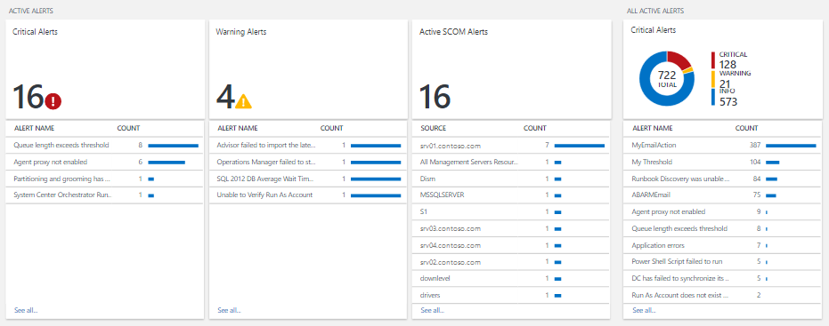

<properties
   pageTitle="Solution de gestion dans Suite de gestion des opérations (OMS) d’alerte | Microsoft Azure"
   description="La solution de gestion des alertes dans le journal Analytique vous permet d’analyser toutes les alertes dans votre environnement.  En plus de consolider alertes générées dans OMS, il importe alertes à partir de groupes d’administration System Center Operations Manager (SCOM) connecté dans journal Analytique."
   services="log-analytics"
   documentationCenter=""
   authors="bwren"
   manager="jwhit"
   editor="tysonn" />
<tags
   ms.service="operations-management-suite"
   ms.devlang="na"
   ms.topic="article"
   ms.tgt_pltfrm="na"
   ms.workload="infrastructure-services"
   ms.date="10/06/2016"
   ms.author="bwren" />

# Solution de gestion des alerte dans Suite de gestion des opérations (OMS)

 La solution de gestion des alertes vous permet d’analyser toutes les alertes dans votre environnement.  En plus de consolider alertes générées dans OMS, il importe alertes à partir de groupes d’administration System Center Operations Manager (SCOM) connecté dans journal Analytique.  Dans les environnements avec plusieurs groupes d’administration, la solution de gestion des alertes constituent une vue consolidée des alertes sur tous les groupes d’administration.

## Conditions préalables

- Pour importer les alertes de SCOM, cette solution nécessite une connexion entre votre espace de travail OMS et un groupe d’administration SCOM à l’aide de la procédure décrite dans [Connecter Operations Manager pour journal Analytique](log-analytics-om-agents.md).  

## Configuration

Ajouter la solution de gestion des alertes dans votre espace de travail OMS à l’aide de la procédure décrite dans [Ajouter solutions](log-analytics-add-solutions.md).  Il n’existe aucune autre configuration requise.

## Packs d’administration

Si votre groupe d’administration SCOM est connecté à votre espace de travail OMS, les packs d’administration suivantes seront installés dans SCOM lorsque vous ajoutez cette solution.  Il n’existe aucune configuration ou la maintenance de ces packs d’administration requis.  

- Gestion des alertes Microsoft System Center Advisor (Microsoft.IntelligencePacks.AlertManagement)

Pour plus d’informations sur la façon dont les packs d’administration solution sont mis à jour, voir [Se connecter Operations Manager pour journal Analytique](log-analytics-om-agents.md).

## Collecte de données

### Agents

Le tableau suivant décrit les sources connectés sont pris en charge par cette solution.

| Source connecté | Prise en charge | Description |
|:--|:--|:--|
| [Agents Windows](log-analytics-windows-agents.md) | N° | Agents Windows directs ne génèrent pas les alertes SCOM. |
| [Agents Linux](log-analytics-linux-agents.md) | N° | Agents Linux directs ne génèrent pas les alertes SCOM. |
| [Groupe d’administration SCOM](log-analytics-om-agents.md) | Oui | Alertes générées sur agents SCOM sont remis au groupe d’administration et puis transférées au journal Analytique.  Une connexion directe à partir de l’agent SCOM au journal Analytique n’est pas nécessaire. Données d’alerte sont transférées du groupe d’administration vers le référentiel OMS. |
| [Compte de stockage Azure](log-analytics-azure-storage.md) | N° | Alertes SCOM ne sont pas stockés dans des comptes de stockage Azure. |

### Fréquence de collection de sites

Alertes générées dans OMS sont disponibles pour la solution immédiatement.  Données d’alerte sont envoyées à partir du groupe d’administration SCOM à Analytique journal toutes les trois minutes.  

## À l’aide de la solution

Lorsque vous ajoutez la solution de gestion des alertes dans votre espace de travail OMS, la vignette de **Gestion des alertes** est ajoutée à votre tableau de bord OMS.  Cette vignette affiche un nombre et une représentation graphique du nombre d’alertes actifs générées dans les 24 dernières heures.  Vous ne pouvez pas modifier ce laps de temps.

Cliquez sur la vignette de **Gestion des alertes** pour ouvrir le tableau de bord de **Gestion des alertes** .  Le tableau de bord inclut les colonnes dans le tableau suivant.  Chaque colonne répertorie les alertes de dix supérieure en fonction du nombre répondant à des critères de cette colonne pour la portée spécifiée et la plage horaire.  Vous pouvez effectuer une recherche de journal qui fournit la liste entière en cliquant sur **Afficher toutes** en bas de la colonne ou en cliquant sur l’en-tête de colonne.

| Colonne| Description |
|:--|:--|
| Alertes critiques | Toutes les alertes dont la gravité critique regroupé par nom de l’alerte.  Cliquez sur un nom d’alerte pour exécuter une recherche de journal retourner tous les enregistrements pour cette alerte. |
| Alertes d’avertissement | Toutes les alertes dont la gravité avertissement regroupé par nom de l’alerte.  Cliquez sur un nom d’alerte pour exécuter une recherche de journal retourner tous les enregistrements pour cette alerte. |
| Alertes SCOM Active | Toutes les alertes SCOM avec n’importe quel état autre que *fermé* groupées par source ayant généré l’alerte. |
| Toutes les alertes actives | Toutes les alertes de n’importe quel gravité regroupés par nom de l’alerte. Inclut uniquement les alertes SCOM avec n’importe quel état différent *fermé*.|

Si vous faites défiler vers la droite, le tableau de bord permet de répertorier plusieurs requêtes courantes que vous pouvez cliquer sur pour effectuer une [recherche dans un journal](log-analytics-log-searches.md) pour les données d’alerte.

## Étendue et la plage horaire

Par défaut, l’étendue des alertes d’analyse de la solution de gestion des alertes est de tous les groupes d’administration connectés générés dans les 7 derniers jours.  

- Pour modifier les groupes d’administration inclus dans l’analyse, cliquez sur **étendue** en haut du tableau de bord.  Vous pouvez sélectionner **Global** pour tous les groupes d’administration connectés ou **Par groupe d’administration** sélectionner un seul groupe d’administration.

- Pour modifier la période d’alertes, sélectionnez **en fonction de données** dans la partie supérieure du tableau de bord.  Vous pouvez sélectionner des alertes générées depuis les 7 derniers jours, 1 jour ou 6 heures.  Ou vous pouvez sélectionner **personnalisée** et spécifier une plage de dates personnalisée.

## Les enregistrements Analytique de journal

La solution de gestion des alertes analyse un enregistrement à un type de **l’alerte**.  Il vous sera également importer les alertes de SCOM et créer un enregistrement correspondant pour chaque avec un type **d’alerte** et un SourceSystem de **OpsManager**.  Ces enregistrements avec les propriétés du tableau ci-dessous.  

| Propriété | Description |
|:--|:--|
| Type | *Alerte* |
| SourceSystem | *OpsManager* |
| AlertContext | Détails de l’élément de données qui a provoqué l’alerte à générer au format XML. |
| AlertDescription | Description détaillée de l’alerte. |
| AlertId | GUID de l’alerte. |
| Nom_alerte | Nom de l’alerte. |
| AlertPriority | Niveau de priorité de l’alerte. |
| AlertSeverity | Niveau de gravité de l’alerte. |
| AlertState | Dernier état de résolution de l’alerte. |
| LastModifiedBy | Nom de l’utilisateur ayant modifié en dernier l’alerte. |
| ManagementGroupName | Nom du groupe d’administration de l’emplacement de l’alerte. |
| RepeatCount | Nombre de fois que le même message d’alerte a été généré pour le même analysés objet depuis en cours de résolution. |
| Résolu par | Nom de l’utilisateur ayant résolu l’alerte. Vide si l’alerte n’a pas encore été résolu. |
| SourceDisplayName | Nom complet de l’objet d’analyse ayant généré l’alerte. |
| SourceFullName | Nom complet de l’objet surveillance ayant généré l’alerte. |
| ID du ticket du | ID de tickets pour l’alerte si l’environnement SCOM est intégré à un processus permettant d’affecter des tickets pour les alertes.  Vide d’aucune tickets ID est attribué. |
| TimeGenerated | Date et heure auxquelles l’alerte a été créée. |
| TimeLastModified | Date et heure de dernière modification apportée à l’alerte. |
| Heure de déclenchement | Date et heure de l’alerte. |
| TimeResolved | Date et heure auxquelles l’alerte a été résolu. Vide si l’alerte n’a pas encore été résolu. |

## Exemple journal des recherches

Le tableau suivant fournit des exemples journal recherche les enregistrements d’alerte collectées par cette solution.  

| Requête | Description |
|:--|:--|
| Type = alerte SourceSystem = OpsManager AlertSeverity = erreur heure de déclenchement > maintenant 24 heures | Alertes critiques élevés durant les dernières 24 heures |
| Type = AlertSeverity alerte = Avertissement heure de déclenchement > maintenant 24 heures | Alertes d’avertissement élevés durant les dernières 24 heures  |
| Type = alerte SourceSystem = OpsManager AlertState ! = fermé heure de déclenchement > maintenant 24 heures & #124 ; mesurer Nb() en tant que nombre par SourceDisplayName | Sources des alertes actives élevés durant les dernières 24 heures |
| Type = alerte SourceSystem = OpsManager AlertSeverity = erreur heure de déclenchement > maintenant 24 heures AlertState ! = fermé | Alertes critiques élevés durant les dernières 24 heures qui sont toujours actives |
| Type = SourceSystem alerte = heure de déclenchement OpsManager > maintenant 24 heures AlertState = fermé | Alertes élevés durant les dernières 24 heures qui sont maintenant fermées |
| Type = SourceSystem alerte = heure de déclenchement OpsManager > maintenant - 1 jour & #124 ; mesurer Nb() en tant que nombre par AlertSeverity | Alertes élevés pendant les heures passés 1 regroupés par leur gravité |
| Type = SourceSystem alerte = heure de déclenchement OpsManager > maintenant - 1 jour & #124 ; Trier RepeatCount desc | Alertes élevés pendant les heures passés 1 triés par leur valeur répétition |

## Étapes suivantes

- En savoir plus sur [les alertes dans le journal Analytique](log-analytics-alerts.md) pour plus d’informations sur la génération d’alertes de journal Analytique.
