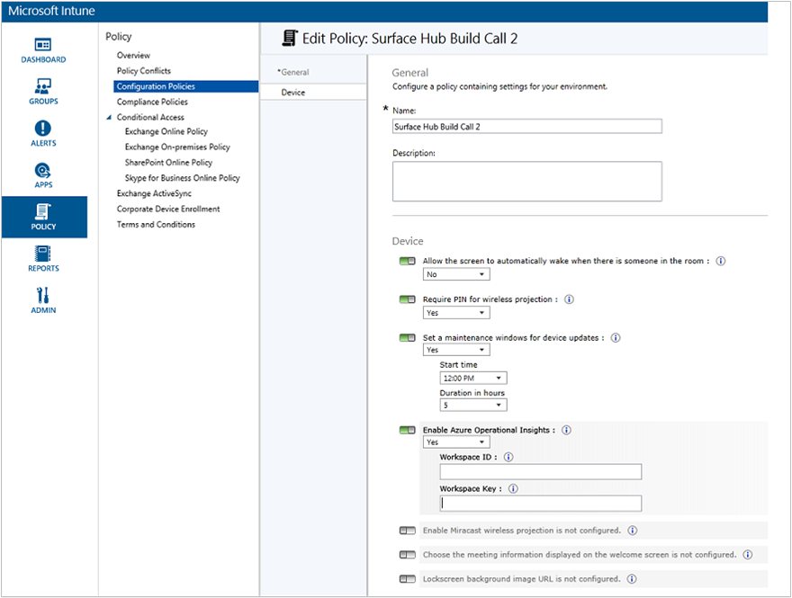

<properties
    pageTitle="Surveiller les Hubs en Surface avec journal Analytique | Microsoft Azure"
    description="Utiliser la solution Surface concentrateur pour suivre l’état de votre Hubs Surface et comprendre comment ils sont utilisés."
    services="log-analytics"
    documentationCenter=""
    authors="bandersmsft"
    manager="jwhit"
    editor=""/>

<tags
    ms.service="log-analytics"
    ms.workload="na"
    ms.tgt_pltfrm="na"
    ms.devlang="na"
    ms.topic="article"
    ms.date="08/11/2016"
    ms.author="banders"/>

# Moniteur Surface Hubs avec journal Analytique

Cet article décrit comment vous pouvez utiliser la solution Surface concentrateur dans journal Analytique pour surveiller les périphériques du concentrateur de Microsoft Surface avec Microsoft Operations Management Suite (OMS). Journal Analytique vous permet de suivre l’état de votre Hubs Surface ainsi que de comprendre comment ils sont utilisés.

Chaque concentrateur Surface a l’Agent de surveillance Microsoft installé. Son via l’agent qu’ils peuvent envoyer des données à partir de votre plateforme Surface à OMS. Les fichiers journaux sont lues à partir de votre Surface Hubs et sont puis sont envoyés au service OMS. Les questions relatives à des serveurs est hors ligne, le calendrier ne synchronise pas, ou si le compte de l’appareil ne parvient pas à vous connecter à Skype sont affichés dans OMS dans le tableau de bord Surface concentrateur. En utilisant les données dans le tableau de bord, vous pouvez identifier les périphériques qui n’exécutent pas, ou qui sont des autres problèmes et potentiellement s’appliquent correctifs pour les problèmes détectés.

## Installation et configuration de la solution

Utilisez les informations suivantes pour installer et configurer la solution. Pour gérer votre Hubs Surface à partir de Microsoft Operations Management Suite (OMS), vous devez les éléments suivants :

- Un abonnement valide à [OMS](http://www.microsoft.com/oms).
- Niveau [d’abonnement OMS](https://azure.microsoft.com/pricing/details/log-analytics/) prend en charge le nombre d’unités que vous voulez analyser. Tarifs OMS varie selon le nombre d’unités est inscrits et la quantité de données qu’il processus. Vous souhaiterez cela prendre en considération lorsque vous planifiez votre déploiement Surface concentrateur.

Ensuite, vous sera ajouter un abonnement OMS à votre abonnement Microsoft Azure existant ou créer un nouvel espace de travail directement via le portail OMS. Obtenir des instructions détaillées pour l’utilisation de ces deux méthodes est [prise en main journal Analytique](log-analytics-get-started.md). Une fois que l’abonnement OMS a été configurée, il existe deux façons d’inscription vos appareils Surface concentrateur :

- Automatiquement par le biais de InTune
- Manuellement à l’aide de **paramètres** sur votre appareil Surface concentrateur.

## Configurer la surveillance

Vous pouvez surveiller les activités de votre plateforme Surface à l’aide de journal Analytique dans OMS et du fonctionnement. Vous pouvez vous inscrire le Hub Surface dans OMS InTune, ou localement à l’aide de **paramètres** dans le Hub Surface.

## Se connecter en Surface Hubs à OMS via InTune

Vous devez l’ID de l’espace de travail et la clé d’espace de travail pour l’espace de travail OMS qui gère votre Hubs Surface. Vous pouvez obtenir ceux à partir du portail OMS.

InTune est un produit Microsoft qui vous permet de gérer les paramètres de configuration OMS qui sont appliqués à un ou plusieurs de vos périphériques de manière centralisée. Suivez ces étapes pour configurer vos périphériques via InTune :

1. Se connecter à InTune.
2. Accédez à **paramètres** > **Sources connectées**.
3. Créer ou modifier une stratégie basée sur le modèle de Surface concentrateur.
4. Accédez à la section OMS (perspectives opérationnelles Azure) de la stratégie, puis ajouter les *ID de l’espace de travail* et la *Clé d’espace de travail* à la stratégie.
5. Enregistrer la stratégie.
6. Associer la stratégie au groupe d’appareils approprié.

  

InTune synchronise puis les paramètres OMS avec les périphériques dans le groupe cible, les s’inscrire à votre espace de travail OMS.

## Se connecter Surface Hubs à OMS à l’aide de l’application de paramètres

Vous devez l’ID de l’espace de travail et la clé d’espace de travail pour l’espace de travail OMS qui gère votre Hubs Surface. Vous pouvez obtenir ceux à partir du portail OMS.

Si vous n’utilisez pas InTune pour gérer votre environnement, vous pouvez vous inscrire appareils manuellement via les **paramètres** sur chaque concentrateur Surface :

1. À partir de votre plateforme Surface, ouvrez **paramètres**.
2. Entrez les informations d’identification appareil administrateur lorsque vous y êtes invité.
3. Cliquez sur **cet appareil**et sous **analyse**, cliquez sur **Configurer les paramètres OMS**.
4. Sélectionnez **Activer le contrôle**.
6. Dans la boîte de dialogue Paramètres OMS, tapez l' **ID de l’espace de travail** et entrez la **Clé de l’espace de travail**.  
  
7. Cliquez sur **OK** pour terminer la configuration.

Une confirmation s’affiche vous indiquant ou non la configuration OMS a été appliquée à l’appareil. S’il s’agissait, un message s’affiche indiquant que l’agent réussi à connecter au service OMS. Le périphérique commence alors à envoyer des données à OMS où vous pouvez afficher et d’agir.

## Surveiller les Hubs en Surface

Surveillance votre Hubs Surface à l’aide de OMS est très similaire surveillance tous les autres périphériques inscrits.

1. Connectez-vous au portail OMS.
2. Accédez au tableau de bord Surface concentrateur solution pack.
3. Au niveau de votre appareil s’affiche.

  

Vous pouvez créer des [alertes](log-analytics-alerts.md) basées sur les recherches de journal existant ou personnalisé. Utilise les données collectées par le OMS à partir de votre Hubs Surface, vous pouvez rechercher des problèmes et une alerte pour les conditions que vous définissez pour vos appareils.

## Étapes suivantes

- [Recherches de journaux dans journal Analytique](log-analytics-log-searches.md) permet d’afficher des données détaillées Surface concentrateur.
- Créer des [alertes](log-analytics-alerts.md) pour vous informer des problèmes se produisent avec votre Hubs Surface.
