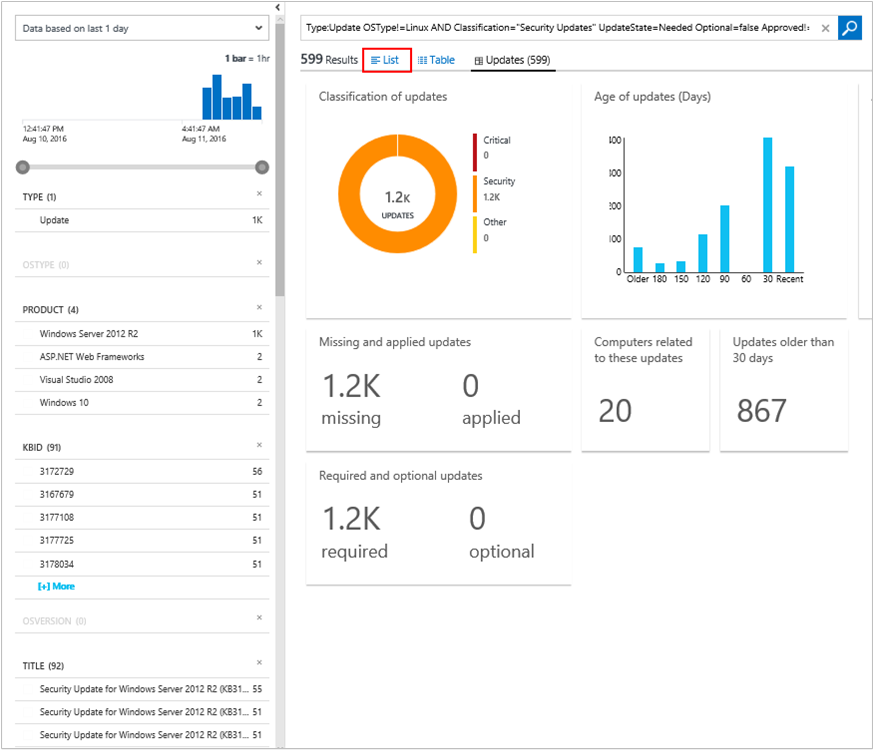
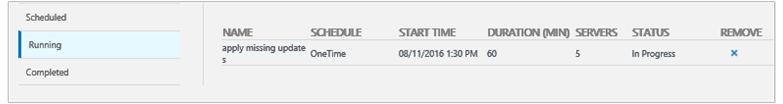

<properties
    pageTitle="Solution d’évaluation de mise à jour système dans le journal Analytique | Microsoft Azure"
    description="Vous pouvez utiliser la solution mises à jour système dans le journal Analytique pour vous aider à appliquer des mises à jour manquantes aux serveurs dans votre infrastructure."
    services="log-analytics"
    documentationCenter=""
    authors="bandersmsft"
    manager="jwhit"
    editor=""/>

<tags
    ms.service="log-analytics"
    ms.workload="na"
    ms.tgt_pltfrm="na"
    ms.devlang="na"
    ms.topic="article"
    ms.date="08/11/2016"
    ms.author="banders"/>

# Solution d’évaluation de mise à jour système dans le journal Analytique

Vous pouvez utiliser la solution mises à jour système dans le journal Analytique pour vous aider à appliquer des mises à jour manquantes aux serveurs dans votre infrastructure. Après avoir installé la solution, vous pouvez afficher les mises à jour qui ne figurent pas dans vos serveurs analysés à l’aide de la vignette de **l’Évaluation de mise à jour du système** dans la page **vue d’ensemble** dans OMS.

Si les mises à jour manquantes sont trouvées, détails sont affichées dans le tableau de bord **mises à jour** . Vous pouvez utiliser le tableau de bord **mises à jour** pour utiliser les mises à jour manquantes et développer un plan pour les appliquer aux serveurs qui en ont besoin.

## Installation et configuration de la solution
Utilisez les informations suivantes pour installer et configurer la solution.

- Ajouter la solution d’évaluation de mise à jour du système à votre espace de travail OMS à l’aide de la procédure décrite dans [solutions ajouter journal Analytique à partir de la galerie de Solutions](log-analytics-add-solutions.md).  Il n’existe aucune autre configuration requise.

## Détails de collecte de données de mise à jour système

Évaluation du système de mise à jour collecte des données de métadonnées et l’état à l’aide d’agents que vous avez activés.

Le tableau suivant montre les méthodes de collecte de données et autres informations sur la façon dont les données sont collectées pour évaluation de mise à jour du système.

| plateforme | Agent directe | Agent SCOM | Stockage Azure | SCOM obligatoire ? | Données de l’agent SCOM envoyées par groupe d’administration | fréquence de collection de sites |
|---|---|---|---|---|---|---|
|Windows||||            || Au moins de 2 fois par jour et 15 minutes après l’installation d’une mise à jour|

Le tableau suivant répertorie des exemples de types de données collectées par évaluation de mise à jour du système :

|**Type de données**|**Champs**|
|---|---|
|Métadonnées|BaseManagedEntityId, ObjectStatus, unité d’organisation, ActiveDirectoryObjectSid, PhysicalProcessors, NetworkName, adresse IP, ForestDNSName, Nom_ordinateur_netbios, VirtualMachineName, LastInventoryDate, HostServerNameIsVirtualMachine, adresse IP, NetbiosDomainName, LogicalProcessors, NomDNS, DisplayName, DomainDnsName, ActiveDirectorySite, au PrincipalName, OffsetInMinuteFromGreenwichTime|
|État|StateChangeEventId, identifiant d’état, NewHealthState, OldHealthState, contexte, TimeGenerated, TimeAdded, StateId2, BaseManagedEntityId, MonitorId, HealthState, LastModified, LastGreenAlertGenerated, DatabaseTimeModified|

### Pour travailler avec les mises à jour

1. Dans la page **vue d’ensemble** , cliquez sur la vignette de **l’Évaluation de mise à jour du système** .  
    
2. Dans le tableau de bord **mises à jour** , afficher les catégories de mise à jour.  
    
3. Faites défiler vers la droite de la page pour afficher la carte de **Mises à jour critique/sécurité de Windows** , puis sous **Classification**, cliquez sur **Mises à jour de sécurité**.  
    
4. Dans la page de recherche dans un journal, diverses informations s’affiche sur les mises à jour de sécurité qui ont été trouvés manquants à partir de serveurs dans votre infrastructure. Cliquez sur **liste** pour afficher des informations détaillées sur les mises à jour.  
    
5. Dans la page de recherche dans un journal, des informations détaillées sur chaque mise à jour apparaît. En regard du numéro KBID, cliquez sur **affichage** pour afficher l’article correspondant sur le site Web de Support Microsoft.  
    
6. Votre navigateur web s’ouvre la page Web de Support Microsoft pour la mise à jour dans un nouvel onglet. Afficher les informations relatives à la mise à jour est manquant.  
    
7. À l’aide en utilisant les informations que vous avez trouvé, vous pouvez créer un plan pour appliquer manuellement la mise à jour manquante, ou vous pouvez continuer procédez comme suit pour appliquer automatiquement la mise à jour.
8. Si vous souhaitez appliquer automatiquement la mise à jour manquante, revenez au tableau de bord **mises à jour** et puis, sous **Mettre à jour s’exécute**, cliquez sur **Cliquez ici pour planifier une mise à jour exécuter**.  
    
9. Dans la page **Mise à jour s’exécute** dans l’onglet **planification** , cliquez sur **Ajouter** pour créer une nouvelle exécution de mise à jour.  
    
10. Dans la page **Nouvelle mise à jour exécuter** , tapez un nom pour la mise à jour exécuter, ajouter des ordinateurs individuels ou des groupes d’ordinateurs, définir une planification, puis cliquez sur **Enregistrer**.  
    
11. L’onglet **planification** dans la page de **Mise à jour s’exécute** indique la nouvelle mise à jour exécuter que vous avez planifiée.  
    
12. Lorsque la mise à jour exécuter démarre, vous verrez des données sous l’onglet **en cours d’exécution** .  
    
13. Une fois la mise à jour exécuter terminée, l’onglet **terminé** affiche état.
14. Si des mises à jour ont été appliqués à partir de la mise à jour exécuter, dans la carte de **Mises à jour critique/sécurité de Windows** , vous verrez que le nombre de mises à jour est réduit.  
    

## Étapes suivantes

- [Les journaux de recherche](log-analytics-log-searches.md) pour afficher les données de mise à jour détaillée du système.
