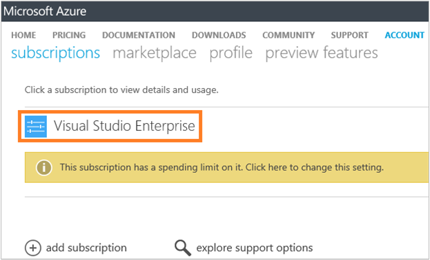

<properties
    pageTitle="Analyser l’utilisation des données dans le journal Analytique | Microsoft Azure"
    description="Vous pouvez utiliser la page de l’utilisation de journal Analytique pour afficher la quantité de données est envoyé au service OMS."
    services="log-analytics"
    documentationCenter=""
    authors="bandersmsft"
    manager="jwhit"
    editor=""/>

<tags
    ms.service="log-analytics"
    ms.workload="na"
    ms.tgt_pltfrm="na"
    ms.devlang="na"
    ms.topic="get-started-article"
    ms.date="08/11/2016"
    ms.author="banders"/>

# Analyser l’utilisation des données dans le journal Analytique

Journal Analytique dans la Suite de gestion des opérations (OMS) collecte des données et envoie au service OMS régulièrement.  Vous pouvez utiliser la page de **l’utilisation** pour afficher la quantité de données est envoyé au service OMS. La page de **l’utilisation** affiche également la quantité de données est envoyé quotidiennement par les solutions et la fréquence à laquelle vos serveurs envoient des données.

>[AZURE.NOTE] Si vous avez un compte gratuit créé à l’aide du [site Web OMS](http://www.microsoft.com/oms), vous êtes limité à l’envoi de 500 Mo de données au service OMS quotidiennement. Si vous atteignez la limite quotidienne, analyse des données arrêtera et reprendre au début de la journée suivante. Vous devez également renvoyer toutes les données qui n’a pas été acceptées ou traitées par OMS.

Vous pouvez consulter votre utilisation à l’aide de la vignette de **l’utilisation** de la **vue d’ensemble du** tableau de bord OMS.

Si vous avez dépassé votre limite de l’utilisation quotidienne, ou si vous êtes à proximité votre limite, vous pouvez éventuellement supprimer une solution pour réduire la quantité de données que vous envoyez au service OMS. Pour plus d’informations sur la suppression de solutions, voir [Ajouter journal Analytique solutions à partir de la galerie de Solutions](log-analytics-add-solutions.md).

La page de **l’utilisation** affiche les informations suivantes :

- Utilisation moyenne par jour
- Utilisation des données pour chaque solution au cours des 30 derniers jours
- Combien d’envoyer des données les serveurs de votre environnement au service OMS au cours des 30 derniers jours
- Vos données planifier niveau de tarification et coût estimé
- Informations sur votre service accord niveau (), y compris la durée OMS traiter vos données

## Pour travailler avec les données d’utilisation

1. Dans la page **vue d’ensemble** , cliquez sur la vignette de **l’utilisation** .
2. Dans la page de **l’utilisation** , afficher les catégories de l’utilisation qui montrent les zones que qui vous préoccuper.
3. Si vous avez une solution qui consomme trop de votre quota de téléchargement quotidien, vous pouvez envisager de suppression de cette solution.

## Pour afficher votre coût estimé et les informations de facturation
1. Dans la page **vue d’ensemble** , cliquez sur la vignette de **l’utilisation** .
2. Dans la page de **l’utilisation** sous **utilisation**, cliquez sur le chevron (**>**) en regard de **coût estimée**.
3. Dans la liste développée détails de **votre plan de données** , vous pouvez voir votre estimée coût mensuel.  
    
4. Si vous souhaitez afficher vos informations de facturation, cliquez sur **lire votre facture** pour afficher les informations de votre abonnement.
    - Dans la page Abonnements, cliquez sur votre abonnement pour afficher les détails et une liste d’éléments de ligne de l’utilisation.  
        
    - Dans la page Résumé pour votre abonnement, vous pouvez effectuer diverses tâches pour gérer et afficher plus d’informations sur votre abonnement.  
        

## Pour afficher les feuilles de données pour votre SLA
1. Dans la page **vue d’ensemble** , cliquez sur la vignette de **l’utilisation** .
2. **Contrat de niveau de Service**, cliquez sur **Télécharger SLA détails**.
3. Un fichier Excel xlsx est téléchargé pour passer en revue.  
    

## Étapes suivantes

- Voir [recherches de journaux dans Analytique journal](log-analytics-log-searches.md) pour afficher des informations détaillées collectées par des solutions.
