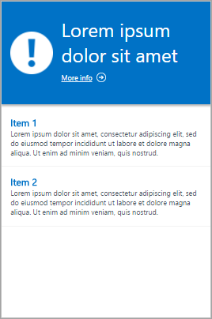

<properties
    pageTitle="Ouvrez une session Concepteur de vue Analytique | Microsoft Azure"
    description="Concepteur de vues dans le journal Analytique permet de créer des affichages personnalisés dans la console OMS qui contiennent les différentes visualisations de données dans le référentiel OMS. Cet article fournit une référence des paramètres pour chacun des composants visualisation utilisés dans vos affichages personnalisés."
    services="log-analytics"
    documentationCenter=""
    authors="bwren"
    manager="jwhit"
    editor=""/>

<tags
    ms.service="log-analytics"
    ms.workload="na"
    ms.tgt_pltfrm="na"
    ms.devlang="na"
    ms.topic="article"
    ms.date="10/20/2016"
    ms.author="bwren"/>

# Référence du composant visualisation journal du Concepteur de vue Analytique
Le Concepteur de vue dans le journal Analytique permet de créer des affichages personnalisés dans la console OMS qui contiennent les différentes visualisations de données à partir du référentiel OMS. Cet article fournit une référence des paramètres pour chacun des composants visualisation utilisés dans vos affichages personnalisés.

Autres articles disponibles pour le Concepteur de vue sont :

- [Concepteur de vue](log-analytics-view-designer.md) - vue d’ensemble du Concepteur de vue et procédures pour la création et modification des affichages personnalisés.
- [Référence sur la vignette](log-analytics-view-designer-tiles.md) - référence des paramètres pour chacun des vignettes utilisés dans vos affichages personnalisés. 

Le tableau suivant décrit les différents types de mosaïques disponibles dans le Concepteur de vue.  Les sections suivantes décrivent chaque type de mosaïque en détail et leurs propriétés.

| Type d’affichage | Description |
|:--|:--|
| [Liste des requêtes](#list-of-queries-part) | Affiche une liste des requêtes de recherche de journal.  L’utilisateur peut cliquer sur chaque requête pour afficher son des résultats.  |
| [Nombre et la liste](#number-amp-list-part) | En-tête comporte un seule affichant un nombre de chiffres d’enregistrements d’une requête de recherche de journal.  Liste affiche les résultats de dix supérieure à partir d’une requête avec un graphique qui indique la valeur relative d’une colonne numérique ou sa modification dans le temps. |
| [Deux nombres et la liste](#two-numbers-amp-list-part) | En-tête comporte deux nombres affichant le nombre de requêtes de recherche séparé pour les journaux des enregistrements.  Liste affiche les résultats de dix supérieure à partir d’une requête avec un graphique qui indique la valeur relative d’une colonne numérique ou sa modification dans le temps. |
| [Anneau & liste](#donut-amp-list-part) | En-tête affiche un nombre unique résumé à partir d’une colonne de valeur dans une requête de journal.  La couronne sous forme graphique affiche les résultats des trois enregistrements supérieure. |
| [Deux barres de planning et la liste](#two-timelines-amp-list-part) | En-tête affiche les résultats de deux requêtes de journal au fil du temps en tant que histogramme empilé avec une légende muni d’un numéro unique résumé à partir d’une colonne de valeur dans une requête de journal.  Liste affiche les résultats de dix supérieure à partir d’une requête avec un graphique qui indique la valeur relative d’une colonne numérique ou sa modification dans le temps. |   
| [Informations](#information-part) | En-tête affiche le texte statique et un lien facultatif.  Liste affiche un ou plusieurs éléments avec texte statique et un titre. |
| [Liste, légende et graphique en courbes](#line-chart-callout-amp-list-part) | En-tête affiche un graphique en courbes avec plusieurs séries d’une requête de journal dans le temps et une légende avec une valeur de synthèse.  Liste affiche les résultats de dix supérieure à partir d’une requête avec un graphique qui indique la valeur relative d’une colonne numérique ou sa modification dans le temps. |
| [Liste et graphique en courbes](#line-chart-amp-list-part) | En-tête affiche un graphique en courbes avec plusieurs séries d’une requête de journal au fil du temps.  Liste affiche les résultats de dix supérieure à partir d’une requête avec un graphique qui indique la valeur relative d’une colonne numérique ou sa modification dans le temps. |
| [Pile du composant de graphiques en courbes](#stack-of-line-charts-part) | Affiche les trois graphiques en courbes distincte avec plusieurs séries d’une requête de journal au fil du temps. |

## Liste des composants de requêtes

Affiche une liste des requêtes de recherche de journal.  L’utilisateur peut cliquer sur chaque requête pour afficher son des résultats.  La vue inclura une seule requête par défaut, et vous pouvez cliquer sur **+ requête** pour ajouter des requêtes supplémentaires.

| Paramètre | Description |
|:--|:--|
| **Général** |
| Titre | Texte à afficher dans la partie supérieure de l’affichage. |
| Nouveau groupe | Permet de créer un nouveau groupe dans la vue en commençant à l’affichage actuel. |
| Filtres présélectionnés | Liste des propriétés à inclure dans le volet de gauche filtre lorsque l’utilisateur sélectionne une requête délimitée par des virgules. |
| Mode de rendu | Vue initiale affichée lorsque la requête est sélectionnée.  L’utilisateur peut sélectionner toutes les vues disponibles après avoir ouvert la requête. |
| **Requêtes** |
| Requête de recherche | Pour exécuter la requête. |
| Nom convivial | Nom descriptif de la requête à afficher à l’utilisateur. |

## Composant de nombre et de la liste

En-tête comporte un seule affichant un nombre de chiffres d’enregistrements d’une requête de recherche de journal.  Liste affiche les résultats de dix supérieure à partir d’une requête avec un graphique qui indique la valeur relative d’une colonne numérique ou sa modification dans le temps.

| Paramètre | Description |
|:--|:--|
| **Général** |
| Titre du groupe | Texte à afficher dans la partie supérieure de l’affichage. |
| Nouveau groupe | Permet de créer un nouveau groupe dans la vue en commençant à l’affichage actuel. |
| Icône | Fichier d’image à afficher en regard du résultat dans l’en-tête.
| Icône d’utilisation | Sélectionnez pour l’affichage de l’icône. |
| **Titre** |
| Légende | Texte à afficher dans la partie supérieure de l’en-tête. |
| Requête | Requête à exécuter pour l’en-tête.  Le décompte du nombre d’enregistrements renvoyés par la requête s’affiche. |
| **Liste** |
| Requête | Requête à exécuter pour la liste.  Les deux premières propriétés pour les dix premiers enregistrements dans les résultats seront affichera.  La première propriété doit être une valeur de texte et la deuxième propriété une valeur numérique.  Barres sont automatiquement créés en fonction de la valeur relative de la colonne numérique.  Utilisez la commande Trier dans la requête pour trier les enregistrements dans la liste.  L’utilisateur peut cliquez sur Afficher tout pour exécuter la requête et renvoyer tous les enregistrements. |
| Masquer le graphique | Sélectionnez pour désactiver le graphique à droite de la colonne numérique. |
| Activer les graphiques sparkline | Permet d’afficher des graphiques sparkline au lieu de barre horizontale.  Pour plus d’informations, voir [Paramètres courants](#sparklines) . |
| Couleur | Couleur des barres ou des graphiques sparkline. |
| Nom & séparateur de valeur | Séparateur de caractère si vous voulez analyser la propriété du texte en plusieurs valeurs.  Pour plus d’informations, voir [Paramètres courants](#name-value-separator) . |
| Requête de navigation | Requête à exécuter lorsque l’utilisateur sélectionne un élément dans la liste.  Pour plus d’informations, voir [Paramètres courants](#navigation-query) . |
| **Liste** | **> Des titres de colonnes** |
| Nom | Texte à afficher en haut de la première colonne de la liste. |
| Valeur | Texte à afficher en haut de la deuxième colonne de la liste. |
| **Liste** | **> Seuils** |
| Activer les seuils | Sélectionnez pour activer les seuils.  Pour plus d’informations, voir [Paramètres courants](#thresholds) . |

## Deux nombres et le composant WebPart liste

En-tête comporte deux nombres affichant le nombre de requêtes de recherche séparé pour les journaux des enregistrements.  Liste affiche les résultats de dix supérieure à partir d’une requête avec un graphique qui indique la valeur relative d’une colonne numérique ou sa modification dans le temps.

| Paramètre | Description |
|:--|:--|
| **Général** |
| Titre du groupe | Texte à afficher dans la partie supérieure de l’affichage. |
| Nouveau groupe | Permet de créer un nouveau groupe dans la vue en commençant à l’affichage actuel. |
| Icône | Fichier d’image à afficher en regard du résultat dans l’en-tête.
| Icône d’utilisation | Sélectionnez pour l’affichage de l’icône. |
| **Titre** |
| Légende | Texte à afficher dans la partie supérieure de l’en-tête. |
| Requête | Requête à exécuter pour l’en-tête.  Le décompte du nombre d’enregistrements renvoyés par la requête s’affiche. |
| **Liste** |
| Requête | Requête à exécuter pour la liste.  Les deux premières propriétés pour les dix premiers enregistrements dans les résultats seront affichera.  La première propriété doit être une valeur de texte et la deuxième propriété une valeur numérique.  Barres sont automatiquement créés en fonction de la valeur relative de la colonne numérique.  Utilisez la commande Trier dans la requête pour trier les enregistrements dans la liste.  L’utilisateur peut cliquez sur Afficher tout pour exécuter la requête et renvoyer tous les enregistrements. |
| Masquer le graphique | Sélectionnez pour désactiver le graphique à droite de la colonne numérique. |
| Activer les graphiques sparkline | Permet d’afficher des graphiques sparkline au lieu de barre horizontale.  Pour plus d’informations, voir [Paramètres courants](#sparklines) . |
| Couleur | Couleur des barres ou des graphiques sparkline. |
| Opération | Opération à effectuer pour le graphique sparkline.  Pour plus d’informations, voir [Paramètres courants](#sparklines) . |
| Nom & séparateur de valeur | Séparateur de caractère si vous voulez analyser la propriété du texte en plusieurs valeurs.  Pour plus d’informations, voir [Paramètres courants](#name-value-separator) . |
| Requête de navigation | Requête à exécuter lorsque l’utilisateur sélectionne un élément dans la liste.  Pour plus d’informations, voir [Paramètres courants](#navigation-query) . |
| **Liste** | **> Des titres de colonnes** |
| Nom | Texte à afficher en haut de la première colonne de la liste. |
| Valeur | Texte à afficher en haut de la deuxième colonne de la liste. |
| **Liste** | **> Seuils** |
| Activer les seuils | Sélectionnez pour activer les seuils.  Pour plus d’informations, voir [Paramètres courants](#thresholds) . |

## Composant couronne & liste

En-tête affiche un nombre unique résumé à partir d’une colonne de valeur dans une requête de journal.  La couronne sous forme graphique affiche les résultats des trois enregistrements supérieure.

| Paramètre | Description |
|:--|:--|
| **Général** |
| Titre du groupe | Texte à afficher dans la partie supérieure de la vignette. |
| Nouveau groupe | Permet de créer un nouveau groupe dans la vue en commençant à l’affichage actuel. |
| Icône | Fichier d’image à afficher en regard du résultat dans l’en-tête. |
| Icône d’utilisation | Sélectionnez pour l’affichage de l’icône. |
| **En-tête** |
| Titre | Texte à afficher dans la partie supérieure de l’en-tête.
| Sous-titre | Texte à afficher sous le titre en haut de l’en-tête.
| **Anneau** |
| Requête | Requête à exécuter pour la couronne.  La première propriété doit être une valeur de texte et la deuxième propriété une valeur numérique. |
| **Anneau** |  **> Centre** |
| Texte | Texte à afficher sous la valeur à l’intérieur de la couronne. |
| Opération | L’opération à effectuer sur la propriété valeur à synthétiser dans une valeur unique.  -Somme : Ajoute les valeurs de tous les enregistrements. -Pourcentage : Pourcentage d’enregistrements renvoyés par les valeurs dans les **valeurs de résultat utilisés dans Centre opération** dans le nombre total d’enregistrements dans la requête. |
| Valeurs de résultat utilisés dans opération centre | Si vous le souhaitez, cliquez sur le signe plus pour ajouter une ou plusieurs valeurs.  Les résultats de la requête sont limités aux enregistrements avec les valeurs de propriétés que vous spécifiez.  Si aucune valeur n’ont été ajoutées, tous les enregistrements sont inclus dans la requête. |
| **Options supplémentaires** | **> Couleurs** |
| Couleur 1 Couleur 2 Couleur 3 | Sélectionnez la couleur de chacun des valeurs affichées dans la couronne. |
| **Options supplémentaires** | **> Mappage des couleurs avancé** |
| Valeur de champ | Tapez le nom d’un champ pour l’afficher sous forme d’une couleur différente si elle est incluse dans la couronne. |
| Couleur | Sélectionnez la couleur pour le champ unique. |
| **Liste** |
| Requête | Requête à exécuter pour la liste.  Le décompte du nombre d’enregistrements renvoyés par la requête s’affiche. |
| Masquer le graphique | Sélectionnez pour désactiver le graphique à droite de la colonne numérique. |
| Activer les graphiques sparkline | Permet d’afficher des graphiques sparkline au lieu de barre horizontale.  Pour plus d’informations, voir [Paramètres courants](#sparklines) . |
| Couleur | Couleur des barres ou des graphiques sparkline. |
| Opération | Opération à effectuer pour le graphique sparkline.  Pour plus d’informations, voir [Paramètres courants](#sparklines) . |
| Nom & séparateur de valeur | Séparateur de caractère si vous voulez analyser la propriété du texte en plusieurs valeurs.  Pour plus d’informations, voir [Paramètres courants](#name-value-separator) . |
| Requête de navigation | Requête à exécuter lorsque l’utilisateur sélectionne un élément dans la liste.  Pour plus d’informations, voir [Paramètres courants](#navigation-query) . |
| **Liste** | **> Des titres de colonnes** |
| Nom | Texte à afficher en haut de la première colonne de la liste. |
| Valeur | Texte à afficher en haut de la deuxième colonne de la liste. |
| **Liste** | **> Seuils** |
| Activer les seuils | Sélectionnez pour activer les seuils.  Pour plus d’informations, voir [Paramètres courants](#thresholds) . |

## Deux parties chronologies et la liste

En-tête affiche les résultats de deux requêtes de journal au fil du temps en tant que histogramme empilé avec une légende muni d’un numéro unique résumé à partir d’une colonne de valeur dans une requête de journal.  Liste affiche les résultats de dix supérieure à partir d’une requête avec un graphique qui indique la valeur relative d’une colonne numérique ou sa modification dans le temps.

| Paramètre | Description |
|:--|:--|
| **Général** |
| Titre du groupe | Texte à afficher dans la partie supérieure de la vignette. |
| Nouveau groupe | Permet de créer un nouveau groupe dans la vue en commençant à l’affichage actuel. |
| Icône | Fichier d’image à afficher en regard du résultat dans l’en-tête. |
| Icône d’utilisation | Sélectionnez pour l’affichage de l’icône. |
| **Tout d’abord graphique deuxième graphique** |
| Légende | Texte à afficher dans la légende pour la première série. |
| Couleur | Couleur à utiliser pour les colonnes de la série. |
| Requête | Requête à exécuter pour la première série.  Le nombre du nombre d’enregistrements sur chaque intervalle de temps sera représenté par les colonnes du graphique. |
| Opération | L’opération à effectuer sur la propriété valeur à synthétiser dans une seule valeur pour la légende.  -Somme : Somme de la valeur de tous les enregistrements. -Moyenne : Moyenne de la valeur de tous les enregistrements. -Exemple dernière : Valeur du dernier intervalle incluse dans le graphique. -Premier échantillon : Valeur le premier intervalle incluse dans le graphique. -Count : Nombre de tous les enregistrements renvoyés par la requête.|
| **Liste** |
| Requête | Requête à exécuter pour la liste.  Le décompte du nombre d’enregistrements renvoyés par la requête s’affiche. |
| Masquer le graphique | Sélectionnez pour désactiver le graphique à droite de la colonne numérique. |
| Activer les graphiques sparkline | Permet d’afficher des graphiques sparkline au lieu de barre horizontale.  Pour plus d’informations, voir [Paramètres courants](#sparklines) . |
| Couleur | Couleur des barres ou des graphiques sparkline. |
| Opération | Opération à effectuer pour le graphique sparkline.  Pour plus d’informations, voir [Paramètres courants](#sparklines) . |
| Requête de navigation | Requête à exécuter lorsque l’utilisateur sélectionne un élément dans la liste.  Pour plus d’informations, voir [Paramètres courants](#navigation-query) . |
| **Liste** | **> Des titres de colonnes** |
| Nom | Texte à afficher en haut de la première colonne de la liste. |
| Valeur | Texte à afficher en haut de la deuxième colonne de la liste. |
| **Liste** | **> Seuils** |
| Activer les seuils | Sélectionnez pour activer les seuils.  Pour plus d’informations, voir [Paramètres courants](#thresholds) . |

## Partie d’informations

En-tête affiche le texte statique et un lien facultatif.  Liste affiche un ou plusieurs éléments avec texte statique et un titre.

| Paramètre | Description |
|:--|:--|
| **Général** |
| Titre du groupe | Texte à afficher dans la partie supérieure de la vignette. |
| Nouveau groupe | Permet de créer un nouveau groupe dans la vue en commençant à l’affichage actuel. |
| Couleur | Couleur d’arrière-plan de l’en-tête. |
| **En-tête** |
| Image | Fichier d’image à afficher dans l’en-tête. |
| Étiquette | Texte à afficher dans l’en-tête. |
| **En-tête** | **> Lien** |
| Étiquette | Texte du lien. |
| URL | URL du lien. |
| **Éléments d’information** |
| Titre | Texte à afficher pour le titre de chaque élément. |
| Contenu | Texte à afficher pour chaque élément. |

## Graphique en courbes, légende et composant WebPart liste

En-tête affiche un graphique en courbes avec plusieurs séries d’une requête de journal dans le temps et une légende avec une valeur de synthèse.  Liste affiche les résultats de dix supérieure à partir d’une requête avec un graphique qui indique la valeur relative d’une colonne numérique ou sa modification dans le temps.

| Paramètre | Description |
|:--|:--|
| **Général** |
| Titre du groupe | Texte à afficher dans la partie supérieure de la vignette. |
| Nouveau groupe | Permet de créer un nouveau groupe dans la vue en commençant à l’affichage actuel. |
| Icône | Fichier d’image à afficher en regard du résultat dans l’en-tête. |
| Icône d’utilisation | Sélectionnez pour l’affichage de l’icône. |
| **En-tête** |
| Titre | Texte à afficher dans la partie supérieure de l’en-tête. |
| Sous-titre | Texte à afficher sous le titre en haut de l’en-tête. |
| **Graphique en courbes** |
| Requête | Requête à exécuter pour le graphique en courbes.  La première propriété doit être une valeur de texte et la deuxième propriété une valeur numérique.  Il s’agit d’une requête qui utilise le mot-clé **mesure** pour résumer les résultats.  Si la requête utilise le mot-clé **intervalle de** l’axe des abscisses du graphique utilisera cet intervalle de temps.  Si la requête n’inclut pas le mot-clé **intervalle** intervalles horaires sont utilisés pour l’axe des abscisses. |
| **Graphique en courbes** | **> Légende** |
| Titre de légende | Texte à afficher au-dessus de la valeur de légende. |
| Nom de la série | Valeur de propriété de la série à utiliser pour la valeur de légende.  Si aucune série n’est fourni, tous les enregistrements de la requête sont utilisés. |
| Opération | L’opération à effectuer sur la propriété valeur à synthétiser dans une seule valeur pour la légende.  -Moyenne : Moyenne de la valeur de tous les enregistrements. -Compter le nombre de tous les enregistrements renvoyés par la requête. -Exemple dernière : Valeur du dernier intervalle incluse dans le graphique. -Max : Valeur maximale les intervalles incluses dans le graphique. -Min : Valeur du champ Minimum entre les intervalles incluses dans le graphique. -Somme : Somme de la valeur de tous les enregistrements. |
| **Graphique en courbes** | **> Axe des ordonnées** |
| Utiliser une échelle logarithmique | Sélectionnez utiliser une échelle logarithmique pour l’axe des ordonnées. |
| Unités | Spécifier l’intensité d’utilisation pour les valeurs renvoyées par la requête.  Ces informations sont utilisées pour afficher les étiquettes sur le graphique qui indique les types de valeur et éventuellement pour convertir les valeurs.  Le Type d’unité spécifie la catégorie de l’unité et définit les valeurs de Type d’unité en cours sont disponibles.  Si vous sélectionnez une valeur dans convertir en les valeurs numériques sont converties à partir du type d’unité en cours de la conversion en type. |
| Étiquette personnalisée | Texte à afficher pour l’axe des ordonnées en regard de l’étiquette pour le type d’unité.  Si aucun nom n’est spécifié, le type d’unité s’affiche. |
| **Liste** |
| Requête | Requête à exécuter pour la liste.  Le décompte du nombre d’enregistrements renvoyés par la requête s’affiche. |
| Masquer le graphique | Sélectionnez pour désactiver le graphique à droite de la colonne numérique. |
| Activer les graphiques sparkline | Permet d’afficher des graphiques sparkline au lieu de barre horizontale.  Pour plus d’informations, voir [Paramètres courants](#sparklines) . |
| Couleur | Couleur des barres ou des graphiques sparkline. |
| Opération | Opération à effectuer pour le graphique sparkline.  Pour plus d’informations, voir [Paramètres courants](#sparklines) . |
| Nom & séparateur de valeur | Séparateur de caractère si vous voulez analyser la propriété du texte en plusieurs valeurs.  Pour plus d’informations, voir [Paramètres courants](#name-value-separator) . |
| Requête de navigation | Requête à exécuter lorsque l’utilisateur sélectionne un élément dans la liste.  Pour plus d’informations, voir [Paramètres courants](#navigation-query) . |
| **Liste** | **> Des titres de colonnes** |
| Nom | Texte à afficher en haut de la première colonne de la liste. |
| Valeur | Texte à afficher en haut de la deuxième colonne de la liste. |
| **Liste** | **> Seuils** |
| Activer les seuils | Sélectionnez pour activer les seuils.  Pour plus d’informations, voir [Paramètres courants](#thresholds) . |

## Composant de graphique et la liste de ligne

En-tête affiche un graphique en courbes avec plusieurs séries d’une requête de journal au fil du temps.  Liste affiche les résultats de dix supérieure à partir d’une requête avec un graphique qui indique la valeur relative d’une colonne numérique ou sa modification dans le temps.

| Paramètre | Description |
|:--|:--|
| **Général** |
| Titre du groupe | Texte à afficher dans la partie supérieure de la vignette. |
| Nouveau groupe | Permet de créer un nouveau groupe dans la vue en commençant à l’affichage actuel. |
| Icône | Fichier d’image à afficher en regard du résultat dans l’en-tête. |
| Icône d’utilisation | Sélectionnez pour l’affichage de l’icône. |
| **En-tête** |
| Titre | Texte à afficher dans la partie supérieure de l’en-tête. |
| Sous-titre | Texte à afficher sous le titre en haut de l’en-tête. |
| **Graphique en courbes** |
| Requête | Requête à exécuter pour le graphique en courbes.  La première propriété doit être une valeur de texte et la deuxième propriété une valeur numérique.  Il s’agit d’une requête qui utilise le mot-clé **mesure** pour résumer les résultats.  Si la requête utilise le mot-clé **intervalle de** l’axe des abscisses du graphique utilisera cet intervalle de temps.  Si la requête n’inclut pas le mot-clé **intervalle** intervalles horaires sont utilisés pour l’axe des abscisses. |
| **Graphique en courbes** | **> Axe des ordonnées** |
| Utiliser une échelle logarithmique | Sélectionnez utiliser une échelle logarithmique pour l’axe des ordonnées. |
| Unités | Spécifier l’intensité d’utilisation pour les valeurs renvoyées par la requête.  Ces informations sont utilisées pour afficher les étiquettes sur le graphique qui indique les types de valeur et éventuellement pour convertir les valeurs.  Le Type d’unité spécifie la catégorie de l’unité et définit les valeurs de Type d’unité en cours sont disponibles.  Si vous sélectionnez une valeur dans convertir en les valeurs numériques sont converties à partir du type d’unité en cours de la conversion en type. |
| Étiquette personnalisée | Texte à afficher pour l’axe des ordonnées en regard de l’étiquette pour le type d’unité.  Si aucun nom n’est spécifié, le type d’unité s’affiche. |
| **Liste** |
| Requête | Requête à exécuter pour la liste.  Le décompte du nombre d’enregistrements renvoyés par la requête s’affiche. |
| Masquer le graphique | Sélectionnez pour désactiver le graphique à droite de la colonne numérique. |
| Activer les graphiques sparkline | Permet d’afficher des graphiques sparkline au lieu de barre horizontale.  Pour plus d’informations, voir [Paramètres courants](#sparklines) . |
| Couleur | Couleur des barres ou des graphiques sparkline. |
| Opération | Opération à effectuer pour le graphique sparkline.  Pour plus d’informations, voir [Paramètres courants](#sparklines) . |
| Nom & séparateur de valeur | Séparateur de caractère si vous voulez analyser la propriété du texte en plusieurs valeurs.  Pour plus d’informations, voir [Paramètres courants](#name-value-separator) . |
| Requête de navigation | Requête à exécuter lorsque l’utilisateur sélectionne un élément dans la liste.  Pour plus d’informations, voir [Paramètres courants](#navigation-query) . |
| **Liste** | **> Des titres de colonnes** |
| Nom | Texte à afficher en haut de la première colonne de la liste. |
| Valeur | Texte à afficher en haut de la deuxième colonne de la liste. |
| **Liste** | **> Seuils** |
| Activer les seuils | Sélectionnez pour activer les seuils.  Pour plus d’informations, voir [Paramètres courants](#thresholds) . |

## Pile du composant de graphiques en courbes

Affiche les trois graphiques en courbes distincte avec plusieurs séries d’une requête de journal au fil du temps.

| Paramètre | Description |
|:--|:--|
| **Général** |
| Titre du groupe | Texte à afficher dans la partie supérieure de la vignette. |
| Nouveau groupe | Permet de créer un nouveau groupe dans la vue en commençant à l’affichage actuel. |
| Icône | Fichier d’image à afficher en regard du résultat dans l’en-tête. |
| **Graphique 1 graphique 2 3 du graphique** | **> En-tête** |
| Titre | Texte à afficher dans la partie supérieure du graphique. |
| Sous-titre | Texte à afficher sous le titre en haut du graphique. |
| **Graphique 1 graphique 2 3 du graphique** | **Graphique en courbes** |
| Requête | Requête à exécuter pour le graphique en courbes.  La première propriété doit être une valeur de texte et la deuxième propriété une valeur numérique.  Il s’agit d’une requête qui utilise le mot-clé **mesure** pour résumer les résultats.  Si la requête utilise le mot-clé **intervalle de** l’axe des abscisses du graphique utilisera cet intervalle de temps.  Si la requête n’inclut pas le mot-clé **intervalle** intervalles horaires sont utilisés pour l’axe des abscisses. |
| **Graphique** | **> Axe des ordonnées** |
| Utiliser une échelle logarithmique | Sélectionnez utiliser une échelle logarithmique pour l’axe des ordonnées. |
| Unités | Spécifier l’intensité d’utilisation pour les valeurs renvoyées par la requête.  Ces informations sont utilisées pour afficher les étiquettes sur le graphique qui indique les types de valeur et éventuellement pour convertir les valeurs.  Le Type d’unité spécifie la catégorie de l’unité et définit les valeurs de Type d’unité en cours sont disponibles.  Si vous sélectionnez une valeur dans convertir en les valeurs numériques sont converties à partir du type d’unité en cours de la conversion en type. |
| Étiquette personnalisée | Texte à afficher pour l’axe des ordonnées en regard de l’étiquette pour le type d’unité.  Si aucun nom n’est spécifié, le type d’unité s’affiche. |

## Paramètres communs
Les sections suivantes décrivent les paramètres communs à plusieurs parties de visualisation.

### <a name="name-value-separator">Nom & séparateur de valeur</a>
Séparateur de caractère si vous voulez analyser la propriété de texte à partir d’une requête de liste à plusieurs valeurs.  Si vous spécifiez un séparateur, vous pouvez fournir des noms pour chaque champ séparé par le même séparateur dans la zone Nom.

Par exemple, considérez une propriété appelée *emplacement* incluant des valeurs, telles que *Redmond construction 41* et *Bellevue Building12*.  Vous pouvez spécifier – nom & séparateur de valeur et *City Building* correspondant au nom.  Ceci analyse chaque valeur dans les deux propriétés appelées *Ville* et *construction*. 

### <a name="navigation-query">Requête de navigation</a>
Requête à exécuter lorsque l’utilisateur sélectionne un élément dans la liste.  Utilisez *{élément sélectionné}* pour inclure la syntaxe de l’élément sélectionné par l’utilisateur.

Par exemple, si la requête possède une colonne appelée la requête de navigation et de *l’ordinateur* est *{élément sélectionné}*, une requête tel que *ordinateur = « Poste de travail »* doit être exécuté lorsque l’utilisateur sélectionné un ordinateur.  Si la requête de navigation est *Type = événement {élément sélectionné}* puis la requête *Type = ordinateur événement = « Poste de travail »* doit être exécuté.

### <a name="sparklines">Graphiques sparkline</a>
Un graphique sparkline est un graphique en courbes petite qui illustre la valeur d’une entrée de la liste dans le temps.  Pour les parties de visualisation avec une liste, vous pouvez sélectionner si vous souhaitez afficher une barre indiquant la valeur d’une colonne numérique ou un graphique sparkline indiquant sa valeur au fil du temps relative horizontale.

Le tableau suivant décrit les paramètres pour les graphiques sparkline.

| Paramètre | Description |
|:--|:--|
| Activer les graphiques sparkline | Permet d’afficher des graphiques sparkline au lieu de barre horizontale. |
| Opération | Si les graphiques sparkline sont activées, il s’agit de l’opération à effectuer sur chacune des propriétés de la liste pour calculer les valeurs pour le graphique sparkline.  -Exemple dernière : Dernière valeur de la série sur l’intervalle de temps. -Max : Valeur maximale pour la série sur l’intervalle de temps. -Min : Valeur minimale pour la série sur l’intervalle de temps. -Somme : Somme des valeurs de la série sur l’intervalle de temps. -Résumé : Utilise la même commande mesure en tant que la requête dans l’en-tête. |

### <a name="thresholds">Seuils</a>
Seuils permettent d’afficher une icône de couleur en regard de chaque élément dans une liste vous donnant un indicateur visuel rapide des éléments qui dépasse une valeur particulière ou compris dans une plage spécifique.  Par exemple, vous pouvez afficher une icône verte pour les éléments avec une valeur acceptable, le jaune si la valeur est dans une plage qui indique un message d’avertissement et rouge s’il dépasse une valeur d’erreur.

Lorsque vous activez seuils d’un composant, vous devez spécifier un ou plusieurs seuils.  Si la valeur d’un élément est supérieur à une valeur de seuil et inférieure à la valeur seuil suivante, cette couleur est utilisée.  Si l’élément est supérieur à la valeur seuil puis plus élevée, cette couleur est définie.   

Chaque jeu seuil possède un seuil avec une valeur **par défaut**.  Il s’agit de la couleur définie en cas de ne dépassée aucune autre valeur.  Vous pouvez ajouter ou supprimer des seuils en cliquant sur les **+** ou bouton **x** .

Le tableau suivant décrit les paramètres de seuils.

| Paramètre | Description |
|:--|:--|
| Activer les seuils | Permet d’afficher une icône de couleur à gauche de chaque valeur qui indique son état par rapport aux seuils spécifiés. |
| Nom | Nom qui identifie la valeur de seuil. |
| Seuil | Valeur de seuil.  La couleur d’intégrité pour chaque élément de liste est définie sur la couleur de la plus grande valeur de seuil dépassée par la valeur de l’élément.  Il existe un seuil par défaut qui est la couleur en cas de ne dépassée aucune valeur de seuil. |
| Couleur | Couleur pour la valeur de seuil. |

## Étapes suivantes

- En savoir plus sur [les recherches de journal](log-analytics-log-searches.md) prendre en charge les requêtes dans les composants de visualisation.