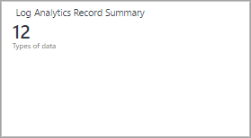
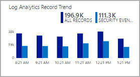

<properties
    pageTitle="Ouvrez une session Analytique mode concepteur vignette référence | Microsoft Azure"
    description="Concepteur de vues dans le journal Analytique permet de créer des affichages personnalisés dans la console OMS qui contiennent les différentes visualisations de données dans le référentiel OMS. Cet article fournit une référence des paramètres pour chacun des vignettes utilisés dans vos affichages personnalisés."
    services="log-analytics"
    documentationCenter=""
    authors="bwren"
    manager="jwhit"
    editor=""/>

<tags
    ms.service="log-analytics"
    ms.workload="na"
    ms.tgt_pltfrm="na"
    ms.devlang="na"
    ms.topic="article"
    ms.date="09/27/2016"
    ms.author="bwren"/>

# Référence du journal Analytique mode concepteur vignette
Le Concepteur de vue dans le journal Analytique permet de créer des affichages personnalisés dans la console OMS qui contiennent les différentes visualisations de données dans le référentiel OMS. Cet article fournit une référence des paramètres pour chacun des vignettes utilisés dans vos affichages personnalisés.

Autres articles disponibles pour le Concepteur de vue sont :

- [Concepteur de vue](log-analytics-view-designer.md) - vue d’ensemble du Concepteur de vue et procédures pour la création et modification des affichages personnalisés.
- [Référence de partie visualisation](log-analytics-view-designer-parts.md) - référence des paramètres pour chacun des vignettes utilisés dans vos affichages personnalisés. 

Le tableau suivant répertorie les différents types de mosaïques disponibles dans le Concepteur de vue.  Les sections suivantes décrivent chaque type de mosaïque en détail et leurs propriétés.

| Mosaïque | Description |
|:--|:--|
| [Nombre](#number-tile) | Nombre unique affichant le nombre d’enregistrements d’une requête. |
| [Deux nombres](#two-numbers-tile) | Deux nombres unique affichant le nombre d’enregistrements à partir de deux requêtes différentes. |
| [Anneau](#donut-tile) | Graphique basé sur une requête avec une valeur de synthèse dans le centre. |
| [Légende et graphique en courbes](#line-chart-amp-callout-tile) | Graphique en courbes basé sur une requête et une légende avec une valeur de synthèse. |
| [Graphique en courbes](#line-chart-tile) | Graphique en courbes basé sur une requête. |
| [Deux barres de planning](#two-timelines-tile) | Graphique en histogrammes avec deux séries que chaque basée sur une requête distincte. |

## Vignette nombre

La vignette **nombre** affiche un seul nombre indiquant le nombre d’enregistrements à partir d’une requête de journal et une étiquette.

| Paramètre | Description |
|:--|:--|
| Nom        | Texte à afficher dans la partie supérieure de la vignette. |
| Description | Texte à afficher sous le nom de la mosaïque.    |
| **Mosaïque** |
| Légende | Texte à afficher sous la valeur. |
| Requête | Pour exécuter la requête.  Le décompte du nombre d’enregistrements renvoyés par la requête s’affiche. |
| **Avancées** |  **> Vérification flux de données** |
| Activé | Sélectionnez si la vérification du flux de données doit être activée pour la vignette.  Cela fournit un autre message si données ne seront pas disponibles pour la vignette.  Ceci est généralement utilisée pour fournir un message pendant la période temporaire lorsque la vue est installée et les données sont disponibles. |
| Requête | Requête pour exécuter pour vérifier si les données sont disponibles pour l’affichage.  Si la requête ne renvoie aucun résultat, un message s’affiche au lieu de la valeur de la requête principale. |
| Message | Message à afficher si la requête de vérification du flux de données ne retourne aucune donnée.  Si vous ne spécifiez aucun message, *Exécution d’évaluation* est affiché. |
| **Intervalle de temps** |
| Durée | Durée de la date actuelle à utiliser pour l’intervalle de temps de la requête.  Par exemple, si **7 jours** n’est spécifié, la requête est limitée aux enregistrements créés à partir de 7 jours à la date du jour. |
| Décalage de données de fin | Offset facultatif à partir des données en cours à utiliser pour l’intervalle de temps de la requête principale.  Par exemple, si le **jour -1** est utilisé pour le **décalage de date de fin** et utilisé pour la **durée**de **7 jours** , la requête est limitée aux enregistrements créés à partir de 8 jours à hier. |

## Vignette de deux nombres

La vignette **Nombre deux** affiche deux nombres affichant le nombre d’enregistrements à partir de deux requêtes de journal différent et une étiquette pour chacune d’elles.

| Paramètre | Description |
|:--|:--|
| Nom        | Texte à afficher dans la partie supérieure de la vignette. |
| Description | Texte à afficher sous le nom de la mosaïque.    |
| **Première mosaïque** |
| Légende | Texte à afficher sous la valeur. |
| Requête | Pour exécuter la requête.  Le décompte du nombre d’enregistrements renvoyés par la requête s’affiche. |
| **Deuxième mosaïque** |
| Légende | Texte à afficher sous la valeur. |
| Requête | Pour exécuter la requête.  Le décompte du nombre d’enregistrements renvoyés par la requête s’affiche. |
| **Avancées** | **> Vérification flux de données** |
| Activé | Sélectionnez si la vérification du flux de données doit être activée pour la vignette.  Cela fournit un autre message si données ne seront pas disponibles pour la vignette.  Ceci est généralement utilisée pour fournir un message pendant la période temporaire lorsque la vue est installée et les données sont disponibles. |
| Requête | Requête pour exécuter pour vérifier si les données sont disponibles pour l’affichage.  Si la requête ne renvoie aucun résultat, un message s’affiche au lieu de la valeur de la requête principale. |
| Message | Message à afficher si la requête de vérification du flux de données ne retourne aucune donnée.  Si vous ne spécifiez aucun message, *Exécution d’évaluation* est affiché. |
| **Intervalle de temps** |
| Durée | Durée de la date actuelle à utiliser pour l’intervalle de temps de la requête.  Par exemple, si **7 jours** n’est spécifié, la requête est limitée aux enregistrements créés à partir de 7 jours à la date du jour. |
| Décalage de données de fin | Offset facultatif à partir des données en cours à utiliser pour l’intervalle de temps de la requête principale.  Par exemple, si le **jour -1** est utilisé pour le **décalage de date de fin** et utilisé pour la **durée**de **7 jours** , la requête est limitée aux enregistrements créés à partir de 8 jours à hier. |

## Vignette couronne

La vignette **couronne** affiche un nombre unique résumé à partir d’une colonne de valeur dans une requête de journal.  La couronne sous forme graphique affiche les résultats des trois enregistrements supérieure.

| Paramètre | Description |
|:--|:--|
| Nom        | Texte à afficher dans la partie supérieure de la vignette. |
| Description | Texte à afficher sous le nom de la mosaïque.    |
| **Anneau** |
| Requête | Requête à exécuter pour la couronne.  La première propriété doit être une valeur de texte et la deuxième propriété une valeur numérique.  Il s’agit d’une requête qui utilise le mot-clé **mesure** pour résumer les résultats. |
| **Anneau** | **> Centre** |
| Texte | Texte à afficher sous la valeur à l’intérieur de la couronne. |
| Opération | L’opération à effectuer sur la propriété valeur à synthétiser dans une valeur unique.  -Somme : Ajoute les valeurs de tous les enregistrements avec la valeur de propriété. -Pourcentage : Pourcentage des valeurs somme à partir d’enregistrements avec la valeur de propriété par rapport aux valeurs somme de tous les enregistrements. |
| Valeurs de résultat utilisés dans opération centre | Si vous le souhaitez, cliquez sur le signe plus pour ajouter une ou plusieurs valeurs.  Les résultats de la requête sont limités aux enregistrements avec les valeurs de propriétés que vous spécifiez.  Si aucune valeur n’est ajoutés, que tous les enregistrements sont inclus dans la requête. |
| **Anneau** | **> Options supplémentaires** |
| Couleurs | La couleur à afficher pour chacune des trois propriétés supérieure.  Si vous voulez spécifier des couleurs de remplacement pour les valeurs de propriétés spécifiques, puis utilisez mappage de couleur avancés. |
| Mappage des couleurs avancées | Affiche une couleur pour les valeurs de propriété spécifiques.  Si la valeur que vous spécifiez est dans les trois premières, l’autre couleur s’affiche au lieu de la couleur standard.  Si la propriété n’est pas dans les trois premières, la couleur n’est pas affichée. |
| **Avancées** | **> Vérification flux de données** |
| Activé | Sélectionnez si la vérification du flux de données doit être activée pour la vignette.  Cela fournit un autre message si données ne seront pas disponibles pour la vignette.  Ceci est généralement utilisée pour fournir un message pendant la période temporaire lorsque la vue est installée et les données sont disponibles. |
| Requête | Requête pour exécuter pour vérifier si les données sont disponibles pour l’affichage.  Si la requête ne renvoie aucun résultat, un message s’affiche au lieu de la valeur de la requête principale. |
| Message | Message à afficher si la requête de vérification du flux de données ne retourne aucune donnée.  Si vous ne spécifiez aucun message, *Exécution d’évaluation* est affiché. |
| **Intervalle de temps** |
| Durée | Durée de la date actuelle à utiliser pour l’intervalle de temps de la requête.  Par exemple, si **7 jours** n’est spécifié, la requête est limitée aux enregistrements créés à partir de 7 jours à la date du jour. |
| Décalage de données de fin | Offset facultatif à partir des données en cours à utiliser pour l’intervalle de temps de la requête principale.  Par exemple, si le **jour -1** est utilisé pour le **décalage de date de fin** et utilisé pour la **durée**de **7 jours** , la requête est limitée aux enregistrements créés à partir de 8 jours à hier. |

## Vignette de graphique de ligne

La vignette de **graphique en courbes** affiche un graphique en courbes avec plusieurs séries d’une requête de journal au fil du temps.  

| Paramètre | Description |
|:--|:--|
| Nom        | Texte à afficher dans la partie supérieure de la vignette. |
| Description | Texte à afficher sous le nom de la mosaïque.    |
| **Graphique en courbes** |  
| Requête | Requête à exécuter pour le graphique en courbes.  La première propriété doit être une valeur de texte et la deuxième propriété une valeur numérique.  Il s’agit d’une requête qui utilise le mot-clé **mesure** pour résumer les résultats.  Si la requête utilise le mot-clé **intervalle de** l’axe des abscisses du graphique utilisera cet intervalle de temps.  Si la requête n’inclut pas le mot-clé **intervalle** intervalles horaires sont utilisés pour l’axe des abscisses. |
| **Graphique en courbes** | **> Axe des ordonnées** |
| Utiliser une échelle logarithmique | Sélectionnez utiliser une échelle logarithmique pour l’axe des ordonnées. |
| Unités | Spécifier l’intensité d’utilisation pour les valeurs renvoyées par la requête.  Ces informations sont utilisées pour afficher les étiquettes sur le graphique qui indique les types de valeur et éventuellement pour convertir les valeurs.  Le **Type d’unité** spécifie la catégorie de l’unité et définit les valeurs de **Type d’unité en cours** sont disponibles.  Si vous sélectionnez une valeur dans **convertir** les valeurs numériques sont converties à partir du type **d’Unité actuelle** au type de **convertir** . |
| Étiquette personnalisée | Texte à afficher pour l’axe des ordonnées en regard de l’étiquette pour le type d’unité.  Si aucun nom n’est spécifié, le type d’unité s’affiche. |
| **Avancées** | **> Vérification flux de données** |
| Activé | Sélectionnez si la vérification du flux de données doit être activée pour la vignette.  Cela fournit un autre message si données ne seront pas disponibles pour la vignette.  Ceci est généralement utilisée pour fournir un message pendant la période temporaire lorsque la vue est installée et les données sont disponibles. |
| Requête | Requête pour exécuter pour vérifier si les données sont disponibles pour l’affichage.  Si la requête ne renvoie aucun résultat, un message s’affiche au lieu de la valeur de la requête principale. |
| Message | Message à afficher si la requête de vérification du flux de données ne retourne aucune donnée.  Si vous ne spécifiez aucun message, *Exécution d’évaluation* est affiché. |
| **Intervalle de temps** |
| Durée | Durée de la date actuelle à utiliser pour l’intervalle de temps de la requête.  Par exemple, si **7 jours** n’est spécifié, la requête est limitée aux enregistrements créés à partir de 7 jours à la date du jour. |
| Décalage de données de fin | Offset facultatif à partir des données en cours à utiliser pour l’intervalle de temps de la requête principale.  Par exemple, si le **jour -1** est utilisé pour le **décalage de date de fin** et utilisé pour la **durée**de **7 jours** , la requête est limitée aux enregistrements créés à partir de 8 jours à hier. |

## Vignette de graphique et la légende de ligne

La vignette **légende et graphique en courbes** affiche un graphique en courbes avec plusieurs séries d’une requête de journal dans le temps et une légende avec une valeur de synthèse.  

| Paramètre | Description |
|:--|:--|
| Nom        | Texte à afficher dans la partie supérieure de la vignette. |
| Description | Texte à afficher sous le nom de la mosaïque.    |
| **Graphique en courbes** |  
| Requête | Requête à exécuter pour le graphique en courbes.  La première propriété doit être une valeur de texte et la deuxième propriété une valeur numérique.  Il s’agit d’une requête qui utilise le mot-clé **mesure** pour résumer les résultats.  Si la requête utilise le mot-clé **intervalle de** l’axe des abscisses du graphique utilisera cet intervalle de temps.  Si la requête n’inclut pas le mot-clé **intervalle** intervalles horaires sont utilisés pour l’axe des abscisses. |
| **Graphique en courbes** | **> Légende** |
| Légende | Texte du titre à afficher au-dessus de la valeur de légende. |
| Nom de la série | Valeur de propriété de la série à utiliser pour la valeur de légende.  Si aucune série n’est fourni, tous les enregistrements de la requête sont utilisés. |
| Opération | L’opération à effectuer sur la propriété valeur à synthétiser dans une seule valeur pour la légende. -Moyenne : Moyenne de la valeur de tous les enregistrements.  -Count : Nombre de tous les enregistrements renvoyés par la requête. -Exemple dernière : Valeur du dernier intervalle incluse dans le graphique. -Max : Valeur maximale les intervalles incluses dans le graphique. -Min : Valeur du champ Minimum entre les intervalles incluses dans le graphique. -Somme : Somme de la valeur de tous les enregistrements. |
| **Graphique en courbes** | **> Axe des ordonnées** |
| Utiliser une échelle logarithmique | Sélectionnez utiliser une échelle logarithmique pour l’axe des ordonnées. |
| Unités | Spécifier l’intensité d’utilisation pour les valeurs renvoyées par la requête.  Ces informations sont utilisées pour afficher les étiquettes sur le graphique qui indique les types de valeur et éventuellement pour convertir les valeurs.  Le **Type d’unité** spécifie la catégorie de l’unité et définit les valeurs de **Type d’unité en cours** sont disponibles.  Si vous sélectionnez une valeur dans **convertir** les valeurs numériques sont converties à partir du type **d’Unité actuelle** au type de **convertir** . |
| Étiquette personnalisée | Texte à afficher pour l’axe des ordonnées en regard de l’étiquette pour le type d’unité.  Si aucun nom n’est spécifié, le type d’unité s’affiche. |
| **Avancées** | **> Vérification flux de données** |
| Activé | Sélectionnez si la vérification du flux de données doit être activée pour la vignette.  Cela fournit un autre message si données ne seront pas disponibles pour la vignette.  Ceci est généralement utilisée pour fournir un message pendant la période temporaire lorsque la vue est installée et les données sont disponibles. |
| Requête | Requête pour exécuter pour vérifier si les données sont disponibles pour l’affichage.  Si la requête ne renvoie aucun résultat, un message s’affiche au lieu de la valeur de la requête principale. |
| Message | Message à afficher si la requête de vérification du flux de données ne retourne aucune donnée.  Si vous ne spécifiez aucun message, *Exécution d’évaluation* est affiché. |
| **Intervalle de temps** |
| Durée | Durée de la date actuelle à utiliser pour l’intervalle de temps de la requête.  Par exemple, si **7 jours** n’est spécifié, la requête est limitée aux enregistrements créés à partir de 7 jours à la date du jour. |
| Décalage de données de fin | Offset facultatif à partir des données en cours à utiliser pour l’intervalle de temps de la requête principale.  Par exemple, si le **jour -1** est utilisé pour le **décalage de date de fin** et utilisé pour la **durée**de **7 jours** , la requête est limitée aux enregistrements créés à partir de 8 jours à hier. |

## Vignette de deux barres de planning

La vignette **deux chronologies** affiche les résultats de deux requêtes de journal au fil du temps en tant que histogramme empilé.  Une légende est affichée pour chaque série.  

| Paramètre | Description |
|:--|:--|
| Nom        | Texte à afficher dans la partie supérieure de la vignette. |
| Description | Texte à afficher sous le nom de la mosaïque.    |
| Premier graphique   
| Légende | Texte à afficher dans la légende pour la première série.
| Couleur | Couleur à utiliser pour les colonnes de la première série.
| Requête avec graphique | Requête à exécuter pour la première série.  Le nombre du nombre d’enregistrements sur chaque intervalle de temps sera représenté par les colonnes du graphique.
| Opération | L’opération à effectuer sur la propriété valeur à synthétiser dans une seule valeur pour la légende.  -Moyenne : Moyenne de la valeur de tous les enregistrements. -Count : Nombre de tous les enregistrements renvoyés par la requête. -Exemple dernière : Valeur du dernier intervalle incluse dans le graphique. -Max : Valeur maximale les intervalles incluses dans le graphique.
| **Le deuxième graphique** |
| Légende | Texte à afficher dans la légende pour la deuxième série.
| Couleur | Couleur à utiliser pour les colonnes de la deuxième série.
| Requête avec graphique | Requête à exécuter pour la deuxième série.  Le nombre du nombre d’enregistrements sur chaque intervalle de temps sera représenté par les colonnes du graphique.
| Opération | L’opération à effectuer sur la propriété valeur à synthétiser dans une seule valeur pour la légende.  -Moyenne : Moyenne de la valeur de tous les enregistrements. -Count : Nombre de tous les enregistrements renvoyés par la requête. -Exemple dernière : Valeur du dernier intervalle incluse dans le graphique. -Max : Valeur maximale les intervalles incluses dans le graphique. |
| **Avancées** | **> Vérification flux de données** |
| Activé | Sélectionnez si la vérification du flux de données doit être activée pour la vignette.  Cela fournit un autre message si données ne seront pas disponibles pour la vignette.  Ceci est généralement utilisée pour fournir un message pendant la période temporaire lorsque la vue est installée et les données sont disponibles. |
| Requête | Requête pour exécuter pour vérifier si les données sont disponibles pour l’affichage.  Si la requête ne renvoie aucun résultat, un message s’affiche au lieu de la valeur de la requête principale. |
| Message | Message à afficher si la requête de vérification du flux de données ne retourne aucune donnée.  Si vous ne spécifiez aucun message, *Exécution d’évaluation* est affiché. |
| **Intervalle de temps** |
| Durée | Durée de la date actuelle à utiliser pour l’intervalle de temps de la requête.  Par exemple, si **7 jours** n’est spécifié, la requête est limitée aux enregistrements créés à partir de 7 jours à la date du jour. |
| Décalage de données de fin | Offset facultatif à partir des données en cours à utiliser pour l’intervalle de temps de la requête principale.  Par exemple, si le **jour -1** est utilisé pour le **décalage de date de fin** et utilisé pour la **durée**de **7 jours** , la requête est limitée aux enregistrements créés à partir de 8 jours à hier. |

## Étapes suivantes

- En savoir plus sur [les recherches de journal](log-analytics-log-searches.md) prendre en charge les requêtes dans les vignettes.
- Ajouter des [Composants de visualisation](log-analytics-view-designer-parts.md) à votre affichage personnalisé.