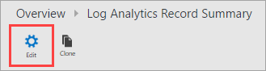

<properties
    pageTitle="Ouvrez une session Concepteur de vue Analytique | Microsoft Azure"
    description="Concepteur de vues dans le journal Analytique permet de créer des affichages personnalisés dans la console OMS qui contiennent les différentes visualisations de données dans le référentiel OMS. Cet article contient une vue d’ensemble du Concepteur de vue et les procédures de création et modification des affichages personnalisés."
    services="log-analytics"
    documentationCenter=""
    authors="bwren"
    manager="jwhit"
    editor=""/>

<tags
    ms.service="log-analytics"
    ms.workload="na"
    ms.tgt_pltfrm="na"
    ms.devlang="na"
    ms.topic="article"
    ms.date="09/27/2016"
    ms.author="bwren"/>

# Concepteur de vue Analytique journal
Le Concepteur de vue dans le journal Analytique permet de créer des affichages personnalisés dans la console OMS qui contiennent les différentes visualisations de données dans le référentiel OMS. Cet article contient une vue d’ensemble du Concepteur de vue et les procédures de création et modification des affichages personnalisés.

Autres articles disponibles pour le Concepteur de vue sont :

- [Référence sur la vignette](log-analytics-view-designer-tiles.md) - référence des paramètres pour chacun des vignettes utilisés dans vos affichages personnalisés. 
- [Référence de partie visualisation](log-analytics-view-designer-parts.md) - référence des paramètres pour chacun des vignettes utilisés dans vos affichages personnalisés. 

## Concepts
Les vues créées avec le Concepteur de vue contiennent les éléments dans le tableau suivant.

| Composant | Description |
|:--|:--|
| Mosaïque | Affiché dans le tableau de bord vue d’ensemble de journal Analytique principale.  Inclut une synthèse visuelle des informations contenues dans la vue personnalisée.  Différents types de mosaïque fournissent différentes visualisations d’enregistrements dans le référentiel OMS.  Cliquez sur la vignette pour ouvrir la vue personnalisée. |
| Affichage personnalisé | Affiché lorsque l’utilisateur clique sur la vignette.  Contient un ou plusieurs composants de visualisation. |
| Composants de visualisation | Visualisation des données dans le référentiel OMS basé sur une ou plusieurs [recherches de journaux](log-analytics-log-searches.md).  La plupart des parties doit inclure un en-tête qui fournit une visualisation de haut niveau et une liste des résultats supérieure.  Types de différentes parties fournissent différentes visualisations d’enregistrements dans le référentiel OMS.  Cliquez sur éléments de la partie pour effectuer une recherche de journal fournissant des rapports détaillés. |

## Ajouter le Concepteur de vue à votre espace de travail
Tandis que concepteur de vue est dans l’aperçu, vous devez l’ajouter à votre espace de travail en sélectionnant des **Fonctionnalités** dans la section **paramètres** du portail OMS.

## Création et modification des affichages

### Créer une nouvelle vue
Ouvrez une nouvelle vue dans le **Concepteur de vue** en cliquant sur la vignette du Concepteur de vue dans le tableau de bord OMS principale.

### Modifier un affichage existant
Pour modifier un affichage existant dans le Concepteur de vue, ouvrez l’affichage en cliquant sur sa vignette dans le tableau de bord OMS principale.  Cliquez ensuite sur le bouton **Modifier** pour ouvrir l’affichage dans le Concepteur de vue.

### Dupliquer un affichage existant
Lorsque vous clonez un affichage, il crée une nouvelle vue et s’ouvre dans le Concepteur de vue.  La nouvelle vue a le même nom en tant que la cellule d’origine avec « copier » ajouté à la fin de celle-ci.  Pour dupliquer un affichage, ouvrez la vue existante en cliquant sur sa vignette dans le tableau de bord OMS principale.  Cliquez ensuite sur le bouton **Dupliquer** pour ouvrir l’affichage dans le Concepteur de vue.

### Supprimer un affichage existant
Pour supprimer un affichage existant, ouvrez l’affichage en cliquant sur sa vignette dans le tableau de bord OMS principale.  Cliquez sur le bouton **Modifier** pour ouvrir l’affichage dans le Concepteur de vue, puis cliquez sur **Supprimer la vue**.

### Exporter un affichage existant
Vous pouvez exporter un affichage dans un fichier JSON que vous pouvez importer dans un autre espace de travail ou utiliser dans un [modèle Azure le Gestionnaire de ressources](../resource-group-authoring-templates.md).  Pour exporter un affichage existant, ouvrez l’affichage en cliquant sur sa vignette dans le tableau de bord OMS principale.  Cliquez ensuite sur le bouton **Exporter** pour créer un fichier dans le dossier de téléchargement du navigateur.  Le nom du fichier sera le nom de la vue avec l' extension *omsview*.

### Importer un affichage existant
Vous pouvez importer un fichier *omsview* que vous avez exporté à partir d’un autre groupe d’administration.  Pour importer un affichage existant, tout d’abord créer une nouvelle vue.  Cliquez sur le bouton **Importer** , puis sélectionnez le fichier *omsview* .  La configuration du fichier est copiée dans l’affichage existant.

## Utilisation de Concepteur de vue
Le Concepteur de vue comprend trois volets.  Le volet de **conception** représente la vue personnalisée.  Lorsque vous ajoutez des vignettes et des composants à partir du volet de **contrôle** dans le volet de **conception** qu’ils sont ajoutés à l’affichage.  Le volet **Propriétés** affiche les propriétés pour la vignette ou une partie sélectionnée.

### Configurer la vignette de l’affichage
Une vue personnalisée peut avoir une seule mosaïque.  Sélectionnez l’onglet **vignette** dans le volet de **contrôle** pour afficher la mosaïque actuelle ou sélectionnez-en une autre.  Le volet **Propriétés** affiche les propriétés de la mosaïque actuelle.  Configurer les propriétés de la vignette en fonction des informations détaillées dans la [Vignette de référence](log-analytics-view-designer-tiles.md) , cliquez sur **Appliquer** pour enregistrer les modifications.

### Configurer les composants de visualisation
Une vue peut inclure un nombre quelconque de composants de visualisation.  Sélectionnez l’onglet **affichage** , puis sur Ajouter à l’affichage d’une partie de visualisation.  Le volet **Propriétés** affiche les propriétés de l’article sélectionné.  Configurer les propriétés d’affichage en fonction des informations détaillées dans la [référence de partie visualisation](log-analytics-view-designer-parts.md) et cliquez sur **Appliquer** pour enregistrer les modifications.

### Supprimer un composant de visualisation
Vous pouvez supprimer un composant de visualisation de l’affichage en cliquant sur le bouton **X** dans le coin supérieur droit de la partie.

### Réorganiser des parties de visualisation
Affichages ont uniquement une seule ligne des composants de visualisation.  Réorganiser des parties existants dans un affichage en cliquant sur et en faisant glisser vers un nouvel emplacement.

## Étapes suivantes

- Ajouter [des vignettes](log-analytics-view-designer-tiles.md) à votre affichage personnalisé.
- Ajouter des [Composants de visualisation](log-analytics-view-designer-parts.md) à votre affichage personnalisé.
